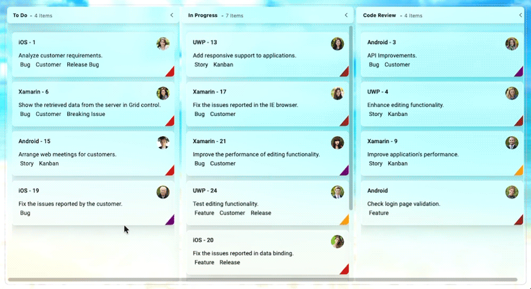

# Liquid Glass Effect in .NET MAUI Kanban Board (SfKanban)

The Liquid Glass Effect introduces a modern, translucent design with adaptive color tinting and light refraction, creating a sleek, glass like user experience that remains clear and accessible. This section explains how to enable and customize the effect in the Syncfusion® .NET MAUI Kanban Board (SfKanban) control.

## Apply liquid glass effect

Follow these steps to enable and configure the Liquid Glass Effect in the Kanban control:

### Step 1: Wrap the control inside glass effect view

To apply the Liquid Glass Effect to Syncfusion® .NET MAUI [Kanban](https://help.syncfusion.com/cr/maui/Syncfusion.Maui.Kanban.SfKanban.html) control, wrap the control inside the [SfGlassEffectView](https://help.syncfusion.com/cr/maui/Syncfusion.Maui.Core.SfGlassEffectView.html) class.

For more details, refer to the [Liquid Glass Getting Started documentation](https://help.syncfusion.com/maui/liquid-glass-ui/getting-started).

### Step 2: Enable the liquid glass effect on Kanban

Set the [EnableLiquidGlassEffect](https://help.syncfusion.com/cr/maui/Syncfusion.Maui.Kanban.SfKanban.html#Syncfusion_Maui_Kanban_SfKanban_EnableLiquidGlassEffect) property to `true` in the [SfKanban](https://help.syncfusion.com/cr/maui/Syncfusion.Maui.Kanban.SfKanban.html) control to apply the Liquid Glass Effect. When enabled, the effect is also applied to its child elements and provides responsive interaction for a smooth and engaging user experience.

### Step 3: Customize the background

To achieve a glass like background in the Kanban control, set its `Background` property to `Transparent` and apply theme keys with transparent values to enable the liquid glass effect for kanban child elements. This ensures a consistent look and feel across your application.

The following code snippet demonstrates how to apply the Liquid Glass Effect to the [Kanban](https://help.syncfusion.com/cr/maui/Syncfusion.Maui.Kanban.SfKanban.html) control:




<Grid>
    <Grid.Background>
        <LinearGradientBrush StartPoint="0,0"
                             EndPoint="0,1">
            <GradientStop Color="#0F4C75"
                          Offset="0.0" />
            <GradientStop Color="#3282B8"
                          Offset="0.5" />
            <GradientStop Color="#1B262C"
                          Offset="1.0" />
        </LinearGradientBrush>
    </Grid.Background>
    <Grid>
        <core:SfGlassEffectView EffectType="Clear"
                                CornerRadius="7">
            <kanban:SfKanban x:Name="kanban"
                             Background="Transparent"
                             AutoGenerateColumns="False"
                             ItemsSource="{Binding Cards}"
                             EnableLiquidGlassEffect="True">
                <kanban:SfKanban.Columns>
                    <kanban:KanbanColumn Title="To Do"
                                         Categories="Open"/>
                    <kanban:KanbanColumn Title="In Progress"
                                         Categories="In Progress"/>
                    <kanban:KanbanColumn Title="Code Review"
                                         Categories="Code Review"/>
                    <kanban:KanbanColumn Title="Done"
                                         Categories="Done"/>
                </kanban:SfKanban.Columns>
                <kanban:SfKanban.BindingContext>
                    <local:KanbanViewModel/>
                </kanban:SfKanban.BindingContext>
            </kanban:SfKanban>
        </core:SfGlassEffectView>
    </Grid>
</Grid>




using Syncfusion.Maui.Kanban;
using Syncfusion.Maui.Core;

var gradientBrush = new LinearGradientBrush
{
    StartPoint = new Point(0, 0),
    EndPoint = new Point(0, 1),
    GradientStops =
    {
        new GradientStop { Color = Color.FromArgb("#0F4C75"), Offset = 0.0 },
        new GradientStop { Color = Color.FromArgb("#3282B8"), Offset = 0.5 },
        new GradientStop { Color = Color.FromArgb("#1B262C"), Offset = 1.0 }
    }
};

// Main grid with background
var mainGrid = new Grid
{
    Background = gradientBrush
};

// Inner grid
var innerGrid = new Grid();

// Glass effect view
var glassEffectView = new SfGlassEffectView
{
    EffectType = LiquidGlassEffectType.Clear,
    CornerRadius = 7
};

// Kanban control
var kanban = new SfKanban
{
    Background = Colors.Transparent,
    AutoGenerateColumns = false,
    EnableLiquidGlassEffect = true,
    BindingContext = new KanbanViewModel()
};

// Define columns
kanban.Columns.Add(new KanbanColumn { Title = "To Do", Categories = { "Open" } });
kanban.Columns.Add(new KanbanColumn { Title = "In Progress", Categories = { "In Progress" } });
kanban.Columns.Add(new KanbanColumn { Title = "Code Review", Categories = { "Code Review" } });
kanban.Columns.Add(new KanbanColumn { Title = "Done", Categories = { "Done" } });

glassEffectView.Content = kanban;
innerGrid.Children.Add(glassEffectView);
mainGrid.Children.Add(innerGrid);
this.Content = mainGrid;




public class KanbanViewModel
{
    #region Constructor

    /// 

    /// Initializes a new instance of the <see cref="KanbanViewModel"/> class.
    /// 

    public KanbanViewModel()
    {
        this.Cards = this.GetCardDetails();
    }

    #endregion

    #region Properties

    /// 

    /// Gets or sets the collection of <see cref="KanbanModel"/> objects representing cards in various stages.
    /// 

    public ObservableCollection<KanbanModel> Cards { get; set; }

    #endregion

    #region Private methods

    /// 

    /// Method to get the collection of predefined Kanban task cards.
    /// 

    /// <returns>The collection of <see cref="KanbanModel"/> instances.</returns>
    private ObservableCollection<KanbanModel> GetCardDetails()
    {
        var cardsDetails = new ObservableCollection<KanbanModel>();

        cardsDetails.Add(new KanbanModel()
        {
            ID = 1,
            Title = "iOS - 1",
            Category = "Open",
            Description = "Analyze customer requirements.",
            IndicatorFill = Colors.Red,
            Tags = new List<string> { "Bug", "Customer", "Release Bug" }
        });

        cardsDetails.Add(new KanbanModel()
        {
            ID = 6,
            Title = "Xamarin - 6",
            Category = "Open",
            Description = "Show the retrieved data from the server in Grid control.",
            IndicatorFill = Colors.Red,
            Tags = new List<string> { "Bug", "Customer", "Breaking Issue" }
        });

        cardsDetails.Add(new KanbanModel()
        {
            ID = 3,
            Title = "iOS - 3",
            Category = "Postponed",
            Description = "Fix the filtering issues reported in Safari.",
            IndicatorFill = Colors.Red,
            Tags = new List<string> { "Bug", "Customer", "Breaking Issue" }
        });

        cardsDetails.Add(new KanbanModel()
        {
            ID = 11,
            Title = "iOS - 21",
            Category = "Postponed",
            Description = "Add input validation for editing.",
            IndicatorFill = Colors.Red,
            Tags = new List<string> { "Bug", "Customer", "Breaking Issue" }
        });

        cardsDetails.Add(new KanbanModel()
        {
            ID = 15,
            Title = "Android - 15",
            Category = "Open",
            Description = "Arrange web meetings for customers.",
            IndicatorFill = Colors.Red,
            Tags = new List<string> { "Story", "Kanban" }
        });

        cardsDetails.Add(new KanbanModel()
        {
            ID = 3,
            Title = "Android - 3",
            Category = "Code Review",
            Description = "API Improvements.",
            IndicatorFill = Colors.Purple,
            Tags = new List<string> { "Bug", "Customer" }
        });

        cardsDetails.Add(new KanbanModel()
        {
            ID = 4,
            Title = "UWP - 4",
            Category = "Code Review",
            Description = "Enhance editing functionality.",
            IndicatorFill = Colors.Brown,
            Tags = new List<string> { "Story", "Kanban" }
        });

        cardsDetails.Add(new KanbanModel()
        {
            ID = 9,
            Title = "Xamarin - 9",
            Category = "Code Review",
            Description = "Improve application's performance.",
            IndicatorFill = Colors.Orange,
            Tags = new List<string> { "Story", "Kanban" }
        });

        cardsDetails.Add(new KanbanModel()
        {
            ID = 13,
            Title = "UWP - 13",
            Category = "In Progress",
            Description = "Add responsive support to applications.",
            IndicatorFill = Colors.Brown,
            Tags = new List<string> { "Story", "Kanban" }
        });

        cardsDetails.Add(new KanbanModel()
        {
            ID = 24,
            Title = "UWP - 24",
            Category = "In Progress",
            Description = "Test editing functionality.",
            IndicatorFill = Colors.Orange,
            Tags = new List<string> { "Feature", "Customer", "Release" }
        });

        cardsDetails.Add(new KanbanModel()
        {
            ID = 20,
            Title = "iOS - 20",
            Category = "In Progress",
            Description = "Fix the issues reported in data binding.",
            IndicatorFill = Colors.Red,
            Tags = new List<string> { "Feature", "Release" }
        });

        cardsDetails.Add(new KanbanModel()
        {
            ID = 13,
            Title = "UWP - 13",
            Category = "Closed",
            Description = "Fix cannot open user's default database SQL error.",
            IndicatorFill = Colors.Purple,
            Tags = new List<string> { "Bug", "Internal", "Release" }
        });

        cardsDetails.Add(new KanbanModel()
        {
            ID = 14,
            Title = "Android - 14",
            Category = "Closed",
            Description = "Arrange a web meeting with the customer to get the login page requirement.",
            IndicatorFill = Colors.Red,
            Tags = new List<string> { "Feature" }
        });

        cardsDetails.Add(new KanbanModel()
        {
            ID = 15,
            Title = "Xamarin - 15",
            Category = "Closed",
            Description = "Login page validation.",
            IndicatorFill = Colors.Red,
            Tags = new List<string> { "Bug" }
        });

        return cardsDetails;
    }

    #endregion
}




N>
* Supported on `macOS 26 or higher` and `iOS 26 or higher`.
* This feature is available only in `.NET 10.`