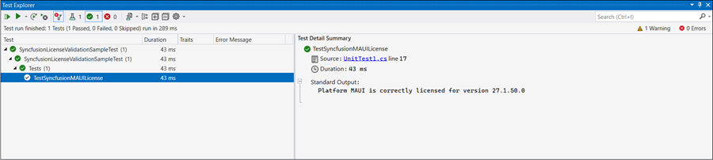
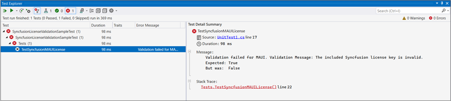

Syncfusion® license key validation in CI services ensures that Syncfusion® Essential Studio® components are properly licensed during CI processes. Validating the license key at the CI level can prevent licensing errors during deployment. Configure the continuous integration pipeline to fail when the license key validation fails. If validation fails, re-verify the platform, version, and license key values to resolve the issue.

> **Prerequisites**
> - PowerShell 7+ (`pwsh`) must be available on the build agent. It is pre installed on `windows-latest` in Azure DevOps and GitHub Actions, but you must add an installation step for Linux or macOS agents.
> - The Syncfusion license key must be stored as a CI secret (Azure DevOps secret variable, GitHub Actions secret, or Jenkins credentials) rather than being hard-coded in scripts.
> - The Syncfusion NuGet/assembly version referenced in the project must match the version passed to the validator.

The following sections show how to validate the Syncfusion® license key in CI services.

## Validate the license key by using the LicenseKeyValidator utility

* Download and extract the LicenseKeyValidator.zip utility from the following link: [LicenseKeyValidator](https://s3.amazonaws.com/files2.syncfusion.com/Installs/LicenseKeyValidation/LicenseKeyValidator.zip).

* Extract the contents to a known location on the build agent (for example, `D:\LicenseKeyValidator`). The `LicenseKeyValidation.ps1` script and the `LicenseKeyValidatorConsole.exe` must reside in the same folder so the `$PSScriptRoot` path resolves correctly.

* Open the `LicenseKeyValidation.ps1` script in a text or code editor. The default contents are shown below.



# Replace the parameters with the desired platform, version, and actual license key.

$result = & $PSScriptRoot"\LicenseKeyValidatorConsole.exe" /platform:"UIComponent" /version:"34.1.29" /licensekey:"Your License Key"

Write-Host $result



# Replace the parameters with the desired platform, version, and actual license key.

$result = & $PSScriptRoot"\LicenseKeyValidatorConsole.exe" /platform:"MAUI" /version:"26.2.4" /licensekey:"Your License Key"

Write-Host $result



* Update the parameters in the script:
  
  **Platform:** Set /platform:"**UIComponent**" for v34.1.29 and later, or /platform:"**MAUI**" for earlier versions (use the relevant Syncfusion platform as needed).
  
  **Version:**  Change the value for /version: to the required version (e.g., "26.2.4").
  
  **License Key:** Replace the value for /licensekey: with your actual license key (e.g., "Your License Key").

## Azure Pipelines (YAML)

* Create a new [User-defined Variable](https://learn.microsoft.com/en-us/azure/devops/pipelines/process/variables?view=azure-devops&tabs=yaml%2Cbatch#user-defined-variables) named `LICENSE_VALIDATION` in the Azure Pipeline. Use the path of the `LicenseKeyValidation.ps1` script file as a value (for example, `D:\LicenseKeyValidator\LicenseKeyValidation.ps1`).

* Add a step that downloads and extracts the LicenseKeyValidator utility (or include it in your repository) before the PowerShell task.

* Add a PowerShell task to the pipeline and run the script to validate the license key. The following example shows the syntax for Windows build agents.



pool:
  vmImage: 'windows-latest'

steps:

- task: PowerShell@2
  inputs:
    targetType: filePath
    filePath: $(LICENSE_VALIDATION) #Or the actual path to the LicenseKeyValidation.ps1 script.
  
  displayName: Syncfusion® License Validation 



## Azure Pipelines (Classic)

* Create a new [User-defined Variable](https://learn.microsoft.com/en-us/azure/devops/pipelines/process/variables?view=azure-devops&tabs=yaml%2Cbatch#user-defined-variables) named `LICENSE_VALIDATION` in the Azure Pipeline. Use the path of the `LicenseKeyValidation.ps1` script file as a value (for example, `D:\LicenseKeyValidator\LicenseKeyValidation.ps1`).

* Include the PowerShell task in the pipeline and execute the script to validate the license key.

## GitHub Actions

* To execute the script in PowerShell as part of a GitHub Actions workflow, add a step in the workflow file that downloads and extracts the LicenseKeyValidator utility, then run `LicenseKeyValidation.ps1`.

The following example shows the syntax for validating the Syncfusion® license key in GitHub actions.



  steps:
  - name: Syncfusion License Validation
    shell: pwsh
    run: |
	  ./path/LicenseKeyValidator/LicenseKeyValidation.ps1



## Jenkins

* Create an [Environment Variable](https://www.jenkins.io/doc/pipeline/tour/environment) named `LICENSE_VALIDATION` in the Jenkins pipeline. Use the path of the `LicenseKeyValidation.ps1` script file as a value (for example, `path\\to\\LicenseKeyValidator\\LicenseKeyValidation.ps1`).

* Add a stage in the Jenkins pipeline that executes the `LicenseKeyValidation.ps1` script in PowerShell. Use the `bat` step on Windows agents and the `sh` step on Linux/macOS agents.

The following example shows the syntax for validating the Syncfusion® license key in the Jenkins pipeline.



pipeline {
	agent any
	environment {
		LICENSE_VALIDATION = 'path\\to\\LicenseKeyValidator\\LicenseKeyValidation.ps1'
	}
	stages {
		stage('Syncfusion License Validation') {
			steps {
				sh 'pwsh ${LICENSE_VALIDATION}'
			}
		}
	}
}



## Validate the license key by using the ValidateLicense() method

* Register the license key properly by calling RegisterLicense("License Key") method with the license key. 

* Once the license key is registered, it can be validated by using the ValidateLicense("Platform.MAUI") method. This ensures that the license key is valid for the platform and version you are using. For reference, please check the following example.



using Syncfusion.Licensing;

// Register the Syncfusion license key
SyncfusionLicenseProvider.RegisterLicense("Your License Key");

// Validate the registered license key.
// The array overload allows validating against multiple platforms in a single call.
bool isValid = SyncfusionLicenseProvider.ValidateLicense(new[] { Platform.UIComponent });



using Syncfusion.Licensing;

// Register the Syncfusion license key
SyncfusionLicenseProvider.RegisterLicense("Your License Key");

// Validate the registered license key
bool isValid = SyncfusionLicenseProvider.ValidateLicense(Platform.MAUI);



N> Use `Platform.UIComponent` for UI component license validation in v34.1.29 and later. `Platform.MAUI` is not supported from v34.1.29 onwards.

* If the `ValidateLicense()` method returns `true`, the registered license key is valid and you can proceed with deployment.

* If the `ValidateLicense()` method returns `false`, invalid license errors will occur during deployment. This is typically caused by an invalid license key or by referencing Syncfusion® assemblies or NuGet packages whose version does not match the license key version. Ensure that all referenced Syncfusion® assemblies or NuGet packages use the same version as the license key before deploying.

## Validate the license key by using the Unit Test project

* To create a unit test project in Visual Studio, choose **File -> New -> Project** from the menu. Filter the project type by **Test**, or type **Test** in the search box, to find available unit test projects. Select the framework (such as MSTest, NUnit, or xUnit) that best suits your needs. The following example uses NUnit.

* For more details on creating unit test projects in Visual Studio, refer to the [Getting Started with Unit Testing guide](https://learn.microsoft.com/en-us/visualstudio/test/getting-started-with-unit-testing?view=vs-2022&tabs=dotnet%2Cmstest#create-unit-tests).

* Install the `Syncfusion.Licensing` NuGet package in the test project and reference `Syncfusion.Licensing.dll`.

* Register the license key by calling the `RegisterLicense("<Your License Key>")` method in the unit test project.

> * Place the license key between double quotes. Ensure that `Syncfusion.Licensing.dll` is referenced in the project where the license key is registered.

* After registering the license key, validate it by calling `ValidateLicense(Platform.MAUI, out var validationMessage)`. This ensures that the license key is valid for the platform and version you are using.

* The following example demonstrates how to register and validate the license key in an NUnit unit test project.



public void TestSyncfusionMAUILicense()
{
	var platform = Platform.MAUI;
	// Register the Syncfusion® license key
	SyncfusionLicenseProvider.RegisterLicense("Your License Key");

	bool isValidLicense = SyncfusionLicenseProvider.ValidateLicense(platform, out var validationMessage);
	Assert.That(isValidLicense, Is.True, $"Validation failed for {platform}." + $" Validation Message: {validationMessage}");

	// Log validation messages to TestContext output
	if (isValidLicense)
	{
		TestContext.Out.WriteLine($"Platform {platform} is correctly licensed for version " + $"{typeof(SyncfusionLicenseProvider).Assembly.GetName().Version}");
	}
}



* Once the unit test is executed, if the license key validation passes for the specified platform, output similar to the following is displayed in the Test Explorer window.

* If the license validation fails during unit testing, output similar to the following is displayed in the Test Explorer window.

* License validation fails due to either an invalid license key or an incorrect assembly or package version that is referenced in the project. In such cases, verify that you are using the valid license key for the platform, and ensure the assembly or package versions referenced in the project match the version of the license key.
