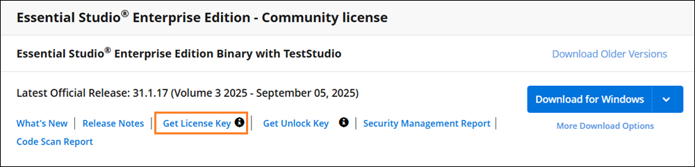

# Where can I get a license key?

License keys can be generated from the [License & Downloads](https://syncfusion.com/account/downloads) or [Trial & Downloads](https://www.syncfusion.com/account/manage-trials/downloads) section of the Syncfusion website. 

I> * Syncfusion license keys are **version and platform specific**, refer to the [KB](https://www.syncfusion.com/kb/8976/how-to-generate-license-key-for-licensed-products) to generate the license key for the required version and platform.
* Refer this [KB](https://www.syncfusion.com/kb/8951/which-version-syncfusion-license-key-should-i-use-in-my-application) to know about which version of the Syncfusion license key should be used in the application.

