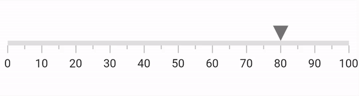

# Animation in .NET MAUI Linear Gauge (SfLinearGauge)

All Linear Gauge elements including the scale, ticks and labels, range, bar pointer, shape marker pointer, and content marker pointer, can be animated separately. 

## Animate axis

The [`EnableAxisAnimation`](https://help.syncfusion.com/cr/maui/Syncfusion.Maui.Gauges.SfLinearGauge.html#Syncfusion_Maui_Gauges_SfLinearGauge_EnableAxisAnimation) and [`AnimationDuration`](https://help.syncfusion.com/cr/maui/Syncfusion.Maui.Gauges.SfLinearGauge.html#Syncfusion_Maui_Gauges_SfLinearGauge_AnimationDuration) properties in [`SfLinearGauge`](https://help.syncfusion.com/cr/maui/Syncfusion.Maui.Gauges.SfLinearGauge.html?tabs=tabid-1) is used to animate the scale along with the ticks and labels. The scale will have a fade-in with opacity animation when this [`EnableAxisAnimation`](https://help.syncfusion.com/cr/maui/Syncfusion.Maui.Gauges.SfLinearGauge.html#Syncfusion_Maui_Gauges_SfLinearGauge_EnableAxisAnimation) is set to true. By default, the [`EnableAxisAnimation`](https://help.syncfusion.com/cr/maui/Syncfusion.Maui.Gauges.SfLinearGauge.html#Syncfusion_Maui_Gauges_SfLinearGauge_EnableAxisAnimation) is set to false. 





 <gauge:SfLinearGauge EnableAxisAnimation="True" />





SfLinearGauge gauge = new SfLinearGauge();
		gauge.EnableAxisAnimation = true;
		this.Content = gauge;





## Animate range

The [`EnableRangeAnimation`](https://help.syncfusion.com/cr/maui/Syncfusion.Maui.Gauges.SfLinearGauge.html#Syncfusion_Maui_Gauges_SfLinearGauge_EnableRangeAnimation) and [`AnimationDuration`](https://help.syncfusion.com/cr/maui/Syncfusion.Maui.Gauges.SfLinearGauge.html#Syncfusion_Maui_Gauges_SfLinearGauge_AnimationDuration) properties in [`SfLinearGauge`](https://help.syncfusion.com/cr/maui/Syncfusion.Maui.Gauges.SfLinearGauge.html?tabs=tabid-1) is used to animate the scale along with the ticks and labels. The range will have a fade-in with opacity animation when this [`EnableRangeAnimation`](https://help.syncfusion.com/cr/maui/Syncfusion.Maui.Gauges.SfLinearGauge.html#Syncfusion_Maui_Gauges_SfLinearGauge_EnableRangeAnimation) is set to true. By default, the [`EnableRangeAnimation`](https://help.syncfusion.com/cr/maui/Syncfusion.Maui.Gauges.SfLinearGauge.html#Syncfusion_Maui_Gauges_SfLinearGauge_EnableRangeAnimation) is set to false.





 <gauge:SfLinearGauge EnableRangeAnimation="True" />





SfLinearGauge gauge = new SfLinearGauge();
		gauge.EnableRangeAnimation = true;
		this.Content = gauge;





## Pointer animation

The animation behavior is common for all the three pointers in Linear Gauge - shape, content, and bar pointer.

All the above three pointers have the following properties for the animation:

*  [`EnableAnimation`](https://help.syncfusion.com/cr/maui/Syncfusion.Maui.Gauges.LinearPointer.html#Syncfusion_Maui_Gauges_LinearPointer_EnableAnimation) - Enable or disable the animation for pointer. The default value is `false`.
*  [`AnimationDuration`](https://help.syncfusion.com/cr/maui/Syncfusion.Maui.Gauges.LinearPointer.html#Syncfusion_Maui_Gauges_LinearPointer_AnimationDuration) - Sets the animation duration. The default value is 1000.
*  [`AnimationEasing`](https://help.syncfusion.com/cr/maui/Syncfusion.Maui.Gauges.LinearPointer.html#Syncfusion_Maui_Gauges_LinearPointer_AnimationEasing) - Sets the animation type. 

The [`AnimationEasing`](https://help.syncfusion.com/cr/maui/Syncfusion.Maui.Gauges.LinearPointer.html#Syncfusion_Maui_Gauges_LinearPointer_AnimationEasing) supports the following animations. The default animation type is `Easing.Linear`.

* `Linear`

* `SinOut`

* `SinIn`

* `SinInOut`

* `CubicIn`

* `CubicOut`

* `CubicInOut`

* `BounceOut`

* `BounceIn`

* `SpringIn`

* `SpringOut`

### Animate bar pointer

The following code example demonstrates how to update the animation for bar pointer.





 <gauge:SfLinearGauge>
                <gauge:SfLinearGauge.MarkerPointers>
                    <gauge:BarPointer Value="70" EnableAnimation="True"/>
                </gauge:SfLinearGauge.MarkerPointers>
            </gauge:SfLinearGauge>





 SfLinearGauge gauge = new SfLinearGauge();
        gauge.BarPointers.Add(new BarPointer()
        {
            Value = 70,
            EnableAnimation = true,
        });
	this.Content = gauge;





### Animate marker pointers (Shape and Content Pointers)

Both the shape and content marker pointers will have the same set of properties and behave similarly for animation. 

So, demonstrated the [`LinearShapePointer`](https://help.syncfusion.com/cr/maui/Syncfusion.Maui.Gauges.LinearShapePointer.html) only but the same is applicable for [`LinearContentPointer`](https://help.syncfusion.com/cr/maui/Syncfusion.Maui.Gauges.LinearContentPointer.html) too. 

### Marker pointer with `SpringOut` animation





 <gauge:SfLinearGauge>
                <gauge:SfLinearGauge.MarkerPointers>
                    <gauge:LinearShapePointer Value="70" EnableAnimation="True" 
                              AnimationEasing="{x:Static Easing.SpringOut}"/>
                </gauge:SfLinearGauge.MarkerPointers>
            </gauge:SfLinearGauge>





SfLinearGauge gauge = new SfLinearGauge();
		gauge.MarkerPointers.Add(new LinearShapePointer()
		{
			Value = 70,
			EnableAnimation = true,
			AnimationEasing=Easing.SpringOut
		});
		this.Content = gauge;





