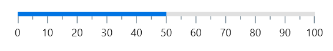
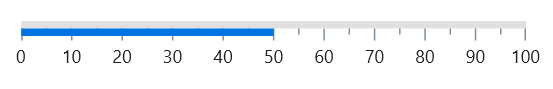
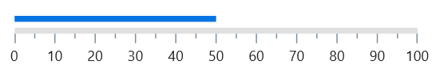

# Bar Pointer in .NET MAUI Linear Gauge (SfLinearGauge)

A Bar Pointer is a highlighted line or shaded area that can be placed on a Linear Gauge to mark any current value in the scale track. The bar pointers always start from the minimum value of the scale and end with the specified value. So, the [`Value`](https://help.syncfusion.com/cr/maui/Syncfusion.Maui.Gauges.LinearPointer.html#Syncfusion_Maui_Gauges_LinearPointer_Value) property is a required parameter for creating a Bar Pointer.

## Default Bar Pointer

The following code sample demonstrates a default Bar Pointer with the value 50. 





<gauge:SfLinearGauge>
	<gauge:SfLinearGauge.BarPointers>
		<gauge:BarPointer Value="50"/>
	</gauge:SfLinearGauge.BarPointers>
</gauge:SfLinearGauge>





SfLinearGauge gauge = new SfLinearGauge();
		gauge.BarPointers.Add(new BarPointer()
		{
			Value = 50,
		});
		this.Content = gauge;





## Customize Bar Pointer thickness

The thickness can be changed using the [`PointerSize`](https://help.syncfusion.com/cr/maui/Syncfusion.Maui.Gauges.BarPointer.html#Syncfusion_Maui_Gauges_BarPointer_PointerSize) property of the Bar Pointer. The following code sample demonstrates this. 





<gauge:SfLinearGauge>
	<gauge:SfLinearGauge.BarPointers>
		<gauge:BarPointer Value="50" PointerSize="10"/>
	</gauge:SfLinearGauge.BarPointers>
</gauge:SfLinearGauge>





SfLinearGauge gauge = new SfLinearGauge();
		gauge.BarPointers.Add(new BarPointer()
		{
			Value = 50,
			PointerSize = 10
		});
		this.Content = gauge;





## Customize edge style

The edge style can be changed using the [`CornerStyle`](https://help.syncfusion.com/cr/maui/Syncfusion.Maui.Gauges.BarPointer.html#Syncfusion_Maui_Gauges_BarPointer_CornerStyle) property of the Bar Pointer. The edge style can be any of the [`StartCurve`](https://help.syncfusion.com/cr/maui/Syncfusion.Maui.Gauges.CornerStyle.html#Syncfusion_Maui_Gauges_CornerStyle_StartCurve), [`EndCurve`](https://help.syncfusion.com/cr/maui/Syncfusion.Maui.Gauges.CornerStyle.html#Syncfusion_Maui_Gauges_CornerStyle_EndCurve), [`BothCurve`](https://help.syncfusion.com/cr/maui/Syncfusion.Maui.Gauges.CornerStyle.html#Syncfusion_Maui_Gauges_CornerStyle_BothCurve), and [`BothFlat`](https://help.syncfusion.com/cr/maui/Syncfusion.Maui.Gauges.CornerStyle.html#Syncfusion_Maui_Gauges_CornerStyle_BothFlat) options. The default value is [`BothFlat`](https://help.syncfusion.com/cr/maui/Syncfusion.Maui.Gauges.CornerStyle.html#Syncfusion_Maui_Gauges_CornerStyle_BothFlat).





 <gauge:SfLinearGauge>
	<gauge:SfLinearGauge.BarPointers>
		<gauge:BarPointer Value="50" PointerSize="10" 
							Offset="5"
							Position="Outside" 
							CornerStyle="BothCurve"/>
	</gauge:SfLinearGauge.BarPointers>
</gauge:SfLinearGauge>





SfLinearGauge gauge = new SfLinearGauge();
		gauge.BarPointers.Add(new BarPointer()
		{
			Value = 50,
			PointerSize = 10,
			Offset = 5,
			Position = GaugeElementPosition.Outside,
			CornerStyle = CornerStyle.BothCurve
		});
		this.Content = gauge;





## Customize the position

By default, the Bar Pointer is positioned across the scale. This position can be changed by the [`Position`](https://help.syncfusion.com/cr/maui/Syncfusion.Maui.Gauges.LinearPointer.html#Syncfusion_Maui_Gauges_LinearPointer_Position) property of a pointer. It is possible to position the Bar Pointer [`Inside`](https://help.syncfusion.com/cr/maui/Syncfusion.Maui.Gauges.GaugeElementPosition.html#Syncfusion_Maui_Gauges_GaugeElementPosition_Inside), [`Cross`](https://help.syncfusion.com/cr/maui/Syncfusion.Maui.Gauges.GaugeElementPosition.html#Syncfusion_Maui_Gauges_GaugeElementPosition_Cross), or [`Outside`](https://help.syncfusion.com/cr/maui/Syncfusion.Maui.Gauges.GaugeElementPosition.html#Syncfusion_Maui_Gauges_GaugeElementPosition_Outside) the scale. The following code sample demonstrates changing the Bar Pointer position to inside the scale.





 <gauge:SfLinearGauge>
	<gauge:SfLinearGauge.BarPointers>
		<gauge:BarPointer Value="50" Position="Inside"/>
	</gauge:SfLinearGauge.BarPointers>
</gauge:SfLinearGauge>





SfLinearGauge gauge = new SfLinearGauge();
		gauge.BarPointers.Add(new BarPointer()
		{
			Value = 50,
			Position = GaugeElementPosition.Inside,
		});
		this.Content = gauge;





## Customize the offset

In addition to positioning the Bar Pointer, it is also possible to change the offset of the Bar Pointer. The [`Offset`](https://help.syncfusion.com/cr/maui/Syncfusion.Maui.Gauges.BarPointer.html#Syncfusion_Maui_Gauges_BarPointer_Offset) value is the distance from the scale and it has no effect on cross-positioned elements. The following code sample demonstrates how to change the offset value of the Bar Pointer.





<gauge:SfLinearGauge>
	<gauge:SfLinearGauge.BarPointers>
		<gauge:BarPointer Value="50" Position="Outside" Offset="5"/>
	</gauge:SfLinearGauge.BarPointers>
</gauge:SfLinearGauge>





SfLinearGauge gauge = new SfLinearGauge();
		gauge.BarPointers.Add(new BarPointer()
		{
			Value = 50,
			Position = GaugeElementPosition.Outside,
			Offset = 5
		});
		this.Content = gauge;





## Change the color of Bar Pointer 

The color of the Bar Pointer can be changed by the [`Fill`](https://help.syncfusion.com/cr/maui/Syncfusion.Maui.Gauges.BarPointer.html#Syncfusion_Maui_Gauges_BarPointer_Fill) property. The following code sample demonstrates this. 





<gauge:SfLinearGauge>
	<gauge:SfLinearGauge.BarPointers>
		<gauge:BarPointer Value="50" Fill="Red"/>
	</gauge:SfLinearGauge.BarPointers>
</gauge:SfLinearGauge>





SfLinearGauge gauge = new SfLinearGauge();
		gauge.BarPointers.Add(new BarPointer()
		{
			Value = 50,
			Fill = new SolidColorBrush(Colors.Red),
		});
		this.Content = gauge;





## Apply gradient

The gradient can be applied by using the [`GradientStops`](https://help.syncfusion.com/cr/maui/Syncfusion.Maui.Gauges.BarPointer.html#Syncfusion_Maui_Gauges_BarPointer_GradientStops) property of Bar Pointer. The following code sample demonstrates applying a gradient to the Bar Pointer.





 <gauge:SfLinearGauge>
	<gauge:SfLinearGauge.BarPointers>
		<gauge:BarPointer Position="Outside" Offset="5" 
							CornerStyle="BothCurve" Value="70">
			<gauge:BarPointer.GradientStops>
				<gauge:GaugeGradientStop Value="0" Color="Green"/>
				<gauge:GaugeGradientStop Value="35" Color="#ff0074E3"/>
			</gauge:BarPointer.GradientStops>
		</gauge:BarPointer>
	</gauge:SfLinearGauge.BarPointers>
</gauge:SfLinearGauge>





SfLinearGauge gauge = new SfLinearGauge();
ObservableCollection<GaugeGradientStop> gradientStops = new ObservableCollection<GaugeGradientStop>();
gradientStops.Add(new GaugeGradientStop() { Value = 0, Color = Colors.Green });
gradientStops.Add(new GaugeGradientStop() { Value = 35, Color = Color.FromArgb("#ff0074E3") });
gauge.BarPointers.Add(new BarPointer()
{
	Value = 70,
	Position = GaugeElementPosition.Outside,
	Offset = 5,
	CornerStyle = CornerStyle.BothCurve,
	GradientStops = gradientStops
});
this.Content = gauge;





## Child support

By using the [`Child`](https://help.syncfusion.com/cr/maui/Syncfusion.Maui.Gauges.BarPointer.html#Syncfusion_Maui_Gauges_BarPointer_Child) property of bar pointer, you can provide a child for the bar pointer. To improve readability, the child content is used to add any UI content, such as text or images, inside the bar pointer.





<gauge:SfLinearGauge ShowLabels="False" ShowTicks="False">
	<gauge:SfLinearGauge.LineStyle>
		<gauge:LinearLineStyle CornerStyle="BothCurve" Thickness="30"/>
	</gauge:SfLinearGauge.LineStyle>
	<gauge:SfLinearGauge.BarPointers>
		<gauge:BarPointer CornerStyle="BothCurve" Value="50" PointerSize="30">
			<gauge:BarPointer.Child>
				<Label Text="50%" Margin="0,0,10,0" 
						HorizontalOptions="End"
						TextColor="White" VerticalOptions="Center"/>
			</gauge:BarPointer.Child>
		</gauge:BarPointer>
	</gauge:SfLinearGauge.BarPointers>
</gauge:SfLinearGauge>





SfLinearGauge gauge = new SfLinearGauge();
		gauge.ShowLabels = false;
		gauge.ShowTicks = false;
		gauge.LineStyle.Thickness = 30;
		gauge.LineStyle.CornerStyle = CornerStyle.BothCurve;
		Label label = new Label()
		{
			Text = "50%",
			Margin = new Thickness(0, 0, 10, 0),
			TextColor = Colors.White,
			HorizontalOptions = LayoutOptions.End,
			VerticalOptions = LayoutOptions.Center
		};
		gauge.BarPointers.Add(new BarPointer()
		{
			Value = 50,
			PointerSize = 30,
			CornerStyle = CornerStyle.BothCurve,
			Child = label
		});
		this.Content = gauge;





