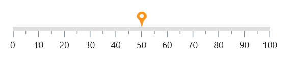
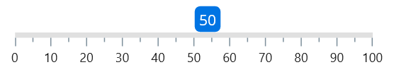
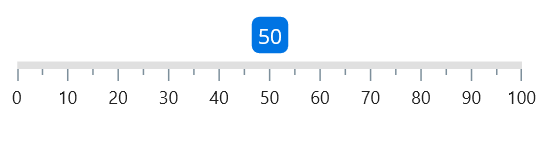

# Content Marker Pointer in .NET MAUI Linear Gauge (SfLinearGauge)

The [`LinearContentPointer`](https://help.syncfusion.com/cr/maui/Syncfusion.Maui.Gauges.LinearContentPointer.html) in [`SfLinearGauge`](https://help.syncfusion.com/cr/maui/Syncfusion.Maui.Gauges.SfLinearGauge.html) allows you to use any .NET MAUI content as a marker pointer. The following code sample uses an `Image` as a marker pointer.





<gauge:SfLinearGauge>
	<gauge:SfLinearGauge.MarkerPointers>
		<gauge:LinearContentPointer Value="50">
			<gauge:LinearContentPointer.Content>
				<Image Source="pin.png" HeightRequest="20" 
						WidthRequest="20"/>
			</gauge:LinearContentPointer.Content>
		</gauge:LinearContentPointer>
	</gauge:SfLinearGauge.MarkerPointers>
</gauge:SfLinearGauge>





SfLinearGauge gauge = new SfLinearGauge();
		LinearContentPointer contentPointer = new LinearContentPointer();
		contentPointer.Value = 50;
		contentPointer.Content = new Image() { Source = "pin.png", HeightRequest = 20, WidthRequest = 20 };
		gauge.MarkerPointers.Add(contentPointer);
		this.Content = gauge;





## Change marker alignment

The content marker pointer alignment can be changed by the [`Alignment`](https://help.syncfusion.com/cr/maui/Syncfusion.Maui.Gauges.LinearMarkerPointer.html#Syncfusion_Maui_Gauges_LinearMarkerPointer_Alignment) property of [`LinearContentPointer`](https://help.syncfusion.com/cr/maui/Syncfusion.Maui.Gauges.LinearContentPointer.html). The available marker positions are [`Start`](https://help.syncfusion.com/cr/maui/Syncfusion.Maui.Gauges.GaugeAlignment.html#Syncfusion_Maui_Gauges_GaugeAlignment_Start), [`End`](https://help.syncfusion.com/cr/maui/Syncfusion.Maui.Gauges.GaugeAlignment.html#Syncfusion_Maui_Gauges_GaugeAlignment_End), and [`Center`](https://help.syncfusion.com/cr/maui/Syncfusion.Maui.Gauges.GaugeAlignment.html#Syncfusion_Maui_Gauges_GaugeAlignment_Center). 





<gauge:SfLinearGauge>
	<gauge:SfLinearGauge.MarkerPointers>
		<gauge:LinearContentPointer Value="50" Alignment="End">
			<gauge:LinearContentPointer.Content>
				<Grid HeightRequest="25" WidthRequest="25">
					<RoundRectangle CornerRadius="5" Fill="#ff0074E3"/>
					<Label Text="50" HorizontalOptions="Center"
						VerticalOptions="Center" TextColor="White"/>
				</Grid>
			</gauge:LinearContentPointer.Content>
		</gauge:LinearContentPointer>
	</gauge:SfLinearGauge.MarkerPointers>
</gauge:SfLinearGauge>





SfLinearGauge gauge = new SfLinearGauge();
		Grid views = new Grid() { HeightRequest = 25, WidthRequest = 25 };
		views.Add(new RoundRectangle()
		{
			Fill = new SolidColorBrush(Color.FromArgb("#ff0074E3")),
			CornerRadius = 5
		});
		views.Add(new Label()
		{
			Text = "50",
			TextColor = Colors.White,
			HorizontalOptions = LayoutOptions.Center,
			VerticalOptions = LayoutOptions.Center
		});
		LinearContentPointer contentPointer = new LinearContentPointer();
		contentPointer.Value = 50;
		contentPointer.Alignment = GaugeAlignment.End;
		contentPointer.Content = views;
		gauge.MarkerPointers.Add(contentPointer);
		this.Content = gauge;





## Change the position

By default, the shape pointer is positioned [`Outside`](https://help.syncfusion.com/cr/maui/Syncfusion.Maui.Gauges.GaugeElementPosition.html#Syncfusion_Maui_Gauges_GaugeElementPosition_Outside) the scale. This position can be changed by the [`Position`](https://help.syncfusion.com/cr/maui/Syncfusion.Maui.Gauges.LinearPointer.html#Syncfusion_Maui_Gauges_LinearPointer_Position) property of pointer. It is possible to position the shape pointer [`Inside`](https://help.syncfusion.com/cr/maui/Syncfusion.Maui.Gauges.GaugeElementPosition.html#Syncfusion_Maui_Gauges_GaugeElementPosition_Inside), [`Cross`](https://help.syncfusion.com/cr/maui/Syncfusion.Maui.Gauges.GaugeElementPosition.html#Syncfusion_Maui_Gauges_GaugeElementPosition_Cross), or [`Outside`](https://help.syncfusion.com/cr/maui/Syncfusion.Maui.Gauges.GaugeElementPosition.html#Syncfusion_Maui_Gauges_GaugeElementPosition_Outside) the scale. The following code sample demonstrates how to change the shape pointer position to [`Cross`](https://help.syncfusion.com/cr/maui/Syncfusion.Maui.Gauges.GaugeElementPosition.html#Syncfusion_Maui_Gauges_GaugeElementPosition_Cross) the scale. 





<gauge:SfLinearGauge>
	<gauge:SfLinearGauge.MarkerPointers>
		<gauge:LinearContentPointer Value="50" Position="Cross">
			<gauge:LinearContentPointer.Content>
				<Grid HeightRequest="25" WidthRequest="25">
					<RoundRectangle CornerRadius="5" Fill="#ff0074E3"/>
					<Label Text="50" HorizontalOptions="Center"
						VerticalOptions="Center" TextColor="White"/>
				</Grid>
			</gauge:LinearContentPointer.Content>
		</gauge:LinearContentPointer>
	</gauge:SfLinearGauge.MarkerPointers>
</gauge:SfLinearGauge>





SfLinearGauge gauge = new SfLinearGauge();
		Grid views = new Grid() { HeightRequest = 25, WidthRequest = 25 };
		views.Add(new RoundRectangle()
		{
			Fill = new SolidColorBrush(Color.FromArgb("#ff0074E3")),
			CornerRadius = 5
		});
		views.Add(new Label()
		{
			Text = "50",
			TextColor = Colors.White,
			HorizontalOptions = LayoutOptions.Center,
			VerticalOptions = LayoutOptions.Center
		});
		LinearContentPointer contentPointer = new LinearContentPointer();
		contentPointer.Value = 50;
		contentPointer.Position = GaugeElementPosition.Cross;
		contentPointer.Content = views;
		gauge.MarkerPointers.Add(contentPointer);
		this.Content = gauge;





## Change the offset

In addition to position the content marker pointer, it is also possible to change the offset of the shape pointer. The [`OffsetX`](https://help.syncfusion.com/cr/maui/Syncfusion.Maui.Gauges.LinearMarkerPointer.html#Syncfusion_Maui_Gauges_LinearMarkerPointer_OffsetX) and [`OffsetY`](https://help.syncfusion.com/cr/maui/Syncfusion.Maui.Gauges.LinearMarkerPointer.html#Syncfusion_Maui_Gauges_LinearMarkerPointer_OffsetY) are the distance from the scale. The cross-positioned elements will not be affected by the [`OffsetX`](https://help.syncfusion.com/cr/maui/Syncfusion.Maui.Gauges.LinearMarkerPointer.html#Syncfusion_Maui_Gauges_LinearMarkerPointer_OffsetX) and [`OffsetY`](https://help.syncfusion.com/cr/maui/Syncfusion.Maui.Gauges.LinearMarkerPointer.html#Syncfusion_Maui_Gauges_LinearMarkerPointer_OffsetY) values. The following code sample demonstrates how to change the offset value of the shape pointer. 





<gauge:SfLinearGauge>
	<gauge:SfLinearGauge.MarkerPointers>
		<gauge:LinearContentPointer Value="50" OffsetY="-5">
			<gauge:LinearContentPointer.Content>
				<Grid HeightRequest="25" WidthRequest="25">
					<RoundRectangle CornerRadius="5" Fill="#ff0074E3"/>
					<Label Text="50" HorizontalOptions="Center"
						VerticalOptions="Center" TextColor="White"/>
				</Grid>
			</gauge:LinearContentPointer.Content>
		</gauge:LinearContentPointer>
	</gauge:SfLinearGauge.MarkerPointers>
</gauge:SfLinearGauge>





SfLinearGauge gauge = new SfLinearGauge();
		Grid views = new Grid() { HeightRequest = 25, WidthRequest = 25 };
		views.Add(new RoundRectangle()
		{
			Fill = new SolidColorBrush(Color.FromArgb("#ff0074E3")),
			CornerRadius = 5
		});
		views.Add(new Label()
		{
			Text = "50",
			TextColor = Colors.White,
			HorizontalOptions = LayoutOptions.Center,
			VerticalOptions = LayoutOptions.Center
		});
		LinearContentPointer contentPointer = new LinearContentPointer();
		contentPointer.Value = 50;
		contentPointer.OffsetY = -5;
		contentPointer.Content = views;
		gauge.MarkerPointers.Add(contentPointer);
		this.Content = gauge;





