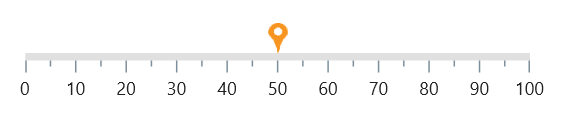
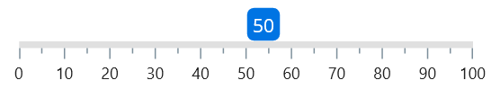
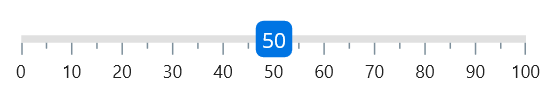
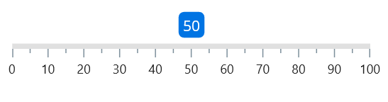

# Content Marker Pointer in .NET MAUI Linear Gauge (SfLinearGauge)

The [`LinearContentPointer`](https://help.syncfusion.com/cr/maui/Syncfusion.Maui.Gauges.LinearContentPointer.html) in [`SfLinearGauge`](https://help.syncfusion.com/cr/maui/Syncfusion.Maui.Gauges.SfLinearGauge.html) allows you to use any .NET MAUI content as a marker pointer. Multiple content marker pointers can be added to a single gauge. For animation support, refer to the [Pointer animation](https://help.syncfusion.com/maui/linear-gauge/animation#pointer-animation) documentation. The following code sample uses an `Image` as a marker pointer.

N> **Prerequisite:** Ensure that the required NuGet package is installed, the necessary namespaces are imported, and the [.NET MAUI Linear Gauge](https://help.syncfusion.com/maui/linear-gauge/getting-started) control is properly configured in your application. For detailed setup and configuration instructions, refer to the **[Getting Started](https://help.syncfusion.com/maui/linear-gauge/getting-started)** guide.

N> The image used in the `Image` source (e.g., `pin.png`) must be added to your project's resources.





<gauge:SfLinearGauge>
    <gauge:SfLinearGauge.MarkerPointers>
        <gauge:LinearContentPointer Value="50">
            <gauge:LinearContentPointer.Content>
                <Image Source="pin.png" HeightRequest="20" 
                       WidthRequest="20"/>
            </gauge:LinearContentPointer.Content>
        </gauge:LinearContentPointer>
    </gauge:SfLinearGauge.MarkerPointers>
</gauge:SfLinearGauge>





SfLinearGauge gauge = new SfLinearGauge();
LinearContentPointer contentPointer = new LinearContentPointer();
contentPointer.Value = 50;
contentPointer.Content = new Image() { Source = "pin.png", HeightRequest = 20, WidthRequest = 20 };
gauge.MarkerPointers.Add(contentPointer);
this.Content = gauge;





## Change the marker alignment

The content marker pointer's alignment can be changed by the [`Alignment`](https://help.syncfusion.com/cr/maui/Syncfusion.Maui.Gauges.LinearMarkerPointer.html#Syncfusion_Maui_Gauges_LinearMarkerPointer_Alignment) property of [`LinearContentPointer`](https://help.syncfusion.com/cr/maui/Syncfusion.Maui.Gauges.LinearContentPointer.html). The available marker positions are [`Start`](https://help.syncfusion.com/cr/maui/Syncfusion.Maui.Gauges.GaugeAlignment.html#Syncfusion_Maui_Gauges_GaugeAlignment_Start), [`End`](https://help.syncfusion.com/cr/maui/Syncfusion.Maui.Gauges.GaugeAlignment.html#Syncfusion_Maui_Gauges_GaugeAlignment_End), and [`Center`](https://help.syncfusion.com/cr/maui/Syncfusion.Maui.Gauges.GaugeAlignment.html#Syncfusion_Maui_Gauges_GaugeAlignment_Center). The default value is [`Center`](https://help.syncfusion.com/cr/maui/Syncfusion.Maui.Gauges.GaugeAlignment.html#Syncfusion_Maui_Gauges_GaugeAlignment_Center).





<gauge:SfLinearGauge>
    <gauge:SfLinearGauge.MarkerPointers>
        <gauge:LinearContentPointer Value="50" Alignment="End">
            <gauge:LinearContentPointer.Content>
                <Grid HeightRequest="25" WidthRequest="25">
                    <RoundRectangle CornerRadius="5" 
                                    Fill="#ff0074E3"/>
                    <Label Text="50" HorizontalOptions="Center"
                           VerticalOptions="Center" TextColor="White"/>
                </Grid>
            </gauge:LinearContentPointer.Content>
        </gauge:LinearContentPointer>
    </gauge:SfLinearGauge.MarkerPointers>
</gauge:SfLinearGauge>





SfLinearGauge gauge = new SfLinearGauge();
Grid views = new Grid() { HeightRequest = 25, WidthRequest = 25 };
views.Add(new RoundRectangle()
{
    Fill = new SolidColorBrush(Color.FromArgb("#ff0074E3")),
    CornerRadius = 5
});
views.Add(new Label()
{
    Text = "50",
    TextColor = Colors.White,
    HorizontalOptions = LayoutOptions.Center,
    VerticalOptions = LayoutOptions.Center
});
LinearContentPointer contentPointer = new LinearContentPointer();
contentPointer.Value = 50;
contentPointer.Alignment = GaugeAlignment.End;
contentPointer.Content = views;
gauge.MarkerPointers.Add(contentPointer);
this.Content = gauge;





## Change the position

By default, the content marker pointer is positioned [`Outside`](https://help.syncfusion.com/cr/maui/Syncfusion.Maui.Gauges.GaugeElementPosition.html#Syncfusion_Maui_Gauges_GaugeElementPosition_Outside) the scale. This position can be changed by the [`Position`](https://help.syncfusion.com/cr/maui/Syncfusion.Maui.Gauges.LinearPointer.html#Syncfusion_Maui_Gauges_LinearPointer_Position) property of pointer. It is possible to position the content marker pointer [`Inside`](https://help.syncfusion.com/cr/maui/Syncfusion.Maui.Gauges.GaugeElementPosition.html#Syncfusion_Maui_Gauges_GaugeElementPosition_Inside), [`Cross`](https://help.syncfusion.com/cr/maui/Syncfusion.Maui.Gauges.GaugeElementPosition.html#Syncfusion_Maui_Gauges_GaugeElementPosition_Cross), or [`Outside`](https://help.syncfusion.com/cr/maui/Syncfusion.Maui.Gauges.GaugeElementPosition.html#Syncfusion_Maui_Gauges_GaugeElementPosition_Outside) the scale. The default position is [`Outside`](https://help.syncfusion.com/cr/maui/Syncfusion.Maui.Gauges.GaugeElementPosition.html#Syncfusion_Maui_Gauges_GaugeElementPosition_Outside). The following code sample demonstrates how to change the content marker pointer position to [`Cross`](https://help.syncfusion.com/cr/maui/Syncfusion.Maui.Gauges.GaugeElementPosition.html#Syncfusion_Maui_Gauges_GaugeElementPosition_Cross) the scale. 





<gauge:SfLinearGauge>
    <gauge:SfLinearGauge.MarkerPointers>
        <gauge:LinearContentPointer Value="50" Position="Cross">
            <gauge:LinearContentPointer.Content>
                <Grid HeightRequest="25" WidthRequest="25">
                    <RoundRectangle CornerRadius="5" 
                                    Fill="#ff0074E3"/>
                    <Label Text="50" HorizontalOptions="Center"
                           VerticalOptions="Center" TextColor="White"/>
                </Grid>
            </gauge:LinearContentPointer.Content>
        </gauge:LinearContentPointer>
    </gauge:SfLinearGauge.MarkerPointers>
</gauge:SfLinearGauge>





SfLinearGauge gauge = new SfLinearGauge();
Grid views = new Grid() { HeightRequest = 25, WidthRequest = 25 };
views.Add(new RoundRectangle()
{
    Fill = new SolidColorBrush(Color.FromArgb("#ff0074E3")),
    CornerRadius = 5
});
views.Add(new Label()
{
    Text = "50",
    TextColor = Colors.White,
    HorizontalOptions = LayoutOptions.Center,
    VerticalOptions = LayoutOptions.Center
});
LinearContentPointer contentPointer = new LinearContentPointer();
contentPointer.Value = 50;
contentPointer.Position = GaugeElementPosition.Cross;
contentPointer.Content = views;
gauge.MarkerPointers.Add(contentPointer);
this.Content = gauge;





## Change the offset

In addition to positioning the content marker pointer, it is also possible to change the offset of the content marker pointer. The [`OffsetX`](https://help.syncfusion.com/cr/maui/Syncfusion.Maui.Gauges.LinearMarkerPointer.html#Syncfusion_Maui_Gauges_LinearMarkerPointer_OffsetX) and [`OffsetY`](https://help.syncfusion.com/cr/maui/Syncfusion.Maui.Gauges.LinearMarkerPointer.html#Syncfusion_Maui_Gauges_LinearMarkerPointer_OffsetY) are the distance from the scale. The default [`OffsetX`](https://help.syncfusion.com/cr/maui/Syncfusion.Maui.Gauges.LinearMarkerPointer.html#Syncfusion_Maui_Gauges_LinearMarkerPointer_OffsetX) and [`OffsetY`](https://help.syncfusion.com/cr/maui/Syncfusion.Maui.Gauges.LinearMarkerPointer.html#Syncfusion_Maui_Gauges_LinearMarkerPointer_OffsetY) values are 0. The cross-positioned elements are not affected by the [`OffsetX`](https://help.syncfusion.com/cr/maui/Syncfusion.Maui.Gauges.LinearMarkerPointer.html#Syncfusion_Maui_Gauges_LinearMarkerPointer_OffsetX) and [`OffsetY`](https://help.syncfusion.com/cr/maui/Syncfusion.Maui.Gauges.LinearMarkerPointer.html#Syncfusion_Maui_Gauges_LinearMarkerPointer_OffsetY) values. The following code sample demonstrates how to change the offset value of the content marker pointer. 





<gauge:SfLinearGauge>
    <gauge:SfLinearGauge.MarkerPointers>
        <gauge:LinearContentPointer Value="50" OffsetY="-5">
            <gauge:LinearContentPointer.Content>
                <Grid HeightRequest="25" WidthRequest="25">
                    <RoundRectangle CornerRadius="5" 
                                    Fill="#ff0074E3"/>
                    <Label Text="50" HorizontalOptions="Center"
                           VerticalOptions="Center" TextColor="White"/>
                </Grid>
            </gauge:LinearContentPointer.Content>
        </gauge:LinearContentPointer>
    </gauge:SfLinearGauge.MarkerPointers>
</gauge:SfLinearGauge>





SfLinearGauge gauge = new SfLinearGauge();
Grid views = new Grid() { HeightRequest = 25, WidthRequest = 25 };
views.Add(new RoundRectangle()
{
    Fill = new SolidColorBrush(Color.FromArgb("#ff0074E3")),
    CornerRadius = 5
});
views.Add(new Label()
{
    Text = "50",
    TextColor = Colors.White,
    HorizontalOptions = LayoutOptions.Center,
    VerticalOptions = LayoutOptions.Center
});
LinearContentPointer contentPointer = new LinearContentPointer();
contentPointer.Value = 50;
contentPointer.OffsetY = -5;
contentPointer.Content = views;
gauge.MarkerPointers.Add(contentPointer);
this.Content = gauge;





