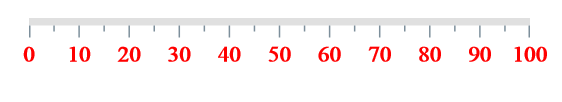
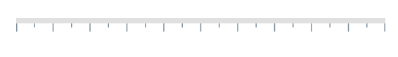
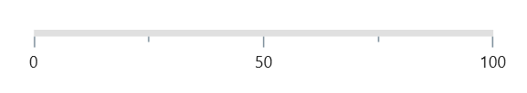
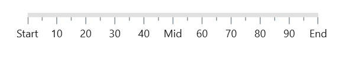
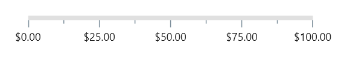

# Labels in .NET MAUI Linear Gauge (SfLinearGauge)

The default style of gauge labels is as follows:.

## Customize label styles

Scale labels can be customized using the [`LabelStyle`](https://help.syncfusion.com/cr/maui/Syncfusion.Maui.Gauges.SfLinearGauge.html#Syncfusion_Maui_Gauges_SfLinearGauge_LabelStyle) property of [`SfLinearGauge`](https://help.syncfusion.com/cr/maui/Syncfusion.Maui.Gauges.SfLinearGauge.html). The [`LabelStyle`](https://help.syncfusion.com/cr/maui/Syncfusion.Maui.Gauges.SfLinearGauge.html#Syncfusion_Maui_Gauges_SfLinearGauge_LabelStyle) property has the following properties to customize the scale labels.

* [`TextColor`](https://help.syncfusion.com/cr/maui/Syncfusion.Maui.Gauges.GaugeLabelStyle.html#Syncfusion_Maui_Gauges_GaugeLabelStyle_TextColor) – Allows you to customize the color of the labels.
* [`FontFamily`](https://help.syncfusion.com/cr/maui/Syncfusion.Maui.Gauges.GaugeLabelStyle.html#Syncfusion_Maui_Gauges_GaugeLabelStyle_FontFamily) – Allows you to specify the font family for labels.
* [`FontAttributes`](https://help.syncfusion.com/cr/maui/Syncfusion.Maui.Gauges.GaugeLabelStyle.html#Syncfusion_Maui_Gauges_GaugeLabelStyle_FontAttributes) – Allows you to specify the font weight for labels.
* [`FontSize`](https://help.syncfusion.com/cr/maui/Syncfusion.Maui.Gauges.GaugeLabelStyle.html#Syncfusion_Maui_Gauges_GaugeLabelStyle_FontSize) – Allows you to specify the font size for labels.





 <gauge:SfLinearGauge>
				<gauge:SfLinearGauge.LabelStyle>
					<gauge:GaugeLabelStyle FontAttributes="Bold" FontSize="15" 
										   TextColor="Red" 
										   FontFamily="TimesNewRoman"/>
				</gauge:SfLinearGauge.LabelStyle>
			</gauge:SfLinearGauge>





SfLinearGauge gauge = new SfLinearGauge();
		gauge.LabelStyle.FontSize = 15;
		gauge.LabelStyle.FontFamily = "TimesNewRoman";
		gauge.LabelStyle.TextColor = Colors.Red;
		gauge.LabelStyle.FontAttributes = FontAttributes.Bold;
		this.Content = gauge;





## Change visibility

The [`ShowLabels`](https://help.syncfusion.com/cr/maui/Syncfusion.Maui.Gauges.SfLinearGauge.html#Syncfusion_Maui_Gauges_SfLinearGauge_ShowLabels) property of [`SfLinearGauge`](https://help.syncfusion.com/cr/maui/Syncfusion.Maui.Gauges.SfLinearGauge.html) allows you to show or hide scale labels. The default value of this property is `true`.





 <gauge:SfLinearGauge ShowLabels="False">
				
			</gauge:SfLinearGauge>





SfLinearGauge gauge = new SfLinearGauge();
		gauge.ShowLabels = false;
		this.Content = gauge;





## Customize interval between labels

The [`Interval`](https://help.syncfusion.com/cr/maui/Syncfusion.Maui.Gauges.SfLinearGauge.html#Syncfusion_Maui_Gauges_SfLinearGauge_Interval) between labels can be customized using the [`Interval`](https://help.syncfusion.com/cr/maui/Syncfusion.Maui.Gauges.SfLinearGauge.html#Syncfusion_Maui_Gauges_SfLinearGauge_Interval) property of [`SfLinearGauge`](https://help.syncfusion.com/cr/maui/Syncfusion.Maui.Gauges.SfLinearGauge.html?tabs=tabid-1). The major ticks are generated based on this [`Interval`](https://help.syncfusion.com/cr/maui/Syncfusion.Maui.Gauges.SfLinearGauge.html#Syncfusion_Maui_Gauges_SfLinearGauge_Interval) property.





<gauge:SfLinearGauge Interval="20">
				
</gauge:SfLinearGauge>





SfLinearGauge gauge = new SfLinearGauge();
		gauge.Interval = 20;
		this.Content = gauge;





## Change label position

The linear gauge allows you to position the labels either [`Inside`](https://help.syncfusion.com/cr/maui/Syncfusion.Maui.Gauges.GaugeLabelsPosition.html#Syncfusion_Maui_Gauges_GaugeLabelsPosition_Inside) or [`Outside`](https://help.syncfusion.com/cr/maui/Syncfusion.Maui.Gauges.GaugeLabelsPosition.html#Syncfusion_Maui_Gauges_GaugeLabelsPosition_Outside) the gauge track using the [`LabelPosition`](https://help.syncfusion.com/cr/maui/Syncfusion.Maui.Gauges.SfLinearGauge.html#Syncfusion_Maui_Gauges_SfLinearGauge_LabelPosition) property. By default, labels are positioned [`Inside`](https://help.syncfusion.com/cr/maui/Syncfusion.Maui.Gauges.GaugeLabelsPosition.html#Syncfusion_Maui_Gauges_GaugeLabelsPosition_Inside) the gauge track.





  <gauge:SfLinearGauge  TickPosition="Outside" LabelPosition="Outside">
				
  </gauge:SfLinearGauge>





SfLinearGauge gauge = new SfLinearGauge();
		gauge.TickPosition = GaugeElementPosition.Outside;
		gauge.LabelPosition = GaugeLabelsPosition.Outside;
		this.Content = gauge;





## Change label offset

The [`LabelOffset`](https://help.syncfusion.com/cr/maui/Syncfusion.Maui.Gauges.SfLinearGauge.html#Syncfusion_Maui_Gauges_SfLinearGauge_LabelOffset) property allows you to adjust the distance between the tick-end and the labels. 





 <gauge:SfLinearGauge LabelOffset="20"/>





SfLinearGauge gauge = new SfLinearGauge();
		gauge.LabelOffset = 20;
		this.Content = gauge;





##  Customize maximum number of visible labels

By default, a maximum of three labels is displayed for every 100 logical pixels in an scale. The maximum number of labels that should be present within 100 logical pixels length can be customized using the [`MaximumLabelsCount`](https://help.syncfusion.com/cr/maui/Syncfusion.Maui.Gauges.SfLinearGauge.html#Syncfusion_Maui_Gauges_SfLinearGauge_MaximumLabelsCount) property of the scale. 





 <gauge:SfLinearGauge MaximumLabelsCount="1"/>





SfLinearGauge gauge = new SfLinearGauge();
		gauge.MaximumLabelsCount = 1;
		this.Content = gauge;





## Customize label text

You can format or change the entire numeric label text using the [`LabelCreated`](https://help.syncfusion.com/cr/maui/Syncfusion.Maui.Gauges.SfLinearGauge.html#Syncfusion_Maui_Gauges_SfLinearGauge_LabelCreated) event.





<gauge:SfLinearGauge LabelCreated="Gauge_LabelCreated"/>





SfLinearGauge gauge = new SfLinearGauge();
		gauge.LabelCreated += Gauge_LabelCreated;
		this.Content = gauge;

...

private void Gauge_LabelCreated(object sender, LabelCreatedEventArgs e)
{
		if (e.Text == "0")
			e.Text = "Start";
		else if (e.Text == "50")
			e.Text = "Mid";
		else if (e.Text == "100")
			e.Text = "End";
}





## Label format

The [`LabelFormat`](https://help.syncfusion.com/cr/maui/Syncfusion.Maui.Gauges.SfLinearGauge.html#Syncfusion_Maui_Gauges_SfLinearGauge_LabelFormat) property is used to format the numeric labels. The default value of this property is `null`.





 <gauge:SfLinearGauge LabelFormat="C" Interval="25"/>





SfLinearGauge gauge = new SfLinearGauge();
		gauge.LabelFormat = "C";
		gauge.Interval = 25;
		this.Content = gauge;





