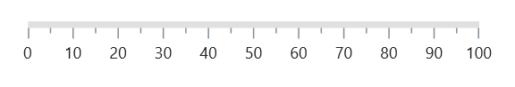
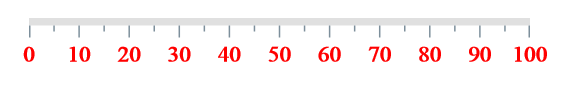
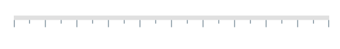
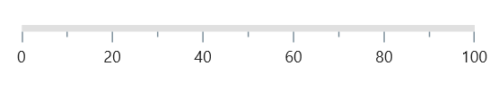
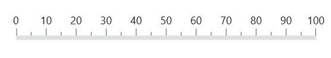
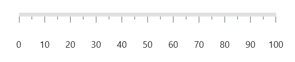
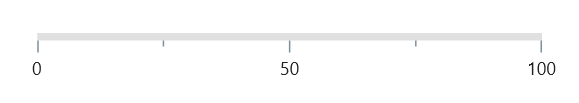
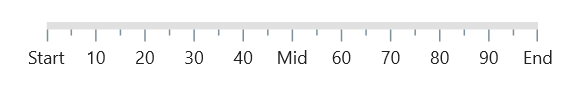
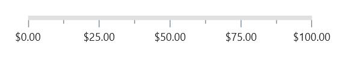

# Labels in .NET MAUI Linear Gauge (SfLinearGauge)

The default style of gauge labels is as follows.

N> **Prerequisite:** Ensure that the required NuGet package is installed, the necessary namespaces are imported, and the [.NET MAUI Linear Gauge](https://help.syncfusion.com/maui/linear-gauge/getting-started) control is properly configured in your application. For detailed setup and configuration instructions, refer to the **[Getting Started](https://help.syncfusion.com/maui/linear-gauge/getting-started)** guide.

## Customize label styles

Scale labels can be customized using the [`LabelStyle`](https://help.syncfusion.com/cr/maui/Syncfusion.Maui.Gauges.SfLinearGauge.html#Syncfusion_Maui_Gauges_SfLinearGauge_LabelStyle) property of [`SfLinearGauge`](https://help.syncfusion.com/cr/maui/Syncfusion.Maui.Gauges.SfLinearGauge.html). The [`LabelStyle`](https://help.syncfusion.com/cr/maui/Syncfusion.Maui.Gauges.SfLinearGauge.html#Syncfusion_Maui_Gauges_SfLinearGauge_LabelStyle) property has the following properties to customize the scale labels.

* [`TextColor`](https://help.syncfusion.com/cr/maui/Syncfusion.Maui.Gauges.GaugeLabelStyle.html#Syncfusion_Maui_Gauges_GaugeLabelStyle_TextColor) – Allows you to customize the color of the labels.
* [`FontFamily`](https://help.syncfusion.com/cr/maui/Syncfusion.Maui.Gauges.GaugeLabelStyle.html#Syncfusion_Maui_Gauges_GaugeLabelStyle_FontFamily) – Allows you to specify the font family for labels.
* [`FontAttributes`](https://help.syncfusion.com/cr/maui/Syncfusion.Maui.Gauges.GaugeLabelStyle.html#Syncfusion_Maui_Gauges_GaugeLabelStyle_FontAttributes) – Allows you to specify the font weight for labels.
* [`FontSize`](https://help.syncfusion.com/cr/maui/Syncfusion.Maui.Gauges.GaugeLabelStyle.html#Syncfusion_Maui_Gauges_GaugeLabelStyle_FontSize) – Allows you to specify the font size for labels.





 <gauge:SfLinearGauge>
    <gauge:SfLinearGauge.LabelStyle>
        <gauge:GaugeLabelStyle FontAttributes="Bold" FontSize="15" 
                               TextColor="Red" 
                               FontFamily="TimesNewRoman"/>
    </gauge:SfLinearGauge.LabelStyle>
</gauge:SfLinearGauge>





SfLinearGauge gauge = new SfLinearGauge();
gauge.LabelStyle.FontSize = 15;
gauge.LabelStyle.FontFamily = "TimesNewRoman";
gauge.LabelStyle.TextColor = Colors.Red;
gauge.LabelStyle.FontAttributes = FontAttributes.Bold;
this.Content = gauge;





## Change visibility

The [`ShowLabels`](https://help.syncfusion.com/cr/maui/Syncfusion.Maui.Gauges.SfLinearGauge.html#Syncfusion_Maui_Gauges_SfLinearGauge_ShowLabels) property of [`SfLinearGauge`](https://help.syncfusion.com/cr/maui/Syncfusion.Maui.Gauges.SfLinearGauge.html) allows you to show or hide the visibility of scale labels. The default value of this property is true.





 <gauge:SfLinearGauge ShowLabels="False"/>





SfLinearGauge gauge = new SfLinearGauge();
gauge.ShowLabels = false;
this.Content = gauge;





## Customize interval between labels

The interval between labels can be customized using the [`Interval`](https://help.syncfusion.com/cr/maui/Syncfusion.Maui.Gauges.SfLinearGauge.html#Syncfusion_Maui_Gauges_SfLinearGauge_Interval) property of [`SfLinearGauge`](https://help.syncfusion.com/cr/maui/Syncfusion.Maui.Gauges.SfLinearGauge.html?tabs=tabid-1). By default, the interval is auto-calculated. The major ticks are generated based on this [`Interval`](https://help.syncfusion.com/cr/maui/Syncfusion.Maui.Gauges.SfLinearGauge.html#Syncfusion_Maui_Gauges_SfLinearGauge_Interval) property.





<gauge:SfLinearGauge Interval="20"/>





SfLinearGauge gauge = new SfLinearGauge();
gauge.Interval = 20;
this.Content = gauge;





## Change label position

The linear gauge allows you to position the labels either [`Inside`](https://help.syncfusion.com/cr/maui/Syncfusion.Maui.Gauges.GaugeLabelsPosition.html#Syncfusion_Maui_Gauges_GaugeLabelsPosition_Inside) or [`Outside`](https://help.syncfusion.com/cr/maui/Syncfusion.Maui.Gauges.GaugeLabelsPosition.html#Syncfusion_Maui_Gauges_GaugeLabelsPosition_Outside) the gauge track using the [`LabelPosition`](https://help.syncfusion.com/cr/maui/Syncfusion.Maui.Gauges.SfLinearGauge.html#Syncfusion_Maui_Gauges_SfLinearGauge_LabelPosition) property. By default, labels are positioned [`Inside`](https://help.syncfusion.com/cr/maui/Syncfusion.Maui.Gauges.GaugeLabelsPosition.html#Syncfusion_Maui_Gauges_GaugeLabelsPosition_Inside) the gauge track.





  <gauge:SfLinearGauge LabelPosition="Outside"/>





SfLinearGauge gauge = new SfLinearGauge();
gauge.LabelPosition = GaugeLabelsPosition.Outside;
this.Content = gauge;





## Change label offset

The [`LabelOffset`](https://help.syncfusion.com/cr/maui/Syncfusion.Maui.Gauges.SfLinearGauge.html#Syncfusion_Maui_Gauges_SfLinearGauge_LabelOffset) property allows you to adjust the distance between the tick-end and the labels. The default [`LabelOffset`](https://help.syncfusion.com/cr/maui/Syncfusion.Maui.Gauges.SfLinearGauge.html#Syncfusion_Maui_Gauges_SfLinearGauge_LabelOffset) value is 0.





 <gauge:SfLinearGauge LabelOffset="20"/>





SfLinearGauge gauge = new SfLinearGauge();
gauge.LabelOffset = 20;
this.Content = gauge;





## Customize maximum number of visible labels

By default, a maximum of three labels is displayed for every 100 logical pixels in a scale. The maximum number of labels that should be present within 100 logical pixels length can be customized using the [`MaximumLabelsCount`](https://help.syncfusion.com/cr/maui/Syncfusion.Maui.Gauges.SfLinearGauge.html#Syncfusion_Maui_Gauges_SfLinearGauge_MaximumLabelsCount) property of the scale. The default value is 3.





 <gauge:SfLinearGauge MaximumLabelsCount="1"/>





SfLinearGauge gauge = new SfLinearGauge();
gauge.MaximumLabelsCount = 1;
this.Content = gauge;





## Customize label text

You can format or change the entire numeric label text using the [`LabelCreated`](https://help.syncfusion.com/cr/maui/Syncfusion.Maui.Gauges.SfLinearGauge.html#Syncfusion_Maui_Gauges_SfLinearGauge_LabelCreated) event. The event provides a [`LabelCreatedEventArgs`](https://help.syncfusion.com/cr/maui/Syncfusion.Maui.Gauges.LabelCreatedEventArgs.html) parameter containing the label's [`Text`](https://help.syncfusion.com/cr/maui/Syncfusion.Maui.Gauges.LabelCreatedEventArgs.html#Syncfusion_Maui_Gauges_LabelCreatedEventArgs_Text) property, which can be modified to customize the displayed text.





<gauge:SfLinearGauge LabelCreated="Gauge_LabelCreated"/>





SfLinearGauge gauge = new SfLinearGauge();
gauge.LabelCreated += Gauge_LabelCreated;
this.Content = gauge;

//code omitted for brevity

private void Gauge_LabelCreated(object sender, LabelCreatedEventArgs e)
{
    if (e.Text == "0")
        e.Text = "Start";
    else if (e.Text == "50")
        e.Text = "Mid";
    else if (e.Text == "100")
        e.Text = "End";
}





## Label format

The [`LabelFormat`](https://help.syncfusion.com/cr/maui/Syncfusion.Maui.Gauges.SfLinearGauge.html#Syncfusion_Maui_Gauges_SfLinearGauge_LabelFormat) property is used to format the numeric labels using standard .NET numeric format strings (e.g., `C` for currency, `N` for number, `P` for percent). The default value of this property is null.





 <gauge:SfLinearGauge LabelFormat="C"/>





SfLinearGauge gauge = new SfLinearGauge();
gauge.LabelFormat = "C";
this.Content = gauge;





