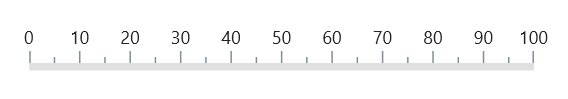

# Mirror in .NET MAUI Linear Gauge (SfLinearGauge)

The [`IsMirrored`](https://help.syncfusion.com/cr/maui/Syncfusion.Maui.Gauges.SfLinearGauge.html#Syncfusion_Maui_Gauges_SfLinearGauge_IsMirrored) property in [`SfLinearGauge`](https://help.syncfusion.com/cr/maui/Syncfusion.Maui.Gauges.SfLinearGauge.html?tabs=tabid-1) mirrors all the Gauge elements in the [`SfLinearGauge`](https://help.syncfusion.com/cr/maui/Syncfusion.Maui.Gauges.SfLinearGauge.html?tabs=tabid-1). The following code sample demonstrates how to set the [`IsMirrored`](https://help.syncfusion.com/cr/maui/Syncfusion.Maui.Gauges.SfLinearGauge.html#Syncfusion_Maui_Gauges_SfLinearGauge_IsMirrored) property.





<gauge:SfLinearGauge IsMirrored="True"/>





SfLinearGauge gauge = new SfLinearGauge();
		gauge.IsMirrored = true;
		this.Content= gauge;





## Comparison for the mirrored and normal gauge

The following screenshot shows a comparison between the mirrored and normal Linear Gauge. 

