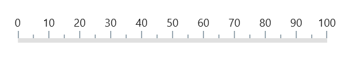

# Mirroring in .NET MAUI Linear Gauge (SfLinearGauge)

N> **Prerequisite:** Ensure that the required NuGet package is installed, the necessary namespaces are imported, and the **Linear Gauge** control is properly configured in your application. For detailed setup and configuration instructions, refer to the **[Getting Started](https://help.syncfusion.com/maui/linear-gauge/getting-started)** guide.

The [`IsMirrored`](https://help.syncfusion.com/cr/maui/Syncfusion.Maui.Gauges.SfLinearGauge.html#Syncfusion_Maui_Gauges_SfLinearGauge_IsMirrored) property in [`SfLinearGauge`](https://help.syncfusion.com/cr/maui/Syncfusion.Maui.Gauges.SfLinearGauge.html?tabs=tabid-1) mirrors all the Linear Gauge elements (scale, labels, ticks, and pointers) in the [`SfLinearGauge`](https://help.syncfusion.com/cr/maui/Syncfusion.Maui.Gauges.SfLinearGauge.html?tabs=tabid-1). This is useful for right-to-left (RTL) layout support. The default value of this property is `false`. The following code sample demonstrates how to set the [`IsMirrored`](https://help.syncfusion.com/cr/maui/Syncfusion.Maui.Gauges.SfLinearGauge.html#Syncfusion_Maui_Gauges_SfLinearGauge_IsMirrored) property.





<gauge:SfLinearGauge IsMirrored="True"/>





SfLinearGauge gauge = new SfLinearGauge();
		gauge.IsMirrored = true;
		this.Content= gauge;





## Comparison of Mirrored and Normal Gauge

The following screenshot provides a comparison of the mirrored and normal Linear Gauge. In the image, the left side shows the normal gauge and the right side shows the mirrored gauge.

