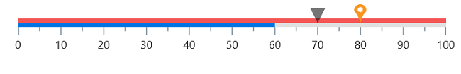

# .NET MAUI Linear Gauge (SfLinearGauge) Overview

Syncfusion&reg; .NET MAUI Linear Gauge is a data visualization control to display data on a linear scale. Use this control to craft high-quality mobile app user interfaces.

## Business use cases

- Dashboard applications that display performance metrics and progress values using linear indicators.  
- Industrial and monitoring systems that track measurements such as temperature, pressure, or speed.  
- Business applications that visualize target versus actual values with clear range indicators.  
- Data-driven apps that require threshold-based representation for alerts and analysis.  

## Key features

- **Orientation** allows displaying the gauge in horizontal or vertical layouts based on UI requirements.  
- **Customizable scale** allows configuring thickness, edge styles, and reversing the scale direction.  
- **Labels and ticks** allows styling labels, major ticks, and minor ticks for better readability.  
- **Range support** allows highlighting value intervals on the scale with different visual styles.  
- **Pointer support** allows using shape marker, content marker, and bar pointers to indicate values.  
- **Mirror mode** allows rendering gauge elements in a mirrored layout for alternate visual representation.  
- **Animation** allows animating gauge elements during load or value changes for better user experience.  
- **Interactive pointer** allows adjusting values dynamically through drag or swipe gestures.  

## Globalization

The following table summarizes the globalization support available in this control.

    
    Full Support

    
    Partial Support

    
    No Support

    
    Not Applicable

<table>
<tr>
<th align="center">Control</th>
<th align="center">Localization</th>
<th align="center">RTL</th>
<th align="center">Time zone</th>
<th align="center">Screen reader</th>
<th align="center">Keyboard navigation</th>
</tr>
<tr>
<td><a href="/maui/linear-gauge/overview">Linear Gauge</a></td>
<td align="center"></td>
<td align="center"></td>
<td align="center"></td>
<td align="center"></td>
<td align="center"></td>
</tr> 
</table>

## Related controls

- [Radial Gauge](https://help.syncfusion.com/maui/radial-gauge/overview) for visualizing values using circular gauge representation.  
- [Circular ProgressBar](https://help.syncfusion.com/maui/circularprogressbar/overview) for representing progress with circular indicators.
- [Linear ProgressBar](https://help.syncfusion.com/maui/linearprogressbar/overview) for displaying progress in a horizontal linear format.

## See Also

Explore further resources:

- [Getting Started](https://help.syncfusion.com/maui/linear-gauge/getting-started) shows a step‑by‑step guide to begin using the Linear Gauge control.  
- [Range](https://help.syncfusion.com/maui/linear-gauge/range) explains how to configure ranges and scale visualization.  
- [Pointers](https://help.syncfusion.com/maui/linear-gauge/pointers) helps customize pointer types and behavior.  
- [UI Kit](https://www.syncfusion.com/demos/maui#maui-ui-control) provides interactive demos and ready‑made UI examples.

## Resources

<!-- Card 1 -->
<a href="https://www.syncfusion.com/maui-controls/maui-linear-gauge" class="form-card" target="_blank">
  

    <h3 class="form-title">Feature Tour</h3>
    

      Walk through highlights and core capabilities.
    

  

</a>
<!-- Card 2 -->
<a href="https://github.com/syncfusion/maui-demos/tree/master/MAUI/Gauges" class="form-card" target="_blank">
  

    <h3 class="form-title">Showcase Samples</h3>
    

      Explore sample scenarios for real apps.
    

  

</a>
<!-- Card 3 -->
<a href="https://www.syncfusion.com/tutorial-videos/maui/linear-gauge" class="form-card" target="_blank">
  

    <h3 class="form-title">Tutorial Videos</h3>
    

      Step‑by‑step guidance through video tutorials.
    

  

</a>
<!-- Card 4 -->
<a href="https://support.syncfusion.com/kb/cross-platforms/category/76" class="form-card" target="_blank">
  

    <h3 class="form-title">Explore KB's</h3>
    

      Find quick solutions and step‑by‑step guidance.
    

  

</a>
<!-- Card 5 -->
<a href="https://www.syncfusion.com/blogs/category/net-maui" class="form-card" target="_blank">
  

    <h3 class="form-title">Explore Blogs</h3>
    

      Read insights, tutorials, and developer journeys.
    

  

</a>