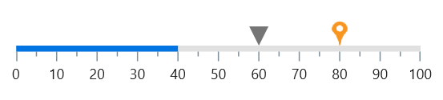

# Pointers in .NET MAUI LinearGauge (SfLinearGauge)

The Pointer is used to indicate values on a scale. The LinearGauge control has three types of pointers:

[`Bar Pointer`](https://help.syncfusion.com/cr/maui/Syncfusion.Maui.Gauges.BarPointer.html)
[`Shape Pointer`](https://help.syncfusion.com/cr/maui/Syncfusion.Maui.Gauges.ShapePointer.html)
[`Content Pointer`](https://help.syncfusion.com/cr/maui/Syncfusion.Maui.Gauges.ContentPointer.html)

All Pointers can be customized as needed. You can add multiple Pointers to the gauge to indicate multiple values on the same scale. The value of the Pointer is set using the [`Value`](https://help.syncfusion.com/cr/maui/Syncfusion.Maui.Gauges.LinearPointer.html#Syncfusion_Maui_Gauges_LinearPointer_Value) property.

## Interaction with pointers

The following code sample demonstrates how to update a simple marker Pointer value based on swipe or drag gestures.





<gauge:SfLinearGauge >
	<gauge:SfLinearGauge.MarkerPointers>
		<gauge:LinearShapePointer Value="70" IsInteractive="True" 
									Fill="Blue"/>
	</gauge:SfLinearGauge.MarkerPointers>
</gauge:SfLinearGauge>





SfLinearGauge gauge = new SfLinearGauge();
		gauge.MarkerPointers.Add(new LinearShapePointer()
		{
			Value = 70,
			IsInteractive = true,
			Fill=new SolidColorBrush(Colors.Blue)	
		});
		this.Content = gauge;





## Step frequency

The [`StepFrequency`](https://help.syncfusion.com/cr/maui/Syncfusion.Maui.Gauges.LinearPointer.html#Syncfusion_Maui_Gauges_LinearPointer_StepFrequency) property is used to specify the interval between snap points while dragging the Pointer.

For example, if the value of [`StepFrequency`](https://help.syncfusion.com/cr/maui/Syncfusion.Maui.Gauges.LinearPointer.html#Syncfusion_Maui_Gauges_LinearPointer_StepFrequency) is 20, the Pointer will not move continuously while dragging; instead, it will update in terms of 20.

N> To work with the [`StepFrequency`](https://help.syncfusion.com/cr/maui/Syncfusion.Maui.Gauges.LinearPointer.html#Syncfusion_Maui_Gauges_LinearPointer_StepFrequency) value, enable Pointer interaction support.





<gauge:SfLinearGauge>
	<gauge:SfLinearGauge.MarkerPointers>
		<gauge:LinearShapePointer Value="70" IsInteractive="True" 
									StepFrequency="5" Fill="Blue"/>
	</gauge:SfLinearGauge.MarkerPointers>
</gauge:SfLinearGauge>





SfLinearGauge gauge = new SfLinearGauge();
		gauge.MarkerPointers.Add(new LinearShapePointer()
		{
			Value = 70,
			IsInteractive = true,
			StepFrequency = 5,
			Fill=new SolidColorBrush(Colors.Blue)	
		});
		this.Content = gauge;





## Drag offset

The [`DragOffset`](https://help.syncfusion.com/cr/maui/Syncfusion.Maui.Gauges.LinearPointer.html#Syncfusion_Maui_Gauges_LinearPointer_DragOffset) property is used to specify the outer dragging offset for Pointer. When the Pointer is pressed close to the Pointer, this value helps with dragging the Pointer. The default value of [`DragOffset`](https://help.syncfusion.com/cr/maui/Syncfusion.Maui.Gauges.LinearPointer.html#Syncfusion_Maui_Gauges_LinearPointer_DragOffset) is 15d.

For example, if the value of [`DragOffset`](https://help.syncfusion.com/cr/maui/Syncfusion.Maui.Gauges.LinearPointer.html#Syncfusion_Maui_Gauges_LinearPointer_DragOffset) is 20, the Pointer will be dragged while interacting with that Pointer around 20 pixels.	

If the value of [`DragOffset`](https://help.syncfusion.com/cr/maui/Syncfusion.Maui.Gauges.LinearPointer.html#Syncfusion_Maui_Gauges_LinearPointer_DragOffset) is 0, the Pointer will be dragged while interacting only within the exact Pointer bounds.

N> To work with the [`DragOffset`](https://help.syncfusion.com/cr/maui/Syncfusion.Maui.Gauges.LinearPointer.html#Syncfusion_Maui_Gauges_LinearPointer_DragOffset) value, enable Pointer interaction support.





<gauge:SfLinearGauge>
	<gauge:SfLinearGauge.MarkerPointers>
		<gauge:LinearShapePointer Value="70" IsInteractive="True" 
									DragOffset="5" Fill="Blue"/>
	</gauge:SfLinearGauge.MarkerPointers>
</gauge:SfLinearGauge>





SfLinearGauge gauge = new SfLinearGauge();
		gauge.MarkerPointers.Add(new LinearShapePointer()
		{
			Value = 70,
			IsInteractive = true,
			DragOffset = 5,
			Fill=new SolidColorBrush(Colors.Blue)	
		});
		this.Content = gauge;





## Event

[`ValueChangeStarted`](https://help.syncfusion.com/cr/maui/Syncfusion.Maui.Gauges.LinearPointer.html#Syncfusion_Maui_Gauges_LinearPointer_ValueChangeStarted) - Occurs whenever the Pointer starts to drag.

[`ValueChanging`](https://help.syncfusion.com/cr/maui/Syncfusion.Maui.Gauges.LinearPointer.html#Syncfusion_Maui_Gauges_LinearPointer_ValueChanging) - Occurs before the current drag value gets updated as Pointer value. The [`Cancel`](https://help.syncfusion.com/cr/maui/Syncfusion.Maui.Gauges.ValueChangingEventArgs.html#Syncfusion_Maui_Gauges_ValueChangingEventArgs_Cancel) argument of [`ValueChangingEventArgs`](https://help.syncfusion.com/cr/maui/Syncfusion.Maui.Gauges.ValueChangingEventArgs.html) allows to restrict the update of current drag value.

[`ValueChanged`](https://help.syncfusion.com/cr/maui/Syncfusion.Maui.Gauges.LinearPointer.html#Syncfusion_Maui_Gauges_LinearPointer_ValueChanged) - Occurs whenever the Pointer value is changed while dragging.

[`ValueChangeCompleted`](https://help.syncfusion.com/cr/maui/Syncfusion.Maui.Gauges.LinearPointer.html#Syncfusion_Maui_Gauges_LinearPointer_ValueChangeCompleted) - Occurs once the dragging of the Pointer gets completed.





<gauge:SfLinearGauge >
   <gauge:SfLinearGauge.MarkerPointers>
	  <gauge:LinearShapePointer Value="70" IsInteractive="True" 
			ValueChanging="LinearShapePointer_ValueChanging"
			ValueChanged="LinearShapePointer_ValueChanged"
			Fill="Blue"/>
   </gauge:SfLinearGauge.MarkerPointers>
</gauge:SfLinearGauge>





SfLinearGauge gauge = new SfLinearGauge();
		LinearShapePointer linearShapePointer = new LinearShapePointer()
		{
			Value = 70,
			IsInteractive = true,
			Fill = new SolidColorBrush(Colors.Blue)
		};
		linearShapePointer.ValueChanging += LinearShapePointer_ValueChanging;
		linearShapePointer.ValueChanged += LinearShapePointer_ValueChanged;
		gauge.MarkerPointers.Add(linearShapePointer);
		this.Content = gauge;

...

private void LinearShapePointer_ValueChanged(object sender, Syncfusion.Maui.Gauges.ValueChangedEventArgs e)
	{

	}

	private void LinearShapePointer_ValueChanging(object sender, ValueChangingEventArgs e)
	{
		if (e.NewValue > 70)
			e.Cancel = true;
	}




