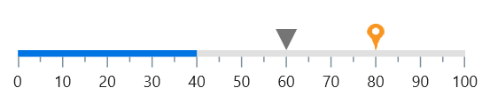
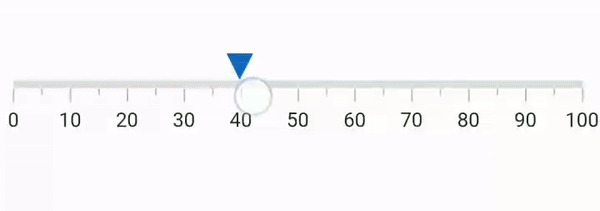

# Pointers in .NET MAUI Linear Gauge (SfLinearGauge)

N> **Prerequisite:** Ensure that the required NuGet package is installed, the necessary namespaces are imported, and the [.NET MAUI Linear Gauge](https://help.syncfusion.com/maui/linear-gauge/getting-started) control is properly configured in your application. For detailed setup and configuration instructions, refer to the **[Getting Started](https://help.syncfusion.com/maui/linear-gauge/getting-started)** guide.

The pointer is used to indicate values on a scale. The Linear Gauge control has three types of pointers:

* [`Bar pointer`](https://help.syncfusion.com/cr/maui/Syncfusion.Maui.Gauges.BarPointer.html) - A shaded bar from the minimum scale value to the specified value. For more details, refer to the [Bar pointer](https://help.syncfusion.com/maui/linear-gauge/bar-pointer) documentation.
* [`Shape pointer`](https://help.syncfusion.com/cr/maui/Syncfusion.Maui.Gauges.LinearShapePointer.html) - A built-in shape marker (e.g., circle, triangle) placed on the scale. For more details, refer to the [Shape marker pointer](https://help.syncfusion.com/maui/linear-gauge/shape-marker-pointer) documentation.
* [`Content pointer`](https://help.syncfusion.com/cr/maui/Syncfusion.Maui.Gauges.LinearContentPointer.html) - Any .NET MAUI content (e.g., image, text, or custom view) placed on the scale. For more details, refer to the [Content marker pointer](https://help.syncfusion.com/maui/linear-gauge/content-marker-pointer) documentation.

All the pointers can be customized as needed. You can add multiple pointers to the gauge to point multiple values on the same scale. The value of the pointer is set using the [`Value`](https://help.syncfusion.com/cr/maui/Syncfusion.Maui.Gauges.LinearPointer.html#Syncfusion_Maui_Gauges_LinearPointer_Value) property. All three pointer types support interaction when the `IsInteractive` property is enabled.

## Interaction with pointers

The following code sample demonstrates how to update a simple marker pointer value based on swipe or drag gestures. By default, the [`IsInteractive`](https://help.syncfusion.com/cr/maui/Syncfusion.Maui.Gauges.LinearPointer.html#Syncfusion_Maui_Gauges_LinearPointer_IsInteractive) property is set to false.





<gauge:SfLinearGauge>
    <gauge:SfLinearGauge.MarkerPointers>
        <gauge:LinearShapePointer Value="70" IsInteractive="True" 
                                  Fill="Blue"/>
    </gauge:SfLinearGauge.MarkerPointers>
</gauge:SfLinearGauge>





SfLinearGauge gauge = new SfLinearGauge();
gauge.MarkerPointers.Add(new LinearShapePointer()
{
    Value = 70,
    IsInteractive = true,
    Fill = new SolidColorBrush(Colors.Blue)
});
this.Content = gauge;





## Step frequency

The [`StepFrequency`](https://help.syncfusion.com/cr/maui/Syncfusion.Maui.Gauges.LinearPointer.html#Syncfusion_Maui_Gauges_LinearPointer_StepFrequency) property is used to specify the interval between snap points while dragging the pointer. The default value is 0, which allows continuous movement.

For example, if the value of [`StepFrequency`](https://help.syncfusion.com/cr/maui/Syncfusion.Maui.Gauges.LinearPointer.html#Syncfusion_Maui_Gauges_LinearPointer_StepFrequency) is 20, the pointer will not move continuously while dragging; instead, it will update in steps of 20.

N> To work with the [`StepFrequency`](https://help.syncfusion.com/cr/maui/Syncfusion.Maui.Gauges.LinearPointer.html#Syncfusion_Maui_Gauges_LinearPointer_StepFrequency) value, enable pointer interaction support.





<gauge:SfLinearGauge>
    <gauge:SfLinearGauge.MarkerPointers>
        <gauge:LinearShapePointer Value="70" IsInteractive="True" 
                                  StepFrequency="5" Fill="Blue"/>
    </gauge:SfLinearGauge.MarkerPointers>
</gauge:SfLinearGauge>





SfLinearGauge gauge = new SfLinearGauge();
gauge.MarkerPointers.Add(new LinearShapePointer()
{
    Value = 70,
    IsInteractive = true,
    StepFrequency = 5,
    Fill = new SolidColorBrush(Colors.Blue)
});
this.Content = gauge;





## Drag offset

The [`DragOffset`](https://help.syncfusion.com/cr/maui/Syncfusion.Maui.Gauges.LinearPointer.html#Syncfusion_Maui_Gauges_LinearPointer_DragOffset) property is used to specify the outer dragging offset for the pointer. This value determines the range within which the pointer can be dragged when interacting near it. The default value of [`DragOffset`](https://help.syncfusion.com/cr/maui/Syncfusion.Maui.Gauges.LinearPointer.html#Syncfusion_Maui_Gauges_LinearPointer_DragOffset) is 15 pixels.

For example, if the value of [`DragOffset`](https://help.syncfusion.com/cr/maui/Syncfusion.Maui.Gauges.LinearPointer.html#Syncfusion_Maui_Gauges_LinearPointer_DragOffset) is 20, the pointer can be dragged when interacting within 20 pixels of it.

If the value of [`DragOffset`](https://help.syncfusion.com/cr/maui/Syncfusion.Maui.Gauges.LinearPointer.html#Syncfusion_Maui_Gauges_LinearPointer_DragOffset) is 0, the pointer can only be dragged when interacting within its exact bounds.

N> To work with the [`DragOffset`](https://help.syncfusion.com/cr/maui/Syncfusion.Maui.Gauges.LinearPointer.html#Syncfusion_Maui_Gauges_LinearPointer_DragOffset) value, enable pointer interaction support.





<gauge:SfLinearGauge>
    <gauge:SfLinearGauge.MarkerPointers>
        <gauge:LinearShapePointer Value="70" IsInteractive="True" 
                                  DragOffset="5" Fill="Blue"/>
    </gauge:SfLinearGauge.MarkerPointers>
</gauge:SfLinearGauge>





SfLinearGauge gauge = new SfLinearGauge();
gauge.MarkerPointers.Add(new LinearShapePointer()
{
    Value = 70,
    IsInteractive = true,
    DragOffset = 5,
    Fill = new SolidColorBrush(Colors.Blue)
});
this.Content = gauge;





## Events

[`ValueChangeStarted`](https://help.syncfusion.com/cr/maui/Syncfusion.Maui.Gauges.LinearPointer.html#Syncfusion_Maui_Gauges_LinearPointer_ValueChangeStarted) - Occurs whenever the pointer starts to drag.

[`ValueChanging`](https://help.syncfusion.com/cr/maui/Syncfusion.Maui.Gauges.LinearPointer.html#Syncfusion_Maui_Gauges_LinearPointer_ValueChanging) - Occurs before the current drag value gets updated as pointer value. The [`Cancel`](https://help.syncfusion.com/cr/maui/Syncfusion.Maui.Gauges.ValueChangingEventArgs.html#Syncfusion_Maui_Gauges_ValueChangingEventArgs_Cancel) argument of [`ValueChangingEventArgs`](https://help.syncfusion.com/cr/maui/Syncfusion.Maui.Gauges.ValueChangingEventArgs.html) allows you to restrict the update of the current drag value.

[`ValueChanged`](https://help.syncfusion.com/cr/maui/Syncfusion.Maui.Gauges.LinearPointer.html#Syncfusion_Maui_Gauges_LinearPointer_ValueChanged) - Occurs whenever the pointer value is changed while dragging. The event provides a [`ValueChangedEventArgs`](https://help.syncfusion.com/cr/maui/Syncfusion.Maui.Gauges.ValueChangedEventArgs.html) containing the new [`Value`](https://help.syncfusion.com/cr/maui/Syncfusion.Maui.Gauges.ValueChangedEventArgs.html#Syncfusion_Maui_Gauges_ValueChangedEventArgs_Value).

[`ValueChangeCompleted`](https://help.syncfusion.com/cr/maui/Syncfusion.Maui.Gauges.LinearPointer.html#Syncfusion_Maui_Gauges_LinearPointer_ValueChangeCompleted) - Occurs once the dragging of the pointer gets completed.





<gauge:SfLinearGauge>
    <gauge:SfLinearGauge.MarkerPointers>
        <gauge:LinearShapePointer Value="70" IsInteractive="True" 
                                  ValueChangeStarted="LinearShapePointer_ValueChangeStarted"
                                  ValueChanging="LinearShapePointer_ValueChanging"
                                  ValueChanged="LinearShapePointer_ValueChanged"
                                  ValueChangeCompleted="LinearShapePointer_ValueChangeCompleted"
                                  Fill="Blue"/>
    </gauge:SfLinearGauge.MarkerPointers>
</gauge:SfLinearGauge>





SfLinearGauge gauge = new SfLinearGauge();
LinearShapePointer linearShapePointer = new LinearShapePointer()
{
    Value = 70,
    IsInteractive = true,
    Fill = new SolidColorBrush(Colors.Blue)
};
linearShapePointer.ValueChangeStarted += LinearShapePointer_ValueChangeStarted;
linearShapePointer.ValueChanging += LinearShapePointer_ValueChanging;
linearShapePointer.ValueChanged += LinearShapePointer_ValueChanged;
linearShapePointer.ValueChangeCompleted += LinearShapePointer_ValueChangeCompleted;
gauge.MarkerPointers.Add(linearShapePointer);
this.Content = gauge;

//code omitted for brevity

private void LinearShapePointer_ValueChanged(object sender, ValueChangedEventArgs e)
{
    // Read the updated value from e.Value
}

private void LinearShapePointer_ValueChanging(object sender, ValueChangingEventArgs e)
{
    if (e.NewValue > 70)
        e.Cancel = true;
}

private void LinearShapePointer_ValueChangeStarted(object sender, EventArgs e)
{
    // Handle the drag start
}

private void LinearShapePointer_ValueChangeCompleted(object sender, ValueChangedEventArgs e)
{
    // Handle the drag completion
}




