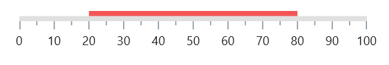
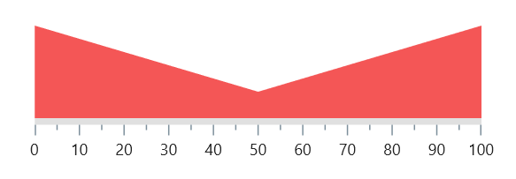
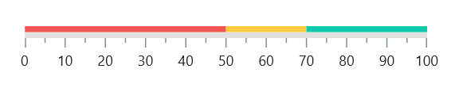

# Range in .NET MAUI Linear Gauge (SfLinearGauge)

A range is a visual element that helps you quickly visualize where a range falls on the axis track. Multiple ranges with different styles can be added to a linear gauge. The default style of range will be as below. 





 <gauge:SfLinearGauge>
				<gauge:SfLinearGauge.Ranges>
					<gauge:LinearRange StartValue="20" EndValue="80"/>
				</gauge:SfLinearGauge.Ranges>
			</gauge:SfLinearGauge>





SfLinearGauge gauge = new SfLinearGauge();
		gauge.Ranges.Add(new LinearRange()
		{
			StartValue = 20,
			EndValue = 80,
		});
		this.Content= gauge;





## Customize range shape 

A Linear Gauge range has two values to draw a range - [`StartValue`](https://help.syncfusion.com/cr/maui/Syncfusion.Maui.Gauges.LinearRange.html#Syncfusion_Maui_Gauges_LinearRange_StartValue), and [`EndValue`](https://help.syncfusion.com/cr/maui/Syncfusion.Maui.Gauges.LinearRange.html#Syncfusion_Maui_Gauges_LinearRange_EndValue).These values indicate where the range falls in the axis. In addition to these values, the shape of the range can be customized by [`StartWidth`](https://help.syncfusion.com/cr/maui/Syncfusion.Maui.Gauges.LinearRange.html#Syncfusion_Maui_Gauges_LinearRange_StartWidth), [`MidWidth`](https://help.syncfusion.com/cr/maui/Syncfusion.Maui.Gauges.LinearRange.html#Syncfusion_Maui_Gauges_LinearRange_MidWidth) and [`EndWidth`](https://help.syncfusion.com/cr/maui/Syncfusion.Maui.Gauges.LinearRange.html#Syncfusion_Maui_Gauges_LinearRange_EndWidth) properties. To draw a line or rectangle, just [`StartValue`](https://help.syncfusion.com/cr/maui/Syncfusion.Maui.Gauges.LinearRange.html#Syncfusion_Maui_Gauges_LinearRange_StartValue), [`StartWidth`](https://help.syncfusion.com/cr/maui/Syncfusion.Maui.Gauges.LinearRange.html#Syncfusion_Maui_Gauges_LinearRange_StartWidth), [`EndValue`](https://help.syncfusion.com/cr/maui/Syncfusion.Maui.Gauges.LinearRange.html#Syncfusion_Maui_Gauges_LinearRange_EndValue) and [`EndWidth`](https://help.syncfusion.com/cr/maui/Syncfusion.Maui.Gauges.LinearRange.html#Syncfusion_Maui_Gauges_LinearRange_EndWidth) are enough - as like the above code snippet in `Default Linear Gauge Range` topic. But to draw a concave and convex shapes, [`MidWidth`](https://help.syncfusion.com/cr/maui/Syncfusion.Maui.Gauges.LinearRange.html#Syncfusion_Maui_Gauges_LinearRange_MidWidth) property is needed. The following code snippet demonstrates how to bring a convex shape for a range.





		  <gauge:SfLinearGauge>
				<gauge:SfLinearGauge.Ranges>
					<gauge:LinearRange StartWidth="70" MidWidth="20" 
									   EndWidth="70"/>
				</gauge:SfLinearGauge.Ranges>
			</gauge:SfLinearGauge>





SfLinearGauge gauge = new SfLinearGauge();
		gauge.Ranges.Add(new LinearRange()
		{
			StartWidth = 70,
			MidWidth = 20,
			EndWidth = 70,
		});
		this.Content= gauge;





For concave shape, override [`UpdateMidRangePath`](https://help.syncfusion.com/cr/maui/Syncfusion.Maui.Gauges.LinearRange.html#Syncfusion_Maui_Gauges_LinearRange_UpdateMidRangePath_Microsoft_Maui_Graphics_PathF_Microsoft_Maui_Graphics_PointF_Microsoft_Maui_Graphics_PointF_Microsoft_Maui_Graphics_PointF_) method and curve for the mid shape. 





<gauge:SfLinearGauge x:Name="gauge">
				<gauge:SfLinearGauge.Ranges>
					<local:LinearRangeExt StartWidth="70" MidWidth="-20" 
										  EndWidth="70"/>
				</gauge:SfLinearGauge.Ranges>
			</gauge:SfLinearGauge>





SfLinearGauge gauge = new SfLinearGauge();
		gauge.Ranges.Add(new LinearRangeExt()
		{
			StartWidth = 70,
			MidWidth = -20,
			EndWidth = 70,
		});
		this.Content= gauge;

...

public class LinearRangeExt : LinearRange
{
	protected override void UpdateMidRangePath(PathF pathF, PointF startPoint, PointF midPoint, PointF endPoint)
	{
		pathF.CurveTo(startPoint, midPoint, endPoint);
	}
}





## Customize color of a range

The color of a range can be changed by setting the [`Fill`](https://help.syncfusion.com/cr/maui/Syncfusion.Maui.Gauges.LinearRange.html#Syncfusion_Maui_Gauges_LinearRange_Fill) property of a range. The following code example demonstrates changing the color property of the range.





 <gauge:SfLinearGauge>
				<gauge:SfLinearGauge.Ranges>
					<gauge:LinearRange Fill="BlueViolet"/>
				</gauge:SfLinearGauge.Ranges>
			</gauge:SfLinearGauge>





SfLinearGauge gauge = new SfLinearGauge();
		gauge.Ranges.Add(new LinearRangeExt()
		{
			Fill = new SolidColorBrush(Colors.BlueViolet),
		});
		this.Content = gauge;





## Apply gradient to a range

A gradient can be applied using the [`GradientStops`](https://help.syncfusion.com/cr/maui/Syncfusion.Maui.Gauges.LinearRange.html#Syncfusion_Maui_Gauges_LinearRange_GradientStops) property of a range. The following code example demonstrates applying a gradient to the range.





<gauge:SfLinearGauge>
				<gauge:SfLinearGauge.Ranges>
					<gauge:LinearRange StartWidth="50">
						<gauge:LinearRange.GradientStops>
							<gauge:GaugeGradientStop Value="0" Color="Red"/>
							<gauge:GaugeGradientStop Value="100" Color="Blue"/>
						</gauge:LinearRange.GradientStops>
					</gauge:LinearRange>
				</gauge:SfLinearGauge.Ranges>
			</gauge:SfLinearGauge>





SfLinearGauge gauge = new SfLinearGauge();
		ObservableCollection<GaugeGradientStop> gradientStops = new ObservableCollection<GaugeGradientStop>();
		gradientStops.Add(new GaugeGradientStop() { Value = 0, Color = Colors.Red });
		gradientStops.Add(new GaugeGradientStop() { Value = 100, Color = Colors.Blue });
		gauge.Ranges.Add(new LinearRangeExt()
		{
			StartWidth=50,
			GradientStops=gradientStops,
		});
		this.Content = gauge;





## Customize range position

It is possible to position the ranges [`Inside`](https://help.syncfusion.com/cr/maui/Syncfusion.Maui.Gauges.GaugeElementPosition.html#Syncfusion_Maui_Gauges_GaugeElementPosition_Inside), [`Cross`](https://help.syncfusion.com/cr/maui/Syncfusion.Maui.Gauges.GaugeElementPosition.html#Syncfusion_Maui_Gauges_GaugeElementPosition_Cross), and [`Outside`](https://help.syncfusion.com/cr/maui/Syncfusion.Maui.Gauges.GaugeElementPosition.html#Syncfusion_Maui_Gauges_GaugeElementPosition_Outside) the axis. By default, the range will be positioned [`Outside`](https://help.syncfusion.com/cr/maui/Syncfusion.Maui.Gauges.GaugeElementPosition.html#Syncfusion_Maui_Gauges_GaugeElementPosition_Outside) the axis. The [`Position`](https://help.syncfusion.com/cr/maui/Syncfusion.Maui.Gauges.LinearRange.html#Syncfusion_Maui_Gauges_LinearRange_Position) property of the range is used to position the range. The following code snippet demonstrates the same.





<gauge:SfLinearGauge>
				<gauge:SfLinearGauge.Ranges>
					<gauge:LinearRange Position="Inside"/>
				</gauge:SfLinearGauge.Ranges>
			</gauge:SfLinearGauge>





SfLinearGauge gauge = new SfLinearGauge();
		gauge.Ranges.Add(new LinearRange()
		{
			Position = GaugeElementPosition.Inside,
		});
		this.Content = gauge;





## Setting range color to axis element

You can set range color to axis elements using the [`UseRangeColorForAxis`](https://help.syncfusion.com/cr/maui/Syncfusion.Maui.Gauges.SfLinearGauge.html#Syncfusion_Maui_Gauges_SfLinearGauge_UseRangeColorForAxis) property of axis.





 <gauge:SfLinearGauge x:Name="gauge" UseRangeColorForAxis="True">
				<gauge:SfLinearGauge.Ranges>
					<gauge:LinearRange StartValue="0" EndValue="33" 
									   Fill="#ffF45656" Position="Cross"/>
					<gauge:LinearRange StartValue="33" EndValue="66" 
									   Fill="#ffFFC93E" Position="Cross"/>
					<gauge:LinearRange StartValue="66" EndValue="100" 
									   Fill="#ff0DC9AB" Position="Cross"/>
				</gauge:SfLinearGauge.Ranges>
			</gauge:SfLinearGauge>





SfLinearGauge gauge = new SfLinearGauge();
		gauge.UseRangeColorForAxis = true;
		gauge.Ranges.Add(new LinearRange()
		{
			StartValue = 0,
			EndValue = 33,
			Fill=new SolidColorBrush(Color.FromArgb("ffF45656")),
			Position=GaugeElementPosition.Cross
		});
		gauge.Ranges.Add(new LinearRange()
		{
			StartValue = 33,
			EndValue = 66,
			Fill = new SolidColorBrush(Color.FromArgb("ffFFC93E")),
			Position = GaugeElementPosition.Cross
		});
		gauge.Ranges.Add(new LinearRange()
		{
			StartValue = 66,
			EndValue = 100,
			Fill = new SolidColorBrush(Color.FromArgb("ff0DC9AB")),
			Position = GaugeElementPosition.Cross
		});
		this.Content = gauge;





## Add multiple ranges

You can add multiple ranges for an axis. The following code example demonstrates adding three ranges in a Linear Gauge.





 <gauge:SfLinearGauge>
				<gauge:SfLinearGauge.Ranges>
					<gauge:LinearRange StartValue="0" EndValue="50" 
									   Fill="#ffF45656"/>
					<gauge:LinearRange StartValue="50" EndValue="70" 
									   Fill="#ffFFC93E"/>
					<gauge:LinearRange StartValue="70" EndValue="100" 
									   Fill="#ff0DC9AB"/>
				</gauge:SfLinearGauge.Ranges>
			</gauge:SfLinearGauge>





SfLinearGauge gauge = new SfLinearGauge();
		gauge.Ranges.Add(new LinearRange()
		{
			StartValue = 0,
			EndValue = 50,
			Fill=new SolidColorBrush(Color.FromArgb("ffF45656")),
		});
		gauge.Ranges.Add(new LinearRange()
		{
			StartValue = 50,
			EndValue = 70,
			Fill = new SolidColorBrush(Color.FromArgb("ffFFC93E")),
		});
		gauge.Ranges.Add(new LinearRange()
		{
			StartValue = 70,
			EndValue = 100,
			Fill = new SolidColorBrush(Color.FromArgb("ff0DC9AB")),
		});
		this.Content = gauge;





## Range child content support

Range allows you to add any content as its child using the [`Child`](https://help.syncfusion.com/cr/maui/Syncfusion.Maui.Gauges.LinearRange.html#Syncfusion_Maui_Gauges_LinearRange_Child) property.





<gauge:SfLinearGauge x:Name="gauge">
				<gauge:SfLinearGauge.Ranges>
					<gauge:LinearRange StartWidth="40" EndWidth="40" 
									   StartValue="0"
									   EndValue="30" Fill="#fb7d55">
						<gauge:LinearRange.Child>
							<Label Text="Bad" HorizontalOptions="Center"
								   VerticalOptions="Center" TextColor="Black"/>
						</gauge:LinearRange.Child>
					</gauge:LinearRange>
					<gauge:LinearRange StartWidth="40" EndWidth="40" 
									   StartValue="30"
									   EndValue="70" Fill="#e8da5d">
						<gauge:LinearRange.Child>
							<Label Text="Good" HorizontalOptions="Center"
								   VerticalOptions="Center" TextColor="Black"/>
						</gauge:LinearRange.Child>
					</gauge:LinearRange>
					<gauge:LinearRange StartWidth="40" EndWidth="40" 
									   StartValue="70"
									   EndValue="100" Fill="#42c09a">
						<gauge:LinearRange.Child>
							<Label Text="Excellent"  HorizontalOptions="Center"
								   VerticalOptions="Center" TextColor="Black"/>
						</gauge:LinearRange.Child>
					</gauge:LinearRange>
				</gauge:SfLinearGauge.Ranges>
			</gauge:SfLinearGauge>





SfLinearGauge gauge = new SfLinearGauge();
		LinearRange range = new LinearRange();
		range.StartValue = 0;
		range.EndValue = 30;
		range.StartWidth = 40;
		range.EndWidth = 40;
		range.Fill = new SolidColorBrush(Color.FromArgb("#fb7d55"));
		range.Child = new Label()
		{
			Text="Bad",
			HorizontalOptions=LayoutOptions.Center,
			VerticalOptions=LayoutOptions.Center,
			TextColor=Colors.Black
		};
		gauge.Ranges.Add(range);
		range = new LinearRange();
		range.StartValue = 30;
		range.EndValue = 70;
		range.StartWidth = 40;
		range.EndWidth = 40;
		range.Fill = new SolidColorBrush(Color.FromArgb("#e8da5d"));
		range.Child = new Label()
		{
			Text = "Good",
			HorizontalOptions = LayoutOptions.Center,
			VerticalOptions = LayoutOptions.Center,
			TextColor = Colors.Black
		};
		gauge.Ranges.Add(range);
		range = new LinearRange();
		range.StartValue = 70;
		range.EndValue = 100;
		range.StartWidth = 40;
		range.EndWidth = 40;
		range.Fill = new SolidColorBrush(Color.FromArgb("#42c09a"));
		range.Child = new Label()
		{
			Text = "Excellent",
			HorizontalOptions = LayoutOptions.Center,
			VerticalOptions = LayoutOptions.Center,
			TextColor = Colors.Black
		};
		gauge.Ranges.Add(range);
		this.Content = gauge;





