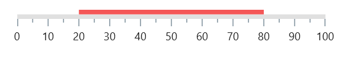
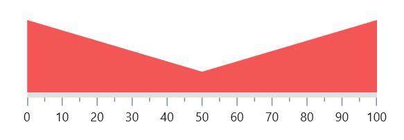
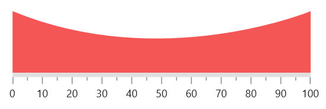
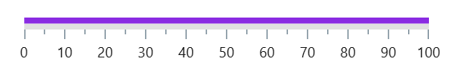
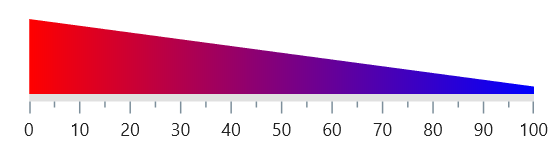
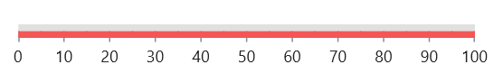
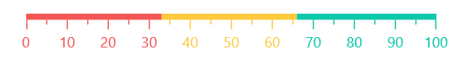
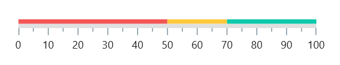
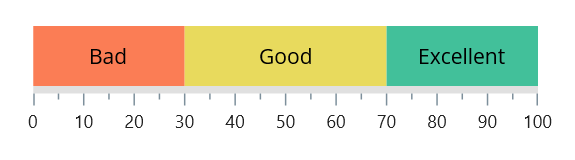

# Range in .NET MAUI Linear Gauge (SfLinearGauge)

N> **Prerequisite:** Ensure that the required NuGet package is installed, the necessary namespaces are imported, and the [.NET MAUI Linear Gauge](https://help.syncfusion.com/maui/linear-gauge/getting-started) control is properly configured in your application. For detailed setup and configuration instructions, refer to the **[Getting Started](https://help.syncfusion.com/maui/linear-gauge/getting-started)** guide.

A range is a visual element that helps you quickly visualize where a range falls on the axis track. Multiple ranges with different styles can be added to a linear gauge. The default style of range will be as follows.





<gauge:SfLinearGauge>
    <gauge:SfLinearGauge.Ranges>
        <gauge:LinearRange StartValue="20" EndValue="80"/>
    </gauge:SfLinearGauge.Ranges>
</gauge:SfLinearGauge>





SfLinearGauge gauge = new SfLinearGauge();
gauge.Ranges.Add(new LinearRange()
{
    StartValue = 20,
    EndValue = 80,
});
this.Content = gauge;





## Customize the range shape

The shape of a range can be customized using the [`StartWidth`](https://help.syncfusion.com/cr/maui/Syncfusion.Maui.Gauges.LinearRange.html#Syncfusion_Maui_Gauges_LinearRange_StartWidth), [`MidWidth`](https://help.syncfusion.com/cr/maui/Syncfusion.Maui.Gauges.LinearRange.html#Syncfusion_Maui_Gauges_LinearRange_MidWidth), and [`EndWidth`](https://help.syncfusion.com/cr/maui/Syncfusion.Maui.Gauges.LinearRange.html#Syncfusion_Maui_Gauges_LinearRange_EndWidth) properties. To draw a line or rectangle, just the [`StartWidth`](https://help.syncfusion.com/cr/maui/Syncfusion.Maui.Gauges.LinearRange.html#Syncfusion_Maui_Gauges_LinearRange_StartWidth) and [`EndWidth`](https://help.syncfusion.com/cr/maui/Syncfusion.Maui.Gauges.LinearRange.html#Syncfusion_Maui_Gauges_LinearRange_EndWidth) are enough, as shown in the code snippet above. But to draw concave and convex shapes, the [`MidWidth`](https://help.syncfusion.com/cr/maui/Syncfusion.Maui.Gauges.LinearRange.html#Syncfusion_Maui_Gauges_LinearRange_MidWidth) property is needed. The following code snippet demonstrates how to create a convex shape for a range. The default values for [`StartWidth`](https://help.syncfusion.com/cr/maui/Syncfusion.Maui.Gauges.LinearRange.html#Syncfusion_Maui_Gauges_LinearRange_StartWidth), [`MidWidth`](https://help.syncfusion.com/cr/maui/Syncfusion.Maui.Gauges.LinearRange.html#Syncfusion_Maui_Gauges_LinearRange_MidWidth), and [`EndWidth`](https://help.syncfusion.com/cr/maui/Syncfusion.Maui.Gauges.LinearRange.html#Syncfusion_Maui_Gauges_LinearRange_EndWidth) are 0.

### Convex shape





<gauge:SfLinearGauge>
    <gauge:SfLinearGauge.Ranges>
        <gauge:LinearRange StartValue="0" EndValue="100"
                           StartWidth="70" MidWidth="20" 
                           EndWidth="70"/>
    </gauge:SfLinearGauge.Ranges>
</gauge:SfLinearGauge>





SfLinearGauge gauge = new SfLinearGauge();
gauge.Ranges.Add(new LinearRange()
{
    StartValue = 0,
    EndValue = 100,
    StartWidth = 70,
    MidWidth = 20,
    EndWidth = 70,
});
this.Content = gauge;





### Concave shape

For a concave shape, create a custom class that extends `LinearRange`, override the [`UpdateMidRangePath`](https://help.syncfusion.com/cr/maui/Syncfusion.Maui.Gauges.LinearRange.html#Syncfusion_Maui_Gauges_LinearRange_UpdateMidRangePath_Microsoft_Maui_Graphics_PathF_Microsoft_Maui_Graphics_PointF_Microsoft_Maui_Graphics_PointF_Microsoft_Maui_Graphics_PointF_) method, and curve the mid shape. The `local:` XAML namespace prefix should map to the namespace where the `LinearRangeExt` class is defined. The `PathF` and `PointF` types require the `Microsoft.Maui.Graphics` namespace.





<gauge:SfLinearGauge x:Name="gauge">
    <gauge:SfLinearGauge.Ranges>
        <local:LinearRangeExt StartWidth="70" MidWidth="-20" 
                              EndWidth="70"/>
    </gauge:SfLinearGauge.Ranges>
</gauge:SfLinearGauge>





SfLinearGauge gauge = new SfLinearGauge();
gauge.Ranges.Add(new LinearRangeExt()
{
    StartWidth = 70,
    MidWidth = -20,
    EndWidth = 70,
});
this.Content = gauge;

//code omitted for brevity

public class LinearRangeExt : LinearRange
{
    protected override void UpdateMidRangePath(PathF pathF, PointF startPoint, PointF midPoint, PointF endPoint)
    {
        pathF.CurveTo(startPoint, midPoint, endPoint);
    }
}





## Customize the color of a range

The color of a range can be changed by setting the [`Fill`](https://help.syncfusion.com/cr/maui/Syncfusion.Maui.Gauges.LinearRange.html#Syncfusion_Maui_Gauges_LinearRange_Fill) property of a range. The following code example demonstrates changing the color property of the range.





<gauge:SfLinearGauge>
    <gauge:SfLinearGauge.Ranges>
        <gauge:LinearRange Fill="BlueViolet"/>
    </gauge:SfLinearGauge.Ranges>
</gauge:SfLinearGauge>





SfLinearGauge gauge = new SfLinearGauge();
gauge.Ranges.Add(new LinearRange()
{
    Fill = new SolidColorBrush(Colors.BlueViolet),
});
this.Content = gauge;





## Apply gradient to a range

The gradient can be applied by using the [`GradientStops`](https://help.syncfusion.com/cr/maui/Syncfusion.Maui.Gauges.LinearRange.html#Syncfusion_Maui_Gauges_LinearRange_GradientStops) property of a range. The following code example demonstrates applying a gradient to the range.





<gauge:SfLinearGauge>
    <gauge:SfLinearGauge.Ranges>
        <gauge:LinearRange StartWidth="50">
            <gauge:LinearRange.GradientStops>
                <gauge:GaugeGradientStop Value="0" Color="Red"/>
                <gauge:GaugeGradientStop Value="100" Color="Blue"/>
            </gauge:LinearRange.GradientStops>
        </gauge:LinearRange>
    </gauge:SfLinearGauge.Ranges>
</gauge:SfLinearGauge>





SfLinearGauge gauge = new SfLinearGauge();
ObservableCollection<GaugeGradientStop> gradientStops = new ObservableCollection<GaugeGradientStop>();
gradientStops.Add(new GaugeGradientStop() { Value = 0, Color = Colors.Red });
gradientStops.Add(new GaugeGradientStop() { Value = 100, Color = Colors.Blue });
gauge.Ranges.Add(new LinearRange()
{
    StartWidth = 50,
    GradientStops = gradientStops,
});
this.Content = gauge;





## Customize range position

It is possible to position the ranges [`Inside`](https://help.syncfusion.com/cr/maui/Syncfusion.Maui.Gauges.GaugeElementPosition.html#Syncfusion_Maui_Gauges_GaugeElementPosition_Inside), [`Cross`](https://help.syncfusion.com/cr/maui/Syncfusion.Maui.Gauges.GaugeElementPosition.html#Syncfusion_Maui_Gauges_GaugeElementPosition_Cross), and [`Outside`](https://help.syncfusion.com/cr/maui/Syncfusion.Maui.Gauges.GaugeElementPosition.html#Syncfusion_Maui_Gauges_GaugeElementPosition_Outside) the axis. By default, the range will be positioned [`Outside`](https://help.syncfusion.com/cr/maui/Syncfusion.Maui.Gauges.GaugeElementPosition.html#Syncfusion_Maui_Gauges_GaugeElementPosition_Outside) the axis. The [`Position`](https://help.syncfusion.com/cr/maui/Syncfusion.Maui.Gauges.LinearRange.html#Syncfusion_Maui_Gauges_LinearRange_Position) property of the range is used to position the range. The following code snippet demonstrates the same.





<gauge:SfLinearGauge>
    <gauge:SfLinearGauge.Ranges>
        <gauge:LinearRange Position="Inside"/>
    </gauge:SfLinearGauge.Ranges>
</gauge:SfLinearGauge>





SfLinearGauge gauge = new SfLinearGauge();
gauge.Ranges.Add(new LinearRange()
{
    Position = GaugeElementPosition.Inside,
});
this.Content = gauge;





## Customize range color for axis elements

You can set range color to axis elements using the [`UseRangeColorForAxis`](https://help.syncfusion.com/cr/maui/Syncfusion.Maui.Gauges.SfLinearGauge.html#Syncfusion_Maui_Gauges_SfLinearGauge_UseRangeColorForAxis) property of the axis. This feature works best when multiple ranges are positioned `Cross` on the axis.





<gauge:SfLinearGauge x:Name="gauge" UseRangeColorForAxis="True">
    <gauge:SfLinearGauge.Ranges>
        <gauge:LinearRange StartValue="0" EndValue="33" 
                           Fill="#ffF45656" Position="Cross"/>
        <gauge:LinearRange StartValue="33" EndValue="66" 
                           Fill="#ffFFC93E" Position="Cross"/>
        <gauge:LinearRange StartValue="66" EndValue="100" 
                           Fill="#ff0DC9AB" Position="Cross"/>
    </gauge:SfLinearGauge.Ranges>
</gauge:SfLinearGauge>





SfLinearGauge gauge = new SfLinearGauge();
gauge.UseRangeColorForAxis = true;
gauge.Ranges.Add(new LinearRange()
{
    StartValue = 0,
    EndValue = 33,
    Fill = new SolidColorBrush(Color.FromArgb("ffF45656")),
    Position = GaugeElementPosition.Cross
});
gauge.Ranges.Add(new LinearRange()
{
    StartValue = 33,
    EndValue = 66,
    Fill = new SolidColorBrush(Color.FromArgb("ffFFC93E")),
    Position = GaugeElementPosition.Cross
});
gauge.Ranges.Add(new LinearRange()
{
    StartValue = 66,
    EndValue = 100,
    Fill = new SolidColorBrush(Color.FromArgb("ff0DC9AB")),
    Position = GaugeElementPosition.Cross
});
this.Content = gauge;





## Add multiple ranges

You can add multiple ranges for an axis. The following code example demonstrates adding three ranges in a .NET MAUI Linear Gauge.





<gauge:SfLinearGauge>
    <gauge:SfLinearGauge.Ranges>
        <gauge:LinearRange StartValue="0" EndValue="50" 
                           Fill="#ffF45656"/>
        <gauge:LinearRange StartValue="50" EndValue="70" 
                           Fill="#ffFFC93E"/>
        <gauge:LinearRange StartValue="70" EndValue="100" 
                           Fill="#ff0DC9AB"/>
    </gauge:SfLinearGauge.Ranges>
</gauge:SfLinearGauge>





SfLinearGauge gauge = new SfLinearGauge();
gauge.Ranges.Add(new LinearRange()
{
    StartValue = 0,
    EndValue = 50,
    Fill = new SolidColorBrush(Color.FromArgb("ffF45656")),
});
gauge.Ranges.Add(new LinearRange()
{
    StartValue = 50,
    EndValue = 70,
    Fill = new SolidColorBrush(Color.FromArgb("ffFFC93E")),
});
gauge.Ranges.Add(new LinearRange()
{
    StartValue = 70,
    EndValue = 100,
    Fill = new SolidColorBrush(Color.FromArgb("ff0DC9AB")),
});
this.Content = gauge;





## Range child content support

Range allows you to add any content as its child using the [`Child`](https://help.syncfusion.com/cr/maui/Syncfusion.Maui.Gauges.LinearRange.html#Syncfusion_Maui_Gauges_LinearRange_Child) property. Ensure that the [`StartWidth`](https://help.syncfusion.com/cr/maui/Syncfusion.Maui.Gauges.LinearRange.html#Syncfusion_Maui_Gauges_LinearRange_StartWidth) and [`EndWidth`](https://help.syncfusion.com/cr/maui/Syncfusion.Maui.Gauges.LinearRange.html#Syncfusion_Maui_Gauges_LinearRange_EndWidth) values are large enough to contain the child content.





<gauge:SfLinearGauge x:Name="gauge">
    <gauge:SfLinearGauge.Ranges>
        <gauge:LinearRange StartWidth="40" EndWidth="40" 
                           StartValue="0"
                           EndValue="30" Fill="#fb7d55">
            <gauge:LinearRange.Child>
                <Label Text="Bad" HorizontalOptions="Center"
                       VerticalOptions="Center" TextColor="Black"/>
            </gauge:LinearRange.Child>
        </gauge:LinearRange>
        <gauge:LinearRange StartWidth="40" EndWidth="40" 
                           StartValue="30"
                           EndValue="70" Fill="#e8da5d">
            <gauge:LinearRange.Child>
                <Label Text="Good" HorizontalOptions="Center"
                       VerticalOptions="Center" TextColor="Black"/>
            </gauge:LinearRange.Child>
        </gauge:LinearRange>
        <gauge:LinearRange StartWidth="40" EndWidth="40" 
                           StartValue="70"
                           EndValue="100" Fill="#42c09a">
            <gauge:LinearRange.Child>
                <Label Text="Excellent" HorizontalOptions="Center"
                       VerticalOptions="Center" TextColor="Black"/>
            </gauge:LinearRange.Child>
        </gauge:LinearRange>
    </gauge:SfLinearGauge.Ranges>
</gauge:SfLinearGauge>





SfLinearGauge gauge = new SfLinearGauge();
LinearRange range = new LinearRange();
range.StartValue = 0;
range.EndValue = 30;
range.StartWidth = 40;
range.EndWidth = 40;
range.Fill = new SolidColorBrush(Color.FromArgb("#fb7d55"));
range.Child = new Label()
{
    Text = "Bad",
    HorizontalOptions = LayoutOptions.Center,
    VerticalOptions = LayoutOptions.Center,
    TextColor = Colors.Black
};
gauge.Ranges.Add(range);
range = new LinearRange();
range.StartValue = 30;
range.EndValue = 70;
range.StartWidth = 40;
range.EndWidth = 40;
range.Fill = new SolidColorBrush(Color.FromArgb("#e8da5d"));
range.Child = new Label()
{
    Text = "Good",
    HorizontalOptions = LayoutOptions.Center,
    VerticalOptions = LayoutOptions.Center,
    TextColor = Colors.Black
};
gauge.Ranges.Add(range);
range = new LinearRange();
range.StartValue = 70;
range.EndValue = 100;
range.StartWidth = 40;
range.EndWidth = 40;
range.Fill = new SolidColorBrush(Color.FromArgb("#42c09a"));
range.Child = new Label()
{
    Text = "Excellent",
    HorizontalOptions = LayoutOptions.Center,
    VerticalOptions = LayoutOptions.Center,
    TextColor = Colors.Black
};
gauge.Ranges.Add(range);
this.Content = gauge;





