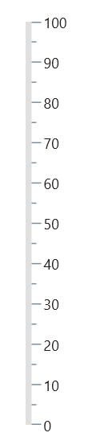
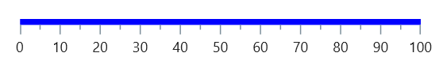
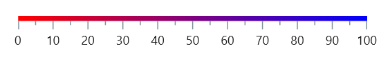
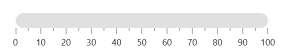
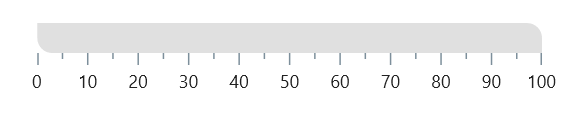

# Scale in .NET MAUI Linear Gauge (SfLinearGauge)

The Linear Gauge scale on which a set of values can be plotted. An scale can be customized by changing the thickness, color, and edge styles. Scale elements such as labels and ticks can also be easily customized and scale can be inversed.

## Default scale

By default, scale will have the [`Minimum`](https://help.syncfusion.com/cr/maui/Syncfusion.Maui.Gauges.SfLinearGauge.html#Syncfusion_Maui_Gauges_SfLinearGauge_Minimum) scale value as 0 and the [`Maximum`](https://help.syncfusion.com/cr/maui/Syncfusion.Maui.Gauges.SfLinearGauge.html#Syncfusion_Maui_Gauges_SfLinearGauge_Maximum) scale value as 100. Without any changes, the default scale of the Linear Gauge will be displayed as follows.





<gauge:SfLinearGauge />





SfLinearGauge gauge = new SfLinearGauge();
this.Content = gauge;





## Customize minimum and maximum scale values

The [`Minimum`](https://help.syncfusion.com/cr/maui/Syncfusion.Maui.Gauges.SfLinearGauge.html#Syncfusion_Maui_Gauges_SfLinearGauge_Minimum) and [`Maximum`](https://help.syncfusion.com/cr/maui/Syncfusion.Maui.Gauges.SfLinearGauge.html#Syncfusion_Maui_Gauges_SfLinearGauge_Maximum) properties of a Linear Gauge can be used to customize the scale values. In the following code sample, the scale is customized to have the [`Minimum`](https://help.syncfusion.com/cr/maui/Syncfusion.Maui.Gauges.SfLinearGauge.html#Syncfusion_Maui_Gauges_SfLinearGauge_Minimum) value of -50 to [`Maximum`](https://help.syncfusion.com/cr/maui/Syncfusion.Maui.Gauges.SfLinearGauge.html#Syncfusion_Maui_Gauges_SfLinearGauge_Maximum) value of 50. The scale values are displayed by the labels. Customizing these label styles are further explained in next topics.  





<gauge:SfLinearGauge  Minimum="-50" Maximum="50" />





SfLinearGauge gauge = new SfLinearGauge();
gauge.Minimum=-50;
gauge.Maximum=50;
this.Content = gauge;





## Customize scale orientation

The orientation of linear scale can be customized by using the [`Orientation`](https://help.syncfusion.com/cr/maui/Syncfusion.Maui.Gauges.SfLinearGauge.html#Syncfusion_Maui_Gauges_SfLinearGauge_Orientation) property of linear gauge.

When the Orientation property is Vertical, the scale will be rendered in bottom-to-top direction.





<gauge:SfLinearGauge Orientation="Vertical"/>





SfLinearGauge gauge = new SfLinearGauge();
		gauge.Orientation = GaugeOrientation.Vertical;
		this.Content = gauge;





## Customize scale track style

The linear scale track can be customized using the [`LineStyle`](https://help.syncfusion.com/cr/maui/Syncfusion.Maui.Gauges.LinearLineStyle.html) property. The [`LineStyle`](https://help.syncfusion.com/cr/maui/Syncfusion.Maui.Gauges.LinearLineStyle.html) has the following properties.

* [`Thickness`](https://help.syncfusion.com/cr/maui/Syncfusion.Maui.Gauges.LinearLineStyle.html#Syncfusion_Maui_Gauges_LinearLineStyle_Thickness) – Customizes the thickness of the scale track.
* [`Fill`](https://help.syncfusion.com/cr/maui/Syncfusion.Maui.Gauges.LinearLineStyle.html#Syncfusion_Maui_Gauges_LinearLineStyle_Fill) – Customizes the color of the scale track with a solid color.
* [`GradientStops`](https://help.syncfusion.com/cr/maui/Syncfusion.Maui.Gauges.LinearLineStyle.html#Syncfusion_Maui_Gauges_LinearLineStyle_GradientStops) - Customizes the color of the scale track with a gradient.
* [`CornerRadius`](https://help.syncfusion.com/cr/maui/Syncfusion.Maui.Gauges.LinearLineStyle.html#Syncfusion_Maui_Gauges_LinearLineStyle_CornerRadius) - Customizes the scale track edge corners.
* [`CornerStyle`](https://help.syncfusion.com/cr/maui/Syncfusion.Maui.Gauges.LinearLineStyle.html#Syncfusion_Maui_Gauges_LinearLineStyle_CornerStyle) - Customizes the scale track edge style as flat or curve.

The following code sample demonstrates how to customize the [`Thickness`](https://help.syncfusion.com/cr/maui/Syncfusion.Maui.Gauges.LinearLineStyle.html#Syncfusion_Maui_Gauges_LinearLineStyle_Thickness) and [`Fill`](https://help.syncfusion.com/cr/maui/Syncfusion.Maui.Gauges.LinearLineStyle.html#Syncfusion_Maui_Gauges_LinearLineStyle_Fill) properties:





 <gauge:SfLinearGauge>
                <gauge:SfLinearGauge.LineStyle>
                    <gauge:LinearLineStyle Thickness="15"/>
                </gauge:SfLinearGauge.LineStyle>
            </gauge:SfLinearGauge>





SfLinearGauge gauge = new SfLinearGauge();

		gauge.LineStyle.Thickness = 15;
		this.Content = gauge;





## Apply solid color

The following code sample sets solid colors to the gauge track.





<gauge:SfLinearGauge>
                <gauge:SfLinearGauge.LineStyle>
                    <gauge:LinearLineStyle Fill="Blue"/>
                </gauge:SfLinearGauge.LineStyle>
            </gauge:SfLinearGauge>





SfLinearGauge gauge = new SfLinearGauge();
		gauge.LineStyle.Fill = new SolidColorBrush(Colors.Blue);
		this.Content = gauge;





## Apply gradient

The [`Fill`](https://help.syncfusion.com/cr/maui/Syncfusion.Maui.Gauges.LinearLineStyle.html#Syncfusion_Maui_Gauges_LinearLineStyle_Fill) property of [`LineStyle`](https://help.syncfusion.com/cr/maui/Syncfusion.Maui.Gauges.LinearLineStyle.html) allows to set a solid color, while the [`GradientStops`](https://help.syncfusion.com/cr/maui/Syncfusion.Maui.Gauges.LinearLineStyle.html#Syncfusion_Maui_Gauges_LinearLineStyle_GradientStops) property of [`LineStyle`](https://help.syncfusion.com/cr/maui/Syncfusion.Maui.Gauges.LinearLineStyle.html) allows to apply linear-gradient to scale track.

The following code sample sets gradient colors to the scale track.





 <gauge:SfLinearGauge>
                <gauge:SfLinearGauge.LineStyle>
                    <gauge:LinearLineStyle>
                        <gauge:LinearLineStyle.GradientStops>
                            <gauge:GaugeGradientStop Value="0" Color="Red"/>
                            <gauge:GaugeGradientStop Value="100" Color="Blue"/>
                        </gauge:LinearLineStyle.GradientStops>
                    </gauge:LinearLineStyle>
                </gauge:SfLinearGauge.LineStyle>
            </gauge:SfLinearGauge>





SfLinearGauge gauge = new SfLinearGauge();
		gauge.LineStyle.GradientStops.Add(new GaugeGradientStop() { Value = 0, Color = Colors.Red });
		gauge.LineStyle.GradientStops.Add(new GaugeGradientStop() { Value = 100, Color = Colors.Blue });
		this.Content = gauge;





## Customize corners

The [`CornerStyle`](https://help.syncfusion.com/cr/maui/Syncfusion.Maui.Gauges.LinearLineStyle.html#Syncfusion_Maui_Gauges_LinearLineStyle_CornerStyle) property of [`LineStyle`](https://help.syncfusion.com/cr/maui/Syncfusion.Maui.Gauges.LinearLineStyle.html) specifies the corner type for the scale track. The corners can be customized with [`BothFlat`](https://help.syncfusion.com/cr/maui/Syncfusion.Maui.Gauges.CornerStyle.html#Syncfusion_Maui_Gauges_CornerStyle_BothFlat), [`BothCurve`](https://help.syncfusion.com/cr/maui/Syncfusion.Maui.Gauges.CornerStyle.html#Syncfusion_Maui_Gauges_CornerStyle_BothCurve), [`StartCurve`](https://help.syncfusion.com/cr/maui/Syncfusion.Maui.Gauges.CornerStyle.html#Syncfusion_Maui_Gauges_CornerStyle_StartCurve), and [`EndCurve`](https://help.syncfusion.com/cr/maui/Syncfusion.Maui.Gauges.CornerStyle.html#Syncfusion_Maui_Gauges_CornerStyle_EndCurve) options. The default value of this property is [`BothFlat`](https://help.syncfusion.com/cr/maui/Syncfusion.Maui.Gauges.CornerStyle.html#Syncfusion_Maui_Gauges_CornerStyle_BothFlat).





 <gauge:SfLinearGauge>
                <gauge:SfLinearGauge.LineStyle>
                    <gauge:LinearLineStyle Thickness="20" 
                                           CornerStyle="BothCurve"/>
                </gauge:SfLinearGauge.LineStyle>
            </gauge:SfLinearGauge>





SfLinearGauge gauge = new SfLinearGauge();
		gauge.LineStyle.Thickness = 20;
		gauge.LineStyle.CornerStyle = CornerStyle.BothCurve;
		this.Content = gauge;





Also [`CornerRadius`](https://help.syncfusion.com/cr/maui/Syncfusion.Maui.Gauges.LinearLineStyle.html#Syncfusion_Maui_Gauges_LinearLineStyle_CornerRadius) allows to set custom corner style for linear scale. 





 <gauge:SfLinearGauge>
                 <gauge:SfLinearGauge.LineStyle>
                    <gauge:LinearLineStyle Thickness="20" 
                                           CornerRadius="0,10,0,10"/>
                </gauge:SfLinearGauge.LineStyle>
            </gauge:SfLinearGauge>





SfLinearGauge gauge = new SfLinearGauge();
		gauge.LineStyle.Thickness = 20;
		gauge.LineStyle.CornerRadius = new Thickness(0, 10, 0, 10);
		this.Content = gauge;





N> If you set both [`CornerStyle`](https://help.syncfusion.com/cr/maui/Syncfusion.Maui.Gauges.LinearLineStyle.html#Syncfusion_Maui_Gauges_LinearLineStyle_CornerStyle) and [`CornerRadius`](https://help.syncfusion.com/cr/maui/Syncfusion.Maui.Gauges.LinearLineStyle.html#Syncfusion_Maui_Gauges_LinearLineStyle_CornerRadius) in the [`LineStyle`](https://help.syncfusion.com/cr/maui/Syncfusion.Maui.Gauges.LinearLineStyle.html), [`CornerStyle`](https://help.syncfusion.com/cr/maui/Syncfusion.Maui.Gauges.LinearLineStyle.html#Syncfusion_Maui_Gauges_LinearLineStyle_CornerStyle) will be first priority for scale. 

## Inverse the scale

The direction of linear gauge scale can be customized by the [`IsInversed`](https://help.syncfusion.com/cr/maui/Syncfusion.Maui.Gauges.SfLinearGauge.html#Syncfusion_Maui_Gauges_SfLinearGauge_IsInversed) property.
When the [`IsInversed`](https://help.syncfusion.com/cr/maui/Syncfusion.Maui.Gauges.SfLinearGauge.html#Syncfusion_Maui_Gauges_SfLinearGauge_IsInversed) property is true, the scale can be placed in an inverse direction. The default value of the [`IsInversed`](https://help.syncfusion.com/cr/maui/Syncfusion.Maui.Gauges.SfLinearGauge.html#Syncfusion_Maui_Gauges_SfLinearGauge_IsInversed) property is false.





 <gauge:SfLinearGauge IsInversed="True">
            </gauge:SfLinearGauge>





SfLinearGauge gauge = new SfLinearGauge();
		gauge.IsInversed = true;
		this.Content = gauge;





You can see that the scale values are displayed from 100 to 0 as the scale track is inversed.

## Change scale track visibility

You can hide the scale track by setting the [`ShowLine`](https://help.syncfusion.com/cr/maui/Syncfusion.Maui.Gauges.SfLinearGauge.html#Syncfusion_Maui_Gauges_SfLinearGauge_ShowLine) property to false. The default value of this property is true.





 <gauge:SfLinearGauge ShowLine="False">
            </gauge:SfLinearGauge>





SfLinearGauge gauge = new SfLinearGauge();
		gauge.ShowLine = false;
		this.Content = gauge;





## Customize scale values

Linear gauge allows you to display a set of values along with a custom scale based on your business logic by using the [`GenerateVisibleLabels`](https://help.syncfusion.com/cr/maui/Syncfusion.Maui.Gauges.SfLinearGauge.html#Syncfusion_Maui_Gauges_SfLinearGauge_GenerateVisibleLabels), [`ValueToFactor`](https://help.syncfusion.com/cr/maui/Syncfusion.Maui.Gauges.SfLinearGauge.html#Syncfusion_Maui_Gauges_SfLinearGauge_ValueToFactor_System_Double_), and [`FactorToValue`](https://help.syncfusion.com/cr/maui/Syncfusion.Maui.Gauges.SfLinearGauge.html#Syncfusion_Maui_Gauges_SfLinearGauge_FactorToValue_System_Double_) callbacks.





 <local:LinearGauge Minimum="1" Maximum="10000">
                <gauge:SfLinearGauge.MarkerPointers>
                    <gauge:LinearShapePointer Value="1000" />
                </gauge:SfLinearGauge.MarkerPointers>
            </local:LinearGauge>





public class LinearGauge : SfLinearGauge
{
    int labelsCount;
    public override List<GaugeLabelInfo> GenerateVisibleLabels()
    {
        List<GaugeLabelInfo> labelInfos = new List<GaugeLabelInfo>();
        int minimum = (int)LogBase(this.Minimum, 10);
        int maximum = (int)LogBase(this.Maximum, 10);
        for (int i = minimum; i <= maximum; i++)
        {
            double value = Math.Floor(Math.Pow(10, i)); // logBase  value is
            GaugeLabelInfo label = new GaugeLabelInfo()
            {
                Value = value,
                Text = value.ToString()
            };
            labelInfos.Add(label);
        }

        labelsCount = labelInfos.Count;
        return labelInfos;
    }

    private double LogBase(double value, int baseValue)
    {
        return Math.Log(value) / Math.Log(baseValue);
    }

    public override double ValueToFactor(double value)
    {
        return LogBase(value, 10) / (labelsCount - 1);
    }

    public override double FactorToValue(double factor)
    {
        return Math.Pow(Math.E, factor * (labelsCount - 1) * Math.Log(10));
    }
}





