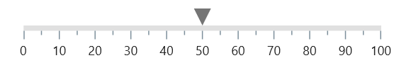
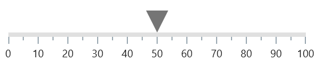
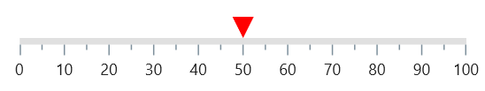
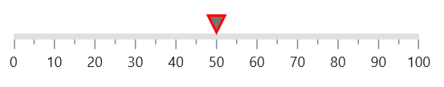
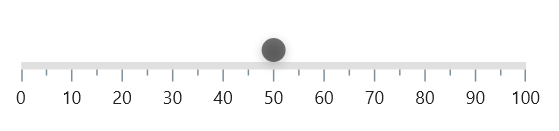
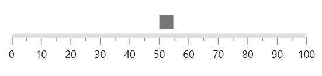
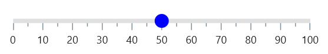
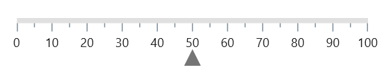

# Shape Marker Pointer in .NET MAUI Linear Gauge (SfLinearGauge)

N> **Prerequisite:** Ensure that the required NuGet package is installed, the necessary namespaces are imported, and the **Linear Gauge** control is properly configured in your application. For detailed setup and configuration instructions, refer to the **[Getting Started](https://help.syncfusion.com/maui/linear-gauge/getting-started)** guide.

The [`LinearShapePointer`](https://help.syncfusion.com/cr/maui/Syncfusion.Maui.Gauges.LinearShapePointer.html) in [`SfLinearGauge`](https://help.syncfusion.com/cr/maui/Syncfusion.Maui.Gauges.SfLinearGauge.html) has the following pre-defined shapes to mark a specific value. The default shape pointer is [`InvertedTriangle`](https://help.syncfusion.com/cr/maui/Syncfusion.Maui.Gauges.ShapeType.html#Syncfusion_Maui_Gauges_ShapeType_InvertedTriangle). 

1. [`Triangle`](https://help.syncfusion.com/cr/maui/Syncfusion.Maui.Gauges.ShapeType.html#Syncfusion_Maui_Gauges_ShapeType_Triangle)
2. [`InvertedTriangle`](https://help.syncfusion.com/cr/maui/Syncfusion.Maui.Gauges.ShapeType.html#Syncfusion_Maui_Gauges_ShapeType_InvertedTriangle)
3. [`Circle`](https://help.syncfusion.com/cr/maui/Syncfusion.Maui.Gauges.ShapeType.html#Syncfusion_Maui_Gauges_ShapeType_Circle)
4. [`Diamond`](https://help.syncfusion.com/cr/maui/Syncfusion.Maui.Gauges.ShapeType.html#Syncfusion_Maui_Gauges_ShapeType_Diamond)
5. [`Rectangle`](https://help.syncfusion.com/cr/maui/Syncfusion.Maui.Gauges.ShapeType.html#Syncfusion_Maui_Gauges_ShapeType_Rectangle)

The following is the default appearance of the shape pointer.





<gauge:SfLinearGauge>
                <gauge:SfLinearGauge.MarkerPointers>
                    <gauge:LinearShapePointer Value="50"/>
                </gauge:SfLinearGauge.MarkerPointers>
            </gauge:SfLinearGauge>





SfLinearGauge gauge = new SfLinearGauge();
		gauge.MarkerPointers.Add(new LinearShapePointer()
		{
			Value = 50,
		});
		this.Content = gauge;





## Change the Size

The size of the marker pointer can be changed by the [`ShapeHeight`](https://help.syncfusion.com/cr/maui/Syncfusion.Maui.Gauges.LinearShapePointer.html#Syncfusion_Maui_Gauges_LinearShapePointer_ShapeHeight) and [`ShapeWidth`](https://help.syncfusion.com/cr/maui/Syncfusion.Maui.Gauges.LinearShapePointer.html#Syncfusion_Maui_Gauges_LinearShapePointer_ShapeWidth) properties of [`LinearShapePointer`](https://help.syncfusion.com/cr/maui/Syncfusion.Maui.Gauges.LinearShapePointer.html). The following code sample demonstrates how to change the size of a shape pointer.





<gauge:SfLinearGauge>
                <gauge:SfLinearGauge.MarkerPointers>
                    <gauge:LinearShapePointer Value="50" ShapeHeight="25" 
                                              ShapeWidth="25"/>
                </gauge:SfLinearGauge.MarkerPointers>
            </gauge:SfLinearGauge>





SfLinearGauge gauge = new SfLinearGauge();
		gauge.MarkerPointers.Add(new LinearShapePointer()
		{
			Value = 50,
			ShapeHeight = 25,
			ShapeWidth = 25,
		});
		this.Content = gauge;





## Customize the Color

The color of the shape pointer can be changed by the [`Fill`](https://help.syncfusion.com/cr/maui/Syncfusion.Maui.Gauges.LinearShapePointer.html#Syncfusion_Maui_Gauges_LinearShapePointer_Fill) property. The following code example demonstrates the same.





<gauge:SfLinearGauge>
                <gauge:SfLinearGauge.MarkerPointers>
                    <gauge:LinearShapePointer Value="50" Fill="Red"/>
                </gauge:SfLinearGauge.MarkerPointers>
            </gauge:SfLinearGauge>





SfLinearGauge gauge = new SfLinearGauge();
		gauge.MarkerPointers.Add(new LinearShapePointer()
		{
			Value = 50,
			Fill=new SolidColorBrush(Colors.Red)
		});
		this.Content = gauge;





## Customize the Border

The border can be customized using the [`Stroke`](https://help.syncfusion.com/cr/maui/Syncfusion.Maui.Gauges.LinearShapePointer.html#Syncfusion_Maui_Gauges_LinearShapePointer_Stroke) and [`StrokeThickness`](https://help.syncfusion.com/cr/maui/Syncfusion.Maui.Gauges.LinearShapePointer.html#Syncfusion_Maui_Gauges_LinearShapePointer_StrokeThickness) properties of the [`LinearShapePointer`](https://help.syncfusion.com/cr/maui/Syncfusion.Maui.Gauges.LinearShapePointer.html).





<gauge:SfLinearGauge>
                <gauge:SfLinearGauge.MarkerPointers>
                    <gauge:LinearShapePointer Value="50" 
                                              StrokeThickness="2" 
                                              Stroke="Red"/>
                </gauge:SfLinearGauge.MarkerPointers>
            </gauge:SfLinearGauge>





SfLinearGauge gauge = new SfLinearGauge();
		gauge.MarkerPointers.Add(new LinearShapePointer()
		{
			Value = 50,
			StrokeThickness = 2,
			Stroke = new SolidColorBrush(Colors.Red)
		});
		this.Content = gauge;





## Shadow Support

A shadow can be applied using the [`HasShadow`](https://help.syncfusion.com/cr/maui/Syncfusion.Maui.Gauges.LinearShapePointer.html#Syncfusion_Maui_Gauges_LinearShapePointer_HasShadow) property.





<gauge:SfLinearGauge>
                <gauge:SfLinearGauge.MarkerPointers>
                    <gauge:LinearShapePointer Value="50" ShapeType="Circle" 
                                              HasShadow="True"/>
                </gauge:SfLinearGauge.MarkerPointers>
            </gauge:SfLinearGauge>





SfLinearGauge gauge = new SfLinearGauge();
		gauge.MarkerPointers.Add(new LinearShapePointer()
		{
			Value = 50,
			ShapeType = ShapeType.Circle,
			HasShadow = true,
		});
		this.Content = gauge;





## Change Marker Alignment

The marker pointer alignment can be changed by the [`Alignment`](https://help.syncfusion.com/cr/maui/Syncfusion.Maui.Gauges.LinearMarkerPointer.html#Syncfusion_Maui_Gauges_LinearMarkerPointer_Alignment) property of [`LinearShapePointer`](https://help.syncfusion.com/cr/maui/Syncfusion.Maui.Gauges.LinearShapePointer.html). The available marker pointer alignments are [`Start`](https://help.syncfusion.com/cr/maui/Syncfusion.Maui.Gauges.GaugeAlignment.html#Syncfusion_Maui_Gauges_GaugeAlignment_Start), [`End`](https://help.syncfusion.com/cr/maui/Syncfusion.Maui.Gauges.GaugeAlignment.html#Syncfusion_Maui_Gauges_GaugeAlignment_End), and [`Center`](https://help.syncfusion.com/cr/maui/Syncfusion.Maui.Gauges.GaugeAlignment.html#Syncfusion_Maui_Gauges_GaugeAlignment_Center). For details on the `OffsetY` property used below, see the [Customize Offset](#customize-offset) section.





 <gauge:SfLinearGauge>
                <gauge:SfLinearGauge.MarkerPointers>
                    <gauge:LinearShapePointer Value="50" ShapeType="Rectangle" 
                                              Alignment="End" OffsetY="-5"/>
                </gauge:SfLinearGauge.MarkerPointers>
            </gauge:SfLinearGauge>





SfLinearGauge gauge = new SfLinearGauge();
		gauge.MarkerPointers.Add(new LinearShapePointer()
		{
			Value = 50,
			ShapeType = ShapeType.Rectangle,
			OffsetY = -5,
			Alignment = GaugeAlignment.End
		});
		this.Content = gauge;





## Customize Position

By default, the shape pointer is positioned [`Outside`](https://help.syncfusion.com/cr/maui/Syncfusion.Maui.Gauges.GaugeElementPosition.html#Syncfusion_Maui_Gauges_GaugeElementPosition_Outside) the scale. This position can be changed by the [`Position`](https://help.syncfusion.com/cr/maui/Syncfusion.Maui.Gauges.LinearPointer.html#Syncfusion_Maui_Gauges_LinearPointer_Position) property of pointer. It is possible to position the shape pointer [`Inside`](https://help.syncfusion.com/cr/maui/Syncfusion.Maui.Gauges.GaugeElementPosition.html#Syncfusion_Maui_Gauges_GaugeElementPosition_Inside), [`Cross`](https://help.syncfusion.com/cr/maui/Syncfusion.Maui.Gauges.GaugeElementPosition.html#Syncfusion_Maui_Gauges_GaugeElementPosition_Cross), or [`Outside`](https://help.syncfusion.com/cr/maui/Syncfusion.Maui.Gauges.GaugeElementPosition.html#Syncfusion_Maui_Gauges_GaugeElementPosition_Outside) the scale. The following code sample demonstrates how to change the shape pointer position to cross the scale.  





<gauge:SfLinearGauge>
                <gauge:SfLinearGauge.MarkerPointers>
                    <gauge:LinearShapePointer Value="50" ShapeType="Circle" 
                                              Position="Cross" Fill="Blue"/>
                </gauge:SfLinearGauge.MarkerPointers>
            </gauge:SfLinearGauge>





SfLinearGauge gauge = new SfLinearGauge();
		gauge.MarkerPointers.Add(new LinearShapePointer()
		{
			Value = 50,
			ShapeType = ShapeType.Circle,
			Position=GaugeElementPosition.Cross,
			Fill=new SolidColorBrush(Colors.Blue),
		});
		this.Content = gauge;





## Customize Offset

In addition to positioning the shape pointer, it is also possible to change the offset of the shape pointer. The [`OffsetX`](https://help.syncfusion.com/cr/maui/Syncfusion.Maui.Gauges.LinearMarkerPointer.html#Syncfusion_Maui_Gauges_LinearMarkerPointer_OffsetX) and [`OffsetY`](https://help.syncfusion.com/cr/maui/Syncfusion.Maui.Gauges.LinearMarkerPointer.html#Syncfusion_Maui_Gauges_LinearMarkerPointer_OffsetY) are the distance from the scale and the cross-positioned elements are not affected by the [`OffsetX`](https://help.syncfusion.com/cr/maui/Syncfusion.Maui.Gauges.LinearMarkerPointer.html#Syncfusion_Maui_Gauges_LinearMarkerPointer_OffsetX) and [`OffsetY`](https://help.syncfusion.com/cr/maui/Syncfusion.Maui.Gauges.LinearMarkerPointer.html#Syncfusion_Maui_Gauges_LinearMarkerPointer_OffsetY) values. The following code sample demonstrates how to change the [`OffsetX`](https://help.syncfusion.com/cr/maui/Syncfusion.Maui.Gauges.LinearMarkerPointer.html#Syncfusion_Maui_Gauges_LinearMarkerPointer_OffsetX) and [`OffsetY`](https://help.syncfusion.com/cr/maui/Syncfusion.Maui.Gauges.LinearMarkerPointer.html#Syncfusion_Maui_Gauges_LinearMarkerPointer_OffsetY) values of the shape pointer. 





 <gauge:SfLinearGauge>
                <gauge:SfLinearGauge.MarkerPointers>
                    <gauge:LinearShapePointer Value="50" ShapeType="Triangle" 
                                              Position="Inside" OffsetY="25"/>
                </gauge:SfLinearGauge.MarkerPointers>
            </gauge:SfLinearGauge>





SfLinearGauge gauge = new SfLinearGauge();
		gauge.MarkerPointers.Add(new LinearShapePointer()
		{
			Value = 50,
			ShapeType = ShapeType.Triangle,
			Position = GaugeElementPosition.Inside,
			OffsetY = 25
		});
		this.Content = gauge;





