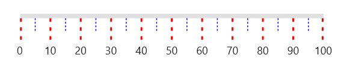
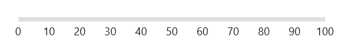
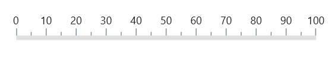

# Ticks in .NET MAUI Linear Gauge (SfLinearGauge)

The default style of scale ticks is as follows.

## Customize tick style

There are two types of ticks in the .NET MAUI Linear Gauge namely major and minor ticks. In the above image, the larger ticks are major ticks and the ticks between the major ticks are minor ticks. The major and minor tick of a [`SfLinearGauge`](https://help.syncfusion.com/cr/maui/Syncfusion.Maui.Gauges.SfLinearGauge.html?tabs=tabid-1) can be customized using the [`MajorTickStyle`](https://help.syncfusion.com/cr/maui/Syncfusion.Maui.Gauges.SfLinearGauge.html#Syncfusion_Maui_Gauges_SfLinearGauge_MajorTickStyle) and [`MinorTickStyle`](https://help.syncfusion.com/cr/maui/Syncfusion.Maui.Gauges.SfLinearGauge.html#Syncfusion_Maui_Gauges_SfLinearGauge_MinorTickStyle) properties. The following properties can be customized for both the major and the minor ticks:
* [`Stroke`](https://help.syncfusion.com/cr/maui/Syncfusion.Maui.Gauges.GaugeTickStyle.html#Syncfusion_Maui_Gauges_GaugeTickStyle_StrokeProperty) – Allows to customize the tick color.
* [`StrokeThickness`](https://help.syncfusion.com/cr/maui/Syncfusion.Maui.Gauges.GaugeTickStyle.html#Syncfusion_Maui_Gauges_GaugeTickStyle_StrokeThicknessProperty) – Allows to customize the thickness of ticks.
* [`Length`](https://help.syncfusion.com/cr/maui/Syncfusion.Maui.Gauges.GaugeTickStyle.html#Syncfusion_Maui_Gauges_GaugeTickStyle_LengthProperty) – Specifics the length of ticks.
* [`StrokeDashArray`](https://help.syncfusion.com/cr/maui/Syncfusion.Maui.Gauges.GaugeTickStyle.html#Syncfusion_Maui_Gauges_GaugeTickStyle_StrokeDashArrayProperty) – Specifics the dash array of ticks.





 <gauge:SfLinearGauge>
                <gauge:SfLinearGauge.MajorTickStyle>
                    <gauge:LinearTickStyle Length="25" Stroke="Red" 
                                           StrokeThickness="2" 
                                           StrokeDashArray="2,3"/>
                </gauge:SfLinearGauge.MajorTickStyle>
                <gauge:SfLinearGauge.MinorTickStyle>
                    <gauge:LinearTickStyle Length="15" Stroke="Blue" 
                                           StrokeThickness="1" 
                                           StrokeDashArray="2,2"/>
                </gauge:SfLinearGauge.MinorTickStyle>
            </gauge:SfLinearGauge>





SfLinearGauge gauge = new SfLinearGauge();

		DoubleCollection collection = new DoubleCollection();
		collection.Add(2);
		collection.Add(3);
		gauge.MajorTickStyle = new LinearTickStyle()
		{
			Length = 25,
			Stroke = new SolidColorBrush(Colors.Red),
			StrokeThickness = 2,
			StrokeDashArray = collection
		};
		
		collection = new DoubleCollection();
		collection.Add(2);
		collection.Add(2);
		gauge.MinorTickStyle = new LinearTickStyle()
		{
			Length = 15,
			Stroke = new SolidColorBrush(Colors.Blue),
			StrokeThickness = 1,
			StrokeDashArray = collection
		};

		this.Content= gauge;





## Customize minor tick interval

The major ticks are generated based on the [`Interval`](https://help.syncfusion.com/cr/maui/Syncfusion.Maui.Gauges.SfLinearGauge.html#Syncfusion_Maui_Gauges_SfLinearGauge_Interval) property, which is documented in [`Customize the interval between labels`](https://help.syncfusion.com/maui/linear-gauge/labels#customize-interval-between-labels) topic. The minor ticks are calculated using the [`MinorTicksPerInterval`](https://help.syncfusion.com/cr/maui/Syncfusion.Maui.Gauges.SfLinearGauge.html#Syncfusion_Maui_Gauges_SfLinearGauge_MinorTicksPerInterval) property of [`SfLinearGauge`](https://help.syncfusion.com/cr/maui/Syncfusion.Maui.Gauges.SfLinearGauge.html?tabs=tabid-1). By default, the value of this property is 1.





 <gauge:SfLinearGauge MinorTicksPerInterval="4"/>





SfLinearGauge gauge = new SfLinearGauge();
		gauge.MinorTicksPerInterval = 4;
		this.Content= gauge;





## Change tick visibility

The [`ShowTicks`](https://help.syncfusion.com/cr/maui/Syncfusion.Maui.Gauges.SfLinearGauge.html#Syncfusion_Maui_Gauges_SfLinearGauge_ShowTicks) property of the scale is used to enable or disable the visibility of both the major and the minor ticks. The default value of this property is true.





<gauge:SfLinearGauge ShowTicks="False"/>





SfLinearGauge gauge = new SfLinearGauge();
		gauge.ShowTicks = false;
		this.Content= gauge;





## Customize tick position

The linear scale allows to position the ticks either inside or outside the scale track using the [`TickPosition`](https://help.syncfusion.com/cr/maui/Syncfusion.Maui.Gauges.SfLinearGauge.html#Syncfusion_Maui_Gauges_SfLinearGauge_TickPosition) property. By default, ticks are positioned inside the scale track.





  <gauge:SfLinearGauge  TickPosition="Outside" LabelPosition="Outside">
                
  </gauge:SfLinearGauge>





SfLinearGauge gauge = new SfLinearGauge();
		gauge.TickPosition = GaugeElementPosition.Outside;
		gauge.LabelPosition = GaugeLabelsPosition.Outside;
		this.Content = gauge;





## Customize tick offset

The ticks can be moved near or far to the scale line using the [`TickOffset`](https://help.syncfusion.com/cr/maui/Syncfusion.Maui.Gauges.SfLinearGauge.html#Syncfusion_Maui_Gauges_SfLinearGauge_TickOffset) property. The default value of tick offset is double.NaN. While setting offset for the ticks, the scale labels are also moved along with the ticks.





<gauge:SfLinearGauge TickOffset="20"/>





SfLinearGauge gauge = new SfLinearGauge();
		gauge.TickOffset = 20;
		this.Content= gauge;





