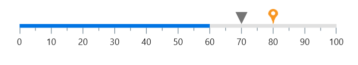
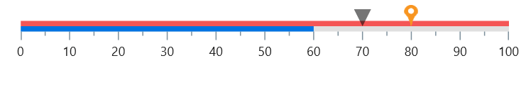

# Getting Started with .NET MAUI Linear Gauge

This section explains the steps required to add the [`.NET MAUI Linear Gauge`]() control and its elements such as axis, range, and pointer. This section covers only basic features needed to get started with Syncfusion linear gauge control.

## Creating an application using the .NET MAUI Linear Gauge

* Create a new .NET MAUI application in the Visual Studio.

* Syncfusion .NET MAUI components are available in [nuget.org](https://www.nuget.org/). To add SfLinearGauge to your project, open the NuGet package manager in Visual Studio, search for [Syncfusion.Maui.Gauges] and then install it.

* Import the control namespace `Syncfusion.Maui.Gauges` in XAML or C# code.





xmlns:gauge="clr-namespace:Syncfusion.Maui.Gauges;assembly=Syncfusion.Maui.Gauges"





using Syncfusion.Maui.Gauges;





* Initialize the SfLinearGauge control





<gauge:SfLinearGauge />





SfLinearGauge gauge = new SfLinearGauge();
this.Content = gauge;





### Register the handler

Syncfusion.Maui.Core nuget is a dependent package for all Syncfusion controls of .NET MAUI. In the MauiProgram.cs file register the handler for Syncfusion core.



using Microsoft.Maui;
using Microsoft.Maui.Hosting;
using Microsoft.Maui.Controls.Compatibility;
using Microsoft.Maui.Controls.Hosting;
using Microsoft.Maui.Controls.Xaml;
using Syncfusion.Maui.Core.Hosting;

namespace GaugeMauiSample
{
    public static class MauiProgram
    {
        public static MauiApp CreateMauiApp()
        {
            var builder = MauiApp.CreateBuilder();
            builder
            .UseMauiApp<App>()
            .ConfigureSyncfusionCore()
            .ConfigureFonts(fonts =>
            {
                fonts.AddFont("OpenSans-Regular.ttf", "OpenSansRegular");
            });

            return builder.Build();
        }
    }
}

 

## Add range to the linear gauge

Ranges contains a list of range elements, to which you can add any number of ranges inside the scale. You can specify the start value, end value, and background color for range using the [`StartValue`](), [`EndValue`](), and [`Fill`]() properties as demonstrated in the following code sample.





<gauge:SfLinearGauge>
                <gauge:SfLinearGauge.Ranges>
                    <gauge:LinearRange/>
                </gauge:SfLinearGauge.Ranges>
            </gauge:SfLinearGauge>





 SfLinearGauge gauge = new SfLinearGauge();
        LinearRange range = new LinearRange();
        gauge.Ranges.Add(range);
        this.Content = gauge;





## Add pointer to the linear gauge

Pointers contains a list of pointer elements, where you can add any number of gauge pointers such as [`BarPointer`](), [`ShapePointer`]() and [`ContentPointer`]() inside the scale to indicate the value.





<gauge:SfLinearGauge>
                ..
                 <gauge:SfLinearGauge.MarkerPointers>

                    <gauge:LinearShapePointer Value="70"/>

                    <gauge:LinearContentPointer Value="80">
                        <gauge:LinearContentPointer.Content>
                            <Image Source="pin.png" HeightRequest="20" WidthRequest="20"/>
                        </gauge:LinearContentPointer.Content>
                    </gauge:LinearContentPointer>
                </gauge:SfLinearGauge.MarkerPointers>

                <gauge:SfLinearGauge.BarPointers>
                    <gauge:BarPointer Value="60"/>
                </gauge:SfLinearGauge.BarPointers>

            </gauge:SfLinearGauge>





SfLinearGauge gauge = new SfLinearGauge();
        ...

        LinearShapePointer shapePointer = new LinearShapePointer();
        shapePointer.Value = 70;
        gauge.MarkerPointers.Add(shapePointer);

        LinearContentPointer contentPointer = new LinearContentPointer();
        contentPointer.Value = 80;
        contentPointer.Content = new Image() { Source = "pin.png", HeightRequest = 20, WidthRequest = 20 };
        gauge.MarkerPointers.Add(contentPointer);

        BarPointer barPointer = new BarPointer();
        barPointer.Value = 60;
        gauge.BarPointers.Add(barPointer);
        this.Content = gauge;





The following code example gives you the complete code of above configurations.





  <gauge:SfLinearGauge>
                <gauge:SfLinearGauge.Ranges>
                    <gauge:LinearRange/>
                </gauge:SfLinearGauge.Ranges>

                <gauge:SfLinearGauge.MarkerPointers>
                    <gauge:LinearShapePointer Value="70"/>

                    <gauge:LinearContentPointer Value="80">
                        <gauge:LinearContentPointer.Content>
                            <Image Source="pin.png" HeightRequest="20" WidthRequest="20"/>
                        </gauge:LinearContentPointer.Content>
                    </gauge:LinearContentPointer>
                </gauge:SfLinearGauge.MarkerPointers>

                <gauge:SfLinearGauge.BarPointers>
                    <gauge:BarPointer Value = "60"/>
                </gauge:SfLinearGauge.BarPointers>
            </gauge:SfLinearGauge>





 SfLinearGauge gauge = new SfLinearGauge();
        
        LinearRange range = new LinearRange();
        gauge.Ranges.Add(range);
        
        LinearShapePointer shapePointer = new LinearShapePointer();
        shapePointer.Value = 70;
        gauge.MarkerPointers.Add(shapePointer);

        LinearContentPointer contentPointer = new LinearContentPointer();
        contentPointer.Value = 80;
        contentPointer.Content = new Image() { Source = "pin.png", HeightRequest = 20, WidthRequest = 20 };
        gauge.MarkerPointers.Add(contentPointer);

        BarPointer barPointer = new BarPointer();
        barPointer.Value = 60;
        gauge.BarPointers.Add(barPointer);

        this.Content = gauge;





