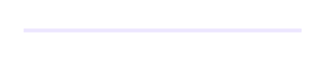
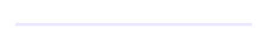

# Animation in .NET MAUI Linear ProgressBar (SfLinearProgressBar)

The linear progress bar provides animation support to visualize the progress value changes in an interactive way. 

The following properties are used to define the duration of animation for the specific states.

* [`AnimationDuration:`](https://help.syncfusion.com/cr/maui/Syncfusion.Maui.ProgressBar.ProgressBarBase.html#Syncfusion_Maui_ProgressBar_ProgressBarBase_AnimationDuration) Represents animation duration of the determinate state’s progress indicator.
* [`SecondaryAnimationDuration:`](https://help.syncfusion.com/cr/maui/Syncfusion.Maui.ProgressBar.SfLinearProgressBar.html#Syncfusion_Maui_ProgressBar_SfLinearProgressBar_SecondaryAnimationDuration) Represents animation duration of the determinate state’s secondary progress indicator.
* [`IndeterminateAnimationDuration:`](https://help.syncfusion.com/cr/maui/Syncfusion.Maui.ProgressBar.ProgressBarBase.html#Syncfusion_Maui_ProgressBar_ProgressBarBase_IndeterminateAnimationDuration) Represents animation duration of the indeterminate state’s indicator.

## Easing effects

The [`AnimationEasing`](https://help.syncfusion.com/cr/maui/Syncfusion.Maui.ProgressBar.ProgressBarBase.html#Syncfusion_Maui_ProgressBar_ProgressBarBase_AnimationEasing) property allows you specify the transfer function that controls animation speed when they run. 

The following code sample demonstrates the `CubicInOut` easing function of the linear progress bar.

 



<progressBar:SfLinearProgressBar Progress="75" 
                                 AnimationEasing="{x:Static Easing.CubicInOut}" />





SfLinearProgressBar linearProgressBar = new SfLinearProgressBar();
linearProgressBar.Progress = 75;
linearProgressBar.AnimationEasing = Easing.CubicInOut;
this.Content = linearProgressBar;



 

The [`SetProgress()`](https://help.syncfusion.com/cr/maui/Syncfusion.Maui.ProgressBar.ProgressBarBase.html#Syncfusion_Maui_ProgressBar_ProgressBarBase_SetProgress_System_Double_System_Nullable_System_Double__Microsoft_Maui_Easing_) method in the progress bar is used to set progress value along with animation duration and easing effect applicable for the specific method call.



void SetProgress(double progress, double? animationDuration = null, Easing? easing = null)



N> The animation duration and easing effect parameters will not affect the configuration of the [`AnimationDuration`](https://help.syncfusion.com/cr/maui/Syncfusion.Maui.ProgressBar.ProgressBarBase.html#Syncfusion_Maui_ProgressBar_ProgressBarBase_AnimationDuration) and [`AnimationEasing`](https://help.syncfusion.com/cr/maui/Syncfusion.Maui.ProgressBar.ProgressBarBase.html#Syncfusion_Maui_ProgressBar_ProgressBarBase_AnimationEasing) properties.

## Indeterminate Easing Effects

The [`IndeterminateAnimationEasing`](https://help.syncfusion.com/cr/maui/Syncfusion.Maui.ProgressBar.ProgressBarBase.html#Syncfusion_Maui_ProgressBar_ProgressBarBase_IndeterminateAnimationEasing) property allows you to specify a transfer function for indeterminate state, which controls animation speed when they run.

The following code sample demonstrates the `BounceIn` easing function of the linear progress bar.

 



<progressBar:SfLinearProgressBar IsIndeterminate="True" 
                                 IndeterminateAnimationEasing="{x:Static Easing.BounceIn}" />





SfLinearProgressBar linearProgressBar = new SfLinearProgressBar();
linearProgressBar.IsIndeterminate = true;
linearProgressBar.IndeterminateAnimationEasing = Easing.BounceIn;
this.Content = linearProgressBar;



 

N> Refer to our [.NET MAUI Linear ProgressBar](https://www.syncfusion.com/maui-controls/maui-progressbar) feature tour page for its groundbreaking feature representations. Also explore our [.NET MAUI Linear ProgressBar example](https://github.com/syncfusion/maui-demos/) that shows how to configure a SfLinearProgressBar in .NET MAUI.