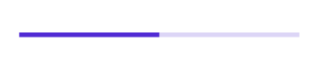

# Define Range in .NET MAUI Linear ProgressBar (SfLinearProgressBar)

The Range represents the entire span of the linear progress bar and can be defined using the [`Minimum`](https://help.syncfusion.com/cr/maui/Syncfusion.Maui.ProgressBar.ProgressBarBase.html#Syncfusion_Maui_ProgressBar_ProgressBarBase_Minimum) and [`Maximum`](https://help.syncfusion.com/cr/maui/Syncfusion.Maui.ProgressBar.ProgressBarBase.html#Syncfusion_Maui_ProgressBar_ProgressBarBase_Maximum) properties. The default value of the range is 0 to 100.

The following code sample demonstrates how to customize the range as factor value to the linear progress bar.

  



<progressBar:SfLinearProgressBar Minimum="0" 
                                 Progress="0.5" 
                                 Maximum="1"/>





SfLinearProgressBar linearProgressBar = new SfLinearProgressBar();
linearProgressBar.Minimum = 0;
linearProgressBar.Maximum = 1;
linearProgressBar.Progress = 0.5;
this.Content = linearProgressBar;



 

N> Refer to our [.NET MAUI Linear ProgressBar](https://www.syncfusion.com/maui-controls/maui-progressbar) feature tour page for its groundbreaking feature representations. Also explore our [.NET MAUI Linear ProgressBar example](https://github.com/syncfusion/maui-demos/) that shows how to configure a SfLinearProgressBar in .NET MAUI.