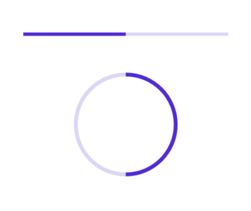

# Range in .NET MAUI Linear Progress Bar

The Range represents the entire span of the Linear Progress Bar and can be defined using the [`Minimum`](https://help.syncfusion.com/cr/maui/Syncfusion.Maui.ProgressBar.ProgressBarBase.html#Syncfusion_Maui_ProgressBar_ProgressBarBase_Minimum) and [`Maximum`](https://help.syncfusion.com/cr/maui/Syncfusion.Maui.ProgressBar.ProgressBarBase.html#Syncfusion_Maui_ProgressBar_ProgressBarBase_Maximum) properties. By default, the range is from 0 to 100.

The following code sample demonstrates how to customize the range as factor value to the Linear Progress Bar.





<progressBar:SfLinearProgressBar Minimum="0"
                                 Progress="0.5"
                                 Maximum="1"/>





using Syncfusion.Maui.ProgressBar;

SfLinearProgressBar linearProgressBar = new SfLinearProgressBar();
linearProgressBar.Minimum = 0;
linearProgressBar.Maximum = 1;
linearProgressBar.Progress = 0.5;
this.Content = linearProgressBar;





N> Refer to our [.NET MAUI Linear Progress Bar](https://www.syncfusion.com/maui-controls/maui-progressbar) feature tour page for its groundbreaking feature representations. Also explore our [.NET MAUI Linear Progress Bar example](https://github.com/syncfusion/maui-demos/) that shows how to configure a SfLinearProgressBar in .NET MAUI.