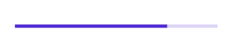
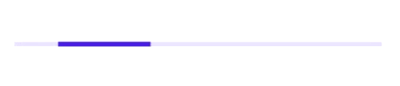

# Getting started with .NET MAUI Linear ProgressBar

This section explains the steps required to add the linear progress bar control with the progress and its customizable elements such as indeterminate, segment, progress fill, and track fill. This section covers only the basic features needed to know and gets started with the Syncfusion linear progress bar.

To get start quickly with our .NET MAUI Linear ProgressBar, check the following video.



## Creating an application using the .NET MAUI Linear Progress Bar

* Create a new .NET MAUI application in the Visual Studio.

* The Syncfusion .NET MAUI components are available on [nuget.org](https://www.nuget.org/). To add SfLinearProgressBar to your project, open the NuGet package manager in Visual Studio, and search for [Syncfusion.Maui.ProgressBar] then install that.

### Register the handler

The Syncfusion.Maui.Core NuGet is a dependent package for all Syncfusion controls of .NET MAUI. In the MauiProgram.cs file, register the handler for the Syncfusion core.



using Microsoft.Maui;
using Microsoft.Maui.Hosting;
using Microsoft.Maui.Controls.Compatibility;
using Microsoft.Maui.Controls.Hosting;
using Microsoft.Maui.Controls.Xaml;
using Syncfusion.Maui.Core.Hosting;

namespace MyProject
{
    public static class MauiProgram
    {
        public static MauiApp CreateMauiApp()
        {
            var builder = MauiApp.CreateBuilder();
            builder
            .UseMauiApp<App>()
            .ConfigureSyncfusionCore()
            .ConfigureFonts(fonts =>
            {
                fonts.AddFont("OpenSans-Regular.ttf", "OpenSansRegular");
            });

            return builder.Build();
        }
    }
}



## Initializing linear progress bar

Add the following namespace.





xmlns:progressBar="clr-namespace:Syncfusion.Maui.ProgressBar;assembly=Syncfusion.Maui.ProgressBar"





using Syncfusion.Maui.ProgressBar;





Create an instance for the linear progress bar control, and add it as content.





<progressBar:SfLinearProgressBar Progress="75"/>





SfLinearProgressBar linearProgressBar = new SfLinearProgressBar { Progress = 75 };
this.Content = linearProgressBar;





N> By default, the value of progress should be specified between 0 and 100. To determine the progress value between 0 and 1, set the Minimum property to 0 and the Maximum property to 1.

Run the project, and check if you get following output to make sure that the project has been configured properly to add the linear progress bar.

## Enabling indeterminate state

When the progress of a task cannot be shown determinately, you can enable the indeterminate state using the [`IsIndeterminate`](https://help.syncfusion.com/cr/maui/Syncfusion.Maui.ProgressBar.ProgressBarBase.html#Syncfusion_Maui_ProgressBar_ProgressBarBase_IsIndeterminate) property to know if any progress is happening in the background.

 

 

<progressBar:SfLinearProgressBar IsIndeterminate="True"/>



 

SfLinearProgressBar linearProgressBar = new SfLinearProgressBar { IsIndeterminate = true };
this.Content = linearProgressBar;



 

## Enable segments

To visualize the progress of a multiple sequential task, split the linear progress bar into the multiple segments by defining the [`SegmentCount`](https://help.syncfusion.com/cr/maui/Syncfusion.Maui.ProgressBar.ProgressBarBase.html#Syncfusion_Maui_ProgressBar_ProgressBarBase_SegmentCount) property as demonstrated in the following code sample.

 

 

<progressBar:SfLinearProgressBar SegmentCount="4" Progress="75"/>



 

SfLinearProgressBar linearProgressBar = new SfLinearProgressBar { Progress = 75, SegmentCount = 4 };
this.Content = linearProgressBar;





## Apply colors

Customize the color of the progress indicator and track by defining the [`ProgressFill`](https://help.syncfusion.com/cr/maui/Syncfusion.Maui.ProgressBar.ProgressBarBase.html#Syncfusion_Maui_ProgressBar_ProgressBarBase_ProgressFill) and [`TrackFill`](https://help.syncfusion.com/cr/maui/Syncfusion.Maui.ProgressBar.ProgressBarBase.html#Syncfusion_Maui_ProgressBar_ProgressBarBase_TrackFill) properties, respectively.

 

 

<progressBar:SfLinearProgressBar Progress="75" 
                                 TrackFill="#33ffbe06" 
                                 ProgressFill="#FFffbe06"/>

<progressBar:SfLinearProgressBar Progress="75"  
                                 TrackFill="#3351483a" 
                                 ProgressFill="#FF51483a"/>



 

SfLinearProgressBar linearProgressBar = new SfLinearProgressBar
{
    Progress = 75, 
    TrackFill = new SolidColorBrush(Color.FromArgb("#33ffbe06")), 
    ProgressFill = new SolidColorBrush(Color.FromArgb("#FFffbe06"))
};

SfLinearProgressBar sfLinearProgressBar = new SfLinearProgressBar
{
    Progress = 75, 
    TrackFill = new SolidColorBrush(Color.FromArgb("#3351483a")), 
    ProgressFill = new SolidColorBrush(Color.FromArgb("#FF51483a"))
};



 

N> 
* Get the complete getting started sample from [GitHub](https://github.com/SyncfusionExamples/Getting-started-with-.NET-MAUI-Linear-ProgressBar-control-) link.
* Refer to our [.NET MAUI Linear ProgressBar](https://www.syncfusion.com/maui-controls/maui-progressbar) feature tour page for its groundbreaking feature representations.