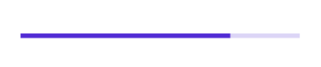

# Getting started with .NET MAUI Linear ProgressBar

This section explains the steps required to add the linear progress bar control with the progress and its customizable elements such as indeterminate, segment, progress fill, and track fill. This section covers only the basic features needed to know and gets started with the Syncfusion&reg; linear progress bar. Follow the steps below to add a .NET MAUI Linear progress bar control to your project.

To get start quickly with our .NET MAUI Linear ProgressBar, check the following video.






## Prerequisites

Before proceeding, ensure the following are set up:

1. Install [.NET 9 SDK](https://dotnet.microsoft.com/en-us/download/dotnet/9.0) or later.
2. Set up a .NET MAUI environment with Visual Studio 2022 v17.12 or later.

## Step 1: Create a New .NET MAUI Project

1. Go to **File > New > Project** and choose the **.NET MAUI App** template.
2. Name the project and choose a location. Then click **Next**.
3. Select the .NET framework version and click **Create**.

## Step 2: Install the Syncfusion&reg; .NET MAUI Linear ProgressBar NuGet Package

1. In **Solution Explorer,** right-click the project and choose **Manage NuGet Packages.**
2. Search for [Syncfusion.Maui.ProgressBar](https://www.nuget.org/packages/Syncfusion.Maui.ProgressBar/) and install the latest version.
3. Ensure the necessary dependencies are installed correctly, and the project is restored.

## Step 3: Register the handler

The [Syncfusion.Maui.Core](https://www.nuget.org/packages/Syncfusion.Maui.Core/) NuGet is a dependent package for all Syncfusion&reg; controls of .NET MAUI. In the **MauiProgram.cs** file, register the handler for Syncfusion core.




using Syncfusion.Maui.Core.Hosting;
namespace GettingStarted
{
    public static class MauiProgram
    {
        public static MauiApp CreateMauiApp()
        {
            var builder = MauiApp.CreateBuilder();

            builder.ConfigureSyncfusionCore();
            builder
            .UseMauiApp<App>()
            .ConfigureFonts(fonts =>
            {
                fonts.AddFont("OpenSans-Regular.ttf", "OpenSansRegular");
            });

            return builder.Build();
        }
    }
}




## Step 4: Add .NET MAUI Linear progress bar control

1. To initialize the control, import the `Syncfusion.Maui.ProgressBar` namespace into your code.
2. Initialize [SfLinearProgressBar](https://help.syncfusion.com/cr/maui/Syncfusion.Maui.ProgressBar.SfLinearProgressBar.html).





xmlns:progressBar="clr-namespace:Syncfusion.Maui.ProgressBar;assembly=Syncfusion.Maui.ProgressBar"





using Syncfusion.Maui.ProgressBar;





Create an instance for the linear progress bar control, and add it as content.





<progressBar:SfLinearProgressBar Progress="75"/>





SfLinearProgressBar linearProgressBar = new SfLinearProgressBar { Progress = 75 };
this.Content = linearProgressBar;








## Prerequisites

Before proceeding, ensure the following are set up:

1. Install [.NET 9 SDK](https://dotnet.microsoft.com/en-us/download/dotnet/9.0) or later.
2. Set up a .NET MAUI environment with Visual Studio Code.
3. Ensure that the .NET MAUI workloads are installed and configured as described [here](https://learn.microsoft.com/en-us/dotnet/maui/get-started/installation?view=net-maui-9.0&tabs=visual-studio-code).

## Step 1: Create a New .NET MAUI Project

1. Open the command palette by pressing `Ctrl+Shift+P` and type **.NET:New Project** and enter.
2. Choose the **.NET MAUI App** template.
3. Select the project location, type the project name and press **Enter**.
4. Then choose **Create project.**

## Step 2: Install the Syncfusion&reg; .NET MAUI Linear ProgressBar NuGet Package

1. Press <kbd>Ctrl</kbd> + <kbd>`</kbd> (backtick) to open the integrated terminal in Visual Studio Code.
2. Ensure you're in the project root directory where your .csproj file is located.
3. Run the command `dotnet add package Syncfusion.Maui.ProgressBar` to install the Syncfusion® .NET MAUI ProgressBar NuGet package.
4. To ensure all dependencies are installed, run `dotnet restore`.

## Step 3: Register the handler

The [Syncfusion.Maui.Core](https://www.nuget.org/packages/Syncfusion.Maui.Core/) NuGet is a dependent package for all Syncfusion&reg; controls of .NET MAUI. In the **MauiProgram.cs** file, register the handler for Syncfusion core.




using Syncfusion.Maui.Core.Hosting;
namespace GettingStarted
{
    public static class MauiProgram
    {
        public static MauiApp CreateMauiApp()
        {
            var builder = MauiApp.CreateBuilder();

            builder.ConfigureSyncfusionCore();
            builder
            .UseMauiApp<App>()
            .ConfigureFonts(fonts =>
            {
                fonts.AddFont("OpenSans-Regular.ttf", "OpenSansRegular");
            });

            return builder.Build();
        }
    }
}




## Step 4: Add .NET MAUI Linear progress bar control

1. To initialize the control, import the `Syncfusion.Maui.ProgressBar` namespace into your code.
2. Initialize [SfLinearProgressBar](https://help.syncfusion.com/cr/maui/Syncfusion.Maui.ProgressBar.SfLinearProgressBar.html).





xmlns:progressBar="clr-namespace:Syncfusion.Maui.ProgressBar;assembly=Syncfusion.Maui.ProgressBar"





using Syncfusion.Maui.ProgressBar;





Create an instance for the linear progress bar control, and add it as content.





<progressBar:SfLinearProgressBar Progress="75"/>





SfLinearProgressBar linearProgressBar = new SfLinearProgressBar { Progress = 75 };
this.Content = linearProgressBar;









## Prerequisites

Before proceeding, ensure the following are set up:

1. Install [.NET 9 SDK](https://dotnet.microsoft.com/en-us/download/dotnet/9.0) or later.
2. Set up a .NET MAUI environment with JetBrains Rider 2024.3 or later.
3. Make sure the MAUI workloads are installed and configured as described [here.](https://www.jetbrains.com/help/rider/MAUI.html#before-you-start)

## Step 1: Create a new .NET MAUI Project

1. Go to **File > New Solution,** Select .NET (C#) and choose the .NET MAUI App template.
2. Enter the Project Name, Solution Name, and Location.
3. Select the .NET framework version and click Create.

## Step 2: Install the Syncfusion® MAUI ProgressBar NuGet Package

1. In **Solution Explorer,** right-click the project and choose **Manage NuGet Packages.**
2. Search for [Syncfusion.Maui.ProgressBar](https://www.nuget.org/packages/Syncfusion.Maui.ProgressBar/) and install the latest version.
3. Ensure the necessary dependencies are installed correctly, and the project is restored. If not, Open the Terminal in Rider and manually run: `dotnet restore`

## Step 3: Register the handler

The [Syncfusion.Maui.Core](https://www.nuget.org/packages/Syncfusion.Maui.Core/) NuGet is a dependent package for all Syncfusion&reg; controls of .NET MAUI. In the **MauiProgram.cs** file, register the handler for Syncfusion core.




using Syncfusion.Maui.Core.Hosting;
namespace GettingStarted
{
    public static class MauiProgram
    {
        public static MauiApp CreateMauiApp()
        {
            var builder = MauiApp.CreateBuilder();

            builder.ConfigureSyncfusionCore();
            builder
            .UseMauiApp<App>()
            .ConfigureFonts(fonts =>
            {
                fonts.AddFont("OpenSans-Regular.ttf", "OpenSansRegular");
            });

            return builder.Build();
        }
    }
}




## Step 4: Add .NET MAUI Linear progress bar control

1. To initialize the control, import the `Syncfusion.Maui.ProgressBar` namespace into your code.
2. Initialize [SfLinearProgressBar](https://help.syncfusion.com/cr/maui/Syncfusion.Maui.ProgressBar.SfLinearProgressBar.html).





xmlns:progressBar="clr-namespace:Syncfusion.Maui.ProgressBar;assembly=Syncfusion.Maui.ProgressBar"





using Syncfusion.Maui.ProgressBar;





Create an instance for the linear progress bar control, and add it as content.





<progressBar:SfLinearProgressBar Progress="75"/>





SfLinearProgressBar linearProgressBar = new SfLinearProgressBar { Progress = 75 };
this.Content = linearProgressBar;








N> By default, the value of progress should be specified between 0 and 100. To determine the progress value between 0 and 1, set the Minimum property to 0 and the Maximum property to 1.

The following screenshot illustrates the result of the above code.

N> 
* Get the complete getting started sample from [GitHub](https://github.com/SyncfusionExamples/Getting-started-with-.NET-MAUI-Linear-ProgressBar-control-) link.
* Refer to our [.NET MAUI Linear ProgressBar](https://www.syncfusion.com/maui-controls/maui-progressbar) feature tour page for its groundbreaking feature representations.