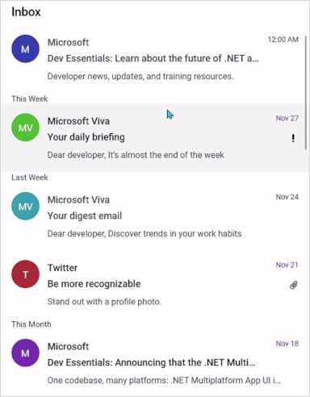
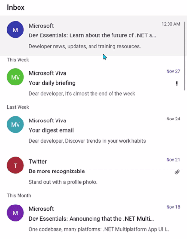

# Pull To Refresh in .NET MAUI ListView (SfListView)

The [SfPullToRefresh](https://help.syncfusion.com/cr/maui/Syncfusion.Maui.PullToRefresh.SfPullToRefresh.html) control allows users to refresh the loaded view by performing a pull-to-refresh action. When SfListView is placed inside the `SfPullToRefresh`, it refreshes the items on the pull-to-refresh action.

Refer to [initializing pull-to-refresh](https://help.syncfusion.com/maui/pull-to-refresh/getting-started#register-the-handler) to enable pull-to-refresh on each platform.

## SfListView inside the SfPullToRefresh 

The `SfListView` supports refreshing the data in view when performing the pull-to-refresh action at runtime by loading it directly into the [SfPullToRefresh.PullableContent](https://help.syncfusion.com/cr/maui/Syncfusion.Maui.PullToRefresh.SfPullToRefresh.html#Syncfusion_Maui_PullToRefresh_SfPullToRefresh_PullableContent) of the [SfPullToRefresh](https://help.syncfusion.com/cr/maui/Syncfusion.Maui.PullToRefresh.SfPullToRefresh.html).

<ol>
    <li>	Install the <a href="https://www.nuget.org/packages/Syncfusion.Maui.PullToRefresh/">Syncfusion.Maui.PullToRefresh</a> NuGet package alongside the <a href="https://help.syncfusion.com/maui/listview/getting-started">SfListView</a> NuGet package. Refer to the <a href="https://help.syncfusion.com/maui/pull-to-refresh/getting-started">SfPullToRefresh getting-started</a> guide for the full list of required packages and platform-specific handler registration.</li>
    <li>	Import the SfPullToRefresh control and SfListView control namespace as follows.</li>
     



xmlns:ListView="clr-namespace:Syncfusion.Maui.ListView;assembly=Syncfusion.Maui.ListView"
xmlns:pulltoRefresh="clr-namespace:Syncfusion.Maui.PullToRefresh;assembly=Syncfusion.Maui.PullToRefresh"
    



using Syncfusion.Maui.ListView;
using Syncfusion.Maui.PullToRefresh;



     
    <li>	Define the SfListView as PullableContent of the SfPullToRefresh.</li>
    <li>	Handle the PullToRefresh events for refreshing the data. </li>
    <li>	Customize the required properties of SfListView and SfPullToRefresh based on your requirements.</li>
</ol>

The final output when hosting SfListView as pullable content is shown below.




<ContentPage xmlns="http://schemas.microsoft.com/dotnet/2021/maui"
            xmlns:x="http://schemas.microsoft.com/winfx/2009/xaml"
            x:Class="RefreshableListView.MainPage"
            xmlns:ListView="clr-namespace:Syncfusion.Maui.ListView;assembly=Syncfusion.Maui.ListView"
            xmlns:pulltoRefresh="clr-namespace:Syncfusion.Maui.PullToRefresh;assembly=Syncfusion.Maui.PullToRefresh"
            xmlns:local="clr-namespace:RefreshableListView">

    <ContentPage.Behaviors>
        <local:ListViewPullToRefreshBehavior />
    </ContentPage.Behaviors>

    <ContentPage.Content>
        <Grid>
            <Grid.RowDefinitions>
                <RowDefinition Height="Auto" />
                <RowDefinition Height="*" />
            </Grid.RowDefinitions>

            <pulltoRefresh:SfPullToRefresh x:Name="pullToRefresh"
                                        RefreshViewHeight="50"
                                        RefreshViewThreshold="30"
                                        PullingThreshold="150"
                                        RefreshViewWidth="50"
                                        TransitionMode="SlideOnTop"
                                        IsRefreshing="False">
                <pulltoRefresh:SfPullToRefresh.PullableContent>
                    <Grid x:Name="mainGrid">
                        <ListView:SfListView Grid.Row="1"
                                            x:Name="listView"
                                            ItemsSource="{Binding InboxInfos}"
                                            ItemSize="102"
                                            SelectionMode="Single"
                                            ScrollBarVisibility="Always">
                            . . . 
                            . . . .

                        </ListView:SfListView>
                    </Grid>
                </pulltoRefresh:SfPullToRefresh.PullableContent>
            </pulltoRefresh:SfPullToRefresh>
        </Grid>
    </ContentPage.Content>
</ContentPage>
    



using Syncfusion.Maui.ListView;
using Syncfusion.Maui.PullToRefresh;

namespace RefreshableListView
{
    public class ListViewPullToRefreshBehavior : Behavior<ContentPage>
    {
        private SfPullToRefresh? pullToRefresh;
        private SfListView? listView;
        private ListViewInboxInfoViewModel? ViewModel;

        protected override void OnAttachedTo(ContentPage bindable)
        {
            ViewModel = new ListViewInboxInfoViewModel();
            bindable.BindingContext = ViewModel;
            pullToRefresh = bindable.FindByName<SfPullToRefresh>("pullToRefresh");
            listView = bindable.FindByName<SfListView>("listView");
            if (pullToRefresh != null)
            {
                pullToRefresh.Refreshing += PullToRefresh_Refreshing;
            }

            base.OnAttachedTo(bindable);
        }

        protected override void OnDetachingFrom(ContentPage bindable)
        {
            if (pullToRefresh != null)
            {
                pullToRefresh.Refreshing -= PullToRefresh_Refreshing;
                pullToRefresh = null;
            }

            listView = null;
            ViewModel = null;
            base.OnDetachingFrom(bindable);
        }

        private async void PullToRefresh_Refreshing(object? sender, EventArgs e)
        {
            if (pullToRefresh == null || ViewModel == null)
            {
                return;
            }

            pullToRefresh.IsRefreshing = true;
            await Task.Delay(2500);
            ViewModel.AddItemsRefresh(3);
            pullToRefresh.IsRefreshing = false;
        }
    }
}




N> [View sample in GitHub](https://github.com/SyncfusionExamples/load-listview-as-pullable-content-of-.net-maui-pull-to-refresh).

If you run the above sample with the [TransitionMode](https://help.syncfusion.com/cr/maui/Syncfusion.Maui.PullToRefresh.SfPullToRefresh.html#Syncfusion_Maui_PullToRefresh_SfPullToRefresh_TransitionMode) as `Push`, the output will look like the following.

## Limitation

The `Horizontal` SfListView does not support the pull-to-refresh action provided by the [SfPullToRefresh](https://help.syncfusion.com/cr/maui/Syncfusion.Maui.PullToRefresh.SfPullToRefresh.html).