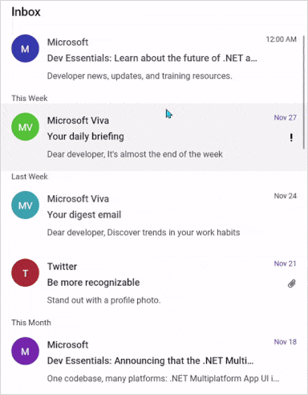
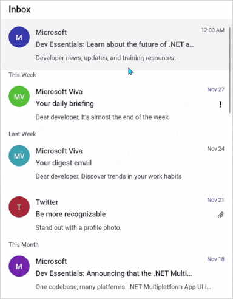

# Pull To Refresh in .NET MAUI ListView (SfListView)

The [SfPullToRefresh](https://help.syncfusion.com/cr/maui/Syncfusion.Maui.PullToRefresh.SfPullToRefresh.html) refreshing control allows interacting and refreshing the loaded view. When the SfListView is loaded inside the `SfPullToRefresh`, it refreshes the item when performing the pull-to-refresh action.

Refer [initializing pull-to-refresh](https://help.syncfusion.com/maui/pull-to-refresh/getting-started#register-the-handler) to launch pull-to-refresh on each platform.

## SfListView inside the SfPullToRefresh 

The `SfListView` supports refreshing the data in view when performing the pull-to-refresh action at runtime by loading it directly into the [SfPullToRefresh.PullableContent](https://help.syncfusion.com/cr/maui/Syncfusion.Maui.PullToRefresh.SfPullToRefresh.html#Syncfusion_Maui_PullToRefresh_SfPullToRefresh_PullableContent) of the [SfPullToRefresh](https://help.syncfusion.com/cr/maui/Syncfusion.Maui.PullToRefresh.SfPullToRefresh.html).

<ol>
    <li>	Add the required assembly references as discussed in the <a href="https://help.syncfusion.com/maui/listview/getting-started">ListView</a> and PullToRefresh.</li>
    <li>	Import the SfPullToRefresh control and SfListView control namespace as follows.</li>
     



    xmlns:ListView="clr-namespace:Syncfusion.Maui.ListView;assembly=Syncfusion.Maui.ListView"
    xmlns:pulltoRefresh="clr-namespace:Syncfusion.Maui.PullToRefresh;assembly=Syncfusion.Maui.PullToRefresh"
    



    using Syncfusion.Maui.ListView;
    using Syncfusion.Maui.PullToRefresh;



     
    <li>	Define the ListView as PullableContent of the SfPullToRefresh.</li>
    <li>	Handle the pull to refresh events for refreshing the data. </li>
    <li>	Customize the required properties of ListView and PullToRefresh based on your requirement.</li>
</ol>

This is how the final output will look like when hosting a SfListView control as pullable content.




    <ContentPage xmlns="http://schemas.microsoft.com/dotnet/2021/maui"
                xmlns:x="http://schemas.microsoft.com/winfx/2009/xaml"
                x:Class="RefreshableListView.MainPage"
                xmlns:ListView="clr-namespace:Syncfusion.Maui.ListView;assembly=Syncfusion.Maui.ListView"
                xmlns:pulltoRefresh="clr-namespace:Syncfusion.Maui.PullToRefresh;assembly=Syncfusion.Maui.PullToRefresh"
                xmlns:local="clr-namespace:RefreshableListView">

        <ContentPage.Behaviors>
            <local:ListViewPullToRefreshBehavior />
        </ContentPage.Behaviors>

        <ContentPage.Content>
            <Grid>
                <pulltoRefresh:SfPullToRefresh x:Name="pullToRefresh"
                                            RefreshViewHeight="50"
                                            RefreshViewThreshold="30"
                                            PullingThreshold="150"
                                            RefreshViewWidth="50"
                                            TransitionMode="SlideOnTop"
                                            IsRefreshing="False">
                    <pulltoRefresh:SfPullToRefresh.PullableContent>
                        <Grid x:Name="mainGrid">
                            <ListView:SfListView Grid.Row="1"
                                                x:Name="listView"
                                                ItemsSource="{Binding InboxInfos}"
                                                ItemSize="102"
                                                SelectionMode="Single"
                                                ScrollBarVisibility="Always"
                                                AutoFitMode="Height">
                                . . . 
                                . . . .

                            </ListView:SfListView>
                        </Grid>
                    </pulltoRefresh:SfPullToRefresh.PullableContent>
                </pulltoRefresh:SfPullToRefresh>
            </Grid>
        </ContentPage.Content>
    </ContentPage>
    



    using Syncfusion.Maui.DataSource;
    using Syncfusion.Maui.DataSource.Extensions;
    using Syncfusion.Maui.ListView;
    using Syncfusion.Maui.PullToRefresh;
    namespace RefreshableListView
    {
        protected override void OnAttachedTo(ContentPage bindable)
        {
            ViewModel = new ListViewInboxInfoViewModel();
            bindable.BindingContext = ViewModel;
            pullToRefresh = bindable.FindByName<SfPullToRefresh>("pullToRefresh");
            ListView = bindable.FindByName<SfListView>("listView");
            pullToRefresh.Refreshing += PullToRefresh_Refreshing;

            base.OnAttachedTo(bindable);
        }

        private async void PullToRefresh_Refreshing(object? sender, EventArgs e)
        {
            pullToRefresh!.IsRefreshing = true;
            await Task.Delay(2500);
            ViewModel!.AddItemsRefresh(3);
            pullToRefresh.IsRefreshing = false;
        }
    }




N> [View sample in GitHub](https://github.com/SyncfusionExamples/load-listview-as-pullable-content-of-.net-maui-pull-to-refresh).

If you run the above sample with the [TransitionMode](https://help.syncfusion.com/cr/maui/Syncfusion.Maui.PullToRefresh.SfPullToRefresh.html#Syncfusion_Maui_PullToRefresh_SfPullToRefresh_TransitionMode) as Push, the output will look as follows.

## Limitation

The `Horizontal` ListView does not support the [SfPullToRefresh](https://help.syncfusion.com/cr/maui/Syncfusion.Maui.PullToRefresh.SfPullToRefresh.html).