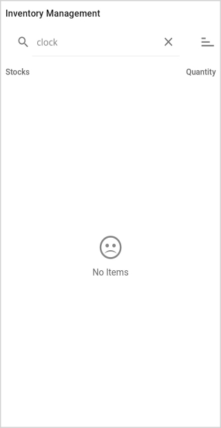
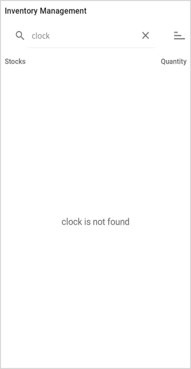
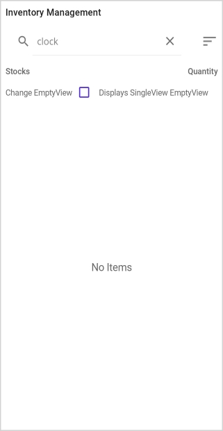
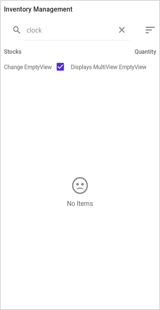
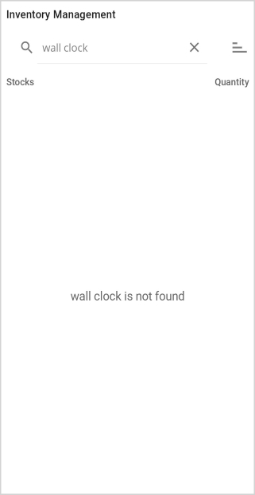
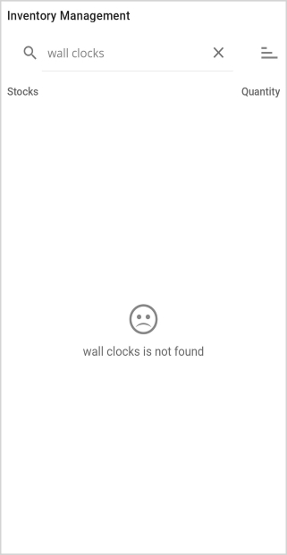

# Empty view in .NET MAUI ListView (SfListView)

The `SfListView` allows you to display and customize empty view content when there is no data available, using the following properties:

 * [EmptyView](https://help.syncfusion.com/cr/maui/Syncfusion.Maui.ListView.SfListView.html#Syncfusion_Maui_ListView_SfListView_EmptyView) is of type `object` and can be set to a `string`, a `View`, or a custom type. It is displayed when `SfListView` has no items. The default value is `null`.
 * [EmptyViewTemplate](https://help.syncfusion.com/cr/maui/Syncfusion.Maui.ListView.SfListView.html#Syncfusion_Maui_ListView_SfListView_EmptyViewTemplate) is of type `DataTemplate`. It is applied to the value of `EmptyView` to produce the final visual content, so the binding context of the template is the `EmptyView` value itself. The default value is `null`.

## Display a string when ListView has no items

The empty view is displayed whenever the [ItemsSource](https://help.syncfusion.com/cr/maui/Syncfusion.Maui.ListView.SfListView.html#Syncfusion_Maui_ListView_SfListView_ItemsSource) is null, or whenever the collection assigned to the `ItemsSource` property is null or empty. In this section, the `EmptyView` property is set to a string.



<ContentPage xmlns:syncfusion="clr-namespace:Syncfusion.Maui.ListView;assembly=Syncfusion.Maui.ListView">
  <syncfusion:SfListView x:Name="listView"
                         ItemsSource="{Binding Items}"
                         ItemSize="56"
                         EmptyView="No Items">
  </syncfusion:SfListView>
</ContentPage>


listView.EmptyView = "No Items";



## Display views when ListView has no items

The `EmptyView` property can be set to a view, which is displayed when the [ItemsSource](https://help.syncfusion.com/cr/maui/Syncfusion.Maui.ListView.SfListView.html#Syncfusion_Maui_ListView_SfListView_ItemsSource) property is null, or when the collection specified by the `ItemsSource` property is null or empty.



<ContentPage xmlns:syncfusion="clr-namespace:Syncfusion.Maui.ListView;assembly=Syncfusion.Maui.ListView">
  <syncfusion:SfListView x:Name="listView"
                         ItemsSource="{Binding Items}"
                         ItemSize="56">
    <syncfusion:SfListView.EmptyView>
      <VerticalStackLayout VerticalOptions="Center">
        <Label Text="&#xe725;" FontSize="40" HorizontalTextAlignment="Center"
                               FontFamily="{OnPlatform iOS=ListViewFontIcons.ttf#ListViewFontIcons, MacCatalyst=ListViewFontIcons.ttf#ListViewFontIcons, Android=ListViewFontIcons.ttf#ListViewFontIcons, UWP=ListViewFontIcons.ttf#ListViewFontIcons}" />
        <Label Text="No Items" FontSize="16" FontFamily="Roboto-Regular" HorizontalTextAlignment="Center" />
      </VerticalStackLayout>
    </syncfusion:SfListView.EmptyView>
  </syncfusion:SfListView>
</ContentPage>


VerticalStackLayout stackLayout = new VerticalStackLayout() { VerticalOptions = LayoutOptions.Center };

var label1 = new Label()
{
  Text = "\ue725",
  FontSize = 40,
  HorizontalTextAlignment = TextAlignment.Center,
  FontFamily = "ListViewFontIcons.ttf#ListViewFontIcons"
};
var label2 = new Label()
{
  Text = "No Items",
  FontSize = 16,
  FontFamily = "Roboto-Regular",
  HorizontalTextAlignment = TextAlignment.Center,
};
stackLayout.Children.Add(label1);
stackLayout.Children.Add(label2);

listView.EmptyView = stackLayout;



N> View displayed by the `EmptyView` can be a single view or a view that contains multiple child views.

Download the entire source code from GitHub [here](https://github.com/SyncfusionExamples/how-to-display-a-view-when-.net-maui-listview-has-no-items).

## Display a custom type as the empty view

The `EmptyView` property can be set to a custom type, which is used to display when the `ItemsSource` is null, or when the collection specified by the `ItemsSource` property is null or empty. The appearance of the `EmptyView` can be customized by using the `EmptyViewTemplate`.



<ContentPage xmlns:syncfusion="clr-namespace:Syncfusion.Maui.ListView;assembly=Syncfusion.Maui.ListView"
             xmlns:local="clr-namespace:EmptyViewTemplate">
  <Grid>
    <Grid.RowDefinitions>
      <RowDefinition Height="30"/>
      <RowDefinition Height="*" />
    </Grid.RowDefinitions>
    <SearchBar x:Name="filterText" 
               FontSize="16"                              
               Placeholder="Filter Inventory" TextChanged="SearchBar_TextChanged"/>                                                   
    <syncfusion:SfListView Grid.Row="1" x:Name="listView"
                           ItemsSource="{Binding Items}"
                           ItemSize="56">
      <syncfusion:SfListView.EmptyView>
        <local:FilterItem Filter="{Binding Source={x:Reference filterText},Path=Text}"/>
      </syncfusion:SfListView.EmptyView>
      <syncfusion:SfListView.EmptyViewTemplate>
        <DataTemplate>
          <Label Text="{Binding Filter,StringFormat='{0} is not found'}" HorizontalTextAlignment="Center"
                 VerticalOptions="Center"
                 FontSize="18" FontFamily="Roboto-Regular"/>
        </DataTemplate>
      </syncfusion:SfListView.EmptyViewTemplate>
    </syncfusion:SfListView>
  </Grid>
</ContentPage>


listView.EmptyView = new FilterItem() { Filter = filterText.Text};

listView.EmptyViewTemplate = new DataTemplate(() =>
{
  Label label = new Label()
  {
    FontSize = 18,
    FontFamily = "Roboto-Regular",
    VerticalOptions = LayoutOptions.Center,
    HorizontalTextAlignment = TextAlignment.Center
  };
  label.SetBinding(Label.TextProperty, new Binding("Filter", stringFormat : "{0} is not found"));
  return label;
});



The `FilterItem` type defines a `Filter` property. It inherits from `BindableObject` so that the `Filter` property can be backed by a `BindableProperty` and notify the template when the value changes, which keeps the `EmptyViewTemplate` in sync with the `SearchBar.Text` value at run time:



public class FilterItem : BindableObject
{
  public static readonly BindableProperty FilterProperty = BindableProperty.Create(nameof(Filter), typeof(string), typeof(FilterItem), null);

  public string Filter
  {
      get { return (string)GetValue(FilterProperty); }
      set { SetValue(FilterProperty, value); }
  }
}



FilterItem object is set to the `EmptyView` property, and the `Filter` property is bound to the `SearchBar.Text` property. When the `SearchBar.TextChanged` event is raised, the value of the `SearchBar.Text` property is stored in the `Filter` property.

Download the entire source code from GitHub [here](https://github.com/SyncfusionExamples/how-to-customize-the-appearance-of-empty-view-using-empty-view-template-in-.net-maui-listview).

## Change an empty view at runtime

The `EmptyView` can be changed to a specific view at run time. Views can also be defined as [ContentView](https://learn.microsoft.com/en-us/dotnet/api/microsoft.maui.controls.contentview?view=net-maui-7.0) objects in the [ResourceDictionary](https://learn.microsoft.com/en-us/dotnet/api/microsoft.maui.controls.resourcedictionary?view=net-maui-7.0).



<ContentPage xmlns:syncfusion="clr-namespace:Syncfusion.Maui.ListView;assembly=Syncfusion.Maui.ListView"
             xmlns:local="clr-namespace:EmptyViewTemplate">
  <ContentPage.Resources>
    <ResourceDictionary>
      <ContentView x:Key="SingleView">
        <ContentView.Content>
          <Label Text="No Items" FontSize="18" FontFamily="Roboto-Regular"
                 HorizontalTextAlignment="Center" VerticalOptions="Center"/>
        </ContentView.Content>
      </ContentView>
      <ContentView x:Key="MultiView">
        <ContentView.Content>
          <VerticalStackLayout VerticalOptions="Center">
            <Label Text="&#xe725;" FontSize="40"
                   FontFamily="{OnPlatform iOS=ListViewFontIcons.ttf#ListViewFontIcons, MacCatalyst=ListViewFontIcons.ttf#ListViewFontIcons, Android=ListViewFontIcons.ttf#ListViewFontIcons, UWP=ListViewFontIcons.ttf#ListViewFontIcons}"
                   HorizontalTextAlignment="Center" />
            <Label TextColor="#666666" Text="No Items" FontSize="16" FontFamily="Roboto-Regular" HorizontalTextAlignment="Center" />
          </VerticalStackLayout>
        </ContentView.Content>
      </ContentView>
    </ResourceDictionary>
  </ContentPage.Resources>

  <ContentPage.Content>
    <Grid>
      <Grid.RowDefinitions>
        <RowDefinition Height="30"/>
        <RowDefinition Height="30"/>
        <RowDefinition Height="*" />
      </Grid.RowDefinitions>
      <SearchBar x:Name="filterText" 
                 FontSize="16"                              
                 Placeholder="Filter Inventory" TextChanged="SearchBar_TextChanged"/> 
      <CheckBox Grid.Row="1" x:Name="checkBox" IsChecked="False" 
                             CheckedChanged="CheckBox_CheckedChanged"/>                                                  
      <syncfusion:SfListView Grid.Row="2" x:Name="listView"
                             ItemsSource="{Binding Items}"
                             ItemSize="56"
                             EmptyView="{StaticResource SingleView}">                   
      </syncfusion:SfListView>
    </Grid>
  </ContentPage.Content>
</ContentPage>


listView.EmptyView = Resources["SingleView"];

checkBox.CheckedChanged += CheckBox_CheckedChanged;



`EmptyView` is changed based on the value of the [CheckBox.IsChecked](https://learn.microsoft.com/en-us/dotnet/api/microsoft.maui.controls.checkbox.ischecked?view=net-maui-7.0) property at run time.



private void CheckBox_CheckedChanged(object sender, CheckedChangedEventArgs e)
{
  if(e.Value)
    listView.EmptyView = this.Resources["MultiView"];
  else
    listView.EmptyView = this.Resources["SingleView"];
}



Download the entire source code from GitHub [here](https://github.com/SyncfusionExamples/how-to-change-empty-view-at-run-time-in-.net-maui-listview).

## Change an empty view template at runtime

The `EmptyView` appearance can be changed at run time based on the value of `EmptyView` by using the `EmptyViewTemplate` property.



<ContentPage xmlns:syncfusion="clr-namespace:Syncfusion.Maui.ListView;assembly=Syncfusion.Maui.ListView"
             xmlns:local="clr-namespace:EmptyViewTemplate">
  <ContentPage.Resources>
    <ResourceDictionary>          
      <DataTemplate x:Key="BasicTemplate">
        <Label Text="{Binding .,StringFormat='{0} is not found'}"
               HorizontalTextAlignment="Center" VerticalOptions="Center"
               FontSize="18" FontFamily="Roboto-Regular"/>
      </DataTemplate>
      <DataTemplate  x:Key="AdvancedTemplate">
        <VerticalStackLayout VerticalOptions="Center">
          <Label Text="&#xe725;"
                 FontSize="40"
                 FontFamily="{OnPlatform iOS=ListViewFontIcons, MacCatalyst=ListViewFontIcons, Android=ListViewFontIcons.ttf#, UWP=ListViewFontIcons.ttf#ListViewFontIcons}"
                 HorizontalTextAlignment="Center"/>
          <Label Text="{Binding .,StringFormat='{0} is not found'}"
                 FontSize="16"
                 FontFamily="Roboto-Regular"
                 HorizontalTextAlignment="Center"/>
        </VerticalStackLayout>
      </DataTemplate>
      <local:EmptyViewDataTemplateSelector x:Key="DataTemplateSelector" 
                                           BasicTemplate="{StaticResource BasicTemplate}" 
                                           AdvancedTemplate="{StaticResource AdvancedTemplate}"/>
    </ResourceDictionary>
  </ContentPage.Resources> 

  <Grid>
    <Grid.RowDefinitions>
      <RowDefinition Height="30"/>
      <RowDefinition Height="*" />
    </Grid.RowDefinitions>
    <SearchBar x:Name="filterText" 
               FontSize="16"                              
               Placeholder="Filter Inventory" TextChanged="SearchBar_TextChanged"/>                                                   
    <syncfusion:SfListView Grid.Row="1" x:Name="listView"
                           ItemsSource="{Binding Items}"
                           ItemSize="56"
                           EmptyView="{Binding Source={x:Reference filterText},Path=Text}"
                           EmptyViewTemplate="{StaticResource DataTemplateSelector}">                         
    </syncfusion:SfListView>
  </Grid>
</ContentPage>


listView.EmptyView = filterText.Text;

listView.EmptyViewTemplate = new EmptyViewDataTemplateSelector() { BasicTemplate = this.Resources["BasicTemplate"] as DataTemplate, AdvancedTemplate = this.Resources["AdvancedTemplate"] as DataTemplate };



The `EmptyView` property is set to the `SearchBar.Text` property, and the `EmptyViewTemplate` property is set to an `EmptyViewDataTemplateSelector` object.



public class EmptyViewDataTemplateSelector : Microsoft.Maui.Controls.DataTemplateSelector
{
  public DataTemplate BasicTemplate { get; set; }
  public DataTemplate AdvancedTemplate { get; set; }

  public EmptyViewDataTemplateSelector()
  {
    
  }

  protected override DataTemplate OnSelectTemplate(object item, BindableObject container)
  {
    if (((string)item).Length > 10)
        return AdvancedTemplate;
    else
        return BasicTemplate;
  }
}



The template for `EmptyView` is set to `AdvancedTemplate` when the `SearchBar.Text` length is greater than 10; otherwise, it is set to `BasicTemplate`.

Download the entire source code from GitHub [here](https://github.com/SyncfusionExamples/how-to-change-empty-view-template-at-run-time-in-.net-maui-listview).