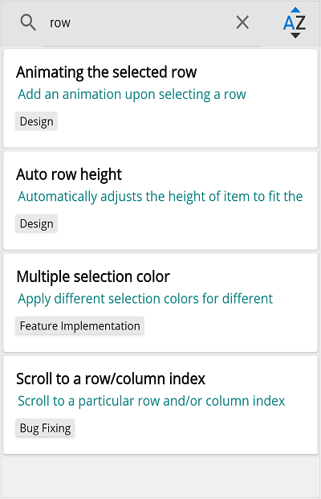

# Filtering in .NET MAUI ListView (SfListView)

This section explains how to filter the data and its related operations in the SfListView.

To get start quickly with .NET MAUI ListView Filtering, you can check on this video:
 <iframe id='MAUIListViewFilteringVideoTutorial' src='https://www.youtube.com/watch?v=IedulwH4h4c'></iframe>

## Programmatic filtering

The [SfListView](https://help.syncfusion.com/cr/maui/Syncfusion.Maui.ListView.SfListView.html) supports data filtering by setting the [SfListView.DataSource.Filter](https://help.syncfusion.com/cr/maui/Syncfusion.DataSource.DataSource.html#Syncfusion_DataSource_DataSource_Filter) property. You have to call the [SfListView.DataSource.RefreshFilter](https://help.syncfusion.com/cr/maui/Syncfusion.DataSource.DataSource.html#Syncfusion_DataSource_DataSource_RefreshFilter) method after assigning the `Filter` property for refreshing the view.

The [FilterChanged](https://help.syncfusion.com/cr/maui/Syncfusion.DataSource.DataSource.html#Syncfusion_DataSource_DataSource_FilterChanged) event is raised once filtering is applied to the SfListView.

The `FilterContacts` method filters the data contains the filter text value. Assign the `FilterContacts` method to the `SfListView.DataSource.Filter` predicate to filter the `ContactName`. To apply filtering in the SfListView, follow the code example:



<ContentPage xmlns:syncfusion="clr-namespace:Syncfusion.Maui.ListView;assembly=Syncfusion.Maui.ListView">
 <Grid>
    <Grid.RowDefinitions>
      <RowDefinition Height="Auto"/>
      <RowDefinition Height="Auto"/>
    </Grid.RowDefinitions>
    <SearchBar x:Name="filterText"
               HeightRequest="40"
               Placeholder="Search here to filter"
               TextChanged="OnFilterTextChanged"/>
    <syncfusion:SfListView x:Name="listView" Grid.Row="1" 
                           ItemSize="60" 
                           ItemsSource="{Binding Items}"/>
  </Grid>
</ContentPage>


var grid = new Grid();
grid.RowDefinitions.Add(new RowDefinition());
grid.RowDefinitions.Add(new RowDefinition());

var searchBar = new SearchBar() { Placeholder = "Search here to filter" };
searchBar.TextChanged += OnFilterTextChanged;

var listView = new SfListView();
listView.ItemsSource = viewModel.Items;
listView.ItemSize = 60;

grid.Children.Add(searchBar);
grid.Children.Add(listView);
grid.SetRow(searchBar, 0);
grid.SetRow(listView, 1);



 
The following code example illustrates how to filter the data using `FilterContacts` method in the ViewModel:



SearchBar searchBar = null;
private void OnFilterTextChanged(object sender, TextChangedEventArgs e)
{
  searchBar = (sender as SearchBar);
  if (listView.DataSource != null)
  {
    this.listView.DataSource.Filter = FilterContacts;
    this.listView.DataSource.RefreshFilter();
  }
}
 
private bool FilterContacts(object obj)
{
  if (searchBar == null || searchBar.Text == null)
     return true;

  var taskInfo = obj as TaskInfo;
   if (taskInfo.Title.ToLower().Contains(searchBar.Text.ToLower()) || taskInfo.Description.ToLower().Contains(searchBar.Text.ToLower()))
      return true;
  else
      return false;
}



The following screenshot shows the output rendered when the items are filtered:

### Filter based on multiple criteria

The [SfListView](https://help.syncfusion.com/cr/maui/Syncfusion.Maui.ListView.SfListView.html) allows filtering the items based on multiple criteria. The following code example explains how to  filter the data using multiple properties:



private bool FilterContacts(object obj)
{
  if (searchBar == null || searchBar.Text == null)
     return true;

  var taskInfo = obj as TaskInfo;
   if (taskInfo.Title.ToLower().Contains(searchBar.Text.ToLower()) || taskInfo.Description.ToLower().Contains(searchBar.Text.ToLower()))
      return true;
   else
      return false;
}



## Getting the filtered data

You can get filtered items from the view and modify it in the [SfListView.DataSource.FilterChanged](https://help.syncfusion.com/cr/maui/Syncfusion.DataSource.DataSource.html#Syncfusion_DataSource_DataSource_FilterChanged) event. When filter is applied, the filtered items are available in the [SfListView.DataSource.DisplayItems](https://help.syncfusion.com/cr/maui/Syncfusion.DataSource.DataSource.html#Syncfusion_DataSource_DataSource_DisplayItems).



listView.DataSource.FilterChanged += DataSource_FilterChanged;
...
private void DataSource_FilterChanged(object sender, NotifyCollectionChangedEventArgs e)
{
   //TaskInfo is model class 
 ObservableCollection<TaskInfo> taskInfo = new ObservableCollection<TaskInfo>();
  // Get the filtered items
  var items = (sender as DataSource).DisplayItems;
  foreach (TaskInfo item in items)
     taskInfo.Add(item as TaskInfo);
}



## Clear filtering

The SfListView allows clearing the filters by setting the [DataSource.Filter](https://help.syncfusion.com/cr/maui/Syncfusion.DataSource.DataSource.html#Syncfusion_DataSource_DataSource_Filter) to null, and call the [DataSource.RefreshFilter](https://help.syncfusion.com/cr/maui/Syncfusion.DataSource.DataSource.html#Syncfusion_DataSource_DataSource_RefreshFilter) method.



listView.DataSource.Filter = null;
listView.DataSource.RefreshFilter();



## Sort the filtered items

The order of the filtered items can be rearranged in the `FilterChanged` event by adding [SortDescriptor](https://help.syncfusion.com/cr/maui/Syncfusion.DataSource.SortDescriptor.html). To sort the filtered items, follow the code example:



private void DataSource_FilterChanged(object sender, NotifyCollectionChangedEventArgs e)
{
  listView.Clear();
  listView.DataSource.SortDescriptors.Add(
          new SortDescriptor 
          { 
             PropertyName = "Title", 
             Direction = ListSortDirection.Ascending 
          }); 
  listView.RefreshView();
}



The following screenshot shows the output rendered when the filtered items are sorted:

## See also

[How to filter the items in .NET MAUI ListView (SfListview) using MVVM](https://www.syncfusion.com/kb/13060/)