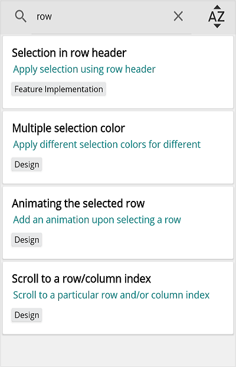
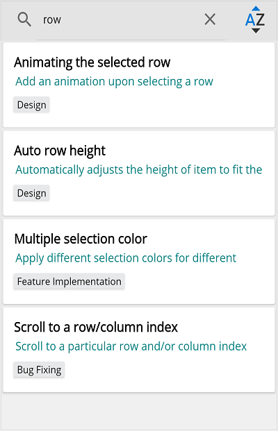
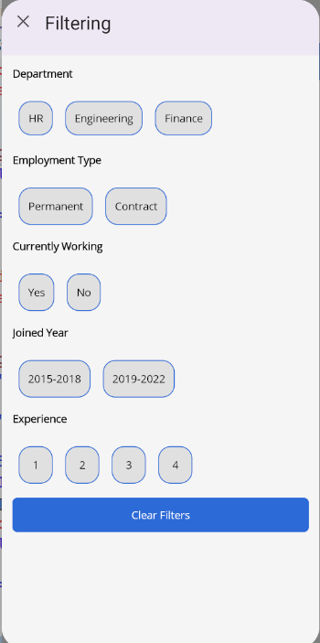

# Filtering in .NET MAUI ListView (SfListView)

This section explains how to filter the data and its related operations in the SfListView.

To get start quickly with filtering in .NET MAUI ListView, you can check on this video:
 <iframe id='MAUIListViewFilteringVideoTutorial' src='https://www.youtube.com/embed/IedulwH4h4c'></iframe>

## Programmatic filtering

The [SfListView](https://help.syncfusion.com/cr/maui/Syncfusion.Maui.ListView.SfListView.html) supports data filtering by setting the [SfListView.DataSource.Filter](https://help.syncfusion.com/cr/maui/Syncfusion.Maui.DataSource.DataSource.html#Syncfusion_Maui_DataSource_DataSource_Filter) property. The `Filter` property accepts a `Predicate<object>` delegate that returns `true` if the item should be displayed and `false` if it should be excluded. You have to call the [SfListView.DataSource.RefreshFilter](https://help.syncfusion.com/cr/maui/Syncfusion.Maui.DataSource.DataSource.html#Syncfusion_Maui_DataSource_DataSource_RefreshFilter) method after assigning the `Filter` property for refreshing the view.

The [FilterChanged](https://help.syncfusion.com/cr/maui/Syncfusion.Maui.DataSource.DataSource.html#Syncfusion_Maui_DataSource_DataSource_FilterChanged) event is raised once filtering is applied to the SfListView.

The `FilterContacts` method filters the data that contains the specified text. Assign the `FilterContacts` method to the `SfListView.DataSource.Filter` predicate to filter the `ContactName`. The following code example shows how to apply filtering in the SfListView:



<ContentPage xmlns="http://schemas.microsoft.com/dotnet/2021/maui"
             xmlns:x="http://schemas.microsoft.com/winfx/2009/xaml"
             xmlns:syncfusion="clr-namespace:Syncfusion.Maui.ListView;assembly=Syncfusion.Maui.ListView"
             x:Class="FilteringSample.MainPage">
 <Grid>
    <Grid.RowDefinitions>
      <RowDefinition Height="Auto"/>
      <RowDefinition Height="Auto"/>
    </Grid.RowDefinitions>
    <SearchBar x:Name="filterText"
               HeightRequest="40"
               Placeholder="Search here to filter"
               TextChanged="OnFilterTextChanged"/>
    <syncfusion:SfListView x:Name="listView" Grid.Row="1"
                           ItemSize="60"
                           ItemsSource="{Binding Items}"/>
  </Grid>
</ContentPage>



The following code example illustrates how to filter the data using the `FilterContacts` method in the code-behind:



SearchBar searchBar;
SfListView listView;
public MainPage()
{
    InitializeComponent();
    searchBar = this.filterText;
    listView = this.listView;
    listView.BindingContext = new ViewModel();
    listView.ItemsSource = (listView.BindingContext as ViewModel).Items;
    searchBar.TextChanged += OnFilterTextChanged;
}

private void OnFilterTextChanged(object sender, TextChangedEventArgs e)
{
    if (listView.DataSource != null)
    {
        this.listView.DataSource.Filter = FilterContacts;
        this.listView.DataSource.RefreshFilter();
    }
}

private bool FilterContacts(object obj)
{
    if (searchBar == null || searchBar.Text == null)
        return true;

    var taskInfo = obj as TaskInfo;
    if (taskInfo == null)
        return false;
    if (taskInfo.Title.ToLower().Contains(searchBar.Text.ToLower()) || taskInfo.Description.ToLower().Contains(searchBar.Text.ToLower()))
        return true;
    else
        return false;
}



The following screenshot shows the output rendered when the items are filtered:

### Filter based on multiple criteria

The [SfListView](https://help.syncfusion.com/cr/maui/Syncfusion.Maui.ListView.SfListView.html) allows filtering the items based on multiple criteria. The following code example shows how to filter the data using multiple properties combined with logical operators:



private bool FilterContacts(object obj)
{
  if (searchBar == null || searchBar.Text == null)
     return true;

  var taskInfo = obj as TaskInfo;
  if (taskInfo == null)
     return false;
  if (taskInfo.Title.ToLower().Contains(searchBar.Text.ToLower()) &&
      taskInfo.Status == "Open" &&
      taskInfo.DueDate >= DateTime.Today)
     return true;
  else
     return false;
}



N> The `Status` and `DueDate` properties must exist on the `TaskInfo` model class for the multi-criteria filter to compile.

## Getting the filtered data

You can get filtered items from the view and modify it in the [SfListView.DataSource.FilterChanged](https://help.syncfusion.com/cr/maui/Syncfusion.Maui.DataSource.DataSource.html#Syncfusion_Maui_DataSource_DataSource_FilterChanged) event. When the filter is applied, the filtered items are available in [SfListView.DataSource.DisplayItems](https://help.syncfusion.com/cr/maui/Syncfusion.Maui.DataSource.DataSource.html#Syncfusion_Maui_DataSource_DataSource_DisplayItems).

Subscribe to the `FilterChanged` event during page initialization (e.g., in the `MainPage` constructor) so that the handler is registered before any filter is applied:



public MainPage()
{
    InitializeComponent();
    listView = this.listView;
    listView.BindingContext = new ViewModel();
    listView.ItemsSource = (listView.BindingContext as ViewModel).Items;
    listView.DataSource.FilterChanged += DataSource_FilterChanged;
}
...
private void DataSource_FilterChanged(object sender, NotifyCollectionChangedEventArgs e)
{
   //TaskInfo is model class
 ObservableCollection<TaskInfo> taskInfo = new ObservableCollection<TaskInfo>();
  // Get the filtered items
  var items = (sender as DataSource).DisplayItems;
  foreach (TaskInfo item in items)
     taskInfo.Add(item as TaskInfo);
}



## Clear filtering

The SfListView allows clearing the filters by setting the [DataSource.Filter](https://help.syncfusion.com/cr/maui/Syncfusion.Maui.DataSource.DataSource.html#Syncfusion_Maui_DataSource_DataSource_Filter) to null, and call the [DataSource.RefreshFilter](https://help.syncfusion.com/cr/maui/Syncfusion.Maui.DataSource.DataSource.html#Syncfusion_Maui_DataSource_DataSource_RefreshFilter) method.



listView.DataSource.Filter = null;
listView.DataSource.RefreshFilter();



## Sort the filtered items

Filtered items can be sorted by adding a [SortDescriptor](https://help.syncfusion.com/cr/maui/Syncfusion.Maui.DataSource.SortDescriptor.html) in the `FilterChanged` event. The following code example shows how to sort the filtered items:



private void DataSource_FilterChanged(object sender, NotifyCollectionChangedEventArgs e)
{
  listView.DataSource.SortDescriptors.Clear();
  listView.DataSource.SortDescriptors.Add(
          new SortDescriptor 
          { 
             PropertyName = "Title", 
             Direction = ListSortDirection.Ascending 
          }); 
  listView.RefreshView();
}



The following screenshot shows the output rendered when the filtered items are sorted:

## Custom Filter UI in .NET MAUI ListView (SfListView)

This section explains how to enable and customize the filtering user interface (UI) in the `.NET MAUI ListView` (`SfListView`). You can customize the filter data using the `FilteringUITemplate` property. The filtering UI can be displayed by using the `ShowFilteringUICommand`, which displays the defined template inside a popup.

## Filtering UI APIs

The [SfListView](https://help.syncfusion.com/cr/maui/Syncfusion.Maui.ListView.html) provides the following APIs to configure and display the filtering UI:

- [`FilteringUITitle`](https://help.syncfusion.com/cr/maui/Syncfusion.Maui.ListView.SfListView.html#Syncfusion_Maui_ListView_SfListView_FilteringUITitle): Specifies the title displayed in the filtering UI popup.
- [`ShowFilteringUICommand`](https://help.syncfusion.com/cr/maui/Syncfusion.Maui.ListView.SfListView.html#Syncfusion_Maui_ListView_SfListView_ShowFilteringUICommand): Triggers the filtering UI programmatically, typically from a button.
- [`FilteringUITemplate`](https://help.syncfusion.com/cr/maui/Syncfusion.Maui.ListView.SfListView.html#Syncfusion_Maui_ListView_SfListView_FilteringUITemplate): Defines the custom layout of the filtering UI, allowing you to design filter elements such as buttons, chips, or other controls.




<syncfusion:SfListView x:Name="listView"
                       ItemsSource="{Binding Employees}"
                       FilteringUITitle="Filtering">

    <!-- Trigger Filtering UI -->
    <syncfusion:SfListView.HeaderTemplate>
        <DataTemplate>
            <Button Text="Filter"
                    Command="{Binding Source={x:Reference listView}, Path=ShowFilteringUICommand}" />
        </DataTemplate>
    </syncfusion:SfListView.HeaderTemplate>

    <!-- Custom Filtering UI -->
    <syncfusion:SfListView.FilteringUITemplate>
        <DataTemplate>
            <VerticalStackLayout Padding="14" Spacing="10">
                <Label Text="Department" FontAttributes="Bold"/>
                <!-- Define custom filter UI elements here -->
            </VerticalStackLayout>
        </DataTemplate>
    </syncfusion:SfListView.FilteringUITemplate>

</syncfusion:SfListView>



listView.FilteringUITitle = "Filtering";

var command = listView.ShowFilteringUICommand;

listView.FilteringUITemplate = new DataTemplate(() =>
{
    return new VerticalStackLayout
    {
        Padding = 14,
        Children =
        {
            new Label
            {
                Text = "Department",
                FontAttributes = FontAttributes.Bold
            }
        }
    };
});




The following screenshot shows the filtering UI popup displayed in the SfListView:

## See also

[How to filter the items in .NET MAUI ListView (SfListView) using MVVM](https://www.syncfusion.com/kb/13060/)