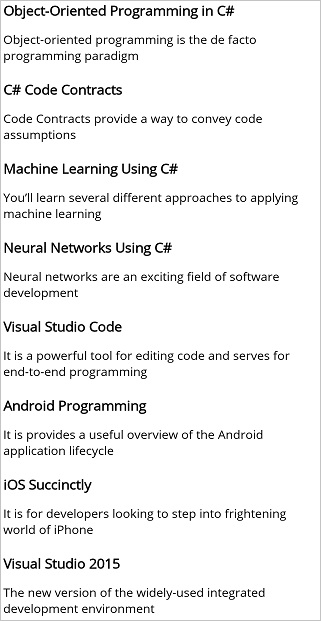

# Getting Started with .NET MAUI ListView

This section guides you through setting up and configuring a [ListView](https://help.syncfusion.com/cr/maui/Syncfusion.Maui.ListView.SfListView.html) in your .NET MAUI application. Follow the steps below to add a basic ListView to your project.

To quickly get started with the .NET MAUI ListView, watch this video:

 <iframe id='MAUIListViewVideoTutorial' src='https://www.youtube.com/embed/EFo2zIFw60Q'></iframe>




## Prerequisites

Before proceeding, ensure the following are set up:

1. Install [.NET 9 SDK](https://dotnet.microsoft.com/en-us/download/dotnet/9.0) or later.
2. Set up a .NET MAUI environment with Visual Studio 2022 v17.12 or later.

## Step 1: Create a new .NET MAUI project

1. Go to **File > New > Project** and choose the **.NET MAUI App** template.
2. Name the project and choose a location. Then, click **Next**.
3. Select the .NET framework version and click **Create**.

## Step 2: Install the Syncfusion® MAUI ListView NuGet package

1. In **Solution Explorer**, right-click the project and choose **Manage NuGet Packages**.
2. Search for [Syncfusion.Maui.ListView](https://www.nuget.org/packages/Syncfusion.Maui.ListView) and install the latest version.
3. Ensure the necessary dependencies are installed correctly, and the project is restored.




## Prerequisites

Before proceeding, ensure the following are set up:

1. Install [.NET 9 SDK](https://dotnet.microsoft.com/en-us/download/dotnet/9.0) or later.
2. Set up a .NET MAUI environment with Visual Studio Code.
3. Ensure that the .NET MAUI workloads are installed and configured as described [here](https://learn.microsoft.com/en-us/dotnet/maui/get-started/installation?view=net-maui-9.0&tabs=visual-studio-code).

## Step 1: Create a new .NET MAUI project

1. Open the Command Palette by pressing **Ctrl+Shift+P** and type **.NET:New Project** and press Enter.
2. Choose the **.NET MAUI App** template.
3. Select the project location, type the project name and press Enter.
4. Then choose **Create project**.

## Step 2: Install the Syncfusion® MAUI ListView NuGet package

1. Press <kbd>Ctrl</kbd> + <kbd>`</kbd> (backtick) to open the integrated terminal in Visual Studio Code.
2. Ensure you're in the project root directory where your .csproj file is located.
3. Run the command `dotnet add package Syncfusion.Maui.ListView` to install the Syncfusion® .NET MAUI ListView package.
4. To ensure all dependencies are installed, run `dotnet restore`.




## Prerequisites

Before proceeding, ensure the following are set up:

1. Install [.NET 9 SDK](https://dotnet.microsoft.com/en-us/download/dotnet/9.0) or later.
2. Set up a .NET MAUI environment with JetBrains Rider 2024.3 or later.
3. Make sure the MAUI workloads are installed and configured as described [here](https://www.jetbrains.com/help/rider/MAUI.html#before-you-start).

## Step 1: Create a new .NET MAUI project

1. Go to **File > New > Solution**. Select .NET (C#) and choose the .NET MAUI App template.
2. Enter the Project Name, Solution Name, and Location.
3. Select the .NET framework version and click Create.

## Step 2: Install the Syncfusion® MAUI ListView NuGet package

1. In **Solution Explorer**, right-click the project and choose **Manage NuGet Packages**.
2. Search for [Syncfusion.Maui.ListView](https://www.nuget.org/packages/Syncfusion.Maui.ListView) and install the latest version.
3. Ensure the necessary dependencies are installed correctly, and the project is restored. If not, open the Terminal in Rider and manually run: `dotnet restore`.




## Step 3: Register Syncfusion handler

Add the following namespace to `MauiProgram.cs`.
 


using Syncfusion.Maui.Core.Hosting;


 
Register the Syncfusion core handler in your `CreateMauiApp` method of `MauiProgram.cs` file to use Syncfusion controls.
 


builder.ConfigureSyncfusionCore();



## Step 4: Define the data model and view model

### Data Model

Create a simple data model as shown in the following code example, and save it as `BookInfo.cs` file. 



public class BookInfo : INotifyPropertyChanged
{
    private string bookName;
    private string bookDesc;

    public BookInfo(string bookName, string bookDesc)
    {
        this.bookName = bookName;
        this.bookDesc = bookDesc;
    }

    public string BookName
    {
        get { return bookName; }
        set
        {
            bookName = value;
            OnPropertyChanged("BookName");
        }
    }

    public string BookDescription
    {
        get { return bookDesc; }
        set
        {
            bookDesc = value;
            OnPropertyChanged("BookDescription");
        }
    }

    public event PropertyChangedEventHandler? PropertyChanged;

    public void OnPropertyChanged(string name)
    {
        this.PropertyChanged?.Invoke(this, new PropertyChangedEventArgs(name));
    }
}
 



N> If you want your data model to respond to property changes, then implement [INotifyPropertyChanged](https://learn.microsoft.com/en-us/dotnet/api/system.componentmodel.inotifypropertychanged?view=net-9.0) interface in your model class.

### View Model

Next, create a view model class with a `BookInfo` collection property initialized with the required number of data objects in a new class file as shown in the following code example, and save it as `BookInfoRepository.cs` file:



public class BookInfoRepository
{
    private ObservableCollection<BookInfo> bookInfo;

    public ObservableCollection<BookInfo> BookInfo
    {
        get { return bookInfo; }
        set { this.bookInfo = value; }
    }

    public BookInfoRepository()
    {
        bookInfo = new ObservableCollection<BookInfo>();
        GenerateBookInfo();
    }

    internal void GenerateBookInfo()
    {
        bookInfo = new ObservableCollection<BookInfo>();
        bookInfo.Add(new BookInfo() { BookName = "Object-Oriented Programming in C#", BookDescription = "Object-oriented programming is a programming paradigm based on the concept of objects" });
        bookInfo.Add(new BookInfo() { BookName = "C# Code Contracts", BookDescription = "Code Contracts provide a way to convey code assumptions" });
        bookInfo.Add(new BookInfo() { BookName = "Machine Learning Using C#", BookDescription = "You will learn several different approaches to applying machine learning" });
        bookInfo.Add(new BookInfo() { BookName = "Neural Networks Using C#", BookDescription = "Neural networks are an exciting field of software development" });
        bookInfo.Add(new BookInfo() { BookName = "Visual Studio Code", BookDescription = "It is a powerful tool for editing code and serves for end-to-end programming" });
        bookInfo.Add(new BookInfo() { BookName = "Android Programming", BookDescription = "It provides a useful overview of the Android application life cycle" });
        bookInfo.Add(new BookInfo() { BookName = "iOS Succinctly", BookDescription = "It is for developers looking to step into frightening world of iPhone" });
        bookInfo.Add(new BookInfo() { BookName = "Visual Studio 2022", BookDescription = "The latest version of the widely-used integrated development environment" });
        bookInfo.Add(new BookInfo() { BookName = ".NET MAUI", BookDescription = "It is a cross-platform framework for creating native mobile and desktop apps" });
        bookInfo.Add(new BookInfo() { BookName = "Microsoft Azure", BookDescription = "A cloud computing platform for building, deploying, and managing applications" });
    }
}




## Step 5: Import the ListView namespace
 
Add the following namespace in your XAML or C#.
 


 
xmlns:syncfusion="clr-namespace:Syncfusion.Maui.ListView;assembly=Syncfusion.Maui.ListView"
 


 
using Syncfusion.Maui.ListView;
 



## Step 6: Add a ListView with an item template

Initialize the [SfListView](https://help.syncfusion.com/cr/maui/Syncfusion.Maui.ListView.SfListView.html) and use the [ItemsSource](https://help.syncfusion.com/cr/maui/Syncfusion.Maui.ListView.SfListView.html#Syncfusion_Maui_ListView_SfListView_ItemsSource) property to bind and display a collection of data. By defining the [SfListView.ItemTemplate](https://help.syncfusion.com/cr/maui/Syncfusion.Maui.ListView.SfListView.html#Syncfusion_Maui_ListView_SfListView_ItemTemplate) of the SfListView, a custom user interface(UI) can be achieved to display the data items. 
 


<?xml version="1.0" encoding="utf-8" ?>
<ContentPage xmlns="http://schemas.microsoft.com/dotnet/2021/maui"
             xmlns:x="http://schemas.microsoft.com/winfx/2009/xaml"
             xmlns:syncfusion="clr-namespace:Syncfusion.Maui.ListView;assembly=Syncfusion.Maui.ListView"
             xmlns:local="clr-namespace:GettingStarted"
             x:Class="GettingStarted.MainPage">

    <ContentPage.BindingContext>
        <local:BookInfoRepository/>
    </ContentPage.BindingContext>

    <syncfusion:SfListView x:Name="listView" 
                   ItemsSource="{Binding BookInfo}"
                   ItemSize="100">
        <syncfusion:SfListView.ItemTemplate>
            <DataTemplate>
            <Grid Padding="10">
                <Grid.RowDefinitions>
                <RowDefinition Height="0.4*" />
                <RowDefinition Height="0.6*" />
                </Grid.RowDefinitions>
                <Label Text="{Binding BookName}" FontAttributes="Bold" TextColor="Teal" FontSize="21" />
                <Label Grid.Row="1" Text="{Binding BookDescription}" TextColor="Teal" FontSize="15"/>
            </Grid>
            </DataTemplate>
        </syncfusion:SfListView.ItemTemplate>
    </syncfusion:SfListView>
</ContentPage>


using Syncfusion.Maui.ListView;

public partial class MainPage : ContentPage
{
    public MainPage()
    {
        InitializeComponent();
        BookInfoRepository viewModel = new BookInfoRepository();
        SfListView listView = new SfListView();
        listView.BindingContext = viewModel;
        listView.SetBinding(SfListView.ItemsSourceProperty, new Binding("BookInfo"));
        listView.ItemSize = 100;
        listView.ItemTemplate = new DataTemplate(() =>
        {
            var grid = new Grid { Padding = 10 };
            grid.RowDefinitions.Add(new RowDefinition(new GridLength(0.4, GridUnitType.Star)));
            grid.RowDefinitions.Add(new RowDefinition(new GridLength(0.6, GridUnitType.Star)));
            var bookName = new Label { FontAttributes = FontAttributes.Bold, TextColor = Colors.Teal, FontSize = 21 };
            bookName.SetBinding(Label.TextProperty, new Binding("BookName"));
            var bookDescription = new Label { TextColor = Colors.Teal, FontSize = 15 };
            bookDescription.SetBinding(Label.TextProperty, new Binding("BookDescription"));
            grid.Children.Add(bookName);
            grid.Children.Add(bookDescription);
            grid.SetRow(bookName, 0);
            grid.SetRow(bookDescription, 1);
            return grid;
        });
        this.Content = listView;
    }
}




The following screenshot illustrates the result of the above code.

You can download the ListView Getting Started sample from [GitHub](https://github.com/SyncfusionExamples/gettingstarted-listview-.net-maui).

N> You can refer to our [.NET MAUI ListView](https://www.syncfusion.com/maui-controls/maui-listview) feature tour page for its groundbreaking feature representations. You can also explore our [.NET MAUI ListView example](https://github.com/syncfusion/maui-demos/tree/master/MAUI/ListView) that shows you how to render the ListView in .NET MAUI.