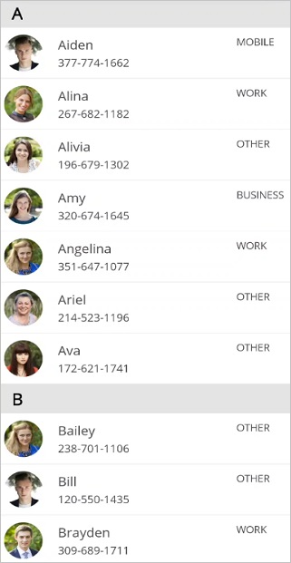
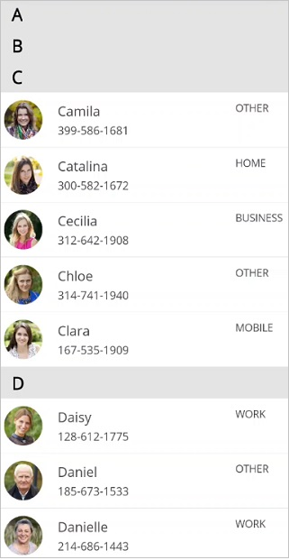
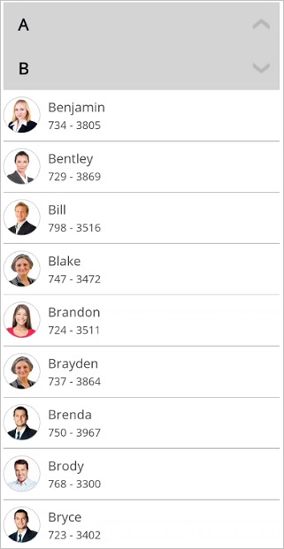
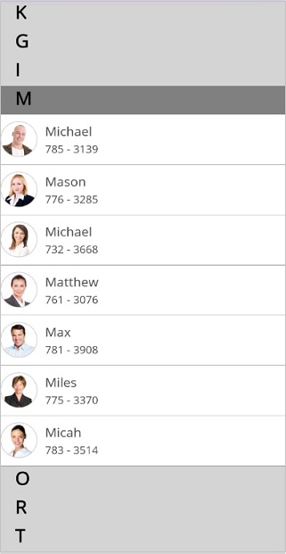
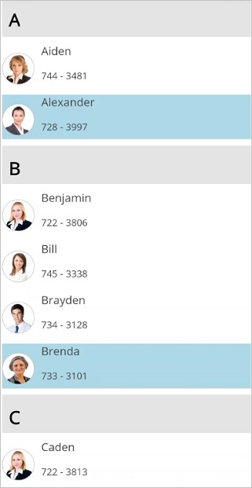
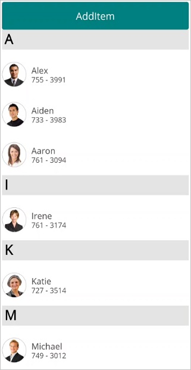

# Grouping in .NET MAUI ListView (SfListView)

A group is a collection of items that belong to a specific category. When grouping is applied, the data is organized into different groups based on key values. Each group is identified by its [Key](https://help.syncfusion.com/cr/maui/Syncfusion.Maui.DataSource.Extensions.GroupResult.html#Syncfusion_DataSource_Extensions_GroupResult_Key), which allows you to access the underlying data in the group.

To get start quickly with grouping in .NET MAUI ListView, you can check on this video:
 <iframe id='MAUIListViewGroupingVideoTutorial' src='https://www.youtube.com/embed/EzjBHeIPPw4'></iframe>

N> When the ItemsSource is changed for a ListView, [DataSource.GroupDescriptors](https://help.syncfusion.com/cr/maui/Syncfusion.Maui.DataSource.DataSource.html#Syncfusion_DataSource_DataSource_GroupDescriptors) will be cleared by default. If you want to retain grouping in the listview, you need to add `DataSource.GroupDescriptors` again after changing the ItemsSource.

N> To update grouping for the newly added listview items at runtime, set the [listView.DataSource.LiveDataUpdateMode](https://help.syncfusion.com/cr/maui/Syncfusion.Maui.DataSource.LiveDataUpdateMode.html) to [LiveDataUpdateMode.AllowDataShaping](https://help.syncfusion.com/cr/maui/Syncfusion.Maui.DataSource.LiveDataUpdateMode.html#Syncfusion_DataSource_LiveDataUpdateMode_AllowDataShaping). 

## Programmatic grouping

The SfListView allows programmatic grouping by defining the [GroupDescriptor](https://help.syncfusion.com/cr/maui/Syncfusion.Maui.DataSource.GroupDescriptor.html) object, and adding it into the [DataSource.GroupDescriptors](https://help.syncfusion.com/cr/maui/Syncfusion.Maui.DataSource.DataSource.html#Syncfusion_DataSource_DataSource_GroupDescriptors) collection. The `GroupDescriptor` object holds the following properties:

* [PropertyName](https://help.syncfusion.com/cr/maui/Syncfusion.Maui.DataSource.GroupDescriptor.html#Syncfusion_DataSource_GroupDescriptor_PropertyName): Describes the name of the property to be grouped.
* [KeySelector](https://help.syncfusion.com/cr/maui/Syncfusion.Maui.DataSource.GroupDescriptor.html#Syncfusion_DataSource_GroupDescriptor_KeySelector): Describes selector to return the group key.
* [Comparer](https://help.syncfusion.com/cr/maui/Syncfusion.Maui.DataSource.GroupDescriptor.html#Syncfusion_DataSource_GroupDescriptor_Comparer): Describes comparer to be applied when sorting takes place.



<ContentPage xmlns:syncfusion="clr-namespace:Syncfusion.Maui.ListView;assembly=Syncfusion.Maui.ListView"
             xmlns:data="clr-namespace:Syncfusion.Maui.DataSource;assembly=Syncfusion.Maui.DataSource" >
  <syncfusion:SfListView x:Name="listView" ItemsSource="{Binding ContactsInfo}">
    <syncfusion:SfListView.DataSource>
      <data:DataSource>
        <data:DataSource.GroupDescriptors>
          <data:GroupDescriptor PropertyName="ContactName"/>
        </data:DataSource.GroupDescriptors>
      </data:DataSource>
    </syncfusion:SfListView.DataSource>
  </syncfusion:SfListView>
</ContentPage>


listView.DataSource.GroupDescriptors.Add(new GroupDescriptor()
{
  PropertyName = "ContactName",
}); 



## Custom grouping

ListView supports grouping the items based on custom logic for each [GroupDescriptor](https://help.syncfusion.com/cr/maui/Syncfusion.Maui.DataSource.GroupDescriptor.html) by using [KeySelector](https://help.syncfusion.com/cr/maui/Syncfusion.Maui.DataSource.GroupDescriptor.html#Syncfusion_DataSource_GroupDescriptor_KeySelector). The following topics explain how to achieve different custom grouping use cases with code examples.

### Grouping based on first character

The SfListView supports grouping the items based on first character of the value assigned to the property name in [GroupDescriptor](https://help.syncfusion.com/cr/maui/Syncfusion.Maui.DataSource.GroupDescriptor.html) by using [KeySelector](https://help.syncfusion.com/cr/maui/Syncfusion.Maui.DataSource.GroupDescriptor.html#Syncfusion_DataSource_GroupDescriptor_KeySelector). 



listView.DataSource.GroupDescriptors.Add(new GroupDescriptor()
{
  PropertyName = "ContactName",
  KeySelector = (object obj1) =>
  {
    var item = (obj1 as Contacts);
    return item.ContactName[0].ToString();
  }
  Comparer = new CustomGroupComparer()
});



The following screenshot shows the output when grouping based on first character.

### Grouping based on more than one property in the data object

Group the items by binding multiple properties to the property name of `GroupDescriptor` by using `KeySelector`, in which the group header items can be created with multiple data model object effectively.



listView.DataSource.GroupDescriptors.Add(new GroupDescriptor()
{
  PropertyName = "Designation",
  KeySelector = (object obj1) =>
  {
     var item = (obj1 as Employee);
     return item.Designation + item.Level;
  }
});



The following screenshot shows the output when grouping based on more than one property .

### Grouping by ignoring case-sensitivity

Grouping the items by ignoring case sensitive by using the `KeySelector` property in the `GroupDescriptor`. While returning the `KeySelector`, convert the required property name in the data model to group either as Upper or Lower case. The items will be grouped based on the `KeySelector` with returned case-sensitive.



listView.DataSource.GroupDescriptors.Add(new GroupDescriptor() 
{ 
  PropertyName = "ContactName", 
  KeySelector = (object obj) => 
  { 
    return (obj as Contacts).ContactName.ToUpper()[0]; 
  } 
}); 



The following screenshot shows grouping by ignoring case sensitivity. 

## Sorting the groups

[.NET MAUI ListView](https://www.syncfusion.com/maui-controls/maui-listview) sorts the groups using default sorting logic of List.

### Custom sorting of groups

The SfListView allows you to sort the groups based on custom logic applied to either the [SfListView.DataSource.GroupComparer](https://help.syncfusion.com/cr/maui/Syncfusion.Maui.DataSource.DataSource.html#Syncfusion_DataSource_DataSource_GroupComparer) property or [GroupDescriptor.Comparer](https://help.syncfusion.com/cr/maui/Syncfusion.Maui.DataSource.GroupDescriptor.html#Syncfusion_DataSource_GroupDescriptor_Comparer) added to the `DataSource.GroupDescriptors` collection.

In custom group comparer, all the items present in a group compares each other based on the items count to each group sorted accordingly.



<ContentPage xmlns:syncfusion="clr-namespace:Syncfusion.Maui.ListView;assembly=Syncfusion.Maui.ListView"
            xmlns:dataSource="clr-namespace:Syncfusion.Maui.DataSource;assembly=Syncfusion.Maui.DataSource"
             xmlns:local="clr-namespace:CustomGrouping">
  <syncfusion:SfListView x:Name="listView" ItemsSource="{Binding ContactsInfo}">
    <syncfusion:SfListView.DataSource>
      <dataSource:DataSource>
        <dataSource:DataSource.GroupDescriptors>
          <dataSource:GroupDescriptor PropertyName="ContactType">
            <dataSource:GroupDescriptor.Comparer>
              <local:CustomGroupComparer/>
            </dataSource:GroupDescriptor.Comparer>
          </dataSource:GroupDescriptor>
        </dataSource:DataSource.GroupDescriptors>
      </dataSource:DataSource>
    </syncfusion:SfListView.DataSource>
  </syncfusion:SfListView>
</ContentPage>





public class CustomGroupComparer : IComparer<GroupResult>
{
  public int Compare(GroupResult x, GroupResult y)
  {
    if (x.Count > y.Count)
    {
       //GroupResult y is stacked into top of the group i.e., Ascending.
       //GroupResult x is stacked at the bottom of the group i.e., Descending.
        return 1;
    }
    else if (x.Count < y.Count)
    {
       //GroupResult x is stacked into top of the group i.e., Ascending.
       //GroupResult y is stacked at the bottom of the group i.e., Descending.
       return -1;
    }

    return 0;
  }
}



### Sorting the items within group

Add [DataSource.GroupDescriptors](https://help.syncfusion.com/cr/maui/Syncfusion.Maui.DataSource.DataSource.html#Syncfusion_DataSource_DataSource_GroupDescriptors) and [DataSource.SortDescriptors](https://help.syncfusion.com/cr/maui/Syncfusion.Maui.DataSource.DataSource.html#Syncfusion_DataSource_DataSource_SortDescriptors) with required properties to group and sort the items of the underlying collection.



public GroupingPage()
{
    InitializeComponent();
    listView.DataSource.SortDescriptors.Add(new SortDescriptor { PropertyName = "ContactName", Direction = ListSortDirection.Ascending });
    //Applying custom grouping
    listView.DataSource.GroupDescriptors.Add(new GroupDescriptor()
       {
           PropertyName = "ContactName",
           KeySelector = (object obj1) =>
            {
                var item = (obj1 as Contacts);
                return item.ContactName[0].ToString();
            },
        });
}



## Group header summary

### Aggregate summary

For each group, display the sum of the values of the property from the model object in the [SfListView.GroupHeaderTemplate](https://help.syncfusion.com/cr/maui/Syncfusion.Maui.ListView.SfListView.html#Syncfusion_Maui_ListView_SfListView_GroupHeaderTemplate) by using converter.



<ContentPage xmlns:syncfusion="clr-namespace:Syncfusion.Maui.ListView;assembly=Syncfusion.Maui.ListView"
             xmlns:data="clr-namespace:Syncfusion.Maui.DataSource;assembly=Syncfusion.Maui.DataSource" >
  <syncfusion:SfListView x:Name="listView" ItemsSource="{Binding contactsinfo}">
      <syncfusion:SfListView.GroupHeaderTemplate>
                    <DataTemplate x:Name="GroupHeaderTemplate"  x:Key="GroupHeaderTemplate">
                                <Grid BackgroundColor="#E4E4E4">
                                    <Grid.ColumnDefinitions>
                                        <ColumnDefinition Width="*" />
                                    </Grid.ColumnDefinitions>
                                    <Label Text="{Binding Key}" />
                                    <Label Text="{Binding Items,Converter={StaticResource Converter}}" Grid.Column="1" />
                                </Grid>
                    </DataTemplate>
      </syncfusion:SfListView.GroupHeaderTemplate>
  </syncfusion:SfListView>
</ContentPage>



listView.GroupHeaderTemplate = new DataTemplate(() =>
{
   var grid = new Grid();
   grid.ColumnDefinitions.Add(new ColumnDefinition());
   grid.ColumnDefinitions.Add(new ColumnDefinition());

   var label1 = new Label();
   label1.SetBinding(Label.TextProperty, new Binding("Key"));

   var label2 = new Label();
   Binding binding = new Binding("Items");
   binding.Converter = new Converter();
   label2.SetBinding(Label.TextProperty,binding);

   grid.Children.Add(label1);
   grid.Children.Add(label2);
   grid.SetColumn(label1, 0);
   grid.SetColumn(label2, 1);

   return grid;
 });
 


 public object Convert(object value, Type targetType, object parameter, CultureInfo culture)
 {
    int result = 0;
    var items = value as IEnumerable;
    if(items != null)
    {
    var items = items.ToList<object>().ToList<object>();
        if (items != null)
        {
        for (int i = 0; i < items.Count; i++)
            {
            var contact = items[i] as Contacts;
            result += contact.ContactNumber;
            }
        }
    }
    return result
}



The following screenshot shows grouping by property value sum.

### Displaying items count

The total number of items in each group will be displayed in the group header by binding the [Count](https://help.syncfusion.com/cr/maui/Syncfusion.Maui.DataSource.Extensions.GroupResult.html#Syncfusion_DataSource_Extensions_GroupResult_Count) property in the [SfListView.GroupHeaderTemplate](https://help.syncfusion.com/cr/maui/Syncfusion.Maui.ListView.SfListView.html#Syncfusion_Maui_ListView_SfListView_GroupHeaderTemplate).



<ContentPage xmlns:syncfusion="clr-namespace:Syncfusion.Maui.ListView;assembly=Syncfusion.Maui.ListView"
             xmlns:data="clr-namespace:Syncfusion.Maui.DataSource;assembly=Syncfusion.Maui.DataSource">
 <syncfusion:SfListView x:Name="listView" ItemsSource="{Binding EmployeeInfo}">
  <syncfusion:SfListView.GroupHeaderTemplate>
    <DataTemplate>
     <Grid BackgroundColor="#E4E4E4">
      <Grid.ColumnDefinitions>
        <ColumnDefinition Width="*"/>
        <ColumnDefinition Width="*"/>
      </Grid.ColumnDefinitions>
      <StackLayout Orientation="Horizontal" HorizontalOptions="Start"
                   VerticalOptions="Center" >
        <Label Text="{Binding Key}" TextColor="Black" />
        <Label Text="Year" TextColor="Black" />
      </StackLayout>
      <StackLayout Orientation="Horizontal" Grid.Column="1"
                   HorizontalOptions="EndAndExpand" VerticalOptions="Center">
        <Label Text="{Binding Count}" TextColor="Black" />
        <Label Text="Item(s)" TextColor="Black" />
      </StackLayout>
     </Grid>
    </DataTemplate>
  </syncfusion:SfListView.GroupHeaderTemplate>
 </syncfusion:SfListView>
</ContentPage>


listView.GroupHeaderTemplate = new DataTemplate(() => 
{
  var grid = new Grid();
  grid.ColumnDefinitions.Add(new ColumnDefinition());
  grid.ColumnDefinitions.Add(new ColumnDefinition());

  var stack1 = new StackLayout()
  {
    VerticalOptions = LayoutOptions.Center,
    HorizontalOptions = LayoutOptions.Start,
    Orientation = StackOrientation.Horizontal
  };
  var yearLabel = new Label
  {
    TextColor = Color.Black,
  };
  var yearlabel2 = new Label() { Text="Year", TextColor=Color.Black};
  yearLabel.SetBinding(Label.TextProperty, new Binding("key"));

  var stack2 = new StackLayout()
  {
    VerticalOptions = LayoutOptions.Center,
    HorizontalOptions = LayoutOptions.EndAndExpand,
    Orientation = StackOrientation.Horizontal
  };
  var countLabel = new Label
  {
    TextColor = Color.Black,
  };
  countLabel.SetBinding(Label.TextProperty, new Binding("Count"));
  var countlabel2 = new Label() { Text="Item's" , TextColor=Color.Black};

  grid.Children.Add(stack1);
  grid.Children.Add(stack2);
  grid.SetColumn(stack1, 0);
  grid.SetColumn(stack2, 1);
  return grid;
});


 
The following screenshot shows the output when displaying items count at group header. 

## Multi-level grouping

The SfListView supports multiple level grouping by adding multiple [GroupDescriptor](https://help.syncfusion.com/cr/maui/Syncfusion.Maui.DataSource.GroupDescriptor.html) objects to the [DataSource.GroupDescriptors](https://help.syncfusion.com/cr/maui/Syncfusion.Maui.DataSource.DataSource.html#Syncfusion_DataSource_DataSource_GroupDescriptors) collection. The grouped items will be displayed in a hierarchical structure by customizing the [SfListView.GroupHeaderTemplate](https://help.syncfusion.com/cr/maui/Syncfusion.Maui.ListView.SfListView.html#Syncfusion_Maui_ListView_SfListView_GroupHeaderTemplate) property. In the `GroupHeaderTemplate`, set the `Padding` property to the custom view to arrange the group header items and sub-group header items in the hierarchical structure.

N> Multi-level grouping is only applicable for `LinearLayout` in the SfListView.



<ContentPage xmlns:syncfusion="clr-namespace:Syncfusion.Maui.ListView;assembly=Syncfusion.Maui.ListView"
             xmlns:data="clr-namespace:Syncfusion.Maui.DataSource;assembly=Syncfusion.Maui.DataSource">
  <ContentPage.Resources>
    <ResourceDictionary>
      <local:GroupHeaderConverter x:Key="TemplateConverter"/>
    </ResourceDictionary>
  </ContentPage.Resources>
  <syncfusion:SfListView ItemsSource="{Binding EmployeeInfo}" ItemSize="60">
    <syncfusion:SfListView.DataSource>
      <data:DataSource>
        <data:DataSource.GroupDescriptors>
            <data:GroupDescriptor PropertyName="Designation" />
            <data:GroupDescriptor PropertyName="Level" />
        </data:DataSource.GroupDescriptors>
      </data:DataSource>
    </syncfusion:SfListView.DataSource>
    <syncfusion:SfListView.GroupHeaderTemplate>
      <DataTemplate>
              <StackLayout BackgroundColor="{Binding Level,Converter={StaticResource TemplateConverter}}"
                            Padding="{Binding Level,Converter={StaticResource TemplateConverter}}">
                  <Label Text="{Binding Key}" 
                        VerticalOptions="Center" HorizontalOptions="Start"/>
              </StackLayout>
      </DataTemplate>
    </syncfusion:SfListView.GroupHeaderTemplate>
  </syncfusion:SfListView>
</ContentPage>




listView.ItemsSource = viewModel.EmployeeInfo;
listView.ItemSize = 60;
listView.DataSource.GroupDescriptors.Add(new GroupDescriptor()
{
  PropertyName = "Designation",
});
listView.DataSource.GroupDescriptors.Add(new GroupDescriptor()
{
  PropertyName = "Designation",
});
listView.GroupHeaderTemplate = new DataTemplate(() =>
{
  var stack = new StackLayout();
  Binding binding = new Binding("Level");
  binding.Converter = new TemplateConverter();
  stack.SetBinding(StackLayout.BackgroundColorProperty, binding);
  stack.SetBinding(StackLayout.PaddingProperty, binding);

  var label = new Label() { VerticalOptions=LayoutOptions.Center,HorizontalOptions=LayoutOptions.Start};
  label.SetBinding(Label.TextProperty, new Binding("Key"));

  return stack;
});



public class GroupHeaderConverter : IValueConverter
{
  public object Convert(object value, Type targetType, object parameter, CultureInfo culture)
  {
     if (targetType.Name == "Color")
     {
        if ((int)value == 1)
           return Color.FromHex("#D3D3D3");
        else
           return Color.Transparent;
     }
     else
     {
        if ((int)value == 1)
           return new Thickness(5, 5, 5, 0);
        else
           return new Thickness((int)value * 15, 5, 5, 0);
     }
  }

   public object ConvertBack(object value, Type targetType, object parameter, CultureInfo culture)
   {
     throw new NotImplementedException();
   }
}



The following screenshot shows the output for multi-level grouping.

## Group expand and collapse

By default, the groups will be in expanded state in the SfListView. You can expand or collapse the group at runtime by setting the [SfListView.AllowGroupExpandCollapse](https://help.syncfusion.com/cr/maui/Syncfusion.Maui.ListView.SfListView.html#Syncfusion_Maui_ListView_SfListView_AllowGroupExpandCollapse) to `true`. So, when tapping the group header, the group collapses if it is in the expand state and vice-versa.



<syncfusion:SfListView x:Name="listView" ItemSize="70" AllowGroupExpandCollapse="True" 
                     ItemsSource="{Binding contactsInfo}" />          


listView.AllowGroupExpandCollapse = true;



The following screenshot shows the output when the groups are collapsed.

### Programmatic expand and collapse

#### Expand or collapse all the groups

Expand or collapse all the groups programmatically at runtime by using the [SfListView.ExpandAll](https://help.syncfusion.com/cr/maui/Syncfusion.Maui.ListView.SfListView.html#Syncfusion_Maui_ListView_SfListView_ExpandAll) and [SfListView.CollapseAll](https://help.syncfusion.com/cr/maui/Syncfusion.Maui.ListView.SfListView.html#Syncfusion_Maui_ListView_SfListView_CollapseAll) methods.



listView.ExpandAll();
listView.CollapseAll();
	


#### Expand or collapse a specific group

Expand or collapse a specific group by using the [SfListView.ExpandGroup](https://help.syncfusion.com/cr/maui/Syncfusion.Maui.ListView.SfListView.html#Syncfusion_Maui_ListView_SfListView_ExpandGroup_Syncfusion_DataSource_Extensions_GroupResult_) and [SfListView.CollapseGroup](https://help.syncfusion.com/cr/maui/Syncfusion.Maui.ListView.SfListView.html#Syncfusion_Maui_ListView_SfListView_CollapseGroup_Syncfusion_DataSource_Extensions_GroupResult_) methods.



var group = listView.DataSource.Groups[0];
listView.ExpandGroup(group);
listView.CollapseGroup(group);



#### Expand or collapse all groups by default

Expand or collapse all the groups by default using the [SfListView.Loaded](https://help.syncfusion.com/cr/maui/Syncfusion.Maui.ListView.SfListView.html#Syncfusion_Maui_ListView_SfListView_Loaded) event.



listView.Loaded += ListView_Loaded;
  
private void ListView_Loaded(object sender, ListViewLoadedEventArgs e)
{
    listView.CollapseAll();
    listView.ExpandAll();
}



### Keeping only one group in expanded state

To keep any one specific group alone in the expanded state, use the [SfListView.GroupExpanding](https://help.syncfusion.com/cr/maui/Syncfusion.Maui.ListView.SfListView.html#Syncfusion_Maui_ListView_SfListView_GroupExpanding) event. The particular selected group can be obtained from [GroupExpandCollapseChangingEventArgs](https://help.syncfusion.com/cr/maui/Syncfusion.Maui.ListView.GroupExpandCollapseChangingEventArgs.html), which allows you to compare and collapse all other groups while expanding the particular selected group.



private void ListView_GroupExpanding(object sender, GroupExpandCollapseChangingEventArgs e) 
{ 
  if (e.Groups.Count > 0) 
  { 
    var group = e.Groups[0]; 
    if (expandedGroup == null || group.Key != expandedGroup.Key) 
    { 
      foreach (var otherGroup in listView.DataSource.Groups) 
      { 
        if (group.Key != otherGroup.Key) 
        { 
          listView.CollapseGroup(otherGroup); 
        } 
      } 
      expandedGroup = group; 
      listView.ExpandGroup(expandedGroup); 
    } 
 } 
}



The following screenshot shows the output when one group is expanded state.

### Expand groups while grouping

You can expand all the groups while grouping by setting the [DataSource.AutoExpandGroups](https://help.syncfusion.com/cr/maui/Syncfusion.Maui.DataSource.DataSource.html#Syncfusion_Maui_DataSource_DataSource_AutoExpandGroups) to `true`. So, when grouping any item, all the groups will be automatically expanded.



<syncfusion:SfListView x:Name="listView" ItemsSource="{Binding contactsinfo}"> 
    <syncfusion:SfListView.DataSource> 
        <data:DataSource AutoExpandGroups="true"> 
            <data:DataSource.GroupDescriptors> 
                <data:GroupDescriptor PropertyName="ContactName"/> 
            </data:DataSource.GroupDescriptors> 
        </data:DataSource> 
    </syncfusion:SfListView.DataSource> 
</syncfusion:SfListView> 


listView.DataSource.AutoExpandGroups = true;


 
### Events

### GroupExpanding Event

The [SfListView.GroupExpanding](https://help.syncfusion.com/cr/maui/Syncfusion.Maui.ListView.SfListView.html#Syncfusion_Maui_ListView_SfListView_GroupExpanding) event occurs when the group is expanded.
 
The [GroupExpandCollapseChangingEventArgs](https://help.syncfusion.com/cr/maui/Syncfusion.Maui.ListView.GroupExpandCollapseChangingEventArgs.html) of the `GroupExpanding` event provides information about the expanding group, which has the following members:

[Groups](https://help.syncfusion.com/cr/maui/Syncfusion.Maui.ListView.GroupExpandCollapseChangingEventArgs.html#Syncfusion_Maui_ListView_GroupExpandCollapseChangingEventArgs_Groups): Gets a list of groups that are being expanded.
[Cancel](https://learn.microsoft.com/en-us/dotnet/api/system.componentmodel.canceleventargs.cancel?view=net-6.0): Decides whether to cancel the group expansion or not.

The `GroupExpanding` event is used in the following use case.

* Keeps any one specific group in the expanded state by comparing and collapsing all other groups.

You can cancel the group expansion by setting `GroupExpandCollapseChangingEventArgs.Cancel` to `true`.



<syncfusion:SfListView x:Name="listView" ItemsSource="{Binding contactsInfo}" 
                       GroupExpanding="ListView_GroupExpanding" />


listView.GroupExpanding += ListView_GroupExpanding;





private void ListView_GroupExpanding(object sender, GroupExpandCollapseChangingEventArgs e)
{
  if (e.Groups[0] == listView.DataSource.Groups[0])
    e.Cancel = true;
}



### GroupExpanded Event

The [SfListView.GroupExpanded](https://help.syncfusion.com/cr/maui/Syncfusion.Maui.ListView.SfListView.html#Syncfusion_Maui_ListView_SfListView_GroupExpanded) event occurs after expanding the group.

The [GroupExpandCollapseChangedEventArgs](https://help.syncfusion.com/cr/maui/Syncfusion.Maui.ListView.GroupExpandCollapseChangedEventArgs.html) of the `GroupExpanded` event provides information about the expanded group, which has the following member:

[Groups](https://help.syncfusion.com/cr/maui/Syncfusion.Maui.ListView.GroupExpandCollapseChangedEventArgs.html#Syncfusion_Maui_ListView_GroupExpandCollapseChangedEventArgs_Groups): Gets a list of expanded groups.

### GroupCollapsing Event 

The [SfListView.GroupCollapsing](https://help.syncfusion.com/cr/maui/Syncfusion.Maui.ListView.SfListView.html#Syncfusion_Maui_ListView_SfListView_GroupCollapsing) event occurs when the group is collapsed

The [GroupExpandCollapseChangingEventArgs](https://help.syncfusion.com/cr/maui/Syncfusion.Maui.ListView.GroupExpandCollapseChangingEventArgs.html) of the `GroupCollapsing` event provides information about the collapsing group, which contains the following members:

[Groups](https://help.syncfusion.com/cr/maui/Syncfusion.Maui.ListView.GroupExpandCollapseChangingEventArgs.html#Syncfusion_Maui_ListView_GroupExpandCollapseChangingEventArgs_Groups): Gets a list of groups that are being collapsed.
[Cancel](https://learn.microsoft.com/en-us/dotnet/api/system.componentmodel.canceleventargs.cancel?view=net-6.0): Decides whether to cancel the group collapsing or not.

You can cancel the group is being collapsed by setting the `GroupExpandCollapseChangingEventArgs.Cancel` to `true`.



<syncfusion:SfListView x:Name="listView" ItemsSource="{Binding contactsInfo}" 
                       GroupCollapsing="ListView_GroupCollapsing" />


listView.GroupCollapsing += ListView_GroupCollapsing;





private void ListView_GroupCollapsing(object sender, GroupExpandCollapseChangingEventArgs e)
{
  if (e.Groups[0] == listView.DataSource.Groups[0])
    e.Cancel = true;
}



### GroupCollapsed Event
 
The [SfListView.GroupCollapsed](https://help.syncfusion.com/cr/maui/Syncfusion.Maui.ListView.SfListView.html#Syncfusion_Maui_ListView_SfListView_GroupCollapsed) event occurs after the group is collapsed.
 
The [GroupExpandCollapseChangedEventArgs](https://help.syncfusion.com/cr/maui/Syncfusion.Maui.ListView.GroupExpandCollapseChangedEventArgs.html) of the `GroupCollapsed` event provides information about collapsed group, which contains the following member.

`Groups`: Gets a list of collapsed groups.

## Stick group header

To stick the group header to view, enable the property [SfListView.IsStickyGroupHeader](https://help.syncfusion.com/cr/maui/Syncfusion.Maui.ListView.SfListView.html#Syncfusion_Maui_ListView_SfListView_IsStickyGroupHeader). If `IsStickyGroupHeader` is set to `true`, the corresponding group header will be in view until the last item of the group goes out of view, and sticky group header will move when another group header leads while scrolling.

I> If the sticky group header is enabled and `AutoFitMode` is `Height`, the panning experience will not be smooth and item's layout will not work as expected. To make panning experience smooth, set the same size for all group header items by handling the `QueryItemSize` event.

N> When the `IsStickyGroupHeader` is set to `true`, the `IsStickyHeader` property will be changed to `true` because the header item cannot be scrolled. When the [IsStickyHeader](https://help.syncfusion.com/cr/maui/Syncfusion.Maui.ListView.SfListView.html#Syncfusion_Maui_ListView_SfListView_IsStickyHeader) is set to `false`, if `IsStickyGroupHeader` is set to `true`, it will be changed to false because the group header item cannot be sticky.



<syncfusion:SfListView x:Name="listView" ItemSize="70" IsStickyGroupHeader="True" 
                       ItemsSource="{Binding contactsInfo}" />          

  
listView.IsStickyGroupHeader = true;



## Group header customization

### Appearance customization

The User Interface (UI) for the group header items can be customized by using the [SfListView.GroupHeaderTemplate](https://help.syncfusion.com/cr/maui/Syncfusion.Maui.ListView.SfListView.html#Syncfusion_Maui_ListView_SfListView_GroupHeaderTemplate) property.

To customize the view for group header items and bind the [Key](https://help.syncfusion.com/cr/maui/Syncfusion.Maui.DataSource.Extensions.GroupResult.html#Syncfusion_DataSource_Extensions_GroupResult_Key) to it, follow the code example.



<ContentPage xmlns:syncfusion="clr-namespace:Syncfusion.Maui.ListView;assembly=Syncfusion.Maui.ListView">
 <syncfusion:SfListView x:Name="listView" ItemsSource="{Binding ContactsInfo}">
  <syncfusion:SfListView.GroupHeaderTemplate>
    <DataTemplate>
          <StackLayout BackgroundColor="#E4E4E4">
            <Label Text="{Binding Key}"
                   FontSize="22"
                   FontAttributes="Bold"
                   VerticalOptions="Center"
                   HorizontalOptions="Start"
                   Margin="20,0,0,0" />
          </StackLayout>
    </DataTemplate>
  </syncfusion:SfListView.GroupHeaderTemplate>
 </syncfusion:SfListView>
</ContentPage>


listView.GroupHeaderTemplate = new DataTemplate(() =>
{
  var grid = new Grid { BackgroundColor = Color.FromHex("#E4E4E4") };
  var label = new Label
  {
    VerticalOptions = LayoutOptions.Center,
    HorizontalOptions = LayoutOptions.Start,
    Margin = new Thickness(20, 0, 0, 0),
  };
  label.SetBinding(Label.TextProperty, new Binding("Key"));
  grid.Children.Add(label);
  return grid;
});



The following screenshot shows the output when the groups header appearance is customized by key.

### Expand and collapse icon in group header

Expand and collapse the group when tapping icon in the group header item by customizing the [SfListView.GroupHeaderTemplate](https://help.syncfusion.com/cr/maui/Syncfusion.Maui.ListView.SfListView.html#Syncfusion_Maui_ListView_SfListView_GroupHeaderTemplate) with the help of converter.



<ContentPage xmlns:syncfusion="clr-namespace:Syncfusion.Maui.ListView;assembly=Syncfusion.Maui.ListView">
    <ContentPage.Resources>
        <ResourceDictionary>
            <local:BoolToImageConverter x:Key="BoolToImageConverter"/>
            <DataTemplate x:Name="GroupHeaderTemplate"  x:Key="GroupHeaderTemplate">
                        <Grid>
                            <Grid.ColumnDefinitions>
                                <ColumnDefinition Width="30" />
                                <ColumnDefinition Width="*" />
                            </Grid.ColumnDefinitions>
                            <Image x:Name="NormalImage" Grid.Column="0" HorizontalOptions="Center"
                                   Source="{Binding IsExpand, Converter={StaticResource BoolToImageConverter}}"
                                   VerticalOptions="Center"/>
                            <Label Text="{Binding Key}" Grid.Column="1"/>
                        </Grid>
            </DataTemplate>
        </ResourceDictionary>
    </ContentPage.Resources>
    <ContentPage.Content>
        <Grid>
            <syncfusion:SfListView x:Name="listView" ItemSize="70"
                                 GroupHeaderSize="60"
                                 GroupHeaderTemplate="{StaticResource GroupHeaderTemplate}"
                                 ItemsSource="{Binding contactsInfo}"
                                 AllowGroupExpandCollapse="True">
            </syncfusion:SfListView>
        </Grid>
    </ContentPage.Content>
</ContentPage>


listView = new SfListView();
viewModel = new ContactsViewModel();
listView.ItemsSource = viewModel.contactsInfo;
listView.GroupHeaderTemplate = new DataTemplate(() => 
{
    var grid = new Grid { BackgroundColor = Color.FromHex("#E4E4E4") };
    var column0 = new ColumnDefinition { Width = 30 };
    var column1 = new ColumnDefinition { Width = new GridLength(1, GridUnitType.Star) };
    grid.ColumnDefinitions.Add(column0);
    grid.ColumnDefinitions.Add(column1);
  
    var image = new Image();
    Binding binding = new Binding("IsExpand");
    binding.Converter = new BoolToImageConverter();
    image.SetBinding(Image.SourceProperty, binding);
    image.HeightRequest = 30;
    image.WidthRequest = 30;
    image.VerticalOptions = LayoutOptions.Center;
    image.HorizontalOptions = LayoutOptions.Center;
  
    var label = new Label
    {
        FontAttributes = FontAttributes.Bold,
        FontSize = 22,
        VerticalOptions = LayoutOptions.Center,
        HorizontalOptions = LayoutOptions.Start,
        Margin = new Thickness(20, 0, 0, 0),
    };
  
    label.SetBinding(Label.TextProperty, new Binding("Key"));
  
    grid.Children.Add(image);
    grid.Children.Add(label);
    grid.SetColumn(image, 0);
    grid.SetColumn(label, 1);
    return grid;
});



You can switch the expand or collapse group icon based on [IsExpand](https://help.syncfusion.com/cr/maui/Syncfusion.Maui.DataSource.Extensions.GroupResult.html#Syncfusion_DataSource_Extensions_GroupResult_IsExpand) property using the converter.



public class BoolToImageConverter : IValueConverter
{
    public object Convert(object value, Type targetType, object parameter, CultureInfo culture)
    {
        if ((bool)value) 
            return ImageSource.FromResource("ListViewSample.Images. GroupExpand.png");
        else
            return ImageSource.FromResource("ListViewSample.Images. GroupCollapse.png");
    }
  
    public object ConvertBack(object value, Type targetType, object parameter, CultureInfo culture)
    {
        throw new NotImplementedException();
    }
}



The following screenshot shows the output when grouping with expand collapse icon in group header. 

### Height customization

The size of the group header items can be customized by setting the [SfListView.GroupHeaderSize](https://help.syncfusion.com/cr/maui/Syncfusion.Maui.ListView.SfListView.html#Syncfusion_Maui_ListView_SfListView_GroupHeaderSize) property. The default value of this property is `40`. This property responds to runtime changes.



<syncfusion:SfListView x:Name="listView" ItemsSource="{Binding ContactsInfo}" GroupHeaderSize="60" />


listView.GroupHeaderSize = 60;



N> For Vertical orientation, the group header size is considered as height and for Horizontal orientation, it will be considered as width.

### CheckBox in group header

ListView supports selecting each group and items in the group like a checkBox selection by customizing the [SfListView.GroupHeaderTemplate](https://help.syncfusion.com/cr/maui/Syncfusion.Maui.ListView.SfListView.html#Syncfusion_Maui_ListView_SfListView_GroupHeaderTemplate) and the [ItemTemplate](https://help.syncfusion.com/cr/maui/Syncfusion.Maui.ListView.SfListView.html#Syncfusion_Maui_ListView_SfListView_ItemTemplate) respectively. The checkbox state will be updated by using converter.



<ContentPage xmlns:syncfusion="clr-namespace:Syncfusion.Maui.ListView;assembly=Syncfusion.Maui.ListView">
  <syncfusion:SfListView x:Name="listView" ItemsSource="{Binding ContactsInfo}">
    <syncfusion:SfListView.GroupHeaderTemplate>
        <DataTemplate>
                <Grid BackgroundColor="#d3d3d3">
                   <Grid.ColumnDefinitions>
                        <ColumnDefinition Width="30" />
                        <ColumnDefinition Width="*" />
                        <ColumnDefinition Width="Auto" />
                   </Grid.ColumnDefinitions>
                   <Label Text="{Binding Key}" Grid.Column="1" VerticalTextAlignment="Center"/>
                   <Image Grid.Column="2" Opacity="{Binding SelectionMode, Source={x:Reference listView}, Converter={StaticResource opacityConverter}}" 
                           HorizontalOptions="Center" VerticalOptions="Center"
                           Source="{Binding ., Converter={StaticResource GroupingSelectionConverter}, ConverterParameter={x:Reference listView}}">
                        <Image.GestureRecognizers>
                            <TapGestureRecognizer Tapped="TapGestureRecognizer_Tapped"/>
                        </Image.GestureRecognizers>
                   </Image>
                </Grid>
        </DataTemplate>
    </syncfusion:SfListView.GroupHeaderTemplate>
  </syncfusion:SfListView>
</ContentPage>


listView.GroupHeaderTemplate = new DataTemplate(() => 
{
  var grid = new Grid();
  grid.ColumnDefinitions.Add(new ColumnDefinition());
  grid.ColumnDefinitions.Add(new ColumnDefinition());

  var label = new Label() { VerticalTextAlignment=TextAlignment.Center};
  label.SetBinding(Label.TextProperty, new Binding("Key"));

  var image = new Image() { VerticalOptions=LayoutOptions.Center, HorizontalOptions=LayoutOptions.Center};
  Binding binding = new Binding(".");
  binding.Converter = new GroupingSelectionConverter();
  binding.ConverterParameter = listView;
  image.SetBinding(Image.SourceProperty, binding);

  Binding bind = new Binding("SelectionMode");
  bind.Source = listView;
  image.SetBinding(Image.OpacityProperty, bind);

  var tapped = new TapGestureRecognizer();
  tapped.Tapped += Image_Tapped;
  image.GestureRecognizers.Add(tapped);
               
  grid.Children.Add(label);
  grid.Children.Add(image);
  grid.SetColumn(label, 1);
  grid.SetColumn(image, 2);
                
  return grid;
});
 


The checkBox state in the `GroupHeaderTemplate` will be updated whenever items are selected and deselected by using converter.



public object Convert(object value, Type targetType, object parameter, CultureInfo culture)
{
    if (value == null)
        return value;

    GroupResult groupResult = value as GroupResult;
    SfListView list = parameter as SfListView;

    var items = new List<MusicInfo>(groupResult.Items.ToList<MusicInfo>());

    if ((items.All(item => item.IsSelected == false)))
    {
        for (int i = 0; i < items.Count(); i++)
        {
            var item = items[i];
            (item as MusicInfo).IsSelected = false;
            list.SelectedItems.Remove(item);
        }
        return ImageSource.FromResource("CustomSelection.Images.NotSelected.png");
    }

    else if ((items.All(item => item.IsSelected == true)))
    {
        for (int i = 0; i < items.Count(); i++)
        {
            var item = items[i];
            (item as MusicInfo).IsSelected = true;
            list.SelectedItems.Add(item);
        }
        return ImageSource.FromResource("CustomSelection.Images.Selected.png");
    }

    else
        return ImageSource.FromResource("CustomSelection.Images.Intermediate.png");
}



Follow the code example to select and deselect all the group items by tapping the checkbox in the group header.



private void TapGestureRecognizer_Tapped(object sender, EventArgs e)
{
    var image = (sender as Image);
    var groupResult = image.BindingContext as GroupResult;

    if (groupResult == null)
        return;
    var items = groupResult.Items.ToList<MusicInfo>().ToList();

    if ((items.All(listItem => listItem.IsSelected == true)))
    {
        for (int i = 0; i < items.Count(); i++)
           {
                var item = items[i];
                (item as MusicInfo).IsSelected = false;
            }
    }
    else if ((items.All(listItem => listItem.IsSelected == false)))
    {
        for (int i = 0; i < items.Count(); i++)
            {
                var item = items[i];
                (item as MusicInfo).IsSelected = true;
            }
    }
    this.RefreshGroupHeader(groupResult);
    listView.RefreshView();
}

private void RefreshGroupHeader(GroupResult group)
{
    foreach (var item in this.ListView.GetVisualContainer().Children)
    {
        if (item is ListViewGroupHeaderItem && 
            (item as ListViewGroupHeaderItem)!.BindingContext == group)
        {
            (item as ListViewGroupHeaderItem).BindingContext = null;
            (item as ListViewGroupHeaderItem).Content.BindingContext = null;
        }
    }
}        



The following screenshot shows the output when checking items in group header. 

### Changing group header appearance when expanding

You can change the [SfListView.GroupHeaderTemplate](https://help.syncfusion.com/cr/maui/Syncfusion.Maui.ListView.SfListView.html#Syncfusion_Maui_ListView_SfListView_GroupHeaderTemplate) appearance like `BackgroundColor` of view while expanding the particular group using the Converter. 



<ContentPage xmlns:syncfusion="clr-namespace:Syncfusion.Maui.ListView;assembly=Syncfusion.Maui.ListView"
             xmlns:data="clr-namespace:Syncfusion.Maui.DataSource;assembly=Syncfusion.Maui.DataSource">
 <ContentPage.Resources> 
  <ResourceDictionary> 
    <local:SelectionBoolToBackgroundColorConverter x:Key="BoolToColorConverter"/> 
  </ResourceDictionary> 
 </ContentPage.Resources> 
 <syncfusion:SfListView x:Name="listView" ItemSize="90" AllowGroupExpandCollapse="True" 
                     ItemSpacing="2" ItemsSource="{Binding Items}"> 
   <syncfusion:SfListView.DataSource> 
    <data:DataSource> 
      <data:DataSource.GroupDescriptors> 
         <data:GroupDescriptor PropertyName="DisplayString"/> 
      </data:DataSource.GroupDescriptors> 
    </data:DataSource> 
   </syncfusion:SfListView.DataSource> 
   <syncfusion:SfListView.GroupHeaderTemplate> 
    <DataTemplate> 
      <StackLayout BackgroundColor="{Binding Path=IsExpand,   
                                    Converter={StaticResource BoolToColorConverter}}"> 
         <Label Text="{Binding Key}"  
                VerticalOptions="Center" HorizontalOptions="Start" /> 
      </StackLayout> 
    </DataTemplate> 
   </syncfusion:SfListView.GroupHeaderTemplate> 
 </syncfusion:SfListView> 
</ContentPage>



listView.DataSource.GroupDescriptors.Add(new GroupDescriptor()
 {
   PropertyName = "BookName",
 });
listView.GroupHeaderTemplate = new DataTemplate(() =>
 {
   var grid = new Grid();
   var stack = new StackLayout();
   Binding binding = new Binding("IsExpand");
   binding.Converter = new BoolToColorConverter();
   stack.SetBinding(StackLayout.BackgroundColorProperty, binding);

   var label = new Label() { VerticalOptions=LayoutOptions.Center,HorizontalOptions=LayoutOptions.Start};
   label.SetBinding(Label.TextProperty, new Binding("Key"));

   stack.Children.Add(label);
   grid.Children.Add(stack);
   return grid;
 });



 public class SelectionBoolToBackgroundColorConverter : IValueConverter 
 { 
    public object Convert(object value, Type targetType, object parameter, CultureInfo culture) 
    { 
      return (bool)value == true ? Colors.Gray : Colors.LightGray;
    } 
 
    public object ConvertBack(object value, Type targetType, object parameter, CultureInfo culture) 
    { 
      throw new NotImplementedException(); 
    } 
 } 



The following screenshot shows the output when group header appearance is changed by expanding. 

N> The binding context for `GroupHeaderTemplate` is `GroupResult`. 

### Providing Indentation for GroupHeader items

ListView allows you to provide space between the group header items by using the [Margin](https://learn.microsoft.com/en-us/dotnet/api/xamarin.forms.view.margin?view=xamarin-forms) property of parent view in the [GroupHeaderTemplate](https://help.syncfusion.com/cr/maui/Syncfusion.Maui.ListView.SfListView.html#Syncfusion_Maui_ListView_SfListView_GroupHeaderTemplate) property. For example, in the following code snippet, StackLayout is considered as parent view and spacing is provided by setting its margin.



<syncfusion:SfListView x:Name="listView" ItemSize="90" AllowGroupExpandCollapse="True" 
                     ItemSpacing="2" ItemsSource="{Binding Items}">
<syncfusion:SfListView.GroupHeaderTemplate> 
  <DataTemplate> 
    <StackLayout BackgroundColor="#E4E4E4" Margin="2,0,0,0"> 
      <Label Text="{Binding Key}" FontSize="22" /> 
    </StackLayout> 
  </DataTemplate> 
</syncfusion:SfListView.GroupHeaderTemplate> 
</syncfusion:SfListView> 



## How To 

### Allow to select only one item in a group at a time

To select only one item in a group at a time, use the [ItemSelectionChangingEventArgs](https://help.syncfusion.com/cr/maui/Syncfusion.Maui.ListView.ItemSelectionChangingEventArgs.html) event. If more than one item in the same group gets selected, already selected item will be removed from `ListView.SelectedItems`. 



private void ListView_SelectionChanging(object sender, ItemSelectionChangingEventArgs e) 
{ 
  GroupResult actualGroup = null; 
  object key = null; 
  var selectedItems = listView.SelectedItems; 
  
  //To Cancel the Deselection 
  if (e.RemovedItems.Count > 0 && selectedItems.Contains(e.RemovedItems[0])) 
  { 
    e.Cancel = true; 
    return; 
  } 
  
 //To return when SelectedItems is zero 
  if (e.AddedItems.Count <= 0) 
     return; 
  
  var itemData = (e.AddedItems[0] as Contacts); 
  
  var descriptor = listView.DataSource.GroupDescriptors[0]; 
  if (descriptor.KeySelector == null) 
  { 
    var Collection = new PropertyInfoCollection(itemData.GetType()); 
    key = Collection.GetValue(itemData, descriptor.PropertyName); 
  } 
  else 
    key = descriptor.KeySelector(itemData); 
  
  for (int i = 0; i < listView.DataSource.Groups.Count; i++) 
  { 
   var group = listView.DataSource.Groups[i]; 
  
   if ((group.Key != null && group.Key.Equals(key)) || group.Key == key) 
   { 
     actualGroup = group; 
     break; 
   } 
} 
  
if (selectedItems.Count > 0) 
{ 
   foreach (var item in actualGroup.Items) 
    { 
      var groupItem = item; 
  
      if (selectedItems.Contains(groupItem)) 
      { 
        listView.SelectedItems.Remove(groupItem); 
        break; 
      } 
    } 
  } 
} 



The following screenshot shows the output when only one item in a group gets selected. 

### Add an item at the specific index in a group

The SfListView allows adding an item at the specific index in a group by finding the group with the help of [Key](https://help.syncfusion.com/cr/maui/Syncfusion.Maui.DataSource.Extensions.GroupResult.html#Syncfusion_DataSource_Extensions_GroupResult_Key) value of the group.




internal void GetGroupResult(object ItemData)
{
    var descriptor = listView.DataSource.GroupDescriptors[0];
    object key;
  
    if (descriptor.KeySelector == null)
    {
      var propertyInfoCollection = new PropertyInfoCollection(ItemData.GetType());
      key = propertyInfoCollection.GetValue(ItemData, descriptor.PropertyName);
    }
    else
      key = descriptor.KeySelector(ItemData);
    for (int i = 0; i < this.listView.DataSource.Groups.Count; i++)
    {
      var group = this.listView.DataSource.Groups[i];
      if ((group.Key != null && group.Key.Equals(key)) || group.Key == key)
         {
           itemGroup = group;
           break;
         }
       group = null;
     }
     itemGroup = this.listView.DataSource.Groups.FirstOrDefault(x => x.Key == key);         
     descriptor = null;
     key = null;
}




To add item at specific index in a group, follow the code example



using Syncfusion.ListView.XForms.Control.Helpers;
private void AddItem_Clicked(object sender, EventArgs e)
{
  var contact = new Contacts();
  contact.ContactName = "Adam";
  contact.ContactNumber = "783-457-567";
  contact.DisplayString = "A";
  contact.ContactImage = ImageSource.FromResource("Grouping.Images.Image" + 25 + ".png");
  ViewModel.ContactItems.Add(contact);

  GetGroupResult(contact);

  if (itemGroup == null)
      return;

   var items = itemGroup.GetType().GetRuntimeProperties().FirstOrDefault(x => x.Name == "ItemList").GetValue(itemGroup) as List<object>;
   InsertItemInGroup(items, contact, 0);
}

internal void InsertItemInGroup(List<object> items, object Item, int InsertAt)  
{
   visualContainer = listView.GetVisualContainer();
   items.Remove(Item);
   items.Insert(InsertAt, Item);
   visualContainer.ForceLayout();
}




The following screenshot shows the output when an item is added at the specified index.

## See also 

[How to create a grouped ListView in .NET MAUI (SfListView)](https://support.syncfusion.com/kb/article/11376/how-to-create-a-grouped-listview-in-net-maui-sflistview)