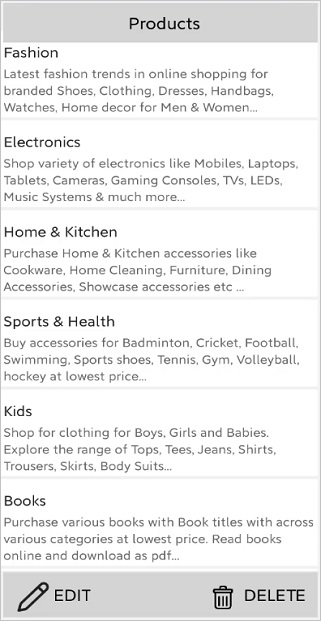
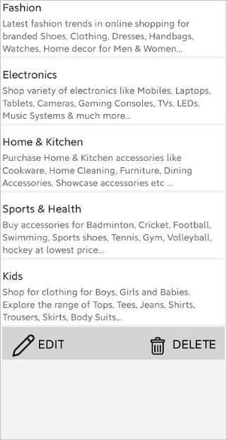
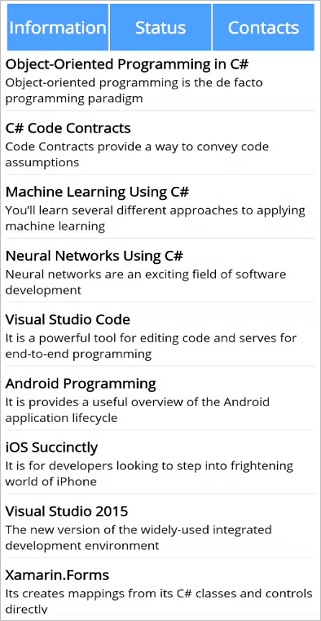

# Header and Footer in .NET MAUI ListView (SfListView)

This section explains how to define and customize the header and footer in the SfListView.

## Header and footer customization

The [SfListView](https://help.syncfusion.com/cr/maui/Syncfusion.Maui.ListView.html) allows you to add and customize appearance of the header and footer by setting the [SfListView.HeaderTemplate](https://help.syncfusion.com/cr/maui/Syncfusion.Maui.ListView.SfListView.html#Syncfusion_Maui_ListView_SfListView_HeaderTemplate) and [SfListView.FooterTemplate](https://help.syncfusion.com/cr/maui/Syncfusion.Maui.ListView.SfListView.html#Syncfusion_Maui_ListView_SfListView_FooterTemplate) properties.



<ContentPage xmlns:syncfusion="clr-namespace:Syncfusion.Maui.ListView;assembly=Syncfusion.Maui.ListView">
    <syncfusion:SfListView x:Name="listView"
                    ItemsSource="{Binding BookInfo}"
                    ItemSize="100">
        <syncfusion:SfListView.HeaderTemplate>
            <DataTemplate>
            <Grid BackgroundColor="Blue" HeightRequest="45">
                <Label LineBreakMode="NoWrap"
                    Margin="10,0,0,0" Text="Book Information" FontAttributes="Bold"
                    FontSize="18" TextColor="White" HorizontalOptions="Center"
                    VerticalOptions="Center"/>
            </Grid>
            </DataTemplate>
        </syncfusion:SfListView.HeaderTemplate>
    </syncfusion:SfListView>
</ContentPage>


viewModel = new ViewModel ();
listView = new SfListView();
listView.ItemsSource = viewModel.BookInfo;
listView.HeaderTemplate = new DataTemplate(() =>
{
   var grid = new Grid();
   grid.BackgroundColor = Colors.Blue;
   var headerLabel = new Label
   {
       TextColor = Colors.White,
       FontSize = 18,
       FontAttributes = FontAttributes.Bold,
       Text = "Book Information"
   };

   grid.Children.Add(headerLabel);

   return grid;
});



## Header and footer items appearance

The [SfListView](https://help.syncfusion.com/cr/maui/Syncfusion.Maui.ListView.html) allows you to customize the size of the header and footer items by setting the [SfListView.HeaderSize](https://help.syncfusion.com/cr/maui/Syncfusion.Maui.ListView.SfListView.html#Syncfusion_Maui_ListView_SfListView_HeaderSize) and [SfListView.FooterSize](https://help.syncfusion.com/cr/maui/Syncfusion.Maui.ListView.SfListView.html#Syncfusion_Maui_ListView_SfListView_FooterSize) properties. The default value is 40. These properties can be customized at runtime.



<syncfusion:SfListView x:Name="listView" ItemsSource="{Binding BookInfo}" HeaderSize="70" FooterSize="60" />


listView.HeaderSize = 70;
listView.FooterSize = 60;



N> For vertical orientation, the header and footer size are considered as height. For horizontal orientation, that will be considered as width.

## Sticky header and footer

The `SfListView` allows you to stick the header and footer items to view by enabling the [SfListView.IsStickyHeader](https://help.syncfusion.com/cr/maui/Syncfusion.Maui.ListView.SfListView.html#Syncfusion_Maui_ListView_SfListView_IsStickyHeader) and [SfListView.IsStickyFooter](https://help.syncfusion.com/cr/maui/Syncfusion.Maui.ListView.SfListView.html#Syncfusion_Maui_ListView_SfListView_IsStickyFooter) properties. If the `SfListView.IsStickyHeader` is `true`, the header item will stick to the top of the view. If the `SfListView.IsStickyFooter` is `true`, the footer item will stick to the bottom of the view.



<syncfusion:SfListView x:Name="listView" ItemsSource="{Binding CategoryInfo}" IsStickyHeader="True" IsStickyFooter="True" />          


listView.IsStickyHeader = true;
listView.IsStickyFooter = true;



## Sticky footer position

The `SfListView` allows you to position the footer item by using the [StickyFooterPosition](https://help.syncfusion.com/cr/maui/Syncfusion.Maui.ListView.SfListView.html#Syncfusion_Maui_ListView_SfListView_StickyFooterPosition) property.

The `StickyFooterPosition` property has two options:

* [Body](https://help.syncfusion.com/cr/maui/Syncfusion.Maui.ListView.ListViewFooterPosition.html#Syncfusion_Maui_ListView_ListViewFooterPosition_Body): The footer item will be positioned inside the body of the ListView when the items are less than the view size.
* [Default](https://help.syncfusion.com/cr/maui/Syncfusion.Maui.ListView.ListViewFooterPosition.html#Syncfusion_Maui_ListView_ListViewFooterPosition_Default): The footer item will be positioned at the bottom of the ListView.



<syncfusion:SfListView x:Name="listView" ItemsSource="{Binding CategoryInfo}" IsStickyFooter="True" StickyFooterPosition="Body"/>          


listView.IsStickyFooter = true;
listView.StickyFooterPosition = FooterPosition.Body;



N> This API is applicable when `IsStickyFooter` is enabled.

## How to

### TabView appearance using listview header

The `SfListView` allows you to perform tab view structure by customizing the [HeaderTemplate](https://help.syncfusion.com/cr/maui/Syncfusion.Maui.ListView.SfListView.html#Syncfusion_Maui_ListView_SfListView_HeaderTemplate) to load any view.



<ContentPage xmlns:syncfusion="clr-namespace:Syncfusion.Maui.ListView;assembly=Syncfusion.Maui.ListView">
    <ContentPage.BindingContext>
        <local:BookInfoRepository />
    </ContentPage.BindingContext>
    <ContentPage.Resources>
        <ResourceDictionary>
            <DataTemplate x:Key="template">
                        <Grid x:Name="grid" RowSpacing="0" Margin="5">
                            <Grid.RowDefinitions>
                                <RowDefinition Height="*" />
                                <RowDefinition Height="1" />
                            </Grid.RowDefinitions>
                            <Grid RowSpacing="0" Grid.Row="0">
                                <Grid.RowDefinitions>
                                    <RowDefinition Height="*" />
                                    <RowDefinition Height="*" />
                                </Grid.RowDefinitions>
                                <Label Grid.Row="0" Text="{Binding BookName}" FontAttributes="Bold" TextColor="Black" FontSize="14" />
                                <Label Grid.Row="1" Text="{Binding BookDescription}" TextColor="Black" FontSize="12"/>
                            </Grid>
                            <StackLayout Grid.Row="1" BackgroundColor="#E4E4E4" HeightRequest="1"/>
                        </Grid>
            </DataTemplate>
        </ResourceDictionary>
    </ContentPage.Resources>
    <syncfusion:SfListView x:Name="listView" IsStickyHeader="True" IsStickyFooter="True"
                               HeaderSize="80" FooterSize="60" SelectionBackground="LightBlue" 
                               ItemSize="90" SelectionMode="Single" ItemTemplate="{StaticResource template}">
        <syncfusion:SfListView.HeaderTemplate>
            <DataTemplate>
                <Grid BackgroundColor="#4CA1FE" HeightRequest="60">
                    <Grid.ColumnDefinitions>
                        <ColumnDefinition Width="2" />
                        <ColumnDefinition Width="*" />
                        <ColumnDefinition Width="2" />
                        <ColumnDefinition Width="*" />
                        <ColumnDefinition Width="2" />
                        <ColumnDefinition Width="*" />
                        <ColumnDefinition Width="2" />
                    </Grid.ColumnDefinitions>
                    <Grid Grid.Column="1" HorizontalOptions="FillAndExpand" VerticalOptions="FillAndExpand" >
                        <Label x:Name="info" BackgroundColor="Transparent" Text="Informations" FontAttributes="Bold" FontSize="18" TextColor="White" 
                              HorizontalTextAlignment="Center" VerticalTextAlignment="Center"  />
                        <Grid.GestureRecognizers>
                            <TapGestureRecognizer Tapped="InfoTapGestureRecognizerTapped" NumberOfTapsRequired="1"/>
                        </Grid.GestureRecognizers>
                    </Grid>
                    <Grid Grid.Column="3" HorizontalOptions="FillAndExpand" VerticalOptions="FillAndExpand" >
                        <Label x:Name="status" BackgroundColor="Transparent" Text="Status" FontAttributes="Bold" FontSize="18" TextColor="White"  
                                HorizontalTextAlignment="Center" VerticalTextAlignment="Center" />
                        <Grid.GestureRecognizers>
                            <TapGestureRecognizer Tapped="StatusTapGestureRecognizerTapped" NumberOfTapsRequired="1"/>
                        </Grid.GestureRecognizers>
                    </Grid>
                    <Grid Grid.Column="5" HorizontalOptions="FillAndExpand" VerticalOptions="FillAndExpand" >
                        <Label x:Name="contacts" BackgroundColor="Transparent" Text="Contacts" FontAttributes="Bold" FontSize="18" TextColor="White" 
                               HorizontalTextAlignment="Center" VerticalTextAlignment="Center"/>
                        <Grid.GestureRecognizers>
                            <TapGestureRecognizer Tapped="ContactsTapGestureRecognizerTapped" NumberOfTapsRequired="1"/>
                        </Grid.GestureRecognizers>
                    </Grid>
                    <BoxView Grid.Column="0" BackgroundColor="White" />
                    <BoxView Grid.Column="2" BackgroundColor="White" />
                    <BoxView Grid.Column="4" BackgroundColor="White" />
                    <BoxView Grid.Column="6" BackgroundColor="White" />
                </Grid>
            </DataTemplate>
        </syncfusion:SfListView.HeaderTemplate>
    </syncfusion:SfListView>
</ContentPage>



public partial class MainPage : ContentPage
{
    BookInfoRepository viewModel = new BookInfoRepository();
    BookInfoRepository1 viewModel1 = new BookInfoRepository1();
    EmployeeViewModel viewModel2 = new EmployeeViewModel();

    public MainPage()
    {
        InitializeComponent();
        this.listView.ItemsSource = viewModel.BookInfo;
    }

    public void InfoTapGestureRecognizerTapped(object sender, EventArgs e)
    {
        this.listView.ItemsSource = viewModel.BookInfo;
        this.listView.ItemTemplate = this.Resources["template"] as DataTemplate;
    }

    public void StatusTapGestureRecognizerTapped(object sender, EventArgs e)
    {
        this.listView.ItemsSource = viewModel1.BookInfo1;
        this.listView.ItemTemplate = this.Resources["template"] as DataTemplate;
    }

    public void ContactsTapGestureRecognizerTapped(object sender, EventArgs e)
    {
        this.listView.ItemsSource = viewModel2.EmployeeInfo;
        InitializeTemplate();
    }

    private void InitializeTemplate()
    {
        listView.ItemTemplate = new DataTemplate(() => { return CreateItemTemplate(); });
        listView.ItemSize = 70;
        listView.GroupHeaderSize = 60;
        listView.IsStickyGroupHeader = true;
        listView.AllowGroupExpandCollapse = true;
        listView.ItemSpacing = new Thickness(0, 0, 5, 0);
        listView.IsStickyHeader = true;
        listView.GroupHeaderTemplate = new DataTemplate(() =>
        {
            var grid = new Grid { BackgroundColor = Color.FromHex("#E4E4E4") };
            var label = new Label
            {
                FontAttributes = FontAttributes.Bold,
                FontSize = 22,
                VerticalOptions = LayoutOptions.Center,
                HorizontalOptions = LayoutOptions.Start,
                Margin = new Thickness(20, 0, 0, 0),
            };
            label.SetBinding(Label.TextProperty, new Binding("Key"));
            grid.Children.Add(label);
            return grid;
        });
    }

    private Grid CreateItemTemplate()
    {
        var gridView = new Grid();
        gridView.RowSpacing = 1;
        var row0 = new RowDefinition { Height = new GridLength(1, GridUnitType.Star) };
        var row1 = new RowDefinition { Height = 1 };
        gridView.RowDefinitions.Add(row0);
        gridView.RowDefinitions.Add(row1);

        var grid = new Grid();

        var column0 = new ColumnDefinition { Width = 50 };
        var column1 = new ColumnDefinition { Width = new GridLength(1, GridUnitType.Star) };
        var column2 = new ColumnDefinition { Width = 70 };
        grid.ColumnDefinitions.Add(column0);
        grid.ColumnDefinitions.Add(column1);
        grid.ColumnDefinitions.Add(column2);

        var contactImage = new Image();
        contactImage.SetBinding(Image.SourceProperty, new Binding("EmployeeImage"));
        contactImage.HeightRequest = 50;
        contactImage.VerticalOptions = LayoutOptions.Center;
        contactImage.HorizontalOptions = LayoutOptions.Center;

        var gridView = new Grid();

        gridView.RowSpacing = 1;
        gridView.Padding = new Thickness(10, 0, 0, 0);
        gridView.VerticalOptions = LayoutOptions.Center;
        var rowdefinition0 = new RowDefinition { Height = new GridLength(1, GridUnitType.Star) };
        var rowdefinition1 = new RowDefinition { Height = new GridLength(1, GridUnitType.Star) };
        gridView.RowDefinitions.Add(rowdefinition0);
        gridView.RowDefinitions.Add(rowdefinition1);

        var contactName = new Label();
        contactName.SetBinding(Label.TextProperty, new Binding("EmployeeName"));
        contactName.LineBreakMode = LineBreakMode.NoWrap;
        contactName.TextColor = Color.FromHex("#474747");
        contactName.FontSize = 20;

        var contactNumber = new Label();
        contactNumber.FontAttributes = FontAttributes.None;
        contactNumber.FontSize = 18;
        contactNumber.LineBreakMode = LineBreakMode.NoWrap;
        contactNumber.SetBinding(Label.TextProperty, new Binding("ContactNumber"));
        contactNumber.TextColor = Color.FromHex("#474747");

        var contactType = new Label();
        contactType.Margin = new Thickness(5);
        contactType.FontAttributes = FontAttributes.None;
        contactType.LineBreakMode = LineBreakMode.NoWrap;
        contactType.VerticalOptions = LayoutOptions.End;
        contactType.VerticalTextAlignment = TextAlignment.End;
        contactType.HorizontalOptions = LayoutOptions.End;
        contactType.SetBinding(Label.TextProperty, new Binding("Designation"));
        contactType.TextColor = Color.FromHex("#474747");
        contactType.FontSize = 12;

        var stackLayout = new StackLayout();
        stackLayout.HeightRequest = 1;
        stackLayout.BackgroundColor = Color.Gray;

        gridView.Children.Add(contactName);
        gridView.Children.Add(contactNumber);
        gridView.SetRow(contactName, 0);
        gridView.SetRow(contactNumber, 1);

        grid.Children.Add(contactImage);
        grid.Children.Add(gridView);
        grid.SetColumn(contactImage, 0);
        grid.SetColumn(gridView, 1);

        gridView.Children.Add(grid);
        gridView.Children.Add(stackLayout);
        gridView.SetRow(grid, 0);
        gridView.SetRow(stackLayout, 1);

        return gridView;
    }
}




