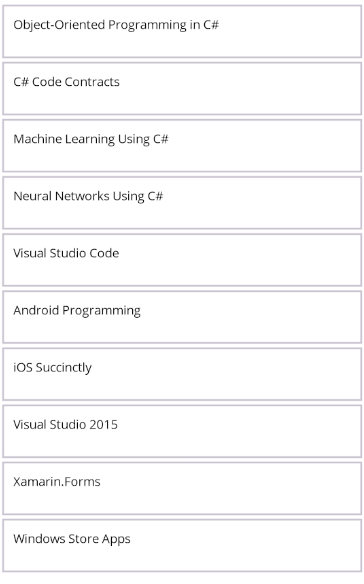
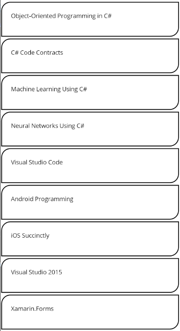

# Item Border Customization in .NET MAUI ListView (SfListView)

This section explains how to customize item borders in the `.NET MAUI ListView` (SfListView) using the built-in APIs.

## Enable Item Border

The `SfListView` allows applying borders to each item by setting the `ShowItemBorder` property to `true`. By default, item borders are not displayed. You can customize the color, thickness, margin, and corner radius of the borders using the respective APIs.

### API List

| API | Type | Description |
|-----|------|-------------|
| `ShowItemBorder` | `bool` | Enables or disables the visibility of item borders. *(Default: false)* |
| `ItemBorderColor` | `Color` | Sets the color of the item border. |
| `ItemBorderThickness` | `Thickness` | Defines the border thickness for each side of the item. |
| `ItemBorderMargin` | `Thickness` | Sets the margin around the border within the item container. |
| `ItemBorderRadius` | `CornerRadius` | Sets the corner radius of the item border for rounded edges. |

N> `ItemBorderRadius` is applicable only when `ItemBorderThickness` has uniform values on all sides.

## Getting Started with Border

To enable border support for items in `SfListView`, set the `ShowItemBorder` property to `true`. This enables border rendering around each item using default values.



<syncfusion:SfListView x:Name="listView"
                       ShowItemBorder="True"
                       ItemsSource="{Binding BookInfo}">
    <syncfusion:SfListView.ItemTemplate>
        <DataTemplate>
            <StackLayout Padding="10">
                <Label Text="{Binding BookName}" />
            </StackLayout>
        </DataTemplate>
    </syncfusion:SfListView.ItemTemplate>
</syncfusion:SfListView>



listView.ShowItemBorder = true;



Once this property is enabled, borders will be drawn with default appearance unless customized further.

## Border Customization

After enabling the item border, you can customize its appearance using the following properties:

- `ItemBorderColor`: Sets the border color.
- `ItemBorderThickness`: Specifies the thickness of the border.
- `ItemBorderMargin`: Adds margin around the border.
- `ItemBorderRadius`: Rounds the item’s corners.



<syncfusion:SfListView x:Name="listView"
                       ShowItemBorder="True"
                       ItemBorderColor="Black"
                       ItemBorderThickness="2"
                       ItemBorderMargin="2"
                       ItemBorderRadius="20,0,0,20"
                       ItemsSource="{Binding BookInfo}">
    <syncfusion:SfListView.ItemTemplate>
        <DataTemplate>
            <StackLayout Padding="10">
                <Label Text="{Binding BookName}" />
            </StackLayout>
        </DataTemplate>
    </syncfusion:SfListView.ItemTemplate>
</syncfusion:SfListView>



listView.ShowItemBorder = true;
listView.ItemBorderColor = Colors.Black;
listView.ItemBorderThickness = new Thickness(2);
listView.ItemBorderMargin = new Thickness(2);
listView.ItemBorderRadius = new CornerRadius(20,0,0,20);



This setup displays each item with a black, 2-unit thick border, spaced 2 units inward, and corners with a radius of 20 at TopLeft and BottomRight of the item.

## Border Customization Tips

- Use `ItemBorderRadius` to rounded corners and soften the visual look.
- Borders are drawn inside the item layout bounds and honor the padding and margin applied to the item.
- Keep border thickness and color subtle for better UX across platforms.

## Limitations

- Item border is not applicable when using a Grid layout inside the ItemTemplate.
- Item border will not be visible unless `ShowItemBorder` is explicitly set to `true`.
- When `ShowItemBorder` is set to `true`, the Focus Border will reuse the item border and will not be drawn separately.
- Only applies to items. Does not apply to headers, group headers, or footers.
- Per-item border customization via data binding is not supported.

## See Also

- [Item Size Customization in .NET MAUI ListView](https://help.syncfusion.com/maui/listview/item-size-customization)
