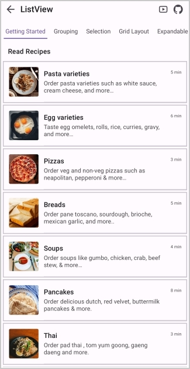
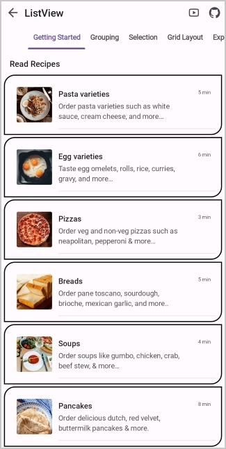

# Item Border Customization in .NET MAUI ListView (SfListView)

This section explains how to customize item borders in the `.NET MAUI ListView` (SfListView) using the built-in APIs.

## Enable Item Border

The [SfListView](https://help.syncfusion.com/cr/maui/Syncfusion.Maui.ListView.html) allows applying borders to each item by setting the [ShowItemBorder](https://help.syncfusion.com/cr/maui/Syncfusion.Maui.ListView.SfListView.html#Syncfusion_Maui_ListView_SfListView_ShowItemBorderProperty) property to `true`. By default, item borders are not displayed. You can customize the color, thickness, margin, and corner radius of the borders using the respective APIs.

<table>
  <thead>
    <tr>
      <th>Property</th>
      <th>Description</th>
    </tr>
  </thead>
  <tbody>
    <tr>
      <td>{{'[ShowItemBorder](https://help.syncfusion.com/cr/maui/Syncfusion.Maui.ListView.SfListView.html#Syncfusion_Maui_ListView_SfListView_ShowItemBorderProperty)'| markdownify }}</td>
      <td>Enables or disables the visibility of item borders. <em>(Default: false)</em></td>
    </tr>
    <tr>
      <td>{{'[ItemBorderColor](https://help.syncfusion.com/cr/maui/Syncfusion.Maui.ListView.SfListView.html#Syncfusion_Maui_ListView_SfListView_ItemBorderColorProperty)'| markdownify }}</td>
      <td>Sets the color of the item border.
    </tr>
    <tr>
      <td>{{'[ItemBorderThickness](https://help.syncfusion.com/cr/maui/Syncfusion.Maui.ListView.SfListView.html#Syncfusion_Maui_ListView_SfListView_ItemBorderThicknessProperty)'| markdownify }}</td>
      <td>Defines the border thickness for each side of the item (per-side <code>double</code> values).
    </tr>
    <tr>
      <td>{{'[ItemBorderMargin](https://help.syncfusion.com/cr/maui/Syncfusion.Maui.ListView.SfListView.html#Syncfusion_Maui_ListView_SfListView_ItemBorderMarginProperty)'| markdownify }}</td>
      <td>Sets the margin around the border within the item.
    </tr>
    <tr>
      <td>{{'[ItemBorderRadius](https://help.syncfusion.com/cr/maui/Syncfusion.Maui.ListView.SfListView.html#Syncfusion_Maui_ListView_SfListView_ItemBorderRadiusProperty)'| markdownify}}</td>
      <td>Sets the corner radius of the item border.
    </tr>
  </tbody>
</table>

N> `ItemBorderRadius` is applicable only when `ItemBorderThickness` has uniform values on all sides.



<syncfusion:SfListView x:Name="listView"
                       ShowItemBorder="True"
                       ItemsSource="{Binding BookInfo}">
    <syncfusion:SfListView.ItemTemplate>
        <DataTemplate>
            <StackLayout Padding="5">
                <Label Text="{Binding BookName}" FontAttributes="Bold" />
                <Label Text="{Binding BookDescription}" />
            </StackLayout>
        </DataTemplate>
    </syncfusion:SfListView.ItemTemplate>
</syncfusion:SfListView>



listView.ShowItemBorder = true;



## Border Customization

After enabling the item border, you can customize its appearance using the following properties:

- [ItemBorderColor](https://help.syncfusion.com/cr/maui/Syncfusion.Maui.ListView.SfListView.html#Syncfusion_Maui_ListView_SfListView_ItemBorderColorProperty): Sets the border color.
- [ItemBorderThickness](https://help.syncfusion.com/cr/maui/Syncfusion.Maui.ListView.SfListView.html#Syncfusion_Maui_ListView_SfListView_ItemBorderThicknessProperty): Specifies the thickness of the border.
- [ItemBorderMargin](https://help.syncfusion.com/cr/maui/Syncfusion.Maui.ListView.SfListView.html#Syncfusion_Maui_ListView_SfListView_ItemBorderMarginProperty): Adds margin around the border.
- [ItemBorderRadius](https://help.syncfusion.com/cr/maui/Syncfusion.Maui.ListView.SfListView.html#Syncfusion_Maui_ListView_SfListView_ItemBorderRadiusProperty): Sets the corner radius of the border.



<syncfusion:SfListView x:Name="listView"
                       ItemSize="60"
                       ShowItemBorder="True"
                       ItemBorderColor="Black"
                       ItemBorderThickness="2"
                       ItemBorderMargin="5,2,5,2"
                       ItemBorderRadius="20,0,0,20"
                       ItemsSource="{Binding BookInfo}">
    <syncfusion:SfListView.ItemTemplate>
        <DataTemplate>
            <StackLayout Padding="5">
                <Label Text="{Binding BookName}" FontAttributes="Bold" />
                <Label Text="{Binding BookDescription}" />
            </StackLayout>
        </DataTemplate>
    </syncfusion:SfListView.ItemTemplate>
</syncfusion:SfListView>



listView.ShowItemBorder = true;
listView.ItemBorderColor = Colors.Black;
listView.ItemBorderThickness = new Thickness(2);
listView.ItemBorderMargin = new Thickness(5, 2, 5, 2);
listView.ItemBorderRadius = new CornerRadius(20,0,0,20);



## Limitations

- Item borders are not supported when [SfListView.ItemsLayout](https://help.syncfusion.com/cr/maui/Syncfusion.Maui.ListView.SfListView.html#Syncfusion_Maui_ListView_SfListView_ItemsLayout) is set to [GridLayout](https://help.syncfusion.com/cr/maui/Syncfusion.Maui.ListView.GridLayout.html).
- [ItemBorderRadius](https://help.syncfusion.com/cr/maui/Syncfusion.Maui.ListView.SfListView.html#Syncfusion_Maui_ListView_SfListView_ItemBorderRadiusProperty) is applicable only when [ItemBorderThickness](https://help.syncfusion.com/cr/maui/Syncfusion.Maui.ListView.SfListView.html#Syncfusion_Maui_ListView_SfListView_ItemBorderThicknessProperty) has uniform values on all sides.

## See Also

- [Syncfusion .NET MAUI ListView Item Size Customization](https://help.syncfusion.com/maui/listview/item-size-customization)

## Group Header Border Customization in .NET MAUI ListView (SfListView)

This section explains how to customize group header borders in the `.NET MAUI ListView` (SfListView) using the built-in APIs.

## Enable Group Header Border

The [SfListView](https://help.syncfusion.com/cr/maui/Syncfusion.Maui.ListView.html) allows applying borders to each group header by setting the `ShowGroupHeaderBorder` property to `true`. By default, group header borders are not displayed. You can customize the color, thickness, margin, and corner radius of the borders using the respective APIs.

<table>
  <thead>
    <tr>
      <th>Property</th>
      <th>Description</th>
    </tr>
  </thead>
  <tbody>
    <tr>
      <td>{{'[ShowGroupHeaderBorder](https://help.syncfusion.com/cr/maui/Syncfusion.Maui.ListView.SfListView.html#Syncfusion_Maui_ListView_SfListView_ShowGroupHeaderBorderProperty)'| markdownify }}</td>
      <td>Enables or disables the visibility of group header borders. <em>(Default: false)</em></td>
    </tr>
    <tr>
      <td>{{'[GroupHeaderBorderColor](https://help.syncfusion.com/cr/maui/Syncfusion.Maui.ListView.SfListView.html#Syncfusion_Maui_ListView_SfListView_GroupHeaderBorderColorProperty)'| markdownify }}</td>
      <td>Sets the color of the group header border. <em>(Default: <code>Colors.Black</code>)</em></td>
    </tr>
    <tr>
      <td>{{'[GroupHeaderBorderThickness](https://help.syncfusion.com/cr/maui/Syncfusion.Maui.ListView.SfListView.html#Syncfusion_Maui_ListView_SfListView_GroupHeaderBorderThicknessProperty)'| markdownify }}</td>
      <td>Defines the border thickness for each side of the group header (per-side <code>double</code> values). <em>(Default: <code>new Thickness(1)</code>)</em></td>
    </tr>
    <tr>
      <td>{{'[GroupHeaderBorderMargin](https://help.syncfusion.com/cr/maui/Syncfusion.Maui.ListView.SfListView.html#Syncfusion_Maui_ListView_SfListView_GroupHeaderBorderMarginProperty)'| markdownify }}</td>
      <td>Sets the margin around the border within the group header. <em>(Default: <code>new Thickness(0)</code>)</em></td>
    </tr>
    <tr>
      <td>{{'[GroupHeaderBorderRadius](https://help.syncfusion.com/cr/maui/Syncfusion.Maui.ListView.SfListView.html#Syncfusion_Maui_ListView_SfListView_GroupHeaderBorderRadiusProperty)'| markdownify }}</td>
      <td>Sets the corner radius of the group header border. <em>(Default: <code>new CornerRadius(0)</code>)</em></td>
    </tr>
  </tbody>
</table>

N> `GroupHeaderBorderRadius` is applicable only when `GroupHeaderBorderThickness` has uniform values on all sides.

### XAML Example



<syncfusion:SfListView x:Name="listView"
                       GroupHeaderSize="50"
                       ShowGroupHeaderBorder="True"
                       AllowGroupExpandCollapse="True"
                       ItemsSource="{Binding BookInfo}"
                       GroupKeySelector="{Binding Category}">
    <syncfusion:SfListView.ItemTemplate>
        <DataTemplate>
            <StackLayout Padding="5">
                <Label Text="{Binding BookName}" FontAttributes="Bold" />
                <Label Text="{Binding BookDescription}" />
            </StackLayout>
        </DataTemplate>
    </syncfusion:SfListView.ItemTemplate>
</syncfusion:SfListView>



listView.ShowGroupHeaderBorder = true;



## Border Customization

After enabling the group header border, you can customize its appearance using the following properties:

- `GroupHeaderBorderColor`: Sets the border color.
- `GroupHeaderBorderThickness`: Specifies the thickness of the border.
- `GroupHeaderBorderMargin`: Adds margin around the border.
- `GroupHeaderBorderRadius`: Sets the corner radius of the border.



<syncfusion:SfListView x:Name="listView"
                       GroupHeaderSize="60"
                       ShowGroupHeaderBorder="True"
                       GroupHeaderBorderColor="Black"
                       GroupHeaderBorderThickness="2"
                       GroupHeaderBorderMargin="5,2,5,2"
                       GroupHeaderBorderRadius="20,0,0,20"
                       ItemsSource="{Binding BookInfo}">
    <syncfusion:SfListView.ItemTemplate>
        <DataTemplate>
            <StackLayout Padding="5">
                <Label Text="{Binding BookName}" FontAttributes="Bold" />
                <Label Text="{Binding BookDescription}" />
            </StackLayout>
        </DataTemplate>
    </syncfusion:SfListView.ItemTemplate>
</syncfusion:SfListView>



listView.ShowGroupHeaderBorder = true;
listView.GroupHeaderBorderColor = Colors.Black;
listView.GroupHeaderBorderThickness = new Thickness(2);
listView.GroupHeaderBorderMargin = new Thickness(2);
listView.GroupHeaderBorderRadius = new CornerRadius(20,0,0,20);



## Limitations

- Group header borders are rendered on top of the group header template content and do not interfere with touch interactions.
- `GroupHeaderBorderRadius` is applicable only when `GroupHeaderBorderThickness` has uniform values on all sides.
- Group header borders are only supported with grouped data sources (when `GroupKeySelector` is set).

## See Also

- [Grouping in .NET MAUI ListView](https://help.syncfusion.com/maui/listview/grouping)
