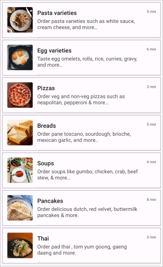
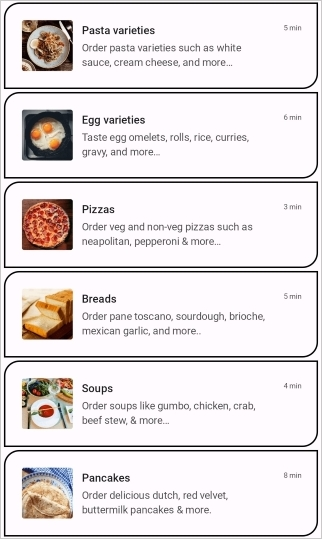

# Item Border Customization in .NET MAUI ListView (SfListView)

This section explains how to customize item borders in the `.NET MAUI ListView` (SfListView) using the built-in APIs.

## Enable Item Border

The `SfListView` allows applying borders to each item by setting the `ShowItemBorder` property to `true`. By default, item borders are not displayed. You can customize the color, thickness, margin, and corner radius of the borders using the respective APIs.

<table>
  <thead>
    <tr>
      <th>Property</th>
      <th>Description</th>
    </tr>
  </thead>
  <tbody>
    <tr>
      <td><code>ShowItemBorder</code></td>
      <td>Enables or disables the visibility of item borders. <em>(Default: false)</em></td>
    </tr>
    <tr>
      <td><code>ItemBorderColor</code></td>
      <td>Sets the color of the item border.</td>
    </tr>
    <tr>
      <td><code>ItemBorderThickness</code></td>
      <td>Defines the border thickness for each side of the item.</td>
    </tr>
    <tr>
      <td><code>ItemBorderMargin</code></td>
      <td>Sets the margin around the border within the item.</td>
    </tr>
    <tr>
      <td><code>ItemBorderRadius</code></td>
      <td>Sets the corner radius of the item border.</td>
    </tr>
  </tbody>
</table>

N> `ItemBorderRadius` is applicable only when `ItemBorderThickness` has uniform values on all sides.



<syncfusion:SfListView x:Name="listView"
                       ShowItemBorder="True"
                       ItemsSource="{Binding BookInfo}">
    <syncfusion:SfListView.ItemTemplate>
        <DataTemplate>
            <StackLayout Padding="5">
                <Label Text="{Binding BookName}" FontAttributes="Bold" />
                <Label Text="{Binding BookDescription}" />
            </StackLayout>
        </DataTemplate>
    </syncfusion:SfListView.ItemTemplate>
</syncfusion:SfListView>



listView.ShowItemBorder = true;



## Border Customization

After enabling the item border, you can customize its appearance using the following properties:

- `ItemBorderColor`: Sets the border color.
- `ItemBorderThickness`: Specifies the thickness of the border.
- `ItemBorderMargin`: Adds margin around the border.
- `ItemBorderRadius`: Sets the corner radius of the  border.



<syncfusion:SfListView x:Name="listView"
                       ItemSize="60"
                       ShowItemBorder="True"
                       ItemBorderColor="Black"
                       ItemBorderThickness="2"
                       ItemBorderMargin="5,2,5,2"
                       ItemBorderRadius="20,0,0,20"
                       ItemsSource="{Binding BookInfo}">
    <syncfusion:SfListView.ItemTemplate>
        <DataTemplate>
            <StackLayout Padding="5">
                <Label Text="{Binding BookName}" FontAttributes="Bold" />
                <Label Text="{Binding BookDescription}" />
            </StackLayout>
        </DataTemplate>
    </syncfusion:SfListView.ItemTemplate>
</syncfusion:SfListView>



listView.ShowItemBorder = true;
listView.ItemBorderColor = Colors.Black;
listView.ItemBorderThickness = new Thickness(2);
listView.ItemBorderMargin = new Thickness(2);
listView.ItemBorderRadius = new CornerRadius(20,0,0,20);



## Limitations

- Item borders are not supported when `SfListView.ItemsLayout` is set to `GridLayout`.
- `ItemBorderRadius` is applicable only when `ItemBorderThickness` has uniform values on all sides.

## See Also

- [Item Size Customization in .NET MAUI ListView](https://help.syncfusion.com/maui/listview/item-size-customization)
