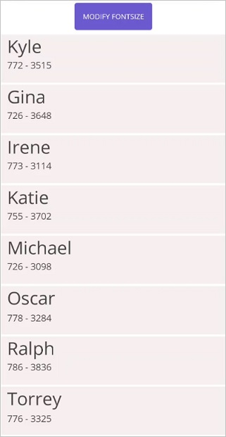

# Item Size Customization in .NET MAUI ListView (SfListView)

This section explains how to customize the item size in the `.NET MAUI ListView` (SfListView).

## Customize item size of a particular item on-demand

The `SfListView` allows customizing the size of the item on-demand by the [SfListView.QueryItemSize](https://help.syncfusion.com/cr/maui/Syncfusion.Maui.ListView.SfListView.html#Syncfusion_Maui_ListView_SfListView_QueryItemSize) event using the item index. This event is raised whenever items come to view and triggered with [QueryItemSizeEventArgs](https://help.syncfusion.com/cr/maui/Syncfusion.Maui.ListView.QueryItemSizeEventArgs.html).

The `SfListView.QueryItemSize` event provides the following properties in their arguments:

 * [ItemIndex](https://help.syncfusion.com/cr/maui/Syncfusion.Maui.ListView.QueryItemSizeEventArgs.html#Syncfusion_Maui_ListView_QueryItemSizeEventArgs_ItemIndex): Gets the index of a particular item in the `SfListView`.
 * [DataItem](https://help.syncfusion.com/cr/maui/Syncfusion.Maui.ListView.QueryItemSizeEventArgs.html#Syncfusion_Maui_ListView_QueryItemSizeEventArgs_DataItem): Gets the underlying data bound to that item.
 * [ItemSize](https://help.syncfusion.com/cr/maui/Syncfusion.Maui.ListView.QueryItemSizeEventArgs.html#Syncfusion_Maui_ListView_QueryItemSizeEventArgs_ItemSize): Gets or sets the size of the queried item. For vertical orientation, it is considered as the item height. For horizontal orientation, it is considered as the item width.
 * [ItemType](https://help.syncfusion.com/cr/maui/Syncfusion.Maui.ListView.QueryItemSizeEventArgs.html#Syncfusion_Maui_ListView_QueryItemSizeEventArgs_ItemType): Gets the item type of the queried item.
 * [Handled](https://help.syncfusion.com/cr/maui/Syncfusion.Maui.ListView.QueryItemSizeEventArgs.html#Syncfusion_Maui_ListView_QueryItemSizeEventArgs_Handled): Gets or sets a value that indicates whether the specified size is applied to the item. When `false` (default), the size is not applied. Set to `true` to apply the specified size.



<ContentPage xmlns:syncfusion="clr-namespace:Syncfusion.Maui.ListView;assembly=Syncfusion.Maui.ListView">
    <syncfusion:SfListView x:Name="listView"
                           QueryItemSize="ListView_QueryItemSize"
                           ItemsSource="{Binding Items}" />
</ContentPage>


using Syncfusion.Maui.ListView;

this.listView.QueryItemSize += ListView_QueryItemSize;

private void ListView_QueryItemSize(object sender, QueryItemSizeEventArgs e)
{
    if (e.ItemIndex == 1)
    {
        // ItemSize is a double; set the value and mark the event as Handled to apply it.
        e.ItemSize = 300d;
        e.Handled = true;
    }
}



## AutoFit the items based on the content

The `SfListView` allows dynamically adjusting size of items based on the content loaded in the [SfListView.ItemTemplate](https://help.syncfusion.com/cr/maui/Syncfusion.Maui.ListView.SfListView.html#Syncfusion_Maui_ListView_SfListView_ItemTemplate) by defining the [SfListView.AutoFitMode](https://help.syncfusion.com/cr/maui/Syncfusion.Maui.ListView.SfListView.html#Syncfusion_Maui_ListView_SfListView_AutoFitMode) property.

The control contains the following three values of `AutoFitMode`:

 * [Height](https://help.syncfusion.com/cr/maui/Syncfusion.Maui.ListView.AutoFitMode.html#Syncfusion_Maui_ListView_AutoFitMode_Height): AutoFit the items based on the content.
 * [DynamicHeight](https://help.syncfusion.com/cr/maui/Syncfusion.Maui.ListView.AutoFitMode.html#Syncfusion_Maui_ListView_AutoFitMode_DynamicHeight): If the size of the content changes at run time, autofit the items based on it.
 * [None](https://help.syncfusion.com/cr/maui/Syncfusion.Maui.ListView.AutoFitMode.html#Syncfusion_Maui_ListView_AutoFitMode_None): [SfListView.ItemSize](https://help.syncfusion.com/cr/maui/Syncfusion.Maui.ListView.SfListView.html#Syncfusion_Maui_ListView_SfListView_ItemSize)  is used to layout the `SfListView` items.

 N> If you define any size manually to the view loaded in [SfListView.ItemTemplate](https://help.syncfusion.com/cr/maui/Syncfusion.Maui.ListView.SfListView.html#Syncfusion_Maui_ListView_SfListView_ItemTemplate), the `SfListView` will return that size as the item size for each item.

### AutoFitMode as Height

AutoFit considers the height of the item when [SfListView.Orientation](https://help.syncfusion.com/cr/maui/Syncfusion.Maui.ListView.SfListView.html#Syncfusion_Maui_ListView_SfListView_Orientation) is set to `Vertical`. When `SfListView.Orientation` is set to `Horizontal`, it considers the width of the item. The [SfListView.GridLayout](https://help.syncfusion.com/cr/maui/Syncfusion.Maui.ListView.GridLayout.html) AutoFits all the items in a row and takes the maximum item height of the row and applies it to all other items in the row.



<ContentPage xmlns:syncfusion="clr-namespace:Syncfusion.Maui.ListView;assembly=Syncfusion.Maui.ListView">
  <syncfusion:SfListView x:Name="listView" 
                    ItemSize="200"
                    AutoFitMode="Height"
                    ItemsSource="{Binding BookInfo}" />
</ContentPage>


using Syncfusion.Maui.ListView;

// ...
listView.AutoFitMode = AutoFitMode.Height;



### AutoFitMode as DynamicHeight

Unlike `Height`, which measures the item only once, `DynamicHeight` re-measures and re-fits items at runtime whenever the content size changes (for example, when text wraps or a font size is updated). As with `Height`, the dimension considered depends on `SfListView.Orientation`, and the [SfListView.GridLayout](https://help.syncfusion.com/maui/listview/layouts#grid-layout) autofits all items in a row to the maximum item height of that row.



<ContentPage xmlns:syncfusion="clr-namespace:Syncfusion.Maui.ListView;assembly=Syncfusion.Maui.ListView">
  <syncfusion:SfListView x:Name="listView" 
                    ItemSize="200"
                    AutoFitMode="DynamicHeight"
                    ItemsSource="{Binding ContactsInfo}" />
</ContentPage>


using Syncfusion.Maui.ListView;

// ...
listView.AutoFitMode = AutoFitMode.DynamicHeight;



## Updating the list-view item size based on font at runtime

.NET MAUI ListView (SfListView) allows you to resize the item size in response to runtime changes in the font size of a label element when `SfListView.AutoFitMode` is [DynamicHeight](https://help.syncfusion.com/cr/maui/Syncfusion.Maui.ListView.AutoFitMode.html#Syncfusion_Maui_ListView_AutoFitMode_DynamicHeight).



<ContentPage xmlns:syncfusion="clr-namespace:Syncfusion.Maui.ListView;assembly=Syncfusion.Maui.ListView">       
 <Grid>
    <Grid.RowDefinitions>
        <RowDefinition Height="50"/>
        <RowDefinition Height="*"/>
    </Grid.RowDefinitions>
    <Button Text="Modify FontSize" Clicked="Button_Clicked"/>
    <syncfusion:SfListView x:Name="listView"
                ItemSpacing="2"
                Grid.Row="1"
                ItemsSource="{Binding Items}"
                BackgroundColor="#FFE8E8EC"
                AutoFitMode="DynamicHeight"
                ItemSize="60">
        <syncfusion:SfListView.ItemTemplate>
            <DataTemplate>
                <Grid x:Name="grid" RowSpacing="1" ColumnSpacing="1">
                    <Grid.ColumnDefinitions>
                        <ColumnDefinition Width="Auto"/>
                        <ColumnDefinition Width="*"/>
                    </Grid.ColumnDefinitions>
                    <Grid Grid.Column="0">
                        <Image HeightRequest="45" Margin="5,0,0,0" WidthRequest="45" Source="{Binding ContactImage}" VerticalOptions="Center" HorizontalOptions="Center" />
                    </Grid>
                    <Grid Grid.Column="1" RowSpacing="1" Padding="5" VerticalOptions="Center">
                        <Grid.RowDefinitions>
                            <RowDefinition Height="Auto"/>
                            <RowDefinition Height="Auto"/>
                        </Grid.RowDefinitions>
                        <Label LineBreakMode="NoWrap"
                            TextColor="#474747"
                            FontSize="{Binding BindingContext.FontSize, Source={x:Reference Name=listView}}"
                            Text="{Binding ContactName}">
                        </Label>
                        <Label Grid.Row="1" 
                             FontSize="13"
                             TextColor="#474747"
                             LineBreakMode="NoWrap"
                             Text="{Binding CallTime}"/>
                    </Grid>
                </Grid>
            </DataTemplate>
        </syncfusion:SfListView.ItemTemplate>
    </syncfusion:SfListView>  
</Grid>              
</ContentPage>


using Microsoft.Maui.Controls;

private void Button_Clicked(object sender, EventArgs e)
{
    ViewModel.FontSize += 25;
}


using System.ComponentModel;
using System.Runtime.CompilerServices;

public class ItemViewModel : INotifyPropertyChanged
{
    private double fontSize = 14;

    public double FontSize
    {
        get { return fontSize; }
        set
        {
            fontSize = value;
            OnPropertyChanged();
        }
    }

    public event PropertyChangedEventHandler PropertyChanged;

    private void OnPropertyChanged([CallerMemberName] string propertyName = null)
    {
        PropertyChanged?.Invoke(this, new PropertyChangedEventArgs(propertyName));
    }
}



## Updating the Header and Footer height based on font at runtime

`SfListView` allows you to resize the `Header` and `Footer` item sizes in response to runtime changes in the font size of their label elements. Call the [RefreshItem](https://help.syncfusion.com/cr/maui/Syncfusion.Maui.ListView.SfListView.html#Syncfusion_Maui_ListView_SfListView_RefreshItem_System_Int32_System_Int32_System_Boolean_) method asynchronously to apply the new sizes when `SfListView.AutoFitMode` is set to `Height`.



<ContentPage xmlns:syncfusion="clr-namespace:Syncfusion.Maui.ListView;assembly=Syncfusion.Maui.ListView">       
 <Grid>
    <Grid.RowDefinitions>
        <RowDefinition Height="50"/>
        <RowDefinition Height="*"/>
    </Grid.RowDefinitions>
    <Button Text="Change FontSize" Command="{Binding ResizeHeaderFooterCommand}" CommandParameter="{x:Reference listView}"/>
    <syncfusion:SfListView x:Name="listView" 
                ItemsSource="{Binding Contacts}"
                BackgroundColor="White"
                AutoFitMode="Height">
                <syncfusion:SfListView.HeaderTemplate>
                    <DataTemplate>
                            <Grid>
                                <Label Text="Contact Details"
                                       FontSize="{Binding BindingContext.FontSize, Source={x:Reference listView}}"/>
                            </Grid>
                    </DataTemplate>
                </syncfusion:SfListView.HeaderTemplate>
                <syncfusion:SfListView.FooterTemplate>
                    <DataTemplate>
                            <Grid>
                                <Grid.ColumnDefinitions>
                                    <ColumnDefinition Width="*"/>
                                    <ColumnDefinition Width="Auto"/>
                                </Grid.ColumnDefinitions>
                                <Label Grid.Column="0" HorizontalOptions="End" Text="Contacts Count" TextColor="Black" FontSize="{Binding BindingContext.FontSize, Source={x:Reference listView}}"/>
                                <Label Grid.Column="1" Text="{Binding Contacts.Count}" HorizontalOptions="Start" TextColor="Black" FontSize="{Binding BindingContext.FontSize, Source={x:Reference listView}}"/>
                            </Grid>
                    </DataTemplate>
                </syncfusion:SfListView.FooterTemplate>
    </syncfusion:SfListView>                
</ContentPage>


using System.ComponentModel;
using System.Runtime.CompilerServices;
using System.Windows.Input;
using Syncfusion.Maui.ListView;

namespace SfListViewSample
{
    public class ContactsViewModel : INotifyPropertyChanged
    {
        private SfListView list;
        private double fontSize = 18;

        public ICommand ResizeHeaderFooterCommand { get; set; }

        public ContactsViewModel()
        {
            ResizeHeaderFooterCommand = new Command(ResizeHeaderFooter);
        }

        public double FontSize
        {
            get { return fontSize; }
            set
            {
                fontSize = value;
                OnPropertyChanged();
            }
        }

        private void ResizeHeaderFooter(object obj)
        {
            list = obj as SfListView;
            var maxFont = 40;
            var minFont = 18;
            if (FontSize >= maxFont)
            {
                FontSize = minFont;
            }
            else
            {
                FontSize += 10;
            }
            // RefreshItem(rowIndex, columnIndex, canReset): -1, -1 targets the header/footer; canReset = true forces a full re-layout.
            list.RefreshItem(-1, -1, true);
        }

        public event PropertyChangedEventHandler PropertyChanged;

        private void OnPropertyChanged([CallerMemberName] string propertyName = null)
        {
            PropertyChanged?.Invoke(this, new PropertyChangedEventArgs(propertyName));
        }
    }
}       



## Load images with autofit mode

By default, the image is not loaded with the actual size in `AutoFitMode` because it measures the size before the layout. As a result, the size of the child view changes cannot be found from the parent view. It is a known issue with `SfListView`, but it can be fixed by calling the `RefreshItem` method in the `Loaded` event of `SfListView`.



<ContentPage xmlns:syncfusion="clr-namespace:Syncfusion.Maui.ListView;assembly=Syncfusion.Maui.ListView">
    <ContentPage.Content>
        <Grid>
            <syncfusion:SfListView x:Name="listView" 
                                   AutoFitMode="Height"
                                   ItemsSource="{Binding ContactsInfo}"
                                   Loaded="ListView_Loaded">
                <syncfusion:SfListView.ItemTemplate>
                    <DataTemplate>
                        <StackLayout>
                            <StackLayout>
                                <Label Text="{Binding ContactName}" />
                                <Label Text="{Binding ContactNumber}"  />
                            </StackLayout>
                            <Image Source="{Binding ContactImage}"  />
                        </StackLayout>
                    </DataTemplate>
                </syncfusion:SfListView.ItemTemplate>
            </syncfusion:SfListView>
        </Grid>
    </ContentPage.Content>
</ContentPage>


using System.Threading.Tasks;
using Microsoft.Maui.ApplicationModel;
using Syncfusion.Maui.ListView;

private void ListView_Loaded(object sender, ListViewLoadedEventArgs e)
{
    MainThread.BeginInvokeOnMainThread(async() =>
    {
        // Delay to allow the image to finish loading before refreshing the items.
        await Task.Delay(100);
        listView.RefreshItem();
    });
}



## Limitations

 * **Images in templates:** Explicitly set the size of the image when loading an image in the [SfListView.ItemTemplate](https://help.syncfusion.com/cr/maui/Syncfusion.Maui.ListView.SfListView.html#Syncfusion_Maui_ListView_SfListView_ItemTemplate). The control does not return the actual measured size when measuring the item before layout. See the "Load images with autofit mode" section above for the workaround.
 * **Nested SfListView:** Avoid nesting `SfListView` inside another `SfListView` if `SfListView.AutoFitMode` is `Height` or `DynamicHeight`. The inner `SfListView` does not return the actual measured size when measuring the item before layout.
 * **GridLayout with AutoFitMode:** When `SfListView.GridLayout` is used with `AutoFitMode` set to `Height` or `DynamicHeight`, all items in a row are sized to the maximum measured item height in that row. Mixed-height items in the same row will not retain their individual heights. See the [GridLayout](https://help.syncfusion.com/maui/listview/layouts#grid-layout) topic for more details.|

## See also 

[How to create an expandable ListView (SfListView) in .NET MAUI](https://support.syncfusion.com/kb/article/11583/how-to-create-an-expandable-listview-sflistview-in-net-maui)