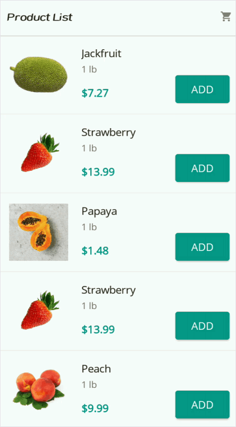
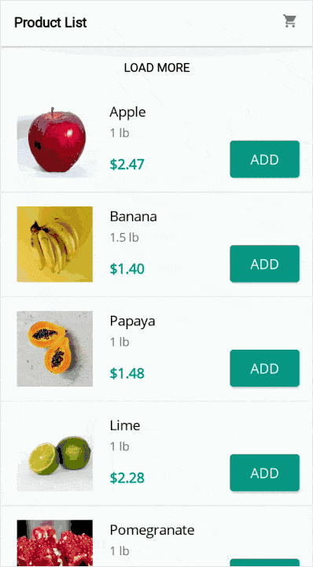
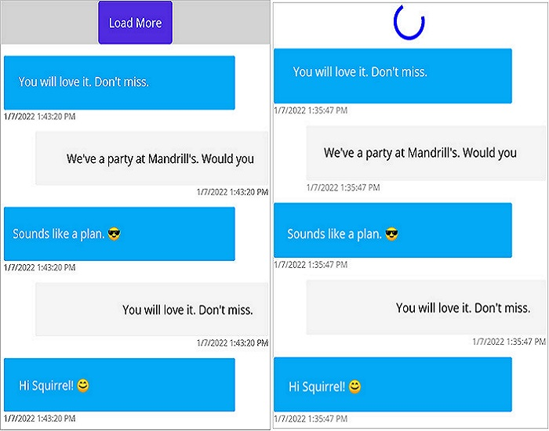

# Load More in .NET MAUI ListView (SfListView)

The `SfListView` enables `Load More` view by setting the [SfListView.LoadMoreOption](https://help.syncfusion.com/cr/maui/Syncfusion.Maui.ListView.SfListView.html#Syncfusion_Maui_ListView_SfListView_LoadMoreOption) and [SfListView.LoadMoreCommand](https://help.syncfusion.com/cr/maui/Syncfusion.Maui.ListView.SfListView.html#Syncfusion_Maui_ListView_SfListView_LoadMoreCommand) properties. This can be displayed either on the top or bottom of the view by setting the [SfListView.LoadMorePosition](https://help.syncfusion.com/cr/maui/Syncfusion.Maui.ListView.SfListView.html#Syncfusion_Maui_ListView_SfListView_LoadMorePosition) property. This view will be displayed when reaching the end of the list when the `LoadMorePosition` is set to `End`. This provides an option to add the items at runtime. If the `SfListView.LoadMorePosition` property is set as `Start`, the items will be loaded only by using the `LoadMoreOption.Manual` mode.

The `SfListView.LoadMoreOption` property contains the following four different modes of operations:

 * [None](https://help.syncfusion.com/cr/maui/Syncfusion.Maui.ListView.LoadMoreOption.html#Syncfusion_Maui_ListView_LoadMoreOption_None): Disables the load more button. This is the default value.
 * [Manual](https://help.syncfusion.com/cr/maui/Syncfusion.Maui.ListView.LoadMoreOption.html#Syncfusion_Maui_ListView_LoadMoreOption_Manual): Displays the load more button when reaching the end of the list and execute `SfListView.LoadMoreCommand` when tapping the button.
 * [Auto](https://help.syncfusion.com/cr/maui/Syncfusion.Maui.ListView.LoadMoreOption.html#Syncfusion_Maui_ListView_LoadMoreOption_Auto): Automatically execute the `SfListView.LoadMoreCommand` when reaching end of the list.
 * [AutoOnScroll](https://help.syncfusion.com/cr/maui/Syncfusion.Maui.ListView.LoadMoreOption.html#Syncfusion_Maui_ListView_LoadMoreOption_AutoOnScroll): Executes `SfListView.LoadMoreCommand` when users interact with the listview and reach the end of list.

The `SfListView.LoadMorePosition` property has two positions:

* [Start](https://help.syncfusion.com/cr/maui/Syncfusion.Maui.ListView.LoadMorePosition.html#Syncfusion_Maui_ListView_LoadMorePosition_Start): Positioned on the start of list.
* [End](https://help.syncfusion.com/cr/maui/Syncfusion.Maui.ListView.LoadMorePosition.html#Syncfusion_Maui_ListView_LoadMorePosition_End): Positioned on the end of list when reaching the end of the list. This is the default value.

`SfListView.LoadMoreCommand` executes when the listview is empty. This is the default behavior of `Manual` and `Auto`.

## Load more automatically

Set the [SfListView.LoadMoreOption](https://help.syncfusion.com/cr/maui/Syncfusion.Maui.ListView.LoadMoreOption.html#Syncfusion_Maui_ListView_LoadMoreOption_Auto) property as `Auto` to automatically load more items using the [SfListView.LoadMoreCommand](https://help.syncfusion.com/cr/maui/Syncfusion.Maui.ListView.SfListView.html#Syncfusion_Maui_ListView_SfListView_LoadMoreCommand) and [SfListView.LoadMoreCommandParameter](https://help.syncfusion.com/cr/maui/Syncfusion.Maui.ListView.SfListView.html#Syncfusion_Maui_ListView_SfListView_LoadMoreCommandParameter) when reaching end of the list.



<ContentPage xmlns:syncfusion="clr-namespace:Syncfusion.Maui.ListView;assembly=Syncfusion.Maui.ListView">
  <syncfusion:SfListView x:Name="listView"
                 ItemSize="120"
                 LoadMoreOption="Auto"
                 LoadMoreCommand="{Binding LoadMoreItemsCommand}"
                 LoadMoreCommandParameter="{Binding Source={x:Reference listView}}"
                 ItemsSource="{Binding Products}"/>
</ContentPage>


listView.LoadMoreOption = LoadMoreOption.Auto;
listView.LoadMoreCommand = viewModel.LoadMoreItemsCommand;

//ViewModel.cs
LoadMoreItemsCommand = new Command<object>(LoadMoreItems, CanLoadMoreItems);

private bool CanLoadMoreItems(object obj)
{
    if (Products.Count >= totalItems)
        return false;
    return true;
}

private async void LoadMoreItems(object obj)
{
    var listView = obj as Syncfusion.Maui.ListView.SfListView;
    listView.IsLazyLoading = true;
    await Task.Delay(2500);
    var index = Products.Count;
    var count = index + 3 >= totalItems ? totalItems - index : 3;
    AddProducts(index, count);
    listView.IsLazyLoading = false;
}

private void AddProducts(int index, int count)
{
    for (int i = index; i < index + count; i++)
    {
        var name = Names[i];
        var p = new Product()
        {
            Name = name,
            Weight = Weights[i],
            Price = Prices[i],
            Image = ImageSource.FromResource("LoadMoreUG.LoadMore." + name.Replace(" ", string.Empty) + ".jpg")
        };
    Products.Add(p);
    }
}



## Load more manually

Set the `SfListView.LoadMoreOption` property as Manual to load more items manually using the `SfListView.LoadMoreCommand` and `SfListView.LoadMoreCommandParameter` when tapping the load more button at end of the list.



<ContentPage xmlns:syncfusion="clr-namespace:Syncfusion.Maui.ListView;assembly=Syncfusion.Maui.ListView">
  <syncfusion:SfListView x:Name="listView"
                 ItemSize="120"
                 LoadMoreOption="Manual"
                 LoadMoreCommand="{Binding LoadMoreItemsCommand}"
                 LoadMoreCommandParameter="{Binding Source={x:Reference listView}}"
                 ItemsSource="{Binding Products}"/>
</ContentPage>


listView.LoadMoreOption = LoadMoreOption.Manual;
listView.LoadMoreCommand = viewModel.LoadMoreItemsCommand;

LoadMoreItemsCommand = new Command<object>(LoadMoreItems, CanLoadMoreItems);

private bool CanLoadMoreItems(object obj)
{
    if (Products.Count >= totalItems)
        return false;
    return true;
}

private async void LoadMoreItems(object obj)
{
    var listView = obj as Syncfusion.Maui.ListView.SfListView;
    listView.IsLazyLoading = true;
    await Task.Delay(2500);
    var index = Products.Count;
    var count = index + 3 >= totalItems ? totalItems - index : 3;
    AddProducts(index, count);
    listView.IsLazyLoading = false;
}

private void AddProducts(int index, int count)
{
    for (int i = index; i < index + count; i++)
    {
        var name = Names[i];
        var p = new Product()
        {
            Name = name,
            Weight = Weights[i],
            Price = Prices[i],
            Image = ImageSource.FromResource("LoadMoreUG.LoadMore." + name.Replace(" ", string.Empty) + ".jpg")
        };
    Products.Add(p);
    }
}



## Load more when user interacts

To load more items only when users interact with the listview and reach to the end of list using `SfListView.LoadMoreCommand` and `SfListView.LoadMoreCommandParameter`, set the `SfListView.LoadMoreOption` property to [AutoOnScroll](https://help.syncfusion.com/cr/maui/Syncfusion.Maui.ListView.LoadMoreOption.html#Syncfusion_Maui_ListView_LoadMoreOption_AutoOnScroll).

The `SfListView.LoadMoreCommand` will not execute when the listview is initially loaded. The `SfListView.LoadMoreCommand` will execute only when users interact and reach to the end of list.

The `SfListView.LoadMoreTemplate` is not displayed when the listview is initially loaded. When users interact, the `SfListView.LoadMoreTemplate` is displayed for the initially loaded items. Then, the visibility of `SfListView.LoadMoreTemplate` will be handled by the `CanExecute` method.



<ContentPage xmlns:syncfusion="clr-namespace:Syncfusion.Maui.ListView;assembly=Syncfusion.Maui.ListView">
  <syncfusion:SfListView x:Name="listView"
                 ItemSize="120"
                 LoadMoreOption="AutoOnScroll"
                 LoadMoreCommand="{Binding LoadMoreItemsCommand}"
                 LoadMoreCommandParameter="{Binding Source={x:Reference listView}}"
                 ItemsSource="{Binding Products}"/>
</ContentPage>


listView.LoadMoreOption = LoadMoreOption.AutoOnScroll;
listView.LoadMoreCommand = viewModel.LoadMoreItemsCommand;

// ViewModel.cs
LoadMoreItemsCommand = new Command<object>(LoadMoreItems, CanLoadMoreItems);

/// 

/// When AutoOnScroll load more is enabled, the CanExecute method will be called only when the user interacts and reach to the end of list.
/// Based on return value, the visibility of the LoadMoreTemplate is handled and the Execute method is called.
/// 

/// <param name="obj">ListView is passed as default parameter.</param>
/// <returns>Returns true if the list has items to load, else returns false.</returns>
private bool CanLoadMoreItems(object obj)
{
    if (Products.Count >= totalItems)
        return false;
    return true;
}
/// 

/// The `Execute` method is called based on the return value of the `CanExecute` method. If `CanExecute` returns false, the `Execute` method will not be executed.
/// 

/// <param name="obj">ListView is passed as default parameter.</param>
private async void LoadMoreItems(object obj)
{
    var listView = obj as Syncfusion.Maui.ListView.SfListView;
    //Enables LoadMoreIndicator to the LoadMoreTemplate.
    listView.IsLazyLoading = true;
    await Task.Delay(2500);
    var index = Products.Count;
    var count = index + 3 >= totalItems ? totalItems - index : 3;
    //Adding the items to the list.
    AddProducts(index, count);
    //Disables LoadMoreIndicator after adding the items.
    listView.IsLazyLoading = false;
}

private void AddProducts(int index, int count)
{
    for (int i = index; i < index + count; i++)
    {
        var name = Names[i];
        var p = new Product()
        {
            Name = name,
            Weight = Weights[i],
            Price = Prices[i],
            Image = ImageSource.FromResource("LoadMoreUG.LoadMore." + name.Replace(" ", string.Empty) + ".jpg")
        };
    Products.Add(p);
    }
}



## Show loading indicator

The [SfListView.LoadMoreIndicator](https://help.syncfusion.com/cr/maui/Syncfusion.Maui.ListView.ListViewLoadMoreIndicator.html) will be displayed when loading more items in the list.

By using the [SfListView.IsLazyLoading](https://help.syncfusion.com/cr/maui/Syncfusion.Maui.ListView.SfListView.html#Syncfusion_Maui_ListView_SfListView_IsLazyLoading) property, you can interchange the visibility of the button and busy indicator when creating the load more view. You can set the value of the `SfListView.IsLazyLoading` property to `true` before adding items to the list and set it to `false`, after adding the items. You can also bind the `IsLazyLoading` property using ViewModel.



private async void LoadMoreItems(object obj)
{
    var listView = obj as Syncfusion.Maui.ListView.SfListView;
    listView.IsLazyLoading = true;
    await Task.Delay(2500);
    var index = Products.Count;
    var count = index + 3 >= totalItems ? totalItems - index : 3;
    AddProducts(index, count);
    listView.IsLazyLoading = false;
}



Items can be loaded either on the top or bottom of the view.

## Load more view customization

The SfListView allows customizing User Interface(UI) of `Load More` view.

### Load more button

To customize the load more button, add the custom UI in the [SfListView.LoadMoreTemplate](https://help.syncfusion.com/cr/maui/Syncfusion.Maui.ListView.SfListView.html#Syncfusion_Maui_ListView_SfListView_LoadMoreTemplate) property. 



<ContentPage xmlns="http://schemas.microsoft.com/dotnet/2021/maui"
             xmlns:x="http://schemas.microsoft.com/winfx/2009/xaml"
             x:Class="LoadMore.MainPage"
             xmlns:local="clr-namespace:LoadMore"
             BackgroundColor="{DynamicResource SecondaryColor}"
             xmlns:sync="clr-namespace:Syncfusion.Maui.ListView;assembly=Syncfusion.Maui.ListView">
    <ContentPage.Resources>
        <ResourceDictionary>
            <local:InverseZeroVisibilityConverter x:Key="inverseZeroVisibilityConverter"/>
        </ResourceDictionary>
        </ContentPage.Resources>
    <ContentPage.BindingContext>
        <local:LoadMoreViewModel/>
    </ContentPage.BindingContext>
    <syncfusion:SfListView x:Name="listView" 
                           ItemSize="120"
                           LoadMoreOption="Manual"
                           LoadMoreCommand="{Binding LoadMoreItemsCommand}"
                           LoadMoreCommandParameter="{Binding Source={x:Reference listView}}"
                           ItemsSource="{Binding Products}">
        <syncfusion:SfListView.LoadMoreTemplate>
            <DataTemplate>
                <Grid>
                    <Label Text="Load More Items..." TextColor="Black" HorizontalTextAlignment="Center" VerticalTextAlignment="Center" IsVisible="{Binding IsLazyLoading, Converter={StaticResource inverseBoolConverter}, Source={x:Reference Name=listView}}">
                    </Label>
                </Grid>
            </DataTemplate>
        </syncfusion:SfListView.LoadMoreTemplate>
    </syncfusion:SfListView>
</ContentPage>


listView.LoadMoreTemplate = new DataTemplate(() =>
{
    var grid = new Grid();
    var label = new Label
    {
        Text = "Load More Items...",
        FontSize = 20,
        BackgroundColor = Color.AliceBlue,
        HorizontalTextAlignment = TextAlignment.Center,
        VerticalTextAlignment = TextAlignment.Center
    };
    label.SetBinding(Label.IsVisibleProperty, new Binding("IsLazyLoading", BindingMode.Default, new InverseBoolConverter(), null, null, listView));
    grid.Children.Add(label);
    return grid;
});



### Loading indicator

To customize the loading indicator, add the custom UI in the [SfListView.LoadMoreTemplate](https://help.syncfusion.com/cr/maui/Syncfusion.Maui.ListView.SfListView.html#Syncfusion_Maui_ListView_SfListView_LoadMoreTemplate) property.



<ContentPage xmlns="http://schemas.microsoft.com/dotnet/2021/maui"
             xmlns:x="http://schemas.microsoft.com/winfx/2009/xaml"
             x:Class="LoadMore.MainPage"
             xmlns:local="clr-namespace:LoadMore"
             BackgroundColor="{DynamicResource SecondaryColor}"
             xmlns:sync="clr-namespace:Syncfusion.Maui.ListView;assembly=Syncfusion.Maui.ListView">
    <ContentPage.Resources>
        <ResourceDictionary>
            <local:InverseZeroVisibilityConverter x:Key="inverseZeroVisibilityConverter"/>
        </ResourceDictionary>
        </ContentPage.Resources>
    <ContentPage.BindingContext>
        <local:LoadMoreViewModel/>
    </ContentPage.BindingContext>
    <syncfusion:SfListView x:Name="listView" 
                           ItemSize="120"
                           LoadMoreOption="Manual"
                           LoadMoreCommand="{Binding LoadMoreItemsCommand}"
                           LoadMoreCommandParameter="{Binding Source={x:Reference listView}}"
                           ItemsSource="{Binding Products}">
        <syncfusion:SfListView.LoadMoreTemplate>
            <DataTemplate>
                <Grid>
                    <Label Text="Load More Items" TextColor="Black" HorizontalTextAlignment="Center" VerticalTextAlignment="Center" IsVisible="{Binding IsLazyLoading, Converter={StaticResource inverseBoolConverter}, Source={x:Reference Name=listView}}">
                    </Label>
                    <syncfusion:ListViewLoadMoreIndicator IsRunning="{Binding IsLazyLoading, Source={x:Reference Name=listView}}" IsVisible="{Binding IsLazyLoading, Source={x:Reference Name=listView}}" Color="Red" VerticalOptions="Center"/>                             
                </Grid>
            </DataTemplate>
        </syncfusion:SfListView.LoadMoreTemplate>
    </syncfusion:SfListView>
</ContentPage>


listView.LoadMoreTemplate = new DataTemplate(() =>
{
    var grid = new Grid();
    var label = new Label
    {
        Text = "Load More Items...",
        FontSize = 20,
        BackgroundColor = Color.AliceBlue,
        HorizontalTextAlignment = TextAlignment.Center,
        VerticalTextAlignment = TextAlignment.Center
    };
    label.SetBinding(Label.IsVisibleProperty, new Binding("IsLazyLoading", BindingMode.Default, new InverseBoolConverter(), null, null, listView));
    var loadMoreIndicator = new ListViewLoadMoreIndicator();
    loadMoreIndicator.Color = Color.Red;
    loadMoreIndicator.VerticalOptions = LayoutOptions.Center;
    loadMoreIndicator.SetBinding(ListViewLoadMoreIndicator.IsRunningProperty, new Binding("IsLazyLoading", BindingMode.Default, null, null,null, listView));
    loadMoreIndicator.SetBinding(ListViewLoadMoreIndicator.IsVisibleProperty, new Binding("IsLazyLoading", BindingMode.Default, null, null, null, listView));
    grid.Children.Add(label);
    grid.Children.Add(loadMoreIndicator);
    return grid;
});



### Customize the size of load more view and indicator

ListView allows customizing the size of the load more item by the [SfListView.QueryItemSize](https://help.syncfusion.com/cr/maui/Syncfusion.Maui.ListView.SfListView.html#Syncfusion_Maui_ListView_SfListView_QueryItemSize) event using the item type. 



this.listView.QueryItemSize += ListView_QueryItemSize;

private void ListView_QueryItemSize(object sender,Syncfusion.Maui.ListView.QueryItemSizeEventArgs e)
{
    if(e.ItemType == ItemType.LoadMore)
    {
        e.ItemSize = 300;
        e.Handled = true;
    }
}



To customize the size of the loading indicator, add the custom UI to the [SfListView.LoadMoreTemplate](https://help.syncfusion.com/cr/maui/Syncfusion.Maui.ListView.SfListView.html#Syncfusion_Maui_ListView_SfListView_LoadMoreTemplate) property and assign the height and width for the grid and loading indicator.



<ContentPage xmlns="http://schemas.microsoft.com/dotnet/2021/maui"
             xmlns:x="http://schemas.microsoft.com/winfx/2009/xaml"
             x:Class="LoadMore.MainPage"
             xmlns:local="clr-namespace:LoadMore"
             BackgroundColor="{DynamicResource SecondaryColor}"
             xmlns:sync="clr-namespace:Syncfusion.Maui.ListView;assembly=Syncfusion.Maui.ListView">
    <ContentPage.BindingContext>
        <local:LoadMoreViewModel/>
    </ContentPage.BindingContext>
    <ContentPage.Resources>
        <ResourceDictionary>
            <helper:InverseBoolConverter x:Key="inverseBoolConverter"/>
        </ResourceDictionary>
    </ContentPage.Resources>
    <syncfusion:SfListView x:Name="listView" 
                           ItemSize="120"
                           LoadMoreOption="Manual"
                           LoadMoreCommand="{Binding LoadMoreItemsCommand}"
                           LoadMoreCommandParameter="{Binding Source={x:Reference listView}}"
                           ItemsSource="{Binding Products}">
        <syncfusion:SfListView.LoadMoreTemplate>
            <DataTemplate>
                <Grid HeightRequest="100" WidthRequest="100">
                    <Label Text="Load More Items" TextColor="Black" HorizontalTextAlignment="Center" VerticalTextAlignment="Center" IsVisible="{Binding IsLazyLoading, Converter={StaticResource inverseBoolConverter}, Source={x:Reference Name=listView}}">
                    </Label>
                    <syncfusion:ListViewLoadMoreIndicator IsRunning="{Binding IsLazyLoading, Source={x:Reference Name=listView}}" IsVisible="{Binding IsLazyLoading, Source={x:Reference Name=listView}}" Color="Red" VerticalOptions="Center" HeightRequest="100" WidthRequest="100"/>                             
                </Grid>
            </DataTemplate>
        </syncfusion:SfListView.LoadMoreTemplate>
    </syncfusion:SfListView>
</ContentPage>


listView.LoadMoreTemplate = new DataTemplate(() =>
{
    var grid = new Grid();
    grid.HeightRequest = 100;
    grid.WidthRequest = 100;
    var label = new Label
    {
        Text = "Load More Items...",
        FontSize = 20,
        BackgroundColor = Color.AliceBlue,
        HorizontalTextAlignment = TextAlignment.Center,
        VerticalTextAlignment = TextAlignment.Center
    };
    label.SetBinding(Label.IsVisibleProperty, new Binding("IsLazyLoading", BindingMode.Default, new InverseBoolConverter(), null, null, listView));
    var loadMoreIndicator = new ListViewLoadMoreIndicator();
    loadMoreIndicator.Color = Color.Red;
    loadMoreIndicator.VerticalOptions = LayoutOptions.Center;
    loadMoreIndicator.SetBinding(ListViewLoadMoreIndicator.IsRunningProperty, new Binding("IsLazyLoading", BindingMode.Default, null, null,null, listView));
    loadMoreIndicator.SetBinding(ListViewLoadMoreIndicator.IsVisibleProperty, new Binding("IsLazyLoading", BindingMode.Default, null, null, null, listView));
    loadMoreIndicator.HeightRequest = 100;
    loadMoreIndicator.WidthRequest = 100;
    grid.Children.Add(label);
    grid.Children.Add(loadMoreIndicator);
    return grid;
});



## Disable load more at runtime

To disable the `Load More` view, return the `CanExecute`method of the `SfListView.LoadMoreCommand` to `false`.

If you reach maximum number of items in the list (for example, totalItems = 22), use the following code example to disable the`Load More` view.



LoadMoreItemsCommand = new Command<object>(LoadMoreItems, CanLoadMoreItems);

private async void LoadMoreItems(object obj)
{
    var listView = obj as Syncfusion.Maui.ListView.SfListView;
    listView.IsLazyLoading = true;
    await Task.Delay(2500);
    var index = Products.Count;
    var count = index + 3 >= totalItems ? totalItems - index : 3;
    AddProducts(index, count);
    listView.IsLazyLoading = false;
}
private bool CanLoadMoreItems(object obj)
{
    if (Products.Count >= totalItems)
        return false;
    return true;
}



## Limitations

* Must set minimum delay for `LoadMore` in Execute method.
* SfListView does not support you to set `Manual` in [SfListView.LoadMoreOption](https://help.syncfusion.com/cr/maui/Syncfusion.Maui.ListView.SfListView.html#Syncfusion_Maui_ListView_SfListView_LoadMoreOption) when [SfListView.Orientation](https://help.syncfusion.com/cr/maui/Syncfusion.Maui.ListView.SfListView.html#Syncfusion_Maui_ListView_SfListView_Orientation) is `Horizontal`.
* SfListView supports to set `Auto` and `AutoOnScroll` in `SfListView.LoadMoreOption` only when `SfListView.LoadMorePosition` is set to `End`.
* Handle [LoadMoreCommand](https://help.syncfusion.com/cr/maui/Syncfusion.Maui.ListView.SfListView.html#Syncfusion_Maui_ListView_SfListView_LoadMoreCommand) execution by implementing command `CanExecute` predicate. 

## How to

### Load more on infinite scroll 

The `SfListView` allows adding more items infinite times,either manually or automatically. 



public class LoadMoreViewModel:INotifyPropertyChanged
{
  public ObservableCollection<Product> Products { get; set; }
  public Command<object> LoadMoreItemsCommand { get; set; }

  public LoadMoreViewModel()
  {
     Products = new ObservableCollection<Product>();
     AddProducts(0, 10);
     LoadMoreItemsCommand = new Command<object>(LoadMoreItems);
  }
  private async void LoadMoreItems(object obj)
  {
     var listview = obj as Syncfusion.Maui.ListView.SfListView;
     listview.IsLazyLoading = true;
     await Task.Delay(2500);
     AddProducts(11, 21);
     listview.IsLazyLoading = false;
  }
  private void AddProducts(int value, int count)
  {
     Random rand= new Random();
     for (int i = value; i < count; i++)
     {
        var name = Names[rand.Next(1,22)];
        var p = new Product()
        {
           Name = name,
           Weight = Weights[i],
           Price = Prices[i],
           Image = ImageSource.FromResource("LoadMoreUG.LoadMore." + name.Replace(" ", string.Empty) + ".jpg")
        };
        Products.Add(p);
     }
  }
}



### Load more items automatically from the top

The `SfListView` allows loading more items automatically when reaching the top of the list by showing the busy indicator by loading in the [HeaderTemplate](https://help.syncfusion.com/cr/maui/Syncfusion.Maui.ListView.SfListView.html#Syncfusion_Maui_ListView_SfListView_HeaderTemplate).



<ContentPage xmlns:syncfusion="clr-namespace:Syncfusion.Maui.ListView;assembly=Syncfusion.Maui.ListView">
   <syncfusion:SfListView x:Name="ListView" 
                        IsLazyLoading="True" 
                        ItemsSource="{Binding Messages}" 
                        AutoFitMode="Height">
        <syncfusion:SfListView.HeaderTemplate>
            <DataTemplate>
                <Grid>
                <syncfusion:ListViewLoadMoreIndicator 
                Color="Blue" 
                IsRunning="True" 
                IsVisible="{Binding IndicatorIsVisible}"/>
                </Grid>
            </DataTemplate>
        </syncfusion:SfListView.HeaderTemplate>
    </syncfusion:SfListView>
</ContentPage>


public partial class MainPage : ContentPage
{
  MainPageViewModel ViewModel;
  public MainPage()
  {
    InitializeComponent();
    ViewModel = new MainPageViewModel();
    ListView.IsLazyLoading = true;
    ListView.ItemsSource = ViewModel.Messages;
    ListView.AutoFitMode = AutoFitMode.Height;
    ListView.HeaderTemplate = new DataTemplate(() =>
    {
      var grid = new Grid();
      var loadMoreIndicator = new ListViewLoadMoreIndicator()
      {
        Color = Color.Blue,
        IsRunning = true
      };
      loadMoreIndicator.SetBinding(LoadMoreIndicator.IsVisibleProperty, new Binding("IndicatorIsVisible"));
      grid.Children.Add(loadMoreIndicator);
      return grid;
    });
  }
}



Insert each new item in the 0th position of the underlying collection bound to the `SfListView.ItemsSource` property.


using Syncfusion..Maui.ListView.Helpers;
public partial class MainPage : ContentPage
{
  MainPageViewModel ViewModel;
  VisualContainer visualContainer;
  public bool isScrolled;
  HeaderItem headerItem;

  public MainPage()
  {
    InitializeComponent();
    ViewModel = new MainPageViewModel();
    BindingContext = ViewModel;
    ViewModel.ListView = this.ListView;
    ListView.Loaded += ListView_Loaded;
    visualContainer = ListView.GetVisualContainer();
  }

  private void HeaderItem_PropertyChanged(object sender, System.ComponentModel.PropertyChangedEventArgs e)
  {
    if(e.PropertyName=="Visibility")
    {
      if (headerItem.Visibility && isScrolled)
        LoadMoreOnTop();
    }
  }
        
  private async void LoadMoreOnTop()
  {
    //To get the current first item which is visible in the View.
    var firstItem = ListView.DataSource.DisplayItems[0];
    ViewModel.IndicatorIsVisible = true;
    var r = new Random();
    //To avoid layout calls for arranging each and every items to be added in the View. 
    ListView.DataSource.BeginInit();
    for (int i = 0; i < 5; i++)
    {
      var collection = new Message();
      collection.Text = ViewModel.MessageText[r.Next(0, ViewModel.MessageText.Count() - 1)];
      collection.IsIncoming = i % 2 == 0 ? true : false;
      collection.MessageDateTime = DateTime.Now.ToString();
      ViewModel.Messages.Insert(0, collection);
    }
    ListView.DataSource.EndInit();
    await Task.Delay(4000);
    var firstItemIndex = ListView.DataSource.DisplayItems.IndexOf(firstItem);
    var header = (ListView.HeaderTemplate != null && !ListView.IsStickyHeader) ? 1 : 0;
    var totalItems = firstItemIndex + header;
    //Need to scroll back to previous position else the ScrollViewer moves to top of the list.
    ListView.ItemsLayout.ScrollToRowIndex(totalItems, true);
    ViewModel.IndicatorIsVisible = false;
  }

  private void ListView_Loaded(object sender, Syncfusion.Maui.ListView.ListViewLoadedEventArgs e)
  {
    //To avoid loading items initially when page loaded.
    if (!isScrolled)
      (ListView.ItemsLayout as LinearLayout).ScrollToRowIndex(ViewModel.Messages.Count - 1, true);
    headerItem = visualContainer.Children.FirstOrDefault(obj => obj.GetType() == typeof(HeaderItem)) as HeaderItem;
    headerItem.PropertyChanged += HeaderItem_PropertyChanged;
    isScrolled = true;
  }
}



### Load more items manually from the top

The `SfListView` allows loading more items when tapping the button loaded in the `HeaderTemplate` when reaching the top of the list and shows the busy indicator until the items are added to the collection.



<ContentPage xmlns:syncfusion="clr-namespace:Syncfusion.Maui.ListView;assembly=Syncfusion.Maui.ListView">
<syncfusion:SfListView x:Name="ListView" 
                       IsLazyLoading="True"
                       ItemTemplate="{StaticResource MessageTemplateSelector}" 
                       ItemsSource="{Binding Messages}"
                       ItemSize="100">
  <syncfusion:SfListView.HeaderTemplate>
    <DataTemplate>
        <Grid>
          <Grid BackgroundColor="#d3d3d3" IsVisible="{Binding GridIsVisible}">
            <Button Text="Load More" Clicked="Button_Clicked" HorizontalOptions="CenterAndExpand" VerticalOptions="CenterAndExpand">
            </Button>
          </Grid>
          <syncfusion:ListViewLoadMoreIndicator Color="Blue" IsRunning="True" IsVisible="{Binding IndicatorIsVisible}"/>
        </Grid>
    </DataTemplate>
  </syncfusion:SfListView.HeaderTemplate>
</syncfusion:SfListView>
</ContentPage>


public partial class MainPage : ContentPage
{
  MainPageViewModel ViewModel;
  public MainPage()
  {
    InitializeComponent();
    ViewModel = new MainPageViewModel();
    ListView.IsLazyLoading = true;
    ListView.ItemsSource = ViewModel.Messages;
    ListView.AutoFitMode = AutoFitMode.Height;
    ListView.HeaderTemplate = new DataTemplate(() =>
    {
      var grid = new Grid();
      grid.BackgroundColor = Color.FromHex("#d3d3d3");
      grid.SetBinding(Grid.IsVisibleProperty, new Binding("GridIsVisible"));
      var loadMore = new Button()
      {
        HorizontalOptions = LayoutOptions.CenterAndExpand,
        VerticalOptions = LayoutOptions.CenterAndExpand,
        Text = "LoadMore",
      };
      loadMore.Clicked += Button_Clicked;
      grid.Children.Add(loadMore);
      var grid1 = new Grid();
      var loadMoreIndicator = new ListViewLoadMoreIndicator()
      {
        Color = Color.Blue,
        IsRunning = true
      };
      loadMoreIndicator.SetBinding(LoadMoreIndicator.IsVisibleProperty, new Binding("IndicatorIsVisible"));
      grid1.Children.Add(loadMoreIndicator);
      grid1.Children.Add(grid);
      return grid1;
    });
  }
}



Insert each new item in the 0th position of the underlying collection bound to the `SfListView.ItemsSource` property.



public partial class MainPage : ContentPage
{
  MainPageViewModel ViewModel;
  VisualContainer visualContainer;

  public MainPage()
  {
    InitializeComponent();
    ViewModel = new MainPageViewModel();
    BindingContext = ViewModel;
    ViewModel.ListView = this.ListView;
    ListView.Loaded += ListView_Loaded;
  }

  private void ListView_Loaded(object sender, Syncfusion.Maui.ListView.ListViewLoadedEventArgs e)
  {
    (ListView.ItemsLayout as LinearLayout).ScrollToRowIndex(ViewModel.Messages.Count - 1, true);
  }

  private async void Button_Clicked(object sender, EventArgs e)
  {
    //To get the current first item which is visible in the View.
    var firstItem = ListView.DataSource.DisplayItems[0];
    ViewModel.GridIsVisible = false;
    ViewModel.IndicatorIsVisible = true;
    var r = new Random();
    //To avoid layout calls for arranging each and every items to be added in the View. 
    ListView.DataSource.BeginInit();
    for (int i = 0; i < 5; i++)
    {
      var collection = new Message();
      collection.Text = ViewModel.MessageText[r.Next(0, ViewModel.MessageText.Count() - 1)];
      collection.IsIncoming = i % 2 == 0 ? true : false;
      collection.MessageDateTime = DateTime.Now.ToString();
      ViewModel.Messages.Insert(0, collection);
    }
    ListView.DataSource.EndInit();
    await Task.Delay(2000);
    var firstItemIndex = ListView.DataSource.DisplayItems.IndexOf(firstItem);
    var header = (ListView.HeaderTemplate != null && !ListView.IsStickyHeader) ? 1 : 0;
    var totalItems = firstItemIndex + header;
    //Need to scroll back to previous position else the ScrollViewer moves to top of the list.
    ListView.ItemsLayout.ScrollToRowIndex(totalItems, true);
    ViewModel.GridIsVisible = true;
    ViewModel.IndicatorIsVisible = false;
  }
}



### How to disable LoadMoreCommand execution when the ListView is Empty?

You can skip the load more action by checking the underlying collection count in the execute method.


LoadMoreItemsCommand = new Command<object>(LoadMoreItems, CanLoadMoreItems);

private bool CanLoadMoreItems(object obj)
{
    if (Products.Count >= totalItems)
        return false;
    return true;
}

private async void LoadMoreItems(object obj)
{
    if (Products.Count == 0)
        return;
    var listView = obj as Syncfusion.Maui.ListView.SfListView;
    listView.IsLazyLoading = true;
    await Task.Delay(2500);
    var index = Products.Count;
    var count = index + 3 >= totalItems ? totalItems - index : 3;
    AddProducts(index, count);
    listView.IsLazyLoading = false;
}

private void AddProducts(int index, int count)
{
    for (int i = index; i < index + count; i++)
    {
        var name = Names[i];
        var p = new Product()
        {
            Name = name,
            Weight = Weights[i],
            Price = Prices[i],
            Image = ImageSource.FromResource("LoadMoreUG.LoadMore." + name.Replace(" ", string.Empty) + ".jpg")
        };
        Products.Add(p);
    }
}

                                                                                            