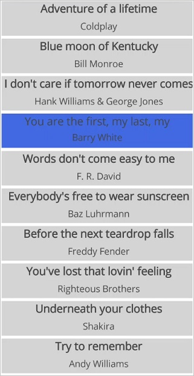
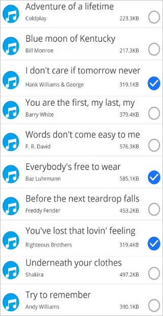
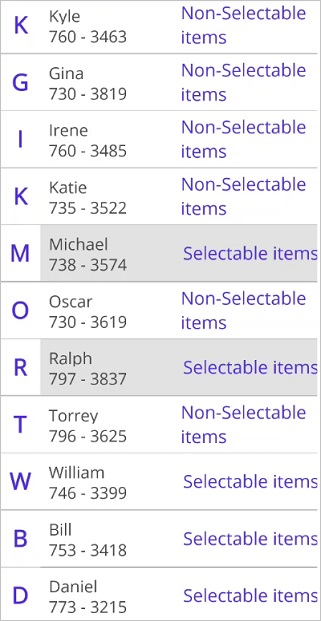

# Selection in .NET MAUI ListView (SfListView)

This section explains how to perform selection and its related operations in the `.NET MAUI ListView` (SfListView).

## UI selection

The [.NET MAUI ListView](https://www.syncfusion.com/maui-controls/maui-listview) (SfListView) allows you to select items either programmatically or touch interactions by setting the [SfListView.SelectionMode](https://help.syncfusion.com/cr/maui/Syncfusion.Maui.ListView.SfListView.html#Syncfusion_Maui_ListView_SfListView_SelectionMode) property value something other than `None`. The control has different selection modes to perform selection operations listed as follows:

 * [None](https://help.syncfusion.com/cr/maui/Syncfusion.Maui.ListView.SelectionMode.html#Syncfusion_Maui_ListView_SelectionMode_None): Allows disabling selection.
 * [Single](https://help.syncfusion.com/cr/maui/Syncfusion.Maui.ListView.SelectionMode.html#Syncfusion_Maui_ListView_SelectionMode_Single): Allows selecting single item only. When clicking the selected item, selection will not be cleared. This is the default value for `SelectionMode`.
 * [SingleDeselect](https://help.syncfusion.com/cr/maui/Syncfusion.Maui.ListView.SelectionMode.html#Syncfusion_Maui_ListView_SelectionMode_SingleDeselect): Allows selecting single item only. When clicking the selected item, selection gets cleared.
 * [Multiple](https://help.syncfusion.com/cr/maui/Syncfusion.Maui.ListView.SelectionMode.html#Syncfusion_Maui_ListView_SelectionMode_Multiple): Allows selecting more than one item. Selection is not cleared when selecting more than one items. When clicking the selected item, selection gets cleared.
 * Extended: Allows selecting multiple items with advanced keyboard and mouse interactions. Use Shift to select ranges and use Ctrl on Windows or Command on macOS to toggle items. Available only on Windows and macOS.

The `SfListView` allows selecting items on different gestures such as tap, double tap, and hold by setting the [SfListView.SelectionGesture](https://help.syncfusion.com/cr/maui/Syncfusion.Maui.ListView.SfListView.html#Syncfusion_Maui_ListView_SfListView_SelectionGesture). The default value for the `SelectionGesture` is [TouchGesture.Tap](https://help.syncfusion.com/cr/maui/Syncfusion.Maui.ListView.TouchGesture.html#Syncfusion_Maui_ListView_TouchGesture_Tap).



 <syncfusion:SfListView x:Name="listView"
                        ItemsSource="{Binding MusicInfo}"
                        SelectionMode="Multiple"
                        SelectionGesture="LongPress"/>
                     

listView.SelectionMode = SelectionMode.Multiple;
listView.SelectionGesture = TouchGesture.LongPress;



## Programmatic selection

When the [SfListView.SelectionMode](https://help.syncfusion.com/cr/maui/Syncfusion.Maui.ListView.SfListView.html#Syncfusion_Maui_ListView_SfListView_SelectionMode) is other than `None`, the item or items in the `SfListView` can be selected from the code by setting the [SfListView.SelectedItem](https://help.syncfusion.com/cr/maui/Syncfusion.Maui.ListView.SfListView.html#Syncfusion_Maui_ListView_SfListView_SelectedItem), or adding items to the [SfListView.SelectedItems](https://help.syncfusion.com/cr/maui/Syncfusion.Maui.ListView.SfListView.html#Syncfusion_Maui_ListView_SfListView_SelectedItems) property based on the `SelectionMode`.

When the selection mode is `Single`, programmatically select an item by setting the underlying object to the `SfListView.SelectedItem` property. 



//Perform selection using selected item
listView.SelectedItem = viewModel.Items[5];



When the selection mode is `Multiple`, programmatically select more than one item by adding the underlying object to the `SfListView.SelectedItems` property. 


 

//Perform multiple selection using selected items
public class SelectionViewModel : INotifyPropertyChanged
{
    private ObservableCollection<object> selectedItems;
    private ObservableCollection<MusicInfo> musicInfo;

    public SelectionViewModel()
    {
        GenerateSource();
        SelectedItems = new ObservableCollection<object>();
    }

    public ObservableCollection<MusicInfo> MusicInfo
    {
        get { return musicInfo; }
        set { this.musicInfo = value; }
    }

    public ObservableCollection<object> SelectedItems
    {
        get { return selectedItems; }
        set { this.selectedItems = value; }
    }
    private async void GenerateSource()
    {
        var random = new Random();
        for (int i = 0; i < SongsNames.Count(); i++)
        {
            var info = new MusicInfo()
            {
                SongTitle = SongsNames[i],
                SongAuther = SongAuthers[i],
                SongSize = random.Next(50, 600).ToString() + "." + random.Next(1, 10) / 2 + "KB",
                SongThumbnail = ImageSource.FromResource("ListViewMaui.Images.SongThumbnail.png"),
            };
            musicInfo.Add(info);
        }
        SelectedItems.Add(MusicInfo[0]);
    }
}

listView.SelectedItems.Add (viewModel.MusicInfo [4]);
listView.SelectedItems.Add (viewModel.MusicInfo[5]);



N> The `SfListView.SelectedItems` property is of type `ObservableCollection<Object>`. Therefore, it is recommended to utilize a ViewModel collection property with the same type, `ObservableCollection<Object>`, to ensure proper functioning of the `SelectedItems` property.



<syncfusion:SfListView x:Name="listView" ItemsSource="{Binding MusicInfo}" SelectedItems="{Binding SelectedItems}">
</syncfusion:SfListView>



All items of the `SfListView` can be selected using the [SelectAll](https://help.syncfusion.com/cr/maui/Syncfusion.Maui.ListView.SfListView.html#Syncfusion_Maui_ListView_SfListView_SelectAll) method.


 
listView.SelectAll();



N>When you programmatically select an item, then the selection related `events` are not be triggered. It triggers only by UI interactions.
However, get the notification from the SelectedItems collection changed event, which will be triggered when you add an item at runtime.

## Selected items

### Get selected items

The `SfListView` gets all the selected items using the [SfListView.SelectedItems](https://help.syncfusion.com/cr/maui/Syncfusion.Maui.ListView.SfListView.html#Syncfusion_Maui_ListView_SfListView_SelectedItems) property and gets the single item by using the [SfListView.SelectedItem](https://help.syncfusion.com/cr/maui/Syncfusion.Maui.ListView.SfListView.html#Syncfusion_Maui_ListView_SfListView_SelectedItem) property.

### Clear selected items

The selected items can be cleared by calling the `SelectedItems.Clear()` method.



listView.SelectedItems.Clear();



### CurrentItem vs SelectedItem

The `SfListView` gets the selected item by using the [SfListView.SelectedItem](https://help.syncfusion.com/cr/maui/Syncfusion.Maui.ListView.SfListView.html#Syncfusion_Maui_ListView_SfListView_SelectedItem) and [SfListView.CurrentItem](https://help.syncfusion.com/cr/maui/Syncfusion.Maui.ListView.SfListView.html#Syncfusion_Maui_ListView_SfListView_CurrentItem) properties. Both `SfListView.SelectedItem` and `SfListView.CurrentItem` return the same data object when selecting a single item. When selecting more than one item, the `SfListView.SelectedItem` property returns the first selected item, and the `SfListView.CurrentItem` property returns the last selected item.

W> If you select an item when [SfListView.SelectionMode](https://help.syncfusion.com/cr/maui/Syncfusion.Maui.ListView.SfListView.html#Syncfusion_Maui_ListView_SfListView_SelectionMode) is `None` or if you select multiple items when `SfListView.SelectionMode` is `Single`, exception will be thrown.

## Selected item customization 

The .NET MAUI ListView (SfListView) supports customizing the selection background color for the selected items by using the [SfListView.SelectedItemTemplate](https://help.syncfusion.com/cr/maui/Syncfusion.Maui.ListView.SfListView.html#Syncfusion_Maui_ListView_SfListView_SelectedItemTemplate), if the background color is set to view loaded in the [SfListView.ItemTemplate](https://help.syncfusion.com/cr/maui/Syncfusion.Maui.ListView.SfListView.html#Syncfusion_Maui_ListView_SfListView_ItemTemplate).



<ContentPage xmlns:syncfusion="clr-namespace:Syncfusion.Maui.ListView;assembly=Syncfusion.Maui.ListView">
  <syncfusion:SfListView x:Name="listView" ItemsSource="{Binding MusicInfo}">
   <syncfusion:SfListView.SelectedItemTemplate>
    <DataTemplate>
     <Grid x:Name="grid" BackgroundColor="RoyalBlue">
      <Grid.RowDefinitions>
         <RowDefinition Height="*" />
         <RowDefinition Height="*" />
         <RowDefinition Height="1" />
       </Grid.RowDefinitions>
      <Label Text="{Binding SongTitle}" />
      <Label Text="{Binding SongAuther}" Grid.Row="1"/>
      <Frame Grid.Row="2" HasShadow="True" HeightRequest="1"/>
     </Grid>
    </DataTemplate>
   </syncfusion:SfListView.SelectedItemTemplate>
  </syncfusion:SfListView>
</ContentPage>


 listView.SelectedItemTemplate = new DataTemplate(() =>
{
  var grid = new Grid();
  grid.RowDefinitions.Add(new RowDefinition { Height = new GridLength(1, GridUnitType.Star) });
  grid.RowDefinitions.Add(new RowDefinition { Height = new GridLength(1, GridUnitType.Star) });
  grid.RowDefinitions.Add(new RowDefinition { Height = new GridLength(1) });
  grid.BackgroundColor = Colors.RoyalBlue;
  var songTitle = new Label();
  songTitle.SetBinding(Label.TextProperty, new Binding("SongTitle"));
  var songAuthor = new Label();
  songAuthor.SetBinding(Label.TextProperty, new Binding("songAuthor"));
  var frame = new Frame()
  {
    HeightRequest = 1,
    HasShadow = true,
  };
  grid.Children.Add(songTitle);
  grid.Children.Add(songAuthor);
  grid.Children.Add(frame);
  grid.SetRow(songTitle, 0);
  grid.SetRow(songAuthor, 1);
  grid.SetRow(frame, 2);
  return grid;
});



### Show checked circle on selected items 

To customize the appearance of the selected item or items, use the appearance of [SfListView.SelectedItemTemplate](https://help.syncfusion.com/cr/maui/Syncfusion.Maui.ListView.SfListView.html#Syncfusion_Maui_ListView_SfListView_SelectedItemTemplate). The following customizations should give you an idea to customize the appearance of selected items in the control.



<ContentPage xmlns:syncfusion="clr-namespace:Syncfusion.Maui.ListView;assembly=Syncfusion.Maui.ListView">
  <syncfusion:SfListView x:Name="listView" ItemsSource="{Binding MusicInfo}">
   <syncfusion:SfListView.SelectedItemTemplate>
    <DataTemplate>
     <Grid x:Name="grid">
      <Grid.ColumnDefinitions>
       <ColumnDefinition Width="40" />
       <ColumnDefinition Width="*" />    
       <ColumnDefinition Width="Auto" />
      </Grid.ColumnDefinitions>
      <Image Source="{Binding SongThumbnail}"/>
      <Grid Grid.Column="1">
       <Grid.RowDefinitions>
        <RowDefinition Height="*" />
        <RowDefinition Height="*" />
       </Grid.RowDefinitions>
       <Label Text="{Binding SongTitle}" />
       <Grid Grid.Row="1">
        <Grid.ColumnDefinitions>
         <ColumnDefinition Width="*" />
         <ColumnDefinition Width="*" />
        </Grid.ColumnDefinitions>
        <Label Text="{Binding SongAuther}" />
        <Label Grid.Column="1" Text="{Binding SongSize}"/>
       </Grid>
      </Grid>
      <Image Grid.Column="2" x:Name="selectionImage" IsVisible="True" Source="Selected.png"/>
     </Grid>
    </DataTemplate>
   </syncfusion:SfListView.SelectedItemTemplate>
  </syncfusion:SfListView>
</ContentPage>


listView.SelectedItemTemplate = new DataTemplate(() =>
{
  var grid1 = new Grid();
  grid1.ColumnDefinitions.Add(new ColumnDefinition { Width = new GridLength(40) });
  grid1.ColumnDefinitions.Add(new ColumnDefinition { Width = new GridLength(1, GridUnitType.Star) });
  grid1.ColumnDefinitions.Add(new ColumnDefinition { Width = new GridLength(1, GridUnitType.Auto) });
  var songThumbnail = new Image();
  songThumbnail.SetBinding(Image.SourceProperty, new Binding("SongThumbnail"));
  var grid2 = new Grid();
  grid2.RowDefinitions.Add(new RowDefinition { Height = new GridLength(1, GridUnitType.Star) });
  grid2.RowDefinitions.Add(new RowDefinition { Height = new GridLength(1, GridUnitType.Star) });
  grid2.Padding = new Thickness(15, 0, 0, 0);
  var songTitle = new Label();
  songTitle.SetBinding(Label.TextProperty, new Binding("SongTitle"));
  var grid3 = new Grid();
  grid3.ColumnDefinitions.Add(new ColumnDefinition { Width = new GridLength(1, GridUnitType.Star) });
  grid3.ColumnDefinitions.Add(new ColumnDefinition { Width = new GridLength(1, GridUnitType.Star) });
  var songAuthor = new Label();
  songAuthor.SetBinding(Label.TextProperty, new Binding("songAuthor"));
  var songSize = new Label();
  songSize.SetBinding(Label.TextProperty, new Binding("SongSize"));
  grid3.Children.Add(songAuthor);
  grid3.Children.Add(songSize, 1, 0);
  grid2.Children.Add(songTitle);
  grid2.Children.Add(grid3, 0, 1);
  var selectionImage = new Image()
  {
    IsVisible = true,
    Source = "Selected.png"
  };
  grid1.Children.Add(songThumbnail);
  grid1.Children.Add(grid2, 1, 0);
  grid1.Children.Add(selectionImage, 2, 0);
  return grid1;
});



## Selected item style

### Selection background

The `SfListView` allows you to change the selection background color for the selected items by using the [SfListView.SelectionBackground](https://help.syncfusion.com/cr/maui/Syncfusion.Maui.ListView.SfListView.html#Syncfusion_Maui_ListView_SfListView_SelectionBackground) property.



 <syncfusion:SfListView x:Name="listView" 
                        ItemsSource="{Binding MusicInfo}"
                        SelectionBackground="Khaki"/>


listView.SelectionBackground = Colors.Khaki;



### Programmatic animation

The SfListView allows programmatic animation in selection at runtime by using the virtual method `AnimateSelectedItem` of `SelectionController` class.



 <syncfusion:SfListView x:Name="listView" ItemsSource="{Binding Items}"
             SelectionBackground="#f5e8d5">


listView.SelectionController = new SelectionControllerExt(listView);

public class SelectionControllerExt : SelectionController
{
   public SelectionControllerExt(SfListView listView) : base(listView)
   {
   }
   
   protected override void AnimateSelectedItem(ListViewItem selectedListViewItem)
   {
      base.AnimateSelectedItem(selectedListViewItem);
      selectedListViewItem.Opacity = 0;
      selectedListViewItem.FadeTo(1, 3000, Easing.SinInOut);
   }
}



## Events

### SelectionChanging event

The [SelectionChanging](https://help.syncfusion.com/cr/maui/Syncfusion.Maui.ListView.SfListView.html#Syncfusion_Maui_ListView_SfListView_SelectionChanging) event is triggered when an item is selected at the execution time. [ItemSelectionChangingEventArgs](https://help.syncfusion.com/cr/maui/Syncfusion.Maui.ListView.ItemSelectionChangingEventArgs.html) contains the following members, which provide the information for `SelectionChanging` event:

 * [AddedItems](https://help.syncfusion.com/cr/maui/Syncfusion.Maui.ListView.ItemSelectionChangingEventArgs.html#Syncfusion_Maui_ListView_ItemSelectionChangingEventArgs_AddedItems): Gets collection of the underlying data objects where the selection is going to be processed.
 * [RemovedItems](https://help.syncfusion.com/cr/maui/Syncfusion.Maui.ListView.ItemSelectionChangingEventArgs.html#Syncfusion_Maui_ListView_ItemSelectionChangingEventArgs_RemovedItems): Gets collection of the underlying data objects where the selection is going to be removed.

You can cancel the selection process within this event by setting the `ItemSelectionChangingEventArgs.Cancel` property to `true`.

The `SelectionChanging` event is used for the following use case:

 * Disable the selection of the particular item based on the underlying data.



listView.SelectionChanging += ListView_SelectionChanging;  

private void ListView_SelectionChanging(object sender, ItemSelectionChangingEventArgs e)
{
  if (e.AddedItems.Count > 0 && e.AddedItems[0] == ViewModel.Items[0])
      e.Cancel = true;
}



### SelectionChanged event

The [SelectionChanged](https://help.syncfusion.com/cr/maui/Syncfusion.Maui.ListView.SfListView.html#Syncfusion_Maui_ListView_SfListView_SelectionChanged) event will occur once selection process has been completed for the selected item in the `SfListView`. [ItemSelectionChangedEventArgs](https://help.syncfusion.com/cr/maui/Syncfusion.Maui.ListView.ItemSelectionChangedEventArgs.html) contains the following members, which provides information for `SelectionChanged` event:

 * [AddedItems](https://help.syncfusion.com/cr/maui/Syncfusion.Maui.ListView.ItemSelectionChangedEventArgs.html#Syncfusion_Maui_ListView_ItemSelectionChangedEventArgs_AddedItems): Gets collection of the underlying data objects where the selection has been processed.
 * [RemovedItems](https://help.syncfusion.com/cr/maui/Syncfusion.Maui.ListView.ItemSelectionChangedEventArgs.html#Syncfusion_Maui_ListView_ItemSelectionChangedEventArgs_RemovedItems): Gets collection of the underlying data objects where the selection has been removed.

The `SelectionChanged` event is used for the following use cases:
 
  * Clears all the selected item.
  * Removes the particular selected item.
  * Gets the index of the selected item.



listView.SelectionChanged += ListView_OnSelectionChanged;  

private void ListView_OnSelectionChanged(object sender, ItemSelectionChangedEventArgs e)
{
   listView.SelectedItems.Clear();
}



N> [SelectionChanging](https://help.syncfusion.com/cr/maui/Syncfusion.Maui.ListView.SfListView.html#Syncfusion_Maui_ListView_SfListView_SelectionChanging) and [SelectionChanged](https://help.syncfusion.com/cr/maui/Syncfusion.Maui.ListView.SfListView.html#Syncfusion_Maui_ListView_SfListView_SelectionChanged) events will be triggered only on UI interactions.

## Commands

### SelectionChangedCommand

The [SelectionChangedCommand](https://help.syncfusion.com/cr/maui/Syncfusion.Maui.ListView.SfListView.html#Syncfusion_Maui_ListView_SfListView_SelectionChangedCommand) will be triggered when the selection is changed and the [SelectionChangedCommandParameter](https://help.syncfusion.com/cr/maui/Syncfusion.Maui.ListView.SfListView.html#Syncfusion_Maui_ListView_SfListView_SelectionChangedCommandParameterProperty) is passed as a parameter.The default value of `SelectionChangedCommandParameter` is `Null`. If `SelectionChangedCommandParameter` is not defined then `ItemSelectionChangedEventArgs` will be passed as argument.




<ContentPage  xmlns:syncfusion="clr-namespace:Syncfusion.Maui.ListView;assembly=Syncfusion.Maui.ListView">
  <syncfusion:SfListView x:Name="listView"
   SelectionChangedCommand="{Binding ListViewSelectionChangedCommand}"
   SelectionChangedCommandParameter="{x:Reference listView}"
   ItemsSource="{Binding BookInfo}"
   ItemSize="100">
  </syncfusion:SfListView>  
</ContentPage>




public class CommandViewModel
{
  private Command<Object> selectionChangedCommand;
  public Command<object> ListViewSelectionChangedCommand
  {
    get { return selectionChangedCommand; }
    set { selectionChangedCommand = value; }
  }
  public CommandViewModel()
  {
    ListViewSelectionChangedCommand = new Command<object>(SelectionChangedCommandMethod);
  }
  private void SelectionChangedCommandMethod(object obj)
  {
    var listView = obj as SfListView;
    DisplayAlert("Message", (listView.SelectedItem as Contacts).ContactName + " is selected", "OK");
  }
}




## How to

### Disable selection on particular item 

The selection of a particular set of items can be disabled based on the [SfListView.SelectedItems](https://help.syncfusion.com/cr/maui/Syncfusion.Maui.ListView.SfListView.html#Syncfusion_Maui_ListView_SfListView_SelectedItems) of the underlying collections. 



public partial class MainPage : ContentPage
{
  public MainPage()
  {
    InitializeComponent();
  }

  private void listView_SelectionChanging(object sender, ItemSelectionChangingEventArgs e)
  {
  if (e.AddedItems.Count > 0 && (e.AddedItems[0] as Contacts).Category == "Non-Selectable items")
      e.Cancel = true;
  }
}



### Automatically scroll to bring a selected item into the view

To bring the [SfListView.SelectedItem](https://help.syncfusion.com/cr/maui/Syncfusion.Maui.ListView.SfListView.html#Syncfusion_Maui_ListView_SfListView_SelectedItem) automatically into the view when it changes at runtime by calling the [ScrollToRowIndex](https://help.syncfusion.com/cr/maui/Syncfusion.Maui.ListView.ListViewLayout.html#Syncfusion_Maui_ListView_ListViewLayout_ScrollToRowIndex_System_Int32_Microsoft_Maui_Controls_ScrollToPosition_System_Boolean_) method.  

In linear layout, you can get the row index of `SfListView.SelectedItem` and  resolve if header and group header are used.



public partial class MainPage : ContentPage
{
  public MainPage()
  {
    InitializeComponent();
    listView.PropertyChanged += listView_PropertyChanged;
  }

  private void listView_PropertyChanged(object sender, PropertyChangedEventArgs e)
  {
    if (e.PropertyName == "SelectedItem")
    {
       var selectedItemIndex = listView.DataSource.DisplayItems.IndexOf(listView.SelectedItem);
       selectedItemIndex += (listView.HeaderTemplate != null && !listView.IsStickyHeader || !listView.IsStickyGroupHeader) ? 1 : 0;
       selectedItemIndex -= (listView.GroupHeaderTemplate != null && listView.IsStickyGroupHeader) ? 1 : 0;
       (listView.ItemsLayout as LinearLayout).ScrollToRowIndex(selectedItemIndex);
    }
  }
}



### Gets the index of selected item

When performing selection, you can get the index of the selected item by using the [SelectionChanged](https://help.syncfusion.com/cr/maui/Syncfusion.Maui.ListView.SfListView.html#Syncfusion_Maui_ListView_SfListView_SelectionChanged) event from the [DataSource.DisplayItems](https://help.syncfusion.com/cr/maui/Syncfusion.Maui.DataSource.DisplayItems.html). 



public partial class MainPage : ContentPage
{
  public MainPage()
  {
    InitializeComponent();
    listView.SelectionChanged += ListView_SelectionChanged;
  }

  private void ListView_SelectionChanged(object sender, ItemSelectionChangedEventArgs e)
  {
    var items = e.AddedItems;
    var index = listView.DataSource.DisplayItems.IndexOf(items[0]);
    entry.Text = index.ToString();
  }
}



### Display selection when ItemTemplate contains image

When [ItemTemplate](https://help.syncfusion.com/cr/maui/Syncfusion.Maui.ListView.SfListView.html#Syncfusion_Maui_ListView_SfListView_ItemTemplate) contains only images, then the selection color will not be visible in the view when an image is selected. To see selection, add any layout such as `Grid` or `StackLayout` above the image, and set margin or padding to it.



<ContentPage  xmlns:syncfusion="clr-namespace:Syncfusion.Maui.ListView;assembly=Syncfusion.Maui.ListView">
  <syncfusion:SfListView
   ItemsSource="{Binding BookInfo}"
   ItemSize="100">  
    <syncfusion:SfListView.ItemTemplate>  
        <DataTemplate>  
            <Grid Margin="10">  
                <Image Source="{Binding Image}" Aspect="Fill"/>  
            </Grid>  
        </DataTemplate>  
    </syncfusion:SfListView.ItemTemplate>  
</syncfusion:SfListView>  
</ContentPage>


public partial class MainPage : ContentPage
{
    SfListView listView;
    public MainPage()
    {
        InitializeComponent();
        listView = new SfListView();
        listView.ItemSize = 100;
        listView.ItemsSource = viewModel.BookInfo;
        listView.ItemTemplate = new DataTemplate(() =>
        {
            var grid = new Grid() { Margin = 10 };
            var image = new Image() { Aspect = Aspect.Fill};
            image.SetBinding(Image.SourceProperty, new Binding("Image"));
            grid.Children.Add(image);
            return grid;
        });
        this.Content = listView;
    }
}



## Limitation

* When a grid is loaded inside the [ItemTemplate](https://help.syncfusion.com/cr/maui/Syncfusion.Maui.ListView.SfListView.html#Syncfusion_Maui_ListView_SfListView_ItemTemplate) with background color, the [SelectionBackground](https://help.syncfusion.com/cr/maui/Syncfusion.Maui.ListView.SfListView.html#Syncfusion_Maui_ListView_SfListView_SelectionBackground) will not display. Because, it overlaps the `SelectionBackground`. In this case, set the background color for the ListView instead of `ItemTemplate`.
* When the `SfListView` contains duplicated items in the collection, only the first item whose instance was created initially will be selected or deselected.

## See also 

[How to change selected image in .NET MAUI ListView (SfListView)](https://support.syncfusion.com/kb/article/11586/how-to-change-selected-image-in-net-maui-listview-sflistview)