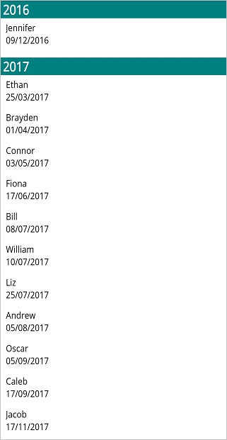
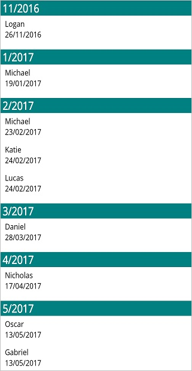

# Sorting in .NET MAUI ListView (SfListView)

The `SfListView` supports sorting the data either in ascending or descending order by using the [DataSource.SortDescriptors](https://help.syncfusion.com/cr/maui/Syncfusion.Maui.DataSource.DataSource.html#Syncfusion_DataSource_DataSource_SortDescriptors) property or custom logic.

To get start quickly with sorting in .NET MAUI ListView, you can check on this video:
 <iframe id='MAUIListViewSortingVideoTutorial' src='https://www.youtube.com/embed/IedulwH4h4c'></iframe>

N> When the `ItemsSource` is changed for a `SfListView`, `DataSource.SortDescriptors` will be cleared by default. You need to add `DataSource.SortDescriptors` again after changing the `ItemsSource`, if you want to retain sorting in the `SfListView`.

N> To sort the newly added `SfListView` items at runtime, set the [SfListView.DataSource.LiveDataUpdateMode](https://help.syncfusion.com/cr/maui/Syncfusion.Maui.DataSource.LiveDataUpdateMode.html) to [LiveDataUpdateMode.AllowDataShaping](https://help.syncfusion.com/cr/maui/Syncfusion.Maui.DataSource.LiveDataUpdateMode.html#Syncfusion_Maui_DataSource_LiveDataUpdateMode_AllowDataShaping). 

## Programmatic sorting

Sort data by creating a [SortDescriptor](https://help.syncfusion.com/cr/maui/Syncfusion.Maui.DataSource.SortDescriptor.html) with the required property name and direction and adding it to the [DataSource.SortDescriptors](https://help.syncfusion.com/cr/maui/Syncfusion.Maui.DataSource.DataSource.html#Syncfusion_DataSource_DataSource_SortDescriptors) property.

`SortDescriptor` object holds the following three properties:

* [PropertyName](https://help.syncfusion.com/cr/maui/Syncfusion.Maui.DataSource.SortDescriptor.html#Syncfusion_Maui_DataSource_SortDescriptor_PropertyName): Describes the name of the sorted property.
* [Direction](https://help.syncfusion.com/cr/maui/Syncfusion.Maui.DataSource.SortDescriptor.html#Syncfusion_Maui_DataSource_SortDescriptor_Direction): Describes an object of type [ListSortDirection](https://help.syncfusion.com/cr/maui/Syncfusion.DataSource.ListSortDirection.html) that defines the sorting direction. Supported values are `Ascending` and `Descending`.
* [Comparer](https://help.syncfusion.com/cr/maui/Syncfusion.Maui.DataSource.SortDescriptor.html#Syncfusion_Maui_DataSource_SortDescriptor_Comparer): Describes the comparer to be applied when sorting takes place. The type is `IComparer<object>` (from the `System.Collections.Generic` namespace), and `IComparer<object>` is also re-exported by the `Syncfusion.Maui.DataSource` namespace. You must `using System.Collections.Generic;` (or qualify the type) when implementing a custom comparer.



<ContentPage  xmlns:syncfusion="clr-namespace:Syncfusion.Maui.ListView;assembly=Syncfusion.Maui.ListView"
               xmlns:data="clr-namespace:Syncfusion.Maui.DataSource;assembly=Syncfusion.Maui.DataSource" >
  <syncfusion:SfListView x:Name="listView">
            <syncfusion:SfListView.DataSource>
                <data:DataSource>
                    <data:DataSource.SortDescriptors>
                        <data:SortDescriptor PropertyName="ContactName" Direction="Ascending"/>
                    </data:DataSource.SortDescriptors>
                </data:DataSource>
            </syncfusion:SfListView.DataSource>
  </syncfusion:SfListView>
</ContentPage>


listView.DataSource.SortDescriptors.Add(new SortDescriptor()
{
  PropertyName = "ContactName",
  Direction = ListSortDirection.Ascending,
}); 
listView.RefreshView();



N> It is mandatory to specify the `PropertyName` of `SortDescriptor`.

N> **Live update behavior:** By default, changes to the underlying collection (for example, items added, removed, or modified through `INotifyCollectionChanged` / `INotifyPropertyChanged`) are not re-sorted automatically. To re-apply the current sort order when items are added or modified at runtime, set [SfListView.DataSource.LiveDataUpdateMode](https://help.syncfusion.com/cr/maui/Syncfusion.Maui.DataSource.LiveDataUpdateMode.html) to [LiveDataUpdateMode.AllowDataShaping](https://help.syncfusion.com/cr/maui/Syncfusion.Maui.DataSource.LiveDataUpdateMode.html#Syncfusion_Maui_DataSource_LiveDataUpdateMode_AllowDataShaping). After toggling `LiveDataUpdateMode` at runtime, call `listView.RefreshView();` to apply the change.

## Custom sorting

Sort the items based on custom logic. This can be applied using either the [SfListView.DataSource.SortComparer](https://help.syncfusion.com/cr/maui/Syncfusion.Maui.DataSource.DataSource.html#Syncfusion_Maui_DataSource_DataSource_SortComparer) property or the [SortDescriptor.Comparer](https://help.syncfusion.com/cr/maui/Syncfusion.Maui.DataSource.SortDescriptor.html#Syncfusion_DataSource_SortDescriptor_Comparer), which is added to the [DataSource.SortDescriptors](https://help.syncfusion.com/cr/maui/Syncfusion.Maui.DataSource.DataSource.html#Syncfusion_DataSource_DataSource_SortDescriptors) collection.

N> If the `PropertyName` in the [SortDescriptor](https://help.syncfusion.com/cr/maui/Syncfusion.Maui.DataSource.SortDescriptor.html) and the `GroupDescriptor` are the same, then the [GroupResult](https://help.syncfusion.com/cr/maui/Syncfusion.DataSource.Extensions.GroupResult.html) will be passed as parameters for the `SortDescriptor.Comparer`. Otherwise, data objects are passed. To sort the data items alone, use a different `PropertyName` in both the `SortDescriptor` and the `GroupDescriptor` properties.



<ContentPage  xmlns:syncfusion="clr-namespace:Syncfusion.Maui.ListView;assembly=Syncfusion.Maui.ListView"
               xmlns:data="clr-namespace:Syncfusion.Maui.DataSource;assembly=Syncfusion.Maui.DataSource">
  <ContentPage.Resources>
    <ResourceDictionary>
      <local:CustomSortComparer x:Key="CustomSortComparer" />
    </ResourceDictionary>
  </ContentPage.Resources>
  <syncfusion:SfListView x:Name="listView">
    <syncfusion:SfListView.DataSource>
      <data:DataSource>
        <data:DataSource.SortDescriptors>
          <data:SortDescriptor Comparer="{StaticResource CustomSortComparer}"/>
        </data:DataSource.SortDescriptors>
      </data:DataSource>
    </syncfusion:SfListView.DataSource>
  </syncfusion:SfListView>
</ContentPage>


listView.DataSource.SortDescriptors.Add(new SortDescriptor()
{
  Comparer = new CustomSortComparer()
});
listView.RefreshView();





using System.Collections.Generic;
using Syncfusion.Maui.DataSource;

namespace CustomSortingSample
{
    public class CustomSortComparer : IComparer<object>
    {
        public int Compare(object x, object y)
        {
            if (x is GroupResult)
            {
                return 0;
            }
            else if (x is ListViewContactsInfo)
            {
                var xitem = (x as ListViewContactsInfo).ContactName;
                var yitem = (y as ListViewContactsInfo).ContactName;

                if (xitem.Length > yitem.Length)
                {
                    return 1;
                }
                else if (xitem.Length < yitem.Length)
                {
                    return -1;
                }
                else
                {
                    if (string.Compare(xitem, yitem) == -1)
                        return -1;
                    else if (string.Compare(xitem, yitem) == 1)
                        return 1;
                }
            }

            return 0;
        }
    }
}



You can download the entire sample code from the [github](https://github.com/SyncfusionExamples/custom-sorting-.net-maui-listview).

## Sorting items when the header is tapped

To apply sorting when the header is tapped, handle the [ItemTapped](https://help.syncfusion.com/cr/maui/Syncfusion.Maui.ListView.SfListView.html#Syncfusion_Maui_ListView_SfListView_ItemTapped) event of the `SfListView`. The handler receives an [ItemTappedEventArgs](https://help.syncfusion.com/cr/maui/Syncfusion.Maui.ListView.ItemTappedEventArgs.html) whose [ItemType](https://help.syncfusion.com/cr/maui/Syncfusion.Maui.ListView.ItemTappedEventArgs.html#Syncfusion_Maui_ListView_ItemTappedEventArgs_ItemType) property indicates which item was tapped (`Header`, `Footer`, `GroupHeader`, `LoadMore`, or `Record`).



<ContentPage xmlns:syncfusion="clr-namespace:Syncfusion.Maui.ListView;assembly=Syncfusion.Maui.ListView"
               xmlns:data="clr-namespace:Syncfusion.Maui.DataSource;assembly=Syncfusion.Maui.DataSource">
  <syncfusion:SfListView x:Name="listView" ItemSize="60"
                        ItemsSource="{Binding customerDetails}" 
                        ItemTapped="ListView_ItemTapped" 
                        IsStickyHeader="True">
    <syncfusion:SfListView.HeaderTemplate>
      <DataTemplate>
            <StackLayout BackgroundColor="Teal">
              <Label TextColor="White" FontSize="20" FontAttributes="Bold" Text="CustomerDetails" />
            </StackLayout>
      </DataTemplate>
    </syncfusion:SfListView.HeaderTemplate>
  </syncfusion:SfListView>
</ContentPage>


listView = new SfListView();
listView.ItemsSource = viewModel.customerDetails;
listView.ItemSize = 60;
listView.ItemTapped += ListView_ItemTapped;
listView.IsStickyHeader = true;
listView.HeaderTemplate = new DataTemplate(() => 
{
  var stackLayout = new StackLayout { BackgroundColor = Colors.Teal };
  var label = new Label { Text = "CustomerDetails", TextColor = Colors.White, 
                          FontAttributes = FontAttributes.Bold, FontSize = 20 };
  stackLayout.Children.Add(label);
  return stackLayout;
});



When the `ItemTapped` event is raised for the header, add the [SortDescriptor](https://help.syncfusion.com/cr/maui/Syncfusion.Maui.DataSource.SortDescriptor.html) and refresh the view.



private void ListView_ItemTapped(object sender, ItemTappedEventArgs e)
{
  //Apply sorting when the header is tapped.
  if (e.ItemType == ItemType.Header && listView.IsStickyHeader)
  {
    //Toggle the sort direction on each header tap.
    var direction = listView.DataSource.SortDescriptors.Count > 0 &&
                    listView.DataSource.SortDescriptors[0].Direction == ListSortDirection.Ascending
                        ? ListSortDirection.Descending
                        : ListSortDirection.Ascending;

    listView.DataSource.SortDescriptors.Clear();
    listView.DataSource.SortDescriptors.Add(new SortDescriptor()
    {
      PropertyName = "ContactName",
      Direction = direction
    });
    listView.RefreshView();
  }
}



## Sorting items along with grouping
 
The `SfListView` allows sorting and grouping the items by adding the [DataSource.GroupDescriptors](https://help.syncfusion.com/cr/maui/Syncfusion.Maui.DataSource.DataSource.html#Syncfusion_DataSource_DataSource_GroupDescriptors) and the [DataSource.SortDescriptors](https://help.syncfusion.com/cr/maui/Syncfusion.Maui.DataSource.DataSource.html#Syncfusion_DataSource_DataSource_SortDescriptors) with the required property name.

## Sorting with grouping by year

Sort and group the items by using [KeySelector](https://help.syncfusion.com/cr/maui/Syncfusion.Maui.DataSource.GroupDescriptor.html#Syncfusion_Maui_DataSource_GroupDescriptor_KeySelector) to return the year value of the date-time property.



<ContentPage xmlns:syncfusion="clr-namespace:Syncfusion.Maui.ListView;assembly=Syncfusion.Maui.ListView"
               xmlns:data="clr-namespace:Syncfusion.Maui.DataSource;assembly=Syncfusion.Maui.DataSource">
  <ContentPage.Content>
    <syncfusion:SfListView x:Name="listView" ItemsSource="{Binding Items}" ItemSize="50">
      <syncfusion:SfListView.GroupHeaderTemplate>
        <DataTemplate>
          <Grid>
              <Label Text="{Binding Key}" BackgroundColor="Teal" FontAttributes="Bold" TextColor="White"/>
		      </Grid>
        </DataTemplate>
      </syncfusion:SfListView.GroupHeaderTemplate>
    </syncfusion:SfListView>
  </ContentPage.Content>
</ContentPage>


public partial class MainPage : ContentPage
{
   public MainPage()
   {
       InitializeComponent();
       this.BindingContext = new ViewModel();
       listView.ItemSize = 50;
       listView.ItemsSource = viewModel.Items;
       listView.GroupHeaderTemplate = new DataTemplate(() =>
       {
           var grid = new Grid();
           var headerLabel = new Label
           {
               TextColor = Colors.White,
               FontAttributes = FontAttributes.Bold,
               BackgroundColor = Colors.Teal
           };
           headerLabel.SetBinding(Label.TextProperty, new Binding("key"));
           grid.Children.Add(headerLabel);
           return grid;
       });
       listView.DataSource.GroupDescriptors.Add(new GroupDescriptor()
       {
           PropertyName = "DateOfBirth",
           KeySelector = (object obj1) =>
           {
               var item = (obj1 as Contacts);
               return item.DateOfBirth.Year;
           },
       });
       this.listView.DataSource.SortDescriptors.Add(new SortDescriptor()
       {
           PropertyName = "DateOfBirth",
           Direction = ListSortDirection.Ascending
       });
   }
}



The following screenshot shows the output when items are sorted by year. Download the entire source code from GitHub [here](https://github.com/SyncfusionExamples/sorting-and-grouping-.net-maui-listview)

## Sorting with grouping by month and year

Sort and group the items by using `KeySelector` to return the month and year value of the date-time property.



<ContentPage xmlns:syncfusion="clr-namespace:Syncfusion.Maui.ListView;assembly=Syncfusion.Maui.ListView"
              xmlns:data="clr-namespace:Syncfusion.Maui.DataSource;assembly=Syncfusion.Maui.DataSource">
  <ContentPage.Content>
    <syncfusion:SfListView x:Name="listView">
      <syncfusion:SfListView.DataSource>
        <data:DataSource>
        <data:DataSource.GroupDescriptors>
            <data:GroupDescriptor PropertyName="DateOfBirth" />
          </data:DataSource.GroupDescriptors>
          <data:DataSource.SortDescriptors>
            <data:SortDescriptor PropertyName="DateOfBirth" Direction="Ascending"/>
          </data:DataSource.SortDescriptors>
        </data:DataSource>
      </syncfusion:SfListView.DataSource>
    </syncfusion:SfListView>
  </ContentPage.Content>
</ContentPage>


public partial class MainPage : ContentPage
{
   public MainPage()
   {
       InitializeComponent();
       listView.DataSource.GroupDescriptors.Add(new GroupDescriptor()
       {
           PropertyName = "DateOfBirth",
           KeySelector = (object obj1) =>
           {
               var item = (obj1 as Contacts);
               return item.DateOfBirth.Month + "/" + item.DateOfBirth.Year;
           },
           Comparer = new CustomGroupComparer()
       });
       this.listView.DataSource.SortDescriptors.Add(new SortDescriptor()
       {
           PropertyName = "DateOfBirth",
           Direction = ListSortDirection.Ascending
       });
   }
}



The following screenshot shows the output when items are sorted by month and year.

