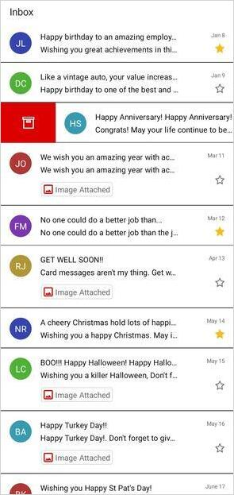
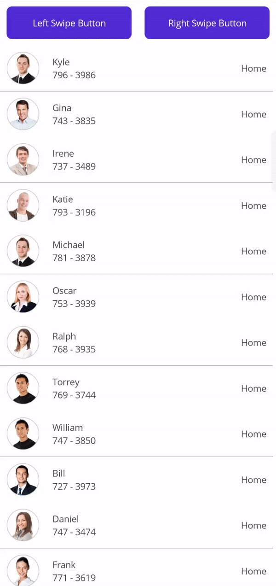

# Swiping in .NET MAUI ListView (SfListView)

## Overview

The `SfListView` allows swiping items to achieve custom actions such as deleting the data, adding the data, editing the data, etc. To enable swiping, set the [SfListView.AllowSwiping](https://help.syncfusion.com/cr/maui/Syncfusion.Maui.ListView.SfListView.html#Syncfusion_Maui_ListView_SfListView_AllowSwiping) property to `true`. Swipe views are displayed when swiping from left to right or right to left (for `Horizontal` orientation, top to bottom, or bottom to top) on the item. 

It provides customizable swipe templates for swiping on the left and right sides. You can restrict the layout of the swipe view up to a certain position when swiping the item by setting the [SfListView.SwipeThreshold](https://help.syncfusion.com/cr/maui/Syncfusion.Maui.ListView.SfListView.html#Syncfusion_Maui_ListView_SfListView_SwipeThreshold) property. You can set the size of the swipe views by setting the [SfListView.SwipeOffset](https://help.syncfusion.com/cr/maui/Syncfusion.Maui.ListView.SfListView.html#Syncfusion_Maui_ListView_SfListView_SwipeOffset) property.

N> When tapping a swiped item, the [SelectionChanging](https://help.syncfusion.com/cr/maui/Syncfusion.Maui.ListView.SfListView.html#Syncfusion_Maui_ListView_SfListView_SelectionChanging) and [SelectionChanged](https://help.syncfusion.com/cr/maui/Syncfusion.Maui.ListView.SfListView.html#Syncfusion_Maui_ListView_SfListView_SelectionChanged) events will not occur since the swiped item is reset at this time.

## Assigning start and end swipe templates

The User Interface (UI) for swiping can be customized by using swipe templates [SfListView.StartSwipeTemplate](https://help.syncfusion.com/cr/maui/Syncfusion.Maui.ListView.SfListView.html#Syncfusion_Maui_ListView_SfListView_StartSwipeTemplate) when swiping towards the right and [SfListView.EndSwipeTemplate](https://help.syncfusion.com/cr/maui/Syncfusion.Maui.ListView.SfListView.html#Syncfusion_Maui_ListView_SfListView_EndSwipeTemplate) when swiping towards the left. The contents inside the swipe template are arranged based on the offset values when swiping an item. You can reset the swiping item or swiped item by calling the [SfListView.ResetSwipeItem](https://help.syncfusion.com/cr/maui/Syncfusion.Maui.ListView.SfListView.html#Syncfusion_Maui_ListView_SfListView_ResetSwipeItem_System_Boolean_) method.



<ContentPage xmlns:syncfusion="clr-namespace:Syncfusion.Maui.ListView;assembly=Syncfusion.Maui.ListView">
  <syncfusion:SfListView x:Name="listView" AllowSwiping="True">
    <syncfusion:SfListView.StartSwipeTemplate>
      <DataTemplate x:Name="StartSwipeTemplate">
        <Grid>
          <Grid BackgroundColor="#009EDA" HorizontalOptions="Fill" VerticalOptions="Fill" Grid.Column="0">
            <Grid VerticalOptions="Center" HorizontalOptions="Center">
              <Image Grid.Column="0"
                    Grid.Row="0"
                    BackgroundColor="Transparent"
                    HeightRequest="35"
                    WidthRequest="35"
                    Source="Favorites.png" />
            </Grid>
          </Grid>
        </Grid>
      </DataTemplate>
    </syncfusion:SfListView.StartSwipeTemplate>
  </syncfusion:SfListView>
</ContentPage>


//Defining start swipe template
listView.StartSwipeTemplate = new DataTemplate(() =>
{
    var grid = new Grid();

    var grid1 = new Grid() { BackgroundColor = Colors.FromHex("#009EDA"), HorizontalOptions = LayoutOptions.Fill, 
                             VerticalOptions = LayoutOptions.Fill };
    var favoriteGrid = new Grid() { HorizontalOptions = LayoutOptions.Center, VerticalOptions = LayoutOptions.Center };
    var favoriteImage = new Image() { BackgroundColor = Colors.Transparent, HeightRequest = 35, WidthRequest = 35 };
    favoriteImage.Source = ImageSource.FromResource("Swiping.Images.Favorites.png");
    favoriteGrid.Children.Add(favoriteImage);
    grid1.Children.Add(favoriteGrid);

    grid.Children.Add(grid1);

    return grid;

});



N> Similarly, the UI for swiping from right to left or bottom to top in vertical or horizontal orientation can be customized by using the [SfListView.EndSwipeTemplate](https://help.syncfusion.com/cr/maui/Syncfusion.Maui.ListView.SfListView.html#Syncfusion_Maui_ListView_SfListView_EndSwipeTemplate).

N> The swipe template is mandatory to perform swiping in the `SfListView`.

Download the entire source code from GitHub [here](https://github.com/SyncfusionExamples/how-to-customize-the-swipe-view-in-.net-maui-listview). 

N> Customize the appearance of each swipe item with different templates based on specific constraints by using the `DataTemplateSelector`. 

## Working with multiple views in swipe template

The swipe templates allow customizing with custom actions such as deleting the data, adding the data, editing the data, etc. by loading multiple views.



<ContentPage xmlns:syncfusion="clr-namespace:Syncfusion.Maui.ListView;assembly=Syncfusion.Maui.ListView">
 <syncfusion:SfListView x:Name="listView" AllowSwiping="True">
  <syncfusion:SfListView.StartSwipeTemplate>
    <DataTemplate x:Name="StartSwipeTemplate">
      <Grid>
        <Grid.ColumnDefinitions>
          <ColumnDefinition Width="*" />
          <ColumnDefinition Width="*" />
        </Grid.ColumnDefinitions>
        <Grid BackgroundColor="#009EDA" HorizontalOptions="Fill" VerticalOptions="Fill" Grid.Column="0">
          <Grid VerticalOptions="Center" HorizontalOptions="Center">
            <Image Grid.Column="0"
                   Grid.Row="0"
                   BackgroundColor="Transparent"
                   HeightRequest="35"
                   WidthRequest="35"
                   BindingContextChanged="leftImage_BindingContextChanged"
                   Source="Favorites.png" />
          </Grid>
        </Grid>
        <Grid BackgroundColor="#DC595F" HorizontalOptions="Fill" VerticalOptions="Fill" Grid.Column="1">
          <Grid VerticalOptions="Center" HorizontalOptions="Center">
            <Image Grid.Column="0"
                   Grid.Row="0"
                   HeightRequest="35"
                   WidthRequest="35"
                   BackgroundColor="Transparent"
                   BindingContextChanged="rightImage_BindingContextChanged"
                   Source="Delete.png" />
          </Grid>
        </Grid>
      </Grid>
    </DataTemplate>
  </syncfusion:SfListView.StartSwipeTemplate>
 </syncfusion:SfListView>
</ContentPage>


listView.StartSwipeTemplate = new DataTemplate(() =>
{
  var grid = new Grid();

  var grid1 = new Grid()
  {
  BackgroundColor = Colors.FromHex("#009EDA"),
  HorizontalOptions = LayoutOptions.Fill,
  VerticalOptions = LayoutOptions.Fill
  };
  var favoriteGrid = new Grid() { HorizontalOptions = LayoutOptions.Center, VerticalOptions = LayoutOptions.Center };
  var favoriteImage = new Image() { BackgroundColor = Colors.Transparent, HeightRequest = 35, WidthRequest = 35 };
  favoriteImage.Source = ImageSource.FromResource("Swiping.Images.Favorites.png");
  favoriteImage.BindingContextChanged += FavoriteImage_BindingContextChanged;
  favoriteGrid.Children.Add(favoriteImage);
  grid1.Children.Add(favoriteGrid);

  var grid2 = new Grid()
  {
  BackgroundColor = Colors.FromHex("#DC595F"),
  HorizontalOptions = LayoutOptions.Fill,
  VerticalOptions = LayoutOptions.Fill
  };
  var deleteGrid = new Grid() { HorizontalOptions = LayoutOptions.Center, VerticalOptions = LayoutOptions.Center };
  var deleteImage = new Image() { BackgroundColor = Colors.Transparent, HeightRequest = 35, WidthRequest = 35 };
  deleteImage.Source = ImageSource.FromResource("Swiping.Images.Delete.png");
  deleteImage.BindingContextChanged += DeleteImage_BindingContextChanged;
  deleteGrid.Children.Add(deleteImage);
  grid1.Children.Add(deleteGrid);

  grid.Children.Add(grid1);
  grid.Children.Add(grid2, 1, 0);
                
  return grid;
});



To delete the item when `Delete` image is tapped and set favorites to an item when `Favorites` image is tapped, follow the code example shown.



Image leftImage;
Image rightImage;
int itemIndex = -1;

private void SetFavorites()
{
   if (itemIndex >= 0)
   {
       var item = viewModel.InboxInfo[itemIndex];
       item.IsFavorite = !item.IsFavorite;
   }
   this.listView.ResetSwipeItem();
}

private void Delete()
{
   if (itemIndex >= 0)
       viewModel.InboxInfo.RemoveAt(itemIndex);
   this.listView.ResetSwipeItem();
}

private void ListView_SwipeStarting(object sender, SwipeStartedEventArgs e)
{
   itemIndex = -1;
}

private void ListView_SwipeEnded(object sender, SwipeEndedEventArgs e)
{
   itemIndex = e.Index;
}

private void leftImage_BindingContextChanged(object sender, EventArgs e)
{
   if (leftImage == null)
   {
      leftImage = sender as Image;
      (leftImage.Parent as View).GestureRecognizers.Add(new TapGestureRecognizer() { Command = new Command(SetFavorites) });
      leftImage.Source = ImageSource.FromResource("Swiping.Images.Favorites.png");
   }
}

private void rightImage_BindingContextChanged(object sender, EventArgs e)
{
   if (rightImage == null)
   {
      rightImage = sender as Image;
      (rightImage.Parent as View).GestureRecognizers.Add(new TapGestureRecognizer() { Command = new Command(Delete) });
      rightImage.Source = ImageSource.FromResource("Swiping.Images.Delete.png");
   }
}



## Performing swipe delete operation

To delete an item in view while swiping the item from one extent to another,Use the [SfListView.SwipeEnded](https://help.syncfusion.com/cr/maui/Syncfusion.Maui.ListView.SfListView.html#Syncfusion_Maui_ListView_SfListView_SwipeEnded) event. By setting the [SfListView.SwipeOffset](https://help.syncfusion.com/cr/maui/Syncfusion.Maui.ListView.SfListView.html#Syncfusion_Maui_ListView_SfListView_SwipeOffset) value to the view size to swipe the item up to the end of the item.



<ContentPage xmlns:syncfusion="clr-namespace:Syncfusion.Maui.ListView;assembly=Syncfusion.Maui.ListView">
 <syncfusion:SfListView x:Name="listView" 
                 AllowSwiping="True" SelectionMode="None" 
                 SwipeOffset="360" SwipeThreshold="30"
                 SwipeStarting="listView_SwipeStarting" 
                 SwipeEnded="listView_SwipeEnded" 
                 Swiping="listView_Swiping">
  <syncfusion:SfListView.EndSwipeTemplate>
    <DataTemplate x:Name="EndSwipeTemplate">
      <Grid BackgroundColor="#DC595F" HorizontalOptions="Fill" VerticalOptions="Fill">
        <Grid VerticalOptions="Center" HorizontalOptions="Center">
          <Image Grid.Column="0"
                 Grid.Row="0"
                 HeightRequest="35"
                 WidthRequest="35"
                 BackgroundColor="Transparent"
                 Source="Delete.png" />
        </Grid>
      </Grid>
    </DataTemplate>
  </syncfusion:SfListView.EndSwipeTemplate>
 </syncfusion:SfListView>
</ContentPage>


listView.AllowSwiping = true;
listView.SelectionMode = SelectionMode.None;
listView.SwipeOffset = 360;
listView.SwipeThreshold = 30;
listView.SwipeStarting += ListView_SwipeStarting;
listView.SwipeEnded += ListView_SwipeEnded;
listView.Swiping += ListView_Swiping;
listView.EndSwipeTemplate = new DataTemplate(() =>
{
   var grid = new Grid();

   var grid1 = new Grid()
   {
    BackgroundColor = Colors.FromHex("#DC595F"),
    HorizontalOptions = LayoutOptions.Fill,
    VerticalOptions = LayoutOptions.Fill
   };
   var deleteGrid = new Grid() { HorizontalOptions = LayoutOptions.Center, VerticalOptions = LayoutOptions.Center };
   var deleteImage = new Image() { BackgroundColor = Colors.Transparent, HeightRequest = 35, WidthRequest = 35 };
   deleteImage.Source = ImageSource.FromResource("Swiping.Images.Delete.png");
   deleteGrid.Children.Add(deleteImage);
   grid1.Children.Add(deleteGrid);

   grid.Children.Add(grid1);

   return grid;
});

private void ListView_SwipeEnded(object sender, SwipeEndedEventArgs e)
{
  if (e.Offset >= 360)
  {
     viewModel.InboxInfo.RemoveAt(e.Index);
     listView.ResetSwipeItem();
  }
}



## Programmatic swiping

Using the [SwipeItem](https://help.syncfusion.com/cr/maui/Syncfusion.Maui.ListView.SfListView.html#Syncfusion_Maui_ListView_SfListView_SwipeItem_System_Object_System_Double_) method, you can swipe an item programmatically based on the given offset value. You need to pass the item to be swiped and `SwipeOffset` as a parameter in the `SwipeItem` method.

<table>
<tr>
<th>Parameters</th>
<th>Description</th>
</tr>
<tr>
<td>item data</td>
<td>Represents the item data of list view item.</td>
</tr>
<tr>
<td>offset</td>
<td>Represents the value that how much the item need to swipe.</td>
</tr>
</table>

The `SwipeOffset` value should be positive for the start swiping of the listview item.
 


private void LeftSwipeButton_Clicked(object sender, EventArgs e)
{
    ListView.SwipeItem(viewModel.contactsinfo[1], 200);
}



The `SwipeOffset` value should be negative for the end swiping of the listview item.



private void RightSwipeButton_Clicked(object sender, EventArgs e)
{
    ListView.SwipeItem(viewModel.contactsinfo[1], -200);
}



## Events

### SwipeStarting Event

The [SfListView.SwipeStarting](https://help.syncfusion.com/cr/maui/Syncfusion.Maui.ListView.SfListView.html#Syncfusion_Maui_ListView_SfListView_SwipeStarting) event is raised when the swipe offset changes from its initial value. 

The `SwipeStarting` event provides the following properties in their arguments:

 * [Index](https://help.syncfusion.com/cr/maui/Syncfusion.Maui.ListView.SwipeStartingEventArgs.html#Syncfusion_Maui_ListView_SwipeStartingEventArgs_Index): Defines the swiping item index.
 * [DataItem](https://help.syncfusion.com/cr/maui/Syncfusion.Maui.ListView.SwipeStartingEventArgs.html#Syncfusion_Maui_ListView_SwipeStartingEventArgs_DataItem): Defines the underlying data associated with the swiped item as its arguments. 
 * [Direction](https://help.syncfusion.com/cr/maui/Syncfusion.Maui.ListView.SwipeStartingEventArgs.html#Syncfusion_Maui_ListView_SwipeStartingEventArgs_Direction): Defines the swipe direction of the swiped item.
 
The `SwipeStarting` event is used for the following use case:

 * You can cancel the swipe action for a particular item by setting the `Cancel` property of the [SwipeStartingEventArgs](https://help.syncfusion.com/cr/maui/Syncfusion.Maui.ListView.SwipeStartingEventArgs.html).



<syncfusion:SfListView x:Name="listView" ItemsSource="{Binding InboxInfo}" AllowSwiping="True"
                     SwipeStarting="listView_SwipeStarting" />


listView.SwipeStarting += ListView_SwipeStarting;





private void ListView_SwipeStarting(object sender, SwipeStartedEventArgs e)
{
   if (e.Index == 1)
      e.Cancel = true;
}



### Swiping Event
 
The [SfListView.Swiping](https://help.syncfusion.com/cr/maui/Syncfusion.Maui.ListView.SfListView.html#Syncfusion_Maui_ListView_SfListView_Swiping) event is raised while swiping an item is in progress. This event is triggered with [SwipingEventArgs](https://help.syncfusion.com/cr/maui/Syncfusion.Maui.ListView.SwipingEventArgs.html).

The `Swiping` event provides the following properties in their arguments:

 * [Index](https://help.syncfusion.com/cr/maui/Syncfusion.Maui.ListView.SwipingEventArgs.html#Syncfusion_Maui_ListView_SwipingEventArgs_Index): Defines the swiping item index.
 * [DataItem](https://help.syncfusion.com/cr/maui/Syncfusion.Maui.ListView.SwipingEventArgs.html#Syncfusion_Maui_ListView_SwipingEventArgs_DataItem): Defines the underlying data associated with the swiped item as its arguments.
 * [Direction](https://help.syncfusion.com/cr/maui/Syncfusion.Maui.ListView.SwipingEventArgs.html#Syncfusion_Maui_ListView_SwipingEventArgs_Direction): Defines the swipe direction of the swiped item.
 * [OffSet](https://help.syncfusion.com/cr/maui/Syncfusion.Maui.ListView.SwipingEventArgs.html#Syncfusion_Maui_ListView_SwipingEventArgs_OffSet): Defines the current swipe offset of the item being swiped.
 * [Handled](https://help.syncfusion.com/cr/maui/Syncfusion.Maui.ListView.SwipingEventArgs.html#Syncfusion_Maui_ListView_SwipingEventArgs_Handled): Defines that if it is `true`,the current swipe offset value remains the same for the swiped item until the [SwipeEnded](https://help.syncfusion.com/cr/maui/Syncfusion.Maui.ListView.SfListView.html#Syncfusion_Maui_ListView_SfListView_SwipeEnded) event is raised.

The `Swiping` event used for the following use cases:

* To maintain the current offset value for the swiped item until the `SwipeEnded` event gets called.
* Hold the swipe view being swiping by setting the `Handled` property to `true` if the swipe offset meets a certain position.



<syncfusion:SfListView x:Name="listView" ItemsSource="{Binding InboxInfo}" AllowSwiping="True"
                       Swiping="ListView_Swiping" />


listView.Swiping += ListView_Swiping;





private void ListView_Swiping(object sender, SwipingEventArgs e)
{
   if (e.Index == 1 && e.OffSet > 70)
       e.Handled = true;
}



### SwipeEnded Event

The [SfListView.SwipeEnded](https://help.syncfusion.com/cr/maui/Syncfusion.Maui.ListView.SfListView.html#Syncfusion_Maui_ListView_SfListView_SwipeEnded) event is fired when completing the swipe action. This event is triggered with [SwipeEndedEventArgs](https://help.syncfusion.com/cr/maui/Syncfusion.Maui.ListView.SwipeEndedEventArgs.html).

The `SwipeEnded` event provides the following properties in their arguments: 

 * [Index](https://help.syncfusion.com/cr/maui/Syncfusion.Maui.ListView.SwipeEndedEventArgs.html#Syncfusion_Maui_ListView_SwipeEndedEventArgs_Index): Defines the swiping item index.
 * [DataItem](https://help.syncfusion.com/cr/maui/Syncfusion.Maui.ListView.SwipeEndedEventArgs.html#Syncfusion_Maui_ListView_SwipeEndedEventArgs_DataItem): Defines the underlying data associated with the swiped item as its arguments. 
 * [Direction](https://help.syncfusion.com/cr/maui/Syncfusion.Maui.ListView.SwipeEndedEventArgs.html#Syncfusion_Maui_ListView_SwipeEndedEventArgs_Direction): Defines the swipe direction of the swiped item.
 * [OffSet](https://help.syncfusion.com/cr/maui/Syncfusion.Maui.ListView.SwipeEndedEventArgs.html#Syncfusion_Maui_ListView_SwipeEndedEventArgs_Offset): Defines the current swipe offset of the item being swiped.
 
The `SwipeEnded` event is used for the following use cases:
 
 * To insert the data or edit the data after swiping.
 * To delete the item from view after swiping it to certain extent.
 * To reset the swipe view automatically for the swiped item.



<syncfusion:SfListView x:Name="listView" ItemsSource="{Binding InboxInfo}" AllowSwiping="True"
                       SwipeEnded="ListView_SwipeEnded" />


listView.SwipeEnded += ListView_SwipeEnded;





private void ListView_SwipeEnded(object sender, SwipeEndedEventArgs e)
{
  if (e.Offset > 70)
      listView.ResetSwipeItem();
}



### SwipeReset Event

The [SfListView.SwipeReset](https://help.syncfusion.com/cr/maui/Syncfusion.Maui.ListView.SfListView.html#Syncfusion_Maui_ListView_SfListView_SwipeReset) event is fired when swipe view is reset. This event is triggered with [SwipeResetEventArgs](https://help.syncfusion.com/cr/maui/Syncfusion.Maui.ListView.ResetSwipeEventArgs.html).

The `SwipeReset` event provides the following properties in their arguments:

 * [Index](https://help.syncfusion.com/cr/maui/Syncfusion.Maui.ListView.ResetSwipeEventArgs.html#Syncfusion_Maui_ListView_ResetSwipeEventArgs_Index): Defines the swiping item index.
 * [DataItem](https://help.syncfusion.com/cr/maui/Syncfusion.Maui.ListView.ResetSwipeEventArgs.html#Syncfusion_Maui_ListView_ResetSwipeEventArgs_DataItem): Defines the underlying data associated with the swiped item as its arguments. 
 * [OffSet](https://help.syncfusion.com/cr/maui/Syncfusion.Maui.ListView.ResetSwipeEventArgs.html#Syncfusion_Maui_ListView_ResetSwipeEventArgs_OffSet): Defines the current swipe offset of the item being swiped.

## How to

### Reset swipe view automatically

Swiped item can be reset by defining the [SfListView.SwipeOffSet](https://help.syncfusion.com/cr/maui/Syncfusion.Maui.ListView.SfListView.html#Syncfusion_Maui_ListView_SfListView_SwipeOffset) argument of [SfListView.SwipeEnded](https://help.syncfusion.com/cr/maui/Syncfusion.Maui.ListView.SfListView.html#Syncfusion_Maui_ListView_SfListView_SwipeEnded) event to `0` when the swiping action is completed.



private void ListView_SwipeEnded(object sender, SwipeEndedEventArgs e)
{
  if (e.Offset > 70)
      e.Offset = 0;
}



### Swipe an item indefinitely

To swipe an item indefinitely, set the [SfListView.SwipeOffset](https://help.syncfusion.com/cr/maui/Syncfusion.Maui.ListView.SfListView.html#Syncfusion_Maui_ListView_SfListView_SwipeOffset) property by considering the width or height of the SfListView with [SfListView.Orientation](https://help.syncfusion.com/cr/maui/Syncfusion.Maui.ListView.SfListView.html#Syncfusion_Maui_ListView_SfListView_Orientation) accordingly.



ListView.PropertyChanged += ListView_PropertyChanged;

private void ListView_PropertyChanged(object sender, PropertyChangedEventArgs e)
{
  if (e.PropertyName == "Width" && ListView.Orientation == Orientation.Vertical && ListView.SwipeOffset != ListView.Width)
     ListView.SwipeOffset = ListView.Width;
  else if (e.PropertyName == "Height" && ListView.Orientation == Orientation.Horizontal && ListView.SwipeOffset != ListView.Height)
     ListView.SwipeOffset = ListView.Height;
}



Download the entire source code from GitHub [here](https://github.com/SyncfusionExamples/how-to-do-indefinite-swiping-in-.net-maui-listview).

### Edit data by swiping

The `SfListView` allows editing the item data using either [SfListView.EndSwipeTemplate](https://help.syncfusion.com/cr/maui/Syncfusion.Maui.ListView.SfListView.html#Syncfusion_Maui_ListView_SfListView_EndSwipeTemplate) or [SfListView.StartSwipeTemplate](https://help.syncfusion.com/cr/maui/Syncfusion.Maui.ListView.SfListView.html#Syncfusion_Maui_ListView_SfListView_StartSwipeTemplate) by loading edit view into the respective template after swiping the item.



<ContentPage xmlns:syncfusion="clr-namespace:Syncfusion.Maui.ListView;assembly=Syncfusion.Maui.ListView">
 <syncfusion:SfListView AllowSwiping="True"> 
  <syncfusion:SfListView.EndSwipeTemplate> 
      <DataTemplate x:Name="EndSwipeTemplate"> 
        <Grid BackgroundColor="#DC595F" HorizontalOptions="Fill" VerticalOptions="Fill"> 
          <Grid> 
            <Label Grid.Row="0" 
                    HeightRequest="50" 
                    WidthRequest="50" 
                    BackgroundColor="Transparent" 
                    Text="EditItem"> 
               <Grid.GestureRecognizers>
                   <TapGestureRecognizer Tapped="TapGestureRecognizer_Tapped"/>
               </Grid.GestureRecognizers>
            </Label> 
          </Grid> 
        </Grid> 
      </DataTemplate> 
  </syncfusion:SfListView.EndSwipeTemplate> 
 </syncfusion:SfListView>
</ContentPage>
 

listView.EndSwipeTemplate = new DataTemplate(() =>
{
  var grid = new Grid()
  {
    BackgroundColor = Colors.FromHex("#009EDA"),
    HorizontalOptions = LayoutOptions.Fill,
    VerticalOptions = LayoutOptions.Fill
  };

  var grid1 = new Grid();
  TapGestureRecognizer tapped = new TapGestureRecognizer();
  grid1.GestureRecognizers.Add(tapped);
  tapped.Tapped += Grid_Tapped;
  var label = new Label()
  {
    HeightRequest =50,
    WidthRequest = 50,
    BackgroundColor =Colors.Transparent,
    Text ="EditItem"
  };

  grid1.Children.Add(label);
  grid.Children.Add(grid1);
  return grid;
});



To set tapped items binding context for pop-up page, follow the code example below.



private void TapGestureRecognizer_Tapped(object sender, EventArgs e)
{
   var popupPage = new SfPopUpView();
   popupPage.BindingContext = (sender as Grid).BindingContext;
   Navigation.PushAsync(popupPage);
}



Download entire source code from GitHub [here](https://github.com/SyncfusionExamples/how-to-edit-the-item-through-swipe-view-in-.net-maui-listview).
