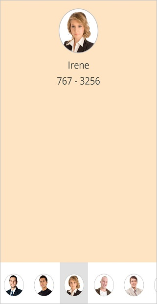
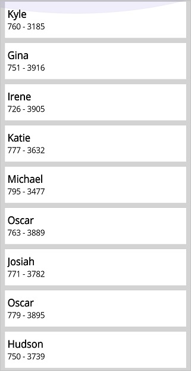
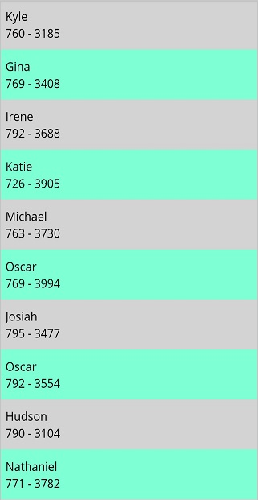
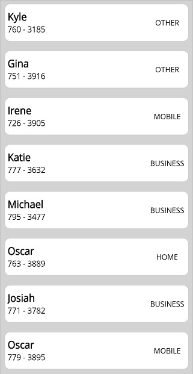
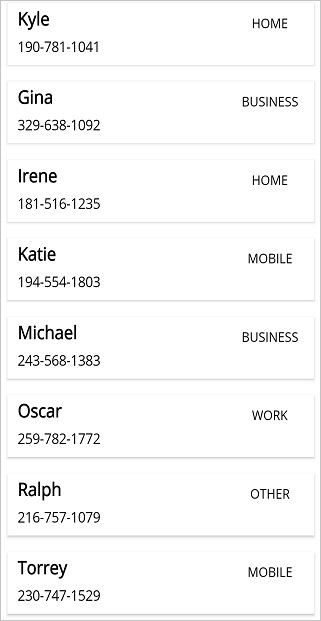

# Appearance in .NET MAUI ListView (SfListView)

The `SfListView` allows customizing the appearance of the underlying data, and provides different functionalities to the end-user.

To get start quickly with .NET MAUI ListView Appearance, you can check on this video:
 <iframe id='MAUIListViewAppearanceVideoTutorial' src='https://www.youtube.com/embed/qp4MglFU0q4'></iframe>

## Item template

A template can be used to present the data in a way that makes sense for the application by using different controls. `SfListView` allows customizing the appearance of the view by setting the [ItemTemplate](https://help.syncfusion.com/cr/maui/Syncfusion.Maui.ListView.SfListView.html#Syncfusion_Maui_ListView_SfListView_ItemTemplate) property.

## Data template selector

The `SfListView` allows customizing the appearance of each item with different templates based on specific constraints by using the `DataTemplateSelector`. You can choose a `DataTemplate` for each item at runtime based on the value of data-bound property using `DataTemplateSelector`.

Here, an [ItemsCacheLimit](https://help.syncfusion.com/cr/maui/Syncfusion.Maui.ListView.ListViewLayout.html#Syncfusion_Maui_ListView_ListViewLayout_ItemsCacheLimit) property is used to maintain the number of items that can be reused in the view. This cache limit is used to create and reuse the [ListViewItem](https://help.syncfusion.com/cr/maui/Syncfusion.Maui.ListView.ListViewItem.html) if different templates are used in `DataTemplateSelector` for better scrolling performance. Based on this value,. Based on this value, `SfListView` creates a number of `ListViewItem` for different templates in the view, if a new template is created while scrolling, and reuses them, if the same template is used to improve the scrolling performance.

### Create a data template selector

Create a custom class that inherits from `DataTemplateSelector`, and override the `OnSelectTemplate` method to return the `DataTemplate` for that item. At runtime, the SfListView invokes the `OnSelectTemplate` method for each item and passes the data object as parameter.




class MyDataTemplateSelector : DataTemplateSelector
{

   private readonly DataTemplate incomingDataTemplate;
   private readonly DataTemplate outgoingDataTemplate;

   public MyDataTemplateSelector()
   {
      this.incomingDataTemplate = new DataTemplate(typeof(IncomingTemplate));
      this.outgoingDataTemplate = new DataTemplate(typeof(OutgoingTemplate));      
   }

   protected override DataTemplate OnSelectTemplate(object item, BindableObject container)
   {
      var message = item as Message;
      if (message == null)
         return null;
      return message.IsIncoming ? this.incomingDataTemplate : this.outgoingDataTemplate;
   }

}




### Applying the data template selector

Assign custom `DataTemplateSelector` to the [ItemTemplate](https://help.syncfusion.com/cr/maui/Syncfusion.Maui.ListView.SfListView.html#Syncfusion_Maui_ListView_SfListView_ItemTemplate) of the `SfListView` in XAML or C#.



<ContentPage xmlns="http://schemas.microsoft.com/dotnet/2021/maui"
             xmlns:x="http://schemas.microsoft.com/winfx/2009/xaml"
             x:Class="DataTemplateSelector.MainPage"
             xmlns:syncfusion="clr-namespace:Syncfusion.Maui.ListView;assembly=Syncfusion.Maui.ListView"
             xmlns:local="clr-namespace:DataTemplateSelector;assembly=DataTemplateSelector">
  <ContentPage.Resources>
    <ResourceDictionary>
      <local:MyDataTemplateSelector x:Key="MessageTemplateSelector" />
    </ResourceDictionary>
  </ContentPage.Resources>
  <Grid>
    <syncfusion:SfListView x:Name="ListView"
                           ItemTemplate="{StaticResource MessageTemplateSelector}"
                           ItemsSource="{Binding Messages}"
                           ItemSize="100">
    </syncfusion:SfListView>
  </Grid>
</ContentPage>


public class MainPage : ContentPage
{
   public MainPage()
   {
      var viewModel = new MainPageViewModel();
      BindingContext = viewModel;
      Content = new SfListView()
      {
          ItemSize = 100,
          ItemsSource = viewModel.Messages,
          ItemTemplate = new MyDataTemplateSelector()
      };
   }
}



## Setting DisplayMemberPath
 
The [DisplayMemberPath](https://help.syncfusion.com/cr/maui/Syncfusion.Maui.ListView.SfListView.html#Syncfusion_Maui_ListView_SfListView_DisplayMemberPath) property in the SfListView provides a simple and efficient way to display a specific property from business objects without creating custom item template. This feature is especially useful for simple lists where you want to display a single property without defining a custom template.
 


<syncfusion:SfListView x:Name="listView"
                       DisplayMemberPath="BookName" />


listView.DisplayMemberPath = "BookName";


 
N> The `ItemTemplate` property takes precedence over `DisplayMemberPath`. If both are set, `ItemTemplate` will be used.

## Horizontal ListView

The SfListView allows you to layout every item in the [SfListView.ItemsSource](https://help.syncfusion.com/cr/maui/Syncfusion.Maui.ListView.SfListView.html#Syncfusion_Maui_ListView_SfListView_ItemsSource) property either in `Vertical` or `Horizontal` orientation by setting the [SfListView.Orientation](https://help.syncfusion.com/cr/maui/Syncfusion.Maui.ListView.SfListView.html#Syncfusion_Maui_ListView_SfListView_Orientation). The default orientation is `Vertical`.



<syncfusion:SfListView x:Name="listView" Orientation="Horizontal" />


listView.Orientation = ItemsLayoutOrientation.Horizontal;



### Navigate across views (like TabView)

The `SfListView` allows you to layout the items like `TabView` in the horizontal direction by setting the [Orientation](https://help.syncfusion.com/cr/maui/Syncfusion.Maui.ListView.SfListView.html#Syncfusion_Maui_ListView_SfListView_Orientation) property as `Horizontal` using the [ItemTapped](https://help.syncfusion.com/cr/maui/Syncfusion.Maui.ListView.SfListView.html#Syncfusion_Maui_ListView_SfListView_ItemTapped) event. It brings any desired view above the horizontal list as follows.



<ContentPage xmlns:syncfusion="clr-namespace:Syncfusion.Maui.ListView;assembly=Syncfusion.Maui.ListView">
    <ContentPage.Content>
        <Grid x:Name="GridView">
            <Label Text="Tap image to expand"/>
            <Grid>
                <Image Source="{Binding ContactImage}" />
                <Label Text="{Binding ContactName}" />
                <Label Text="{Binding ContactNumber}" />
            </Grid>
            <syncfusion:SfListView x:Name="listView" ItemTapped="list_ItemTapped" ItemSize="70" ItemsSource="{Binding ContactsInfo}">
                <syncfusion:SfListView.ItemTemplate>
                    <DataTemplate x:Name="ItemTemplate"  x:Key="ItemTemplate" >
                        <Image Source="{Binding ContactImage}" />
                    </DataTemplate>
                </syncfusion:SfListView.ItemTemplate>
            </syncfusion:SfListView>
        </Grid>
    </ContentPage.Content>
</ContentPage>


public partial class MainPage : ContentPage
{
    public MainPage()
    {
        InitializeComponent();
        list.BindingContext = new ContactsViewModel();

        var grid = new Grid();
        var label = new Label();
        label.Text = "Tap image to expand";
        var grid1 = new Grid();
        var image = new Image();
        image.SetBinding(Image.SourceProperty, new Binding("ContactImage"));
        var label1 = new Label();
        label.SetBinding(Label.TextProperty, new Binding("ContactName"));
        var label2 = new Label();
        label1.SetBinding(Label.TextProperty, new Binding("ContactNumber"));
        grid1.Children.Add(image);
        grid1.Children.Add(label1);
        grid1.Children.Add(label2);

        var listView = new SfListView();
        ContactsViewModel contactsViewModel = new ContactsViewModel();
        listView.ItemsSource = contactsViewModel.ContactsInfo;
        listView.ItemSize = 70;
        listView.ItemTapped += ListView_ItemTapped;
        listView.ItemTemplate = new DataTemplate(() =>
        {
            var image1 = new Image();
            image1.SetBinding(Image.SourceProperty, new Binding("ContactImage"));
            return image1;
        });

        grid.Children.Add(label);
        grid.Children.Add(grid1);
        grid.Children.Add(listView);

    }

    private void ListView_ItemTapped(object sender, Syncfusion.Maui.ListView.ItemTappedEventArgs e)
    {
        GridView.BindingContext = e.DataItem;
    }
}



## Horizontal list inside vertical list

The `SfListView` allows you to layout the items in a horizontal list within a vertical list. You can load the nested `SfListView` by customizing the [ItemTemplate](https://help.syncfusion.com/cr/maui/Syncfusion.Maui.ListView.SfListView.html#Syncfusion_Maui_ListView_SfListView_ItemTemplate) of outer `SfListView`. 

You should either define the size for each inner `SfListView` or set the [AutoFitMode](https://help.syncfusion.com/cr/maui/Syncfusion.Maui.ListView.SfListView.html#Syncfusion_Maui_ListView_SfListView_AutoFitModeProperty) of the inner SfListView to `Height`, and define the [ItemSize](https://help.syncfusion.com/cr/maui/Syncfusion.Maui.ListView.SfListView.html#Syncfusion_Maui_ListView_SfListView_ItemSize) for outer `SfListView`.



<ContentPage xmlns:syncfusion="clr-namespace:Syncfusion.Maui.ListView;assembly=Syncfusion.Maui.ListView">
  <ContentPage.BindingContext>
    <local:ListViewModel x:Name="viewModel"/>
  </ContentPage.BindingContext>
    <Grid>
        <syncfusion:SfListView x:Name="listView" ItemsSource="{Binding OuterList}" ItemSize="100">
            <syncfusion:SfListView.ItemTemplate>
                <DataTemplate>
                    <Grid>
                        <Label Text="{Binding Label}" />
                        <syncfusion:SfListView ItemsSource="{Binding InnerList}" ItemSize="100" Orientation="Horizontal">
                            <syncfusion:SfListView.ItemTemplate>
                                <DataTemplate>
                                    <Grid>
                                        <Image Source="{Binding Image}"/>
                                    </Grid>
                                </DataTemplate>
                            </syncfusion:SfListView.ItemTemplate>
                        </syncfusion:SfListView>
                    </Grid>
                </DataTemplate>
            </syncfusion:SfListView.ItemTemplate>
        </syncfusion:SfListView>
    </Grid>
</ContentPage>


public partial class MainPage : ContentPage
{
    public MainPage()
    {
        InitializeComponent();

        var grid = new Grid();
        var label1 = new Label();
        label1.SetBinding(Label.TextProperty, new Binding("Label"));
        var listView = new SfListView();
        listView.ItemsSource = OuterList;
        listView.ItemSize = 100;
        listView.ItemTemplate = new DataTemplate(() =>
        {
            var InnerListView = new SfListView();
            InnerListView.ItemSize = 100;
            InnerListView.ItemsSource = InnerList;
            InnerListView.Orientation = ItemsLayoutOrientation.Horizontal;
            listView.ItemTemplate = new DataTemplate(() =>
            {
                var grid1 = new Grid();
                var image = new Image();
                image.SetBinding(Image.SourceProperty, new Binding("Image"));
                grid1.Children.Add(image);
            }
            
            return InnerListView;
        });

        grid.Children.Add(label1);
        grid.Children.Add(listView);
    }

}



## Item size

The `SfListView` allows customizing the size of items by setting the [ItemSize](https://help.syncfusion.com/cr/maui/Syncfusion.Maui.ListView.SfListView.html#Syncfusion_Maui_ListView_SfListView_ItemSize) property. The default value of this property is `48d`. This property can be customized at runtime.



<syncfusion:SfListView x:Name="listView" ItemSize="60" />


listView.ItemSize = 60;



## Item spacing

The `SfListView` allows specifying space between each item in the list by setting the [ItemSpacing](https://help.syncfusion.com/cr/maui/Syncfusion.Maui.ListView.SfListView.html#Syncfusion_Maui_ListView_SfListView_ItemSpacing) property. Generate the space around the item. The default value of this property is `0`. This property can be customized at runtime.



<syncfusion:SfListView x:Name="listView" ItemSpacing="5,0,0,0" />


listView.ItemSpacing = new Thickness(5, 0, 0, 0)



## Alternate row styling

The `SfListView` allows applying alternate row styling for items by using the `IValueConverter` to find the index of the underlying object.



<ContentPage xmlns:syncfusion="clr-namespace:Syncfusion.Maui.ListView;assembly=Syncfusion.Maui.ListView">
    <ContentPage.Resources>
        <ResourceDictionary>
            <local:IndexToColorConverter x:Key="IndexToColorConverter"/>
        </ResourceDictionary>
    </ContentPage.Resources>
    <ContentPage.Content>
        <syncfusion:SfListView x:Name="listView" ItemsSource="{Binding Items}" ItemSize="50">
            <syncfusion:SfListView.ItemTemplate>
                <DataTemplate>
                    <Grid BackgroundColor="{Binding .,Converter={StaticResource IndexToColorConverter},ConverterParameter={x:Reference Name=listView}}">
                        <Label Text="{Binding ContactName}" />
                        <Label Text="{Binding ContactNumber}" />
                    </Grid>
                </DataTemplate>
            </syncfusion:SfListView.ItemTemplate>
        </syncfusion:SfListView>
    </ContentPage.Content>
</ContentPage>


public partial class MainPage : ContentPage
{
    public MainPage()
    {
        InitializeComponent();

        ContactsViewModel viewModel = new ContactsViewModel();
        var listView = new SfListView();
        listView.ItemsSource = viewModel.Items;
        listView.ItemSize = 50;
        listView.ItemTemplate = new DataTemplate(() =>
        {
            var grid = new Grid();
            var label1 = new Label();
            label1.SetBinding(Label.TextProperty, new Binding("ContactName"));
            var label2 = new Label();
            label2.SetBinding(Label.TextProperty, new Binding("ContactNumber"));
            grid.SetBinding(Grid.BackgroundColorProperty, new Binding(".", BindingMode.Default, new IndexToColorConverter(), listView));

            return grid;
        });
    }
}




public class IndexToColorConverter : IValueConverter
{
    public object Convert(object value, Type targetType, object parameter, CultureInfo culture)
    {
        var listview = parameter as SfListView;
        var index = listview.DataSource.DisplayItems.IndexOf(value);

        if (index % 2 == 0)
            return Color.LightGray;
        return Color.Aquamarine;
    }

    public object ConvertBack(object value, Type targetType, object parameter, CultureInfo culture)
    {
    }
}


## Rounded corner on items

The `SfListView` allows customizing the item appearance, such as rounded corners, by using the `Border` layout in the [ItemTemplate](https://help.syncfusion.com/cr/maui/Syncfusion.Maui.ListView.SfListView.html#Syncfusion_Maui_ListView_SfListView_ItemTemplate) property. By defining the `CornerRadius` property of the border, you can perform rounded corner for items. 



<ContentPage xmlns:syncfusion="clr-namespace:Syncfusion.Maui.ListView;assembly=Syncfusion.Maui.ListView">
    <ContentPage.Content>
        <syncfusion:SfListView x:Name="listView" ItemSize="60" ItemsSource="{Binding customerDetails}">
            <syncfusion:SfListView.ItemTemplate>
                <DataTemplate>
                    <Border x:Name="frame" CornerRadius="10" Padding="0">
                        <StackLayout>
                            <Label Text="{Binding ContactName}" />
                            <Label Text="{Binding ContactNumber}" />
                            <Label Text="{Binding ContactType}" />
                        </StackLayout>
                    </Border>
                </DataTemplate>
            </syncfusion:SfListView.ItemTemplate>
        </syncfusion:SfListView>
    </ContentPage.Content>
</ContentPage>


public partial class MainPage : ContentPage
{
    public MainPage()
    {
        InitializeComponent();

        var listView = new SfListView();
        listView.ItemsSource = customerDetails;
        listView.ItemSize = 60;
        listView.ItemTemplate = new DataTemplate(() =>
        {
            var border = new Border();
            border.CornerRadius = 10;
            var stackLayout = new StackLayout();
            var label1 = new Label();
            label.SetBinding(Label.TextProperty, new Binding("ContactName"));
            var label2 = new Label();
            label.SetBinding(Label.TextProperty, new Binding("ContactName"));
            var label3 = new Label();
            label1.SetBinding(Label.TextProperty, new Binding("ContactType"));
            stackLayout.Children.Add(label1);
            stackLayout.Children.Add(label2);
            stackLayout.Children.Add(label3);
            border.Content = stackLayout;

            return border;
        });
    }
}



## Drop shadow effect on items

The `SfListView` allows customizing the item appearance like shadow effect for items by using a `Border` inside the [ItemTemplate](https://help.syncfusion.com/cr/maui/Syncfusion.Maui.ListView.SfListView.html#Syncfusion_Maui_ListView_SfListView_ItemTemplate) property.

N> Define the border within any view inside `ItemTemplate` with some margin around it. 



<ContentPage  xmlns:syncfusion="clr-namespace:Syncfusion.Maui.ListView;assembly=Syncfusion.Maui.ListView">
    <ContentPage.Content>
        <syncfusion:SfListView x:Name="listView" ItemSize="60" ItemsSource="{Binding customerDetails}">
            <syncfusion:SfListView.ItemTemplate>
                <DataTemplate>
                    <Grid Padding="2" Margin="2" >
                        <Border x:Name="frame" Padding="2" Margin="2">
                            <StackLayout>
                                <Label Text="{Binding ContactName}" /> 
                                <Label Text="{Binding ContactNumber}" />
                                <Label Text="{Binding ContactType}" />
                            </StackLayout>
                        </Border>
                    </Grid>
                </DataTemplate>
            </syncfusion:SfListView.ItemTemplate>
        </syncfusion:SfListView>
    </ContentPage.Content>
</ContentPage>


public partial class MainPage : ContentPage
{
    public MainPage()
    {
        InitializeComponent();

        var listView = new SfListView();
        listView.ItemsSource = customerDetails;
        listView.ItemSize = 60;
        listView.ItemTemplate = new DataTemplate(() =>
        {
            var grid = new Grid();
            grid.Padding = 2;
            grid.Margin = 2;
            var border = new Border();
            border.Padding = 2;
            border.Margin = 2;
            var stackLayout = new StackLayout();
            var label1 = new Label();
            label.SetBinding(Label.TextProperty, new Binding("ContactName"));
            var label2 = new Label();
            label.SetBinding(Label.TextProperty, new Binding("ContactName"));
            var label3 = new Label();
            label1.SetBinding(Label.TextProperty, new Binding("ContactType"));
            stackLayout.Children.Add(label1);
            stackLayout.Children.Add(label2);
            stackLayout.Children.Add(label3);
            border.Content = stackLayout;
            grid.Children.Add(border);

            return grid;
        });
    }
}



## Visual State Manager

The appearance of the `ListViewItem` can be customized using the following `VisualStates`:

* Normal
* PointerOver
* Pressed
* Selected



<ContentPage xmlns="http://schemas.microsoft.com/dotnet/2021/maui"
             xmlns:x="http://schemas.microsoft.com/winfx/2009/xaml"
             x:Class="ListViewMaui.MainPage"
             xmlns:local="clr-namespace:ListViewMaui"
             xmlns:syncfusion="clr-namespace:Syncfusion.Maui.ListView;assembly=Syncfusion.Maui.ListView">
    <ContentPage.Resources>
        
    </ContentPage.Resources>
    <ContentPage.Content>
        <syncfusion:SfListView ItemsSource="{Binding ContactsInfo}">
                <syncfusion:SfListView.ItemTemplate>
                    <DataTemplate>
                        <Label Text="{Binding ContactName}" />
                    </DataTemplate>
                </syncfusion:SfListView.ItemTemplate>
        </syncfusion:SfListView>
    </ContentPage.Content>
</ContentPage>



N> Only the `Background` property of `ListViewItem` can be customized using visual state.

## ListViewItem customization

The `SfListView` allows customizing the [ListViewItem](https://help.syncfusion.com/cr/maui/Syncfusion.Maui.ListView.ListViewItem.html) based on the [ItemType](https://help.syncfusion.com/cr/maui/Syncfusion.Maui.ListView.ItemType.html). Follow the code example to customize the Header, Footer, GroupHeader, LoadMore, and ListViewItem.



public partial class MainPage : ContentPage
{
    public MainPage()
    {
        InitializeComponent();
        this.listView.ItemGenerator = new ItemGeneratorExt(this.listView);
    }
}



### Extension class for ItemGenerator



public class ItemGeneratorExt : ItemsGenerator
{
    public SfListView listView;
	
    public ItemGeneratorExt(SfListView listView) : base(listView)
    {
        this.listView = listView;
    }

    protected override ListViewItem OnCreateListViewItem(int itemIndex, ItemType type, object data = null)
    {
        if (type == ItemType.Header)
            return new HeaderItemExt(this.listView);
        else if (type == ItemType.Footer)
            return new FooterItemExt(this.listView);
        else if (type == ItemType.GroupHeader)
            return new GroupHeaderItemExt(this.listView);
        else if (type == ItemType.LoadMore)
            return new LoadMoreItemExt(this.listView);
        else if (type == ItemType.Record)
            return new ListViewItemExt(this.listView);
        return base.OnCreateListViewItem(itemIndex, type, data);
    }
}



### Extension class for HeaderItem



public class HeaderItemExt : HeaderItem
{
    private SfListView listView;

    public HeaderItemExt(SfListView listView)
    {
        this.listView = listView;
    }

    protected override void OnItemAppearing()
    {
        base.OnItemAppearing();
        this.BackgroundColor = Colors.Yellow;
    }
}



### Extension class for FooterItem



public class FooterItemExt : FooterItem
{
    private SfListView listView;

    public FooterItemExt(SfListView listView)
    {
        this.listView = listView;
    }

    protected override void OnItemAppearing()
    {
        base.OnItemAppearing();
        this.BackgroundColor = Colors.Yellow;
    }
}



### Extension class for GroupHeaderItem



public class GroupHeaderItemExt : GroupHeaderItem
{
    private SfListView listView;

    public GroupHeaderItemExt(SfListView listView)
    {
        this.listView = listView;
    }

    protected override void OnItemAppearing()
    {
        base.OnItemAppearing();
        this.BackgroundColor = Colors.Yellow;
    }
}



### Extension class for LoadMoreItem



public class LoadMoreItemExt : LoadMoreItem
{
    private SfListView listView;

    public LoadMoreItemExt(SfListView listView)
    {
        this.listView = listView;
    }

    protected override void OnItemAppearing()
    {
        base.OnItemAppearing();
        this.BackgroundColor = Colors.Yellow;
    }
}



### Extension class for ListViewItem



public class ListViewItemExt : ListViewItem
{
    private SfListView listView;

    public ListViewItemExt(SfListView listView)
    {
        this.listView = listView;
    }

    protected override void OnItemAppearing()
    {
        base.OnItemAppearing();
        this.BackgroundColor = Colors.Yellow;
    }
}



## Accordion view

The `SfListView` supports accordion view to display a list of items. Each item can be expanded or stretched to reveal the content associated with that item. There can be zero expanded items, exactly one item, or more than one item can be expanded at a time depending on the configuration.




<ContentPage xmlns:syncfusion="clr-namespace:Syncfusion.Maui.ListView;assembly=Syncfusion.Maui.ListView">
  <ContentPage.Behaviors>
    <local:SfListViewAccordionBehavior />
  </ContentPage.Behaviors>
  <ContentPage.Content>
    <Grid x:Name="mainGrid" BackgroundColor="#F0F0F0" Padding="4">
      <syncfusion:SfListView x:Name="listView" AutoFitMode="DynamicHeight" SelectionMode ="None"  ItemSpacing="0">
        <syncfusion:SfListView.ItemTemplate>
          <DataTemplate>
            <Grid Padding="2" Margin="1" BackgroundColor="#F0F0F0" >
                <Border x:Name="frame" CornerRadius="2" Padding="1" Margin="1" Stroke="White">
                <Grid VerticalOptions="FillAndExpand" BackgroundColor="White" HorizontalOptions="FillAndExpand">
                    <Grid.RowDefinitions>
                    <RowDefinition Height="Auto" />
                    </Grid.RowDefinitions>
                    <Grid x:Name="grid" >
                    <Grid.RowDefinitions>
                        <RowDefinition Height="60" />
                    </Grid.RowDefinitions>
                    <Grid RowSpacing="0">
                        <Grid.ColumnDefinitions>
                        <ColumnDefinition Width="60" />
                        <ColumnDefinition Width="*" />
                        <ColumnDefinition Width="50" />
                        </Grid.ColumnDefinitions>
                        <Image Grid.Row="0" Grid.Column="0" Source="{Binding ContactImage}" VerticalOptions="Center"/>
                        <Grid Grid.Row="0" Grid.Column="1" VerticalOptions="CenterAndExpand">
                        <Grid.RowDefinitions>
                            <RowDefinition Height="*" />
                            <RowDefinition Height="*" />
                        </Grid.RowDefinitions>
                        <Label Grid.Row="0" LineBreakMode="NoWrap" TextColor="#474747" Text="{Binding ContactName}" />
                        <Label Grid.Row="1" TextColor="#474747" LineBreakMode="NoWrap" Text="{Binding CallTime}" />
                        </Grid>
                        <Grid Grid.Row="0" Grid.Column="2" HorizontalOptions="Center" VerticalOptions="Center">
                        <Image Source="{Binding PhoneImage}" HeightRequest="20" WidthRequest="20" HorizontalOptions="Center" VerticalOptions="Center" />
                        </Grid>
                    </Grid>
                    </Grid>
                    <Grid IsVisible="{Binding IsVisible, Mode=TwoWay}" ColumnSpacing="0" RowSpacing="0" Grid.Row="1" BackgroundColor="White"
                        HorizontalOptions="FillAndExpand" Padding="5" VerticalOptions="FillAndExpand">
                    <Grid.RowDefinitions>
                        <RowDefinition Height="1" />
                        <RowDefinition Height="40" />
                        <RowDefinition Height="40" />
                        <RowDefinition Height="40" />
                        <RowDefinition Height="40" />
                        <RowDefinition Height="40" />
                    </Grid.RowDefinitions>
                    <Grid.ColumnDefinitions >
                        <ColumnDefinition Width="50" />
                        <ColumnDefinition Width="*" />
                    </Grid.ColumnDefinitions>
                    <BoxView Grid.Row="0" Grid.Column="0" BackgroundColor="LightGray" />
                    <Image Grid.Row="1" Grid.Column="0" Source="{Binding NewContact}"  />
                    <Image Grid.Row="2" Grid.Column="0" Source="{Binding AddContact}" />
                    <Image Grid.Row="3" Grid.Column="0" Source="{Binding SendMessage}"  />
                    <Image Grid.Row="4" Grid.Column="0" Source="{Binding BlockSpan}"  />
                    <Image Grid.Row="5" Grid.Column="0" Source="{Binding CallDetails}" />
                    <BoxView Grid.Row="0" Grid.Column="1" BackgroundColor="LightGray" />
                    <Label Grid.Row="1" Grid.Column="1" Text="Create new contact" TextColor="#000000" />
                    <Label Grid.Row="2" Grid.Column="1" Text="Add to a contact" TextColor="#000000"/>
                    <Label Grid.Row="3" Grid.Column="1" Text="Send a message" TextColor="#000000" />
                    <Label Grid.Row="4" Grid.Column="1" Text="Block/report Spam" TextColor="#000000" />
                    <Label Grid.Row="5" Grid.Column="1" Text="Call details" TextColor="#000000" />
                    </Grid>
                </Grid>
                </Border>
            </Grid>
          </DataTemplate>
        </syncfusion:SfListView.ItemTemplate>
      </syncfusion:SfListView>
    </Grid>
  </ContentPage.Content>
</ContentPage>




`Accordion` view can be displayed by defining two different ItemTemplates. The ItemTemplates can be enabled or disabled in the [ItemTapped](https://help.syncfusion.com/cr/maui/Syncfusion.Maui.ListView.SfListView.html#Syncfusion_Maui_ListView_SfListView_ItemTapped) event.



internal class SfListViewAccordionBehavior : Behavior<ContentPage>
{
    #region Fields

    private Contact tappedItem;
    private SfListView listview;
    private AccordionViewModel AccordionViewModel;

    #endregion

    #region Properties
    public SfListViewAccordionBehavior()
    {
        AccordionViewModel = new AccordionViewModel();
    }

    #endregion

    #region Override Methods

    protected override void OnAttachedTo(ContentPage bindable)
    {
        listview = bindable.FindByName<SfListView>("listView");
        listview.ItemsSource = AccordionViewModel.ContactsInfo;
        listview.ItemTapped += ListView_ItemTapped;
    }

    #endregion

    #region Private Methods
    private void ListView_ItemTapped(object sender, ItemTappedEventArgs e)
    {
        var tappedItemData = obj as Contact;
        if (tappedItem != null && tappedItem.IsVisible)
        {
            tappedItem.IsVisible = false;
        }

        if (tappedItem == tappedItemData)
        {
            tappedItem = null;
            return;
        }

        tappedItem = tappedItemData;
        tappedItem.IsVisible = true;
    }

    #endregion

    protected override void OnDetachingFrom(ContentPage bindable)
    {
        listview.ItemTapped -= ListView_ItemTapped;           
    }
}




The `IsVisible` model property, which is bound to the second template, will be enabled when the item is tapped and disabled when the item is tapped again.

## Item animation on appearing

The `SfListView` supports animating the items by using an [OnItemAppearing](https://help.syncfusion.com/cr/maui/Syncfusion.Maui.ListView.ListViewItem.html#Syncfusion_Maui_ListView_ListViewItem_OnItemAppearing) virtual method. It is raised when the items appearing in the view on scrolling, loading, and navigating from one page to another page. To apply the animation effect for items, follow these steps:

### Extension of ItemGenerator




public class ItemGeneratorExt : ItemGenerator
{
    public SfListView listView;
	
    public ItemGeneratorExt(SfListView listView) : base(listView)
    {
        this.listView = listView;
    }

    protected override ListViewItem OnCreateListViewItem(int itemIndex, ItemType type, object data = null)
    {
        if (type == ItemType.Record)
            return new ListViewItemExt(this.listView);
        return base.OnCreateListViewItem(itemIndex, type, data);
    }
}




Initialize and assign ItemGenerator extension to ListView




public partial class MainPage : ContentPage
{
    public MainPage()
    {
        InitializeComponent();
        this.listView.ItemGenerator = new ItemGeneratorExt(this.listView);
    }
}




### Extension of ListViewItem
 
To apply the animation for items while appearing, override the [OnItemAppearing](https://help.syncfusion.com/cr/maui/Syncfusion.Maui.ListView.ListViewItem.html#Syncfusion_Maui_ListView_ListViewItem_OnItemAppearing) method.




public class ListViewItemExt : ListViewItem
{
    private SfListView listView;

    public ListViewItemExt(SfListView listView)
    {
        this.listView = listView;
    }

    protected override void OnItemAppearing()
    {
        this.Opacity = 0;
        this.FadeTo(1, 400, Easing.SinInOut);
        base.OnItemAppearing();
    }
}




Here `FadeTo` animation is applied for [ListViewItem](https://help.syncfusion.com/cr/maui/Syncfusion.Maui.ListView.ListViewItem.html), when comes in the view. 

### Right to left(RTL)

`SfListView` supports to change the flow of text to the right-to-left direction by setting the `FlowDirection` property. 



<ContentPage xmlns:syncfusion="clr-namespace:Syncfusion.Maui.ListView;assembly=Syncfusion.Maui.ListView">
  <syncfusion:SfListView x:Name="listView"
                 ItemsSource="{Binding Products}"
                 FlowDirection="RightToLeft"/>
</ContentPage>


this.FlowDirection = FlowDirection.RightToLeft;



### Limitations

* `SfListView` does not support the right-to-left(RTL) direction when `SfListView.Orientation` is `Horizontal`.

## How to

### Disable ripple effect on item click

To disable the ripple effect when clicking a `ListViewItem`, set color value `Transparent` to the built-in key `SfListViewItemRippleBackground`.



<ContentPage xmlns="http://schemas.microsoft.com/dotnet/2021/maui"
                xmlns:x="http://schemas.microsoft.com/winfx/2009/xaml"
				...
                xmlns:syncTheme="clr-namespace:Syncfusion.Maui.Themes;assembly=Syncfusion.Maui.Core"
				...
				>
	<ContentPage.Resources>
        <syncTheme:SyncfusionThemeDictionary>
            <syncTheme:SyncfusionThemeDictionary.MergedDictionaries>
                <ResourceDictionary>
                   <x:String x:Key="SfListViewTheme">CustomTheme</x:String>
                   <Color x:Key="SfListViewItemRippleBackground">Transparent</Color>
                </ResourceDictionary>
            </syncTheme:SyncfusionThemeDictionary.MergedDictionaries>
        </syncTheme:SyncfusionThemeDictionary>
    </ContentPage.Resources>
</ContentPage>				



## See also 

[How to change selected image in .NET MAUI ListView (SfListView)](https://support.syncfusion.com/kb/article/11586/how-to-change-selected-image-in-net-maui-listview-sflistview)                                                         
[How to apply alternate item background in .NET MAUI ListView (SfListView)](https://support.syncfusion.com/kb/article/11575/how-to-apply-alternate-item-background-in-net-maui-listview-sflistview)  
[How to apply the item text color in .NET MAUI ListView(SfListView)](https://support.syncfusion.com/kb/article/11526/how-to-apply-the-item-text-color-in-net-maui-listview-sflistview)
