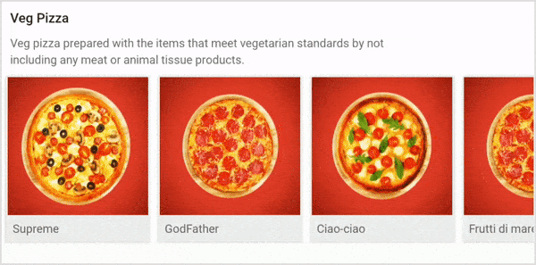
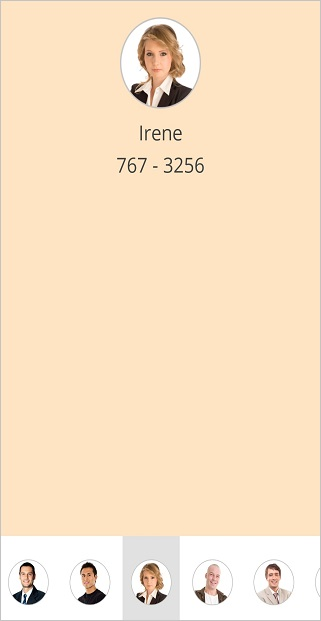
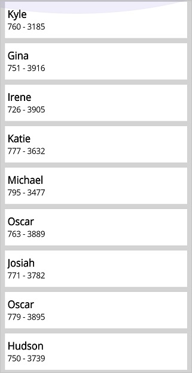
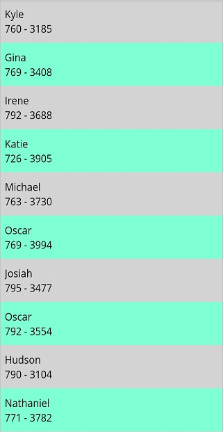
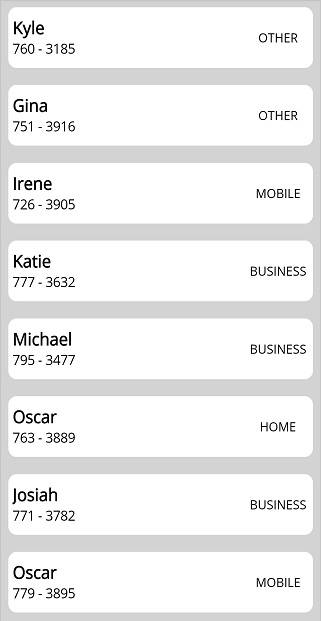
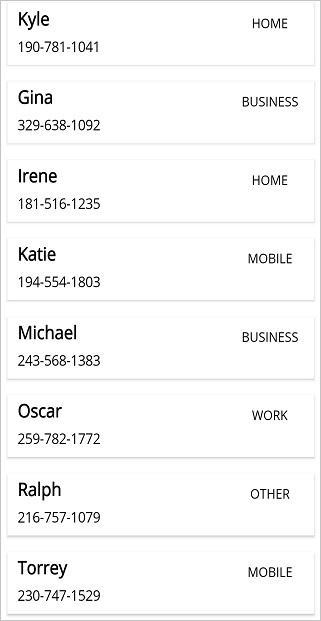

# Appearance in .NET MAUI ListView (SfListView)

The `SfListView` allows customizing the appearance of the underlying data, and provides different functionalities to the end-user.

To get start quickly with .NET MAUI ListView Appearance, you can check on this video:
 <iframe id='MAUIListViewAppearanceVideoTutorial' src='https://www.youtube.com/embed/qp4MglFU0q4'></iframe>

## Item template

A template can be used to present the data in a way that makes sense for the application by using different controls. `SfListView` allows customizing the appearance of the view by setting the [ItemTemplate](https://help.syncfusion.com/cr/maui/Syncfusion.Maui.ListView.SfListView.html#Syncfusion_Maui_ListView_SfListView_ItemTemplate) property.

## Data template selector

The `SfListView` allows customizing the appearance of each item with different templates based on specific constraints by using the `DataTemplateSelector`. You can choose a `DataTemplate` for each item at runtime based on the value of data-bound property using `DataTemplateSelector`.

Here, an [ItemsCacheLimit](https://help.syncfusion.com/cr/maui/Syncfusion.Maui.ListView.ListViewLayout.html#Syncfusion_Maui_ListView_ListViewLayout_ItemsCacheLimit) property is used to maintain the number of items that can be reused in the view. This cache limit is used to create and reuse the [ListViewItem](https://help.syncfusion.com/cr/maui/Syncfusion.Maui.ListView.ListViewItem.html) if different templates are used in `DataTemplateSelector` for better scrolling performance. Based on this value, `SfListView` creates a number of `ListViewItem` for different templates in the view, if a new template is created while scrolling, and reuses them, if the same template is used to improve the scrolling performance.

### Create a data template selector

Create a custom class that inherits from `DataTemplateSelector`, and override the `OnSelectTemplate` method to return the `DataTemplate` for that item. At runtime, the SfListView invokes the `OnSelectTemplate` method for each item and passes the data object as parameter.




public class MyDataTemplateSelector : DataTemplateSelector
{

   private readonly DataTemplate incomingDataTemplate;
   private readonly DataTemplate outgoingDataTemplate;

   public MyDataTemplateSelector()
   {
      this.incomingDataTemplate = new DataTemplate(typeof(IncomingTemplate));
      this.outgoingDataTemplate = new DataTemplate(typeof(OutgoingTemplate));      
   }

   protected override DataTemplate OnSelectTemplate(object item, BindableObject container)
   {
      var message = item as Message;
      if (message == null)
         return null;
      return message.IsIncoming ? this.incomingDataTemplate : this.outgoingDataTemplate;
   }

}




### Applying the data template selector

Assign custom `DataTemplateSelector` to the [ItemTemplate](https://help.syncfusion.com/cr/maui/Syncfusion.Maui.ListView.SfListView.html#Syncfusion_Maui_ListView_SfListView_ItemTemplate) of the `SfListView` in XAML or C#.



<ContentPage xmlns="http://schemas.microsoft.com/dotnet/2021/maui"
             xmlns:x="http://schemas.microsoft.com/winfx/2009/xaml"
             x:Class="DataTemplateSelector.MainPage"
             xmlns:syncfusion="clr-namespace:Syncfusion.Maui.ListView;assembly=Syncfusion.Maui.ListView"
             xmlns:local="clr-namespace:DataTemplateSelector;assembly=DataTemplateSelector">
  <ContentPage.Resources>
    <ResourceDictionary>
      <local:MyDataTemplateSelector x:Key="MessageTemplateSelector" />
    </ResourceDictionary>
  </ContentPage.Resources>
  <Grid>
    <syncfusion:SfListView x:Name="ListView"
                           ItemTemplate="{StaticResource MessageTemplateSelector}"
                           ItemsSource="{Binding Messages}"
                           ItemSize="100">
    </syncfusion:SfListView>
  </Grid>
</ContentPage>


public class MainPage : ContentPage
{
   public MainPage()
   {
      var viewModel = new MainPageViewModel();
      BindingContext = viewModel;
      Content = new SfListView()
      {
          ItemSize = 100,
          ItemsSource = viewModel.Messages,
          ItemTemplate = new MyDataTemplateSelector()
      };
   }
}



## Setting DisplayMemberPath

The [DisplayMemberPath](https://help.syncfusion.com/cr/maui/Syncfusion.Maui.ListView.SfListView.html#Syncfusion_Maui_ListView_SfListView_DisplayMemberPath) property in the SfListView provides a simple and efficient way to display a specific property from business objects without creating custom item template. This feature is especially useful for simple lists where you want to display a single property without defining a custom template.



<syncfusion:SfListView x:Name="listView"
                       ItemsSource="{Binding BookInfo}"
                       DisplayMemberPath="BookName" />


listView.ItemsSource = viewModel.BookInfo;
listView.DisplayMemberPath = "BookName";



N> The `ItemTemplate` property takes precedence over `DisplayMemberPath`. If both are set, `ItemTemplate` will be used.

## Horizontal list view

The SfListView allows you to layout every item in the [SfListView.ItemsSource](https://help.syncfusion.com/cr/maui/Syncfusion.Maui.ListView.SfListView.html#Syncfusion_Maui_ListView_SfListView_ItemsSource) property either in `Vertical` or `Horizontal` orientation by setting the [SfListView.Orientation](https://help.syncfusion.com/cr/maui/Syncfusion.Maui.ListView.SfListView.html#Syncfusion_Maui_ListView_SfListView_Orientation). The default orientation is `Vertical`.



<syncfusion:SfListView x:Name="listView" Orientation="Horizontal" />


listView.Orientation = ItemsLayoutOrientation.Horizontal;



### Navigate across views (like TabView)

The `SfListView` allows you to layout the items like `TabView` in the horizontal direction by setting the [Orientation](https://help.syncfusion.com/cr/maui/Syncfusion.Maui.ListView.SfListView.html#Syncfusion_Maui_ListView_SfListView_Orientation) property as `Horizontal` using the [ItemTapped](https://help.syncfusion.com/cr/maui/Syncfusion.Maui.ListView.SfListView.html#Syncfusion_Maui_ListView_SfListView_ItemTapped) event. It brings any desired view above the horizontal list as follows.



<ContentPage xmlns:syncfusion="clr-namespace:Syncfusion.Maui.ListView;assembly=Syncfusion.Maui.ListView">
    <ContentPage.Content>
        <Grid x:Name="GridView">
            <Label Text="Tap image to expand"/>
            <Grid>
                <Image Source="{Binding ContactImage}" />
                <Label Text="{Binding ContactName}" />
                <Label Text="{Binding ContactNumber}" />
            </Grid>
            <syncfusion:SfListView x:Name="listView" ItemTapped="ListView_ItemTapped" ItemSize="70" ItemsSource="{Binding ContactsInfo}">
                <syncfusion:SfListView.ItemTemplate>
                    <DataTemplate>
                        <Image Source="{Binding ContactImage}" />
                    </DataTemplate>
                </syncfusion:SfListView.ItemTemplate>
            </syncfusion:SfListView>
        </Grid>
    </ContentPage.Content>
</ContentPage>


public partial class MainPage : ContentPage
{
    public MainPage()
    {
        InitializeComponent();
        listView.BindingContext = new ContactsViewModel();

        var grid = new Grid();
        var label = new Label();
        label.Text = "Tap image to expand";
        var grid1 = new Grid();
        var image = new Image();
        image.SetBinding(Image.SourceProperty, new Binding("ContactImage"));
        var label1 = new Label();
        label1.SetBinding(Label.TextProperty, new Binding("ContactName"));
        var label2 = new Label();
        label2.SetBinding(Label.TextProperty, new Binding("ContactNumber"));
        grid1.Children.Add(image);
        grid1.Children.Add(label1);
        grid1.Children.Add(label2);

        var listView = new SfListView();
        ContactsViewModel contactsViewModel = new ContactsViewModel();
        listView.ItemsSource = contactsViewModel.ContactsInfo;
        listView.ItemSize = 70;
        listView.ItemTapped += ListView_ItemTapped;
        listView.ItemTemplate = new DataTemplate(() =>
        {
            var image1 = new Image();
            image1.SetBinding(Image.SourceProperty, new Binding("ContactImage"));
            return image1;
        });

        grid.Children.Add(label);
        grid.Children.Add(grid1);
        grid.Children.Add(listView);

    }

    private void ListView_ItemTapped(object sender, Syncfusion.Maui.ListView.ItemTappedEventArgs e)
    {
        grid.BindingContext = e.DataItem;
    }
}



### Horizontal list inside vertical list

The `SfListView` allows you to layout the items in a horizontal list within a vertical list. You can load the nested `SfListView` by customizing the [ItemTemplate](https://help.syncfusion.com/cr/maui/Syncfusion.Maui.ListView.SfListView.html#Syncfusion_Maui_ListView_SfListView_ItemTemplate) of outer `SfListView`. 

You should either define the size for each inner `SfListView` or set the [AutoFitMode](https://help.syncfusion.com/cr/maui/Syncfusion.Maui.ListView.SfListView.html#Syncfusion_Maui_ListView_SfListView_AutoFitModeProperty) of the inner SfListView to `Height`, and define the [ItemSize](https://help.syncfusion.com/cr/maui/Syncfusion.Maui.ListView.SfListView.html#Syncfusion_Maui_ListView_SfListView_ItemSize) for outer `SfListView`.



<ContentPage xmlns:syncfusion="clr-namespace:Syncfusion.Maui.ListView;assembly=Syncfusion.Maui.ListView">
  <ContentPage.BindingContext>
    <local:ListViewModel x:Name="viewModel"/>
  </ContentPage.BindingContext>
    <Grid>
        <syncfusion:SfListView x:Name="listView" ItemsSource="{Binding OuterList}" ItemSize="100">
            <syncfusion:SfListView.ItemTemplate>
                <DataTemplate>
                    <Grid>
                        <Label Text="{Binding Label}" />
                        <syncfusion:SfListView ItemsSource="{Binding InnerList}" ItemSize="100" Orientation="Horizontal">
                            <syncfusion:SfListView.ItemTemplate>
                                <DataTemplate>
                                    <Grid>
                                        <Image Source="{Binding Image}"/>
                                    </Grid>
                                </DataTemplate>
                            </syncfusion:SfListView.ItemTemplate>
                        </syncfusion:SfListView>
                    </Grid>
                </DataTemplate>
            </syncfusion:SfListView.ItemTemplate>
        </syncfusion:SfListView>
    </Grid>
</ContentPage>


public partial class MainPage : ContentPage
{
    public MainPage()
    {
        InitializeComponent();

        var grid = new Grid();
        var label1 = new Label();
        label1.SetBinding(Label.TextProperty, new Binding("Label"));
        var listView = new SfListView();
        listView.ItemsSource = OuterList;
        listView.ItemSize = 100;
        listView.ItemTemplate = new DataTemplate(() =>
        {
            var innerListView = new SfListView();
            innerListView.ItemSize = 100;
            innerListView.ItemsSource = InnerList;
            innerListView.Orientation = ItemsLayoutOrientation.Horizontal;
            innerListView.ItemTemplate = new DataTemplate(() =>
            {
                var grid1 = new Grid();
                var image = new Image();
                image.SetBinding(Image.SourceProperty, new Binding("Image"));
                grid1.Children.Add(image);
                return grid1;
            });

            return innerListView;
        });

        grid.Children.Add(label1);
        grid.Children.Add(listView);
    }

}



## Item Customizations
### Item size

The `SfListView` allows customizing the size of items by setting the [ItemSize](https://help.syncfusion.com/cr/maui/Syncfusion.Maui.ListView.SfListView.html#Syncfusion_Maui_ListView_SfListView_ItemSize) property. The default value of this property is `48d`. This property can be customized at runtime.



<syncfusion:SfListView x:Name="listView" ItemSize="60" />


listView.ItemSize = 60;



### Item spacing

The `SfListView` allows specifying space between each item in the list by setting the [ItemSpacing](https://help.syncfusion.com/cr/maui/Syncfusion.Maui.ListView.SfListView.html#Syncfusion_Maui_ListView_SfListView_ItemSpacing) property. This adds space around each item. The default value of this property is `0`. This property can be customized at runtime.



<syncfusion:SfListView x:Name="listView" ItemSpacing="5,0,0,0" />


listView.ItemSpacing = new Thickness(5, 0, 0, 0);



### Item Border Customization

This section explains how to customize item borders in the `.NET MAUI ListView` (SfListView) using the built-in APIs.

#### Enable Item Border

The [SfListView](https://help.syncfusion.com/cr/maui/Syncfusion.Maui.ListView.html) allows applying borders to each item by setting the [ShowItemBorder](https://help.syncfusion.com/cr/maui/Syncfusion.Maui.ListView.SfListView.html#Syncfusion_Maui_ListView_SfListView_ShowItemBorderProperty) property to `true`. By default, item borders are not displayed. You can customize the color, thickness, margin, and corner radius of the borders using the respective APIs.

<table>
  <thead>
    <tr>
      <th>Property</th>
      <th>Description</th>
    </tr>
  </thead>
  <tbody>
    <tr>
      <td>{{'[ShowItemBorder](https://help.syncfusion.com/cr/maui/Syncfusion.Maui.ListView.SfListView.html#Syncfusion_Maui_ListView_SfListView_ShowItemBorderProperty)'| markdownify }}</td>
      <td>Enables or disables the visibility of item borders. <em>(Default: false)</em></td>
    </tr>
    <tr>
      <td>{{'[ItemBorderColor](https://help.syncfusion.com/cr/maui/Syncfusion.Maui.ListView.SfListView.html#Syncfusion_Maui_ListView_SfListView_ItemBorderColorProperty)'| markdownify }}</td>
      <td>Sets the color of the item border.</td>
    </tr>
    <tr>
      <td>{{'[ItemBorderThickness](https://help.syncfusion.com/cr/maui/Syncfusion.Maui.ListView.SfListView.html#Syncfusion_Maui_ListView_SfListView_ItemBorderThicknessProperty)'| markdownify }}</td>
      <td>Defines the border thickness for each side of the item (per-side <code>double</code> values).</td>
    </tr>
    <tr>
      <td>{{'[ItemBorderMargin](https://help.syncfusion.com/cr/maui/Syncfusion.Maui.ListView.SfListView.html#Syncfusion_Maui_ListView_SfListView_ItemBorderMarginProperty)'| markdownify }}</td>
      <td>Sets the margin around the border within the item.</td>
    </tr>
    <tr>
      <td>{{'[ItemBorderRadius](https://help.syncfusion.com/cr/maui/Syncfusion.Maui.ListView.SfListView.html#Syncfusion_Maui_ListView_SfListView_ItemBorderRadiusProperty)'| markdownify}}</td>
      <td>Sets the corner radius of the item border.</td>
    </tr>
  </tbody>
</table>

N> `ItemBorderRadius` is applicable only when `ItemBorderThickness` has uniform values on all sides.



<syncfusion:SfListView x:Name="listView"
                       ShowItemBorder="True"
                       ItemsSource="{Binding BookInfo}">
    <syncfusion:SfListView.ItemTemplate>
        <DataTemplate>
            <StackLayout Padding="5">
                <Label Text="{Binding BookName}" FontAttributes="Bold" />
                <Label Text="{Binding BookDescription}" />
            </StackLayout>
        </DataTemplate>
    </syncfusion:SfListView.ItemTemplate>
</syncfusion:SfListView>



listView.ShowItemBorder = true;



#### Border Customization

After enabling the item border, you can customize its appearance using the following properties:

- [ItemBorderColor](https://help.syncfusion.com/cr/maui/Syncfusion.Maui.ListView.SfListView.html#Syncfusion_Maui_ListView_SfListView_ItemBorderColorProperty): Sets the border color.
- [ItemBorderThickness](https://help.syncfusion.com/cr/maui/Syncfusion.Maui.ListView.SfListView.html#Syncfusion_Maui_ListView_SfListView_ItemBorderThicknessProperty): Specifies the thickness of the border.
- [ItemBorderMargin](https://help.syncfusion.com/cr/maui/Syncfusion.Maui.ListView.SfListView.html#Syncfusion_Maui_ListView_SfListView_ItemBorderMarginProperty): Adds margin around the border.
- [ItemBorderRadius](https://help.syncfusion.com/cr/maui/Syncfusion.Maui.ListView.SfListView.html#Syncfusion_Maui_ListView_SfListView_ItemBorderRadiusProperty): Sets the corner radius of the border.



<syncfusion:SfListView x:Name="listView"
                       ItemSize="60"
                       ShowItemBorder="True"
                       ItemBorderColor="Black"
                       ItemBorderThickness="2"
                       ItemBorderMargin="5,2,5,2"
                       ItemBorderRadius="20,0,0,20"
                       ItemsSource="{Binding BookInfo}">
    <syncfusion:SfListView.ItemTemplate>
        <DataTemplate>
            <StackLayout Padding="5">
                <Label Text="{Binding BookName}" FontAttributes="Bold" />
                <Label Text="{Binding BookDescription}" />
            </StackLayout>
        </DataTemplate>
    </syncfusion:SfListView.ItemTemplate>
</syncfusion:SfListView>



listView.ShowItemBorder = true;
listView.ItemBorderColor = Colors.Black;
listView.ItemBorderThickness = new Thickness(2);
listView.ItemBorderMargin = new Thickness(5, 2, 5, 2);
listView.ItemBorderRadius = new CornerRadius(20,0,0,20);



#### Limitations

- Item borders are not supported when [SfListView.ItemsLayout](https://help.syncfusion.com/cr/maui/Syncfusion.Maui.ListView.SfListView.html#Syncfusion_Maui_ListView_SfListView_ItemsLayout) is set to [GridLayout](https://help.syncfusion.com/cr/maui/Syncfusion.Maui.ListView.GridLayout.html).
- [ItemBorderRadius](https://help.syncfusion.com/cr/maui/Syncfusion.Maui.ListView.SfListView.html#Syncfusion_Maui_ListView_SfListView_ItemBorderRadiusProperty) is applicable only when [ItemBorderThickness](https://help.syncfusion.com/cr/maui/Syncfusion.Maui.ListView.SfListView.html#Syncfusion_Maui_ListView_SfListView_ItemBorderThicknessProperty) has uniform values on all sides.

### Group Header Border Customization

This section explains how to customize group header borders in the `.NET MAUI ListView` (SfListView) using the built-in APIs.

#### Enable Group Header Border

The [SfListView](https://help.syncfusion.com/cr/maui/Syncfusion.Maui.ListView.html) allows applying borders to each group header by setting the `ShowGroupHeaderBorder` property to `true`. By default, group header borders are not displayed. You can customize the color, thickness, margin, and corner radius of the borders using the respective APIs.

<table>
  <thead>
    <tr>
      <th>Property</th>
      <th>Description</th>
    </tr>
  </thead>
  <tbody>
    <tr>
      <td>{{'[ShowGroupHeaderBorder](https://help.syncfusion.com/cr/maui/Syncfusion.Maui.ListView.SfListView.html#Syncfusion_Maui_ListView_SfListView_ShowGroupHeaderBorderProperty)'| markdownify }}</td>
      <td>Enables or disables the visibility of group header borders. <em>(Default: false)</em></td>
    </tr>
    <tr>
      <td>{{'[GroupHeaderBorderColor](https://help.syncfusion.com/cr/maui/Syncfusion.Maui.ListView.SfListView.html#Syncfusion_Maui_ListView_SfListView_GroupHeaderBorderColorProperty)'| markdownify }}</td>
      <td>Sets the color of the group header border.</td>
    </tr>
    <tr>
      <td>{{'[GroupHeaderBorderThickness](https://help.syncfusion.com/cr/maui/Syncfusion.Maui.ListView.SfListView.html#Syncfusion_Maui_ListView_SfListView_GroupHeaderBorderThicknessProperty)'| markdownify }}</td>
      <td>Defines the border thickness for each side of the group header (per-side <code>double</code> values).</td>
    </tr>
    <tr>
      <td>{{'[GroupHeaderBorderMargin](https://help.syncfusion.com/cr/maui/Syncfusion.Maui.ListView.SfListView.html#Syncfusion_Maui_ListView_SfListView_GroupHeaderBorderMarginProperty)'| markdownify }}</td>
      <td>Sets the margin around the border within the group header.</td>
    </tr>
    <tr>
      <td>{{'[GroupHeaderBorderRadius](https://help.syncfusion.com/cr/maui/Syncfusion.Maui.ListView.SfListView.html#Syncfusion_Maui_ListView_SfListView_GroupHeaderBorderRadiusProperty)'| markdownify }}</td>
      <td>Sets the corner radius of the group header border.</td>
    </tr>
  </tbody>
</table>

N> `GroupHeaderBorderRadius` is applicable only when `GroupHeaderBorderThickness` has uniform values on all sides.

#### XAML Example



<syncfusion:SfListView x:Name="listView"
                       GroupHeaderSize="50"
                       ShowGroupHeaderBorder="True"
                       AllowGroupExpandCollapse="True"
                       ItemsSource="{Binding BookInfo}"
                       GroupKeySelector="{Binding Category}">
    <syncfusion:SfListView.ItemTemplate>
        <DataTemplate>
            <StackLayout Padding="5">
                <Label Text="{Binding BookName}" FontAttributes="Bold" />
                <Label Text="{Binding BookDescription}" />
            </StackLayout>
        </DataTemplate>
    </syncfusion:SfListView.ItemTemplate>
</syncfusion:SfListView>



listView.ShowGroupHeaderBorder = true;



#### Border Customization

After enabling the group header border, you can customize its appearance using the following properties:

- `GroupHeaderBorderColor`: Sets the border color.
- `GroupHeaderBorderThickness`: Specifies the thickness of the border.
- `GroupHeaderBorderMargin`: Adds margin around the border.
- `GroupHeaderBorderRadius`: Sets the corner radius of the border.



<syncfusion:SfListView x:Name="listView"
                       GroupHeaderSize="60"
                       ShowGroupHeaderBorder="True"
                       GroupHeaderBorderColor="Black"
                       GroupHeaderBorderThickness="2"
                       GroupHeaderBorderMargin="5,2,5,2"
                       GroupHeaderBorderRadius="20,0,0,20"
                       ItemsSource="{Binding BookInfo}">
    <syncfusion:SfListView.ItemTemplate>
        <DataTemplate>
            <StackLayout Padding="5">
                <Label Text="{Binding BookName}" FontAttributes="Bold" />
                <Label Text="{Binding BookDescription}" />
            </StackLayout>
        </DataTemplate>
    </syncfusion:SfListView.ItemTemplate>
</syncfusion:SfListView>



listView.ShowGroupHeaderBorder = true;
listView.GroupHeaderBorderColor = Colors.Black;
listView.GroupHeaderBorderThickness = new Thickness(2);
listView.GroupHeaderBorderMargin = new Thickness(2);
listView.GroupHeaderBorderRadius = new CornerRadius(20,0,0,20);



#### Limitations

- Group header borders are rendered on top of the group header template content and do not interfere with touch interactions.
- `GroupHeaderBorderRadius` is applicable only when `GroupHeaderBorderThickness` has uniform values on all sides.
- Group header borders are only supported with grouped data sources (when `GroupKeySelector` is set).

### Alternate row styling

The `SfListView` allows applying alternate row styling for items by using the `IValueConverter` to find the index of the underlying object.



<ContentPage xmlns:syncfusion="clr-namespace:Syncfusion.Maui.ListView;assembly=Syncfusion.Maui.ListView">
    <ContentPage.Resources>
        <ResourceDictionary>
            <local:IndexToColorConverter x:Key="IndexToColorConverter"/>
        </ResourceDictionary>
    </ContentPage.Resources>
    <ContentPage.Content>
        <syncfusion:SfListView x:Name="listView" ItemsSource="{Binding Items}" ItemSize="50">
            <syncfusion:SfListView.ItemTemplate>
                <DataTemplate>
                    <Grid BackgroundColor="{Binding .,Converter={StaticResource IndexToColorConverter},ConverterParameter={x:Reference Name=listView}}">
                        <Label Text="{Binding ContactName}" />
                        <Label Text="{Binding ContactNumber}" />
                    </Grid>
                </DataTemplate>
            </syncfusion:SfListView.ItemTemplate>
        </syncfusion:SfListView>
    </ContentPage.Content>
</ContentPage>


public partial class MainPage : ContentPage
{
    public MainPage()
    {
        InitializeComponent();

        ContactsViewModel viewModel = new ContactsViewModel();
        var listView = new SfListView();
        listView.ItemsSource = viewModel.Items;
        listView.ItemSize = 50;
        listView.ItemTemplate = new DataTemplate(() =>
        {
            var grid = new Grid();
            var label1 = new Label();
            label1.SetBinding(Label.TextProperty, new Binding("ContactName"));
            var label2 = new Label();
            label2.SetBinding(Label.TextProperty, new Binding("ContactNumber"));
            grid.SetBinding(Grid.BackgroundColorProperty, new Binding(".", BindingMode.Default, new IndexToColorConverter(), listView));

            return grid;
        });
    }
}




using System;
using System.Collections;
using System.Globalization;
using Microsoft.Maui.Controls;
using Syncfusion.Maui.ListView;

public class IndexToColorConverter : IValueConverter
{
    public object Convert(object value, Type targetType, object parameter, CultureInfo culture)
    {
        var listview = parameter as SfListView;
        if (listview?.ItemsSource is IList items)
        {
            var index = items.IndexOf(value);
            if (index % 2 == 0)
                return Colors.LightGray;
        }
        return Colors.Aquamarine;
    }

    public object ConvertBack(object value, Type targetType, object parameter, CultureInfo culture)
    {
    }
}


### Rounded corner on items

The `SfListView` allows customizing the item appearance, such as rounded corners, by using the `Border` layout in the [ItemTemplate](https://help.syncfusion.com/cr/maui/Syncfusion.Maui.ListView.SfListView.html#Syncfusion_Maui_ListView_SfListView_ItemTemplate) property. By defining the `CornerRadius` property of the border, you can apply rounded corners to items.



<ContentPage xmlns:syncfusion="clr-namespace:Syncfusion.Maui.ListView;assembly=Syncfusion.Maui.ListView">
    <ContentPage.Content>
        <syncfusion:SfListView x:Name="listView" ItemSize="60" ItemsSource="{Binding customerDetails}">
            <syncfusion:SfListView.ItemTemplate>
                <DataTemplate>
                    <Border x:Name="border" CornerRadius="10" Padding="0">
                        <StackLayout>
                            <Label Text="{Binding ContactName}" />
                            <Label Text="{Binding ContactNumber}" />
                            <Label Text="{Binding ContactType}" />
                        </StackLayout>
                    </Border>
                </DataTemplate>
            </syncfusion:SfListView.ItemTemplate>
        </syncfusion:SfListView>
    </ContentPage.Content>
</ContentPage>


public partial class MainPage : ContentPage
{
    public MainPage()
    {
        InitializeComponent();

        var listView = new SfListView();
        listView.ItemsSource = customerDetails;
        listView.ItemSize = 60;
        listView.ItemTemplate = new DataTemplate(() =>
        {
            var border = new Border();
            border.CornerRadius = 10;
            var stackLayout = new StackLayout();
            var label1 = new Label();
            label1.SetBinding(Label.TextProperty, new Binding("ContactName"));
            var label2 = new Label();
            label2.SetBinding(Label.TextProperty, new Binding("ContactNumber"));
            var label3 = new Label();
            label3.SetBinding(Label.TextProperty, new Binding("ContactType"));
            stackLayout.Children.Add(label1);
            stackLayout.Children.Add(label2);
            stackLayout.Children.Add(label3);
            border.Content = stackLayout;

            return border;
        });
    }
}



### Drop shadow effect on items

The `SfListView` allows applying a shadow effect to items by using a `Border` inside the [ItemTemplate](https://help.syncfusion.com/cr/maui/Syncfusion.Maui.ListView.SfListView.html#Syncfusion_Maui_ListView_SfListView_ItemTemplate) property.

N> Define the border within any view inside `ItemTemplate` with some margin around it.



<ContentPage  xmlns:syncfusion="clr-namespace:Syncfusion.Maui.ListView;assembly=Syncfusion.Maui.ListView">
    <ContentPage.Content>
        <syncfusion:SfListView x:Name="listView" ItemSize="60" ItemsSource="{Binding customerDetails}">
            <syncfusion:SfListView.ItemTemplate>
                <DataTemplate>
                    <Grid Padding="2" Margin="2" >
                        <Border x:Name="border" Padding="2" Margin="2">
                            <StackLayout>
                                <Label Text="{Binding ContactName}" /> 
                                <Label Text="{Binding ContactNumber}" />
                                <Label Text="{Binding ContactType}" />
                            </StackLayout>
                        </Border>
                    </Grid>
                </DataTemplate>
            </syncfusion:SfListView.ItemTemplate>
        </syncfusion:SfListView>
    </ContentPage.Content>
</ContentPage>


public partial class MainPage : ContentPage
{
    public MainPage()
    {
        InitializeComponent();

        var listView = new SfListView();
        listView.ItemsSource = customerDetails;
        listView.ItemSize = 60;
        listView.ItemTemplate = new DataTemplate(() =>
        {
            var grid = new Grid();
            grid.Padding = 2;
            grid.Margin = 2;
            var border = new Border();
            border.Padding = 2;
            border.Margin = 2;
            var stackLayout = new StackLayout();
            var label1 = new Label();
            label1.SetBinding(Label.TextProperty, new Binding("ContactName"));
            var label2 = new Label();
            label2.SetBinding(Label.TextProperty, new Binding("ContactNumber"));
            var label3 = new Label();
            label3.SetBinding(Label.TextProperty, new Binding("ContactType"));
            stackLayout.Children.Add(label1);
            stackLayout.Children.Add(label2);
            stackLayout.Children.Add(label3);
            border.Content = stackLayout;
            grid.Children.Add(border);

            return grid;
        });
    }
}



## Item separator customization

This section explains how to enable and customize built-in item separators in the Syncfusion .NET MAUI SfListView control. The separator feature adds optional, cross-platform divider lines between list items and group headers.

### Enable item separator

The SfListView displays separators between items when the `ShowItemSeparator` property is set to `true`.

Separators for group headers can be enabled using the `ShowGroupItemSeparator` property. `ShowGroupItemSeparator` has no visible effect unless the SfListView is grouped (that is, `IsGrouped` is `true` and a `GroupTemplate` or grouping logic is configured). Both can be styled independently using the properties below.



<ContentPage xmlns:syncfusion="clr-namespace:Syncfusion.Maui.ListView;assembly=Syncfusion.Maui.ListView"
             x:Class="ListViewSample.MainPage">
    <syncfusion:SfListView x:Name="listView"
                           ShowItemSeparator="True"
                           ShowGroupItemSeparator="True"
                           ItemsSource="{Binding BookInfo}">
        <syncfusion:SfListView.ItemTemplate>
            <DataTemplate>
                <StackLayout Padding="5">
                    <Label Text="{Binding BookName}" FontAttributes="Bold" />
                    <Label Text="{Binding BookDescription}" />
                </StackLayout>
            </DataTemplate>
        </syncfusion:SfListView.ItemTemplate>
    </syncfusion:SfListView>
</ContentPage>



listView.ShowItemSeparator = true;
listView.ShowGroupItemSeparator = true;



### Separator customization

The styling properties listed in this section take effect only when the corresponding `ShowItemSeparator` or `ShowGroupItemSeparator` flag is also set to `true`. After enabling the appropriate flag, you can customize the appearance and behavior using the following properties:

<table>
  <thead>
    <tr>
      <th>Property</th>
      <th>Description</th>
    </tr>
  </thead>
  <tbody>
    <tr>
      <td>{{'[ItemSeparatorColor](https://help.syncfusion.com/cr/maui/Syncfusion.Maui.ListView.SfListView.html#Syncfusion_Maui_ListView_SfListView_ItemSeparatorColorProperty)'| markdownify }}</td>
      <td>Sets the color of the item separator line. Accepts any <code>Color</code> value, including named colors, hex values, and <code>Color.FromArgb</code>. <em>(Type: <code>Color</code>, Default: <code>Colors.LightGray</code>)</em></td>
    </tr>
    <tr>
      <td>{{'[ItemSeparatorThickness](https://help.syncfusion.com/cr/maui/Syncfusion.Maui.ListView.SfListView.html#Syncfusion_Maui_ListView_SfListView_ItemSeparatorThicknessProperty)'| markdownify }}</td>
      <td>Specifies the thickness of the separator line as a single <code>double</code> value (device-independent units) applied uniformly on all sides. <em>(Type: <code>double</code>, Default: <code>1</code>)</em></td>
    </tr>
    <tr>
      <td>{{'[ItemSeparatorMargin](https://help.syncfusion.com/cr/maui/Syncfusion.Maui.ListView.SfListView.html#Syncfusion_Maui_ListView_SfListView_ItemSeparatorMarginProperty)'| markdownify }}</td>
      <td>Specifies the margin applied to the separator to align it with the item content. <em>(Type: <code>Thickness</code>, Default: <code>new Thickness(0)</code>)</em> In XAML, a single value (for example, <code>"10"</code>) sets all four sides uniformly. In C#, use the <code>Thickness</code> structure (for example, <code>new Thickness(10)</code>). For <code>Vertical</code> orientation, only the left and right values are used; for <code>Horizontal</code>, only the top and bottom values are used.</td>
    </tr>
    <tr>
      <td>{{'[GroupItemSeparatorColor](https://help.syncfusion.com/cr/maui/Syncfusion.Maui.ListView.SfListView.html#Syncfusion_Maui_ListView_SfListView_GroupItemSeparatorColorProperty)'| markdownify }}</td>
      <td>Sets the color of the separator rendered below group headers. Accepts any <code>Color</code> value, including named colors, hex values, and <code>Color.FromArgb</code>. <em>(Type: <code>Color</code>, Default: <code>Colors.LightGray</code>)</em></td>
    </tr>
    <tr>
      <td>{{'[GroupItemSeparatorThickness](https://help.syncfusion.com/cr/maui/Syncfusion.Maui.ListView.SfListView.html#Syncfusion_Maui_ListView_SfListView_GroupItemSeparatorThicknessProperty)'| markdownify }}</td>
      <td>Specifies the thickness of the group header separator as a single <code>double</code> value (device-independent units) applied uniformly on all sides. <em>(Type: <code>double</code>, Default: <code>1</code>)</em></td>
    </tr>
    <tr>
      <td>{{'[GroupItemSeparatorMargin](https://help.syncfusion.com/cr/maui/Syncfusion.Maui.ListView.SfListView.html#Syncfusion_Maui_ListView_SfListView_GroupItemSeparatorMarginProperty)'| markdownify }}</td>
      <td>Specifies the margin for the group header separator for alignment with headers or items. <em>(Type: <code>Thickness</code>, Default: <code>new Thickness(0)</code>)</em> In XAML, a single value (for example, <code>"40"</code>) sets all four sides uniformly. In C#, use the <code>Thickness</code> structure (for example, <code>new Thickness(40)</code>). For <code>Vertical</code> orientation, only the left and right values are used; for <code>Horizontal</code>, only the top and bottom values are used.</td>
    </tr>
  </tbody>
</table>



<ContentPage xmlns:syncfusion="clr-namespace:Syncfusion.Maui.ListView;assembly=Syncfusion.Maui.ListView"
             x:Class="ListViewSample.MainPage">
    <syncfusion:SfListView x:Name="listView"
                           ItemSize="60"
                           ShowItemSeparator="True"
                           ItemSeparatorColor="#D0BCFF"
                           ItemSeparatorThickness="2"
                           ItemSeparatorMargin="10"
                           ShowGroupItemSeparator="True"
                           GroupItemSeparatorColor="#6750A4"
                           GroupItemSeparatorThickness="2"
                           GroupItemSeparatorMargin="40"
                           ItemsSource="{Binding BookInfo}">
        <syncfusion:SfListView.ItemTemplate>
            <DataTemplate>
                <StackLayout Padding="5">
                    <Label Text="{Binding BookName}" FontAttributes="Bold" />
                    <Label Text="{Binding BookDescription}" />
                </StackLayout>
            </DataTemplate>
        </syncfusion:SfListView.ItemTemplate>
    </syncfusion:SfListView>
</ContentPage>



listView.ShowItemSeparator = true;
listView.ItemSeparatorColor = Color.FromArgb("#D0BCFF");
listView.ItemSeparatorThickness = 2;
listView.ItemSeparatorMargin = new Thickness(10);
listView.ShowGroupItemSeparator = true;
listView.GroupItemSeparatorColor = Color.FromArgb("#6750A4");
listView.GroupItemSeparatorThickness = 2;
listView.GroupItemSeparatorMargin = new Thickness(40);



## Visual State Manager

The appearance of the `ListViewItem` can be customized using the following `VisualStates`:

* Normal
* PointerOver
* Pressed
* Selected



<ContentPage xmlns="http://schemas.microsoft.com/dotnet/2021/maui"
             xmlns:x="http://schemas.microsoft.com/winfx/2009/xaml"
             x:Class="ListViewMaui.MainPage"
             xmlns:local="clr-namespace:ListViewMaui"
             xmlns:syncfusion="clr-namespace:Syncfusion.Maui.ListView;assembly=Syncfusion.Maui.ListView">
    <ContentPage.Resources>
        
    </ContentPage.Resources>
    <ContentPage.Content>
        <syncfusion:SfListView ItemsSource="{Binding ContactsInfo}">
                <syncfusion:SfListView.ItemTemplate>
                    <DataTemplate>
                        <Label Text="{Binding ContactName}" />
                    </DataTemplate>
                </syncfusion:SfListView.ItemTemplate>
        </syncfusion:SfListView>
    </ContentPage.Content>
</ContentPage>



N> Only the `Background` property of `ListViewItem` can be customized using visual state.

## ListViewItem customization

The `SfListView` allows customizing the [ListViewItem](https://help.syncfusion.com/cr/maui/Syncfusion.Maui.ListView.ListViewItem.html) based on the [ItemType](https://help.syncfusion.com/cr/maui/Syncfusion.Maui.ListView.ItemType.html). Follow the code example to customize the Header, Footer, GroupHeader, LoadMore, and ListViewItem.



public partial class MainPage : ContentPage
{
    public MainPage()
    {
        InitializeComponent();
        this.listView.ItemGenerator = new ItemGeneratorExt(this.listView);
    }
}



### Extension class for ItemGenerator



public class ItemGeneratorExt : ItemsGenerator
{
    public SfListView listView;
	
    public ItemGeneratorExt(SfListView listView) : base(listView)
    {
        this.listView = listView;
    }

    protected override ListViewItem OnCreateListViewItem(int itemIndex, ItemType type, object data)
    {
        if (type == ItemType.Header)
            return new HeaderItemExt(this.listView);
        else if (type == ItemType.Footer)
            return new FooterItemExt(this.listView);
        else if (type == ItemType.GroupHeader)
            return new GroupHeaderItemExt(this.listView);
        else if (type == ItemType.LoadMore)
            return new LoadMoreItemExt(this.listView);
        else if (type == ItemType.Record)
            return new ListViewItemExt(this.listView);
        return base.OnCreateListViewItem(itemIndex, type, data);
    }
}



### Extension class for HeaderItem



public class HeaderItemExt : HeaderItem
{
    private SfListView listView;

    public HeaderItemExt(SfListView listView)
    {
        this.listView = listView;
    }

    protected override void OnItemAppearing()
    {
        base.OnItemAppearing();
        this.BackgroundColor = Colors.Yellow;
    }
}



### Extension class for FooterItem



public class FooterItemExt : FooterItem
{
    private SfListView listView;

    public FooterItemExt(SfListView listView)
    {
        this.listView = listView;
    }

    protected override void OnItemAppearing()
    {
        base.OnItemAppearing();
        this.BackgroundColor = Colors.Yellow;
    }
}



### Extension class for GroupHeaderItem



public class GroupHeaderItemExt : GroupHeaderItem
{
    private SfListView listView;

    public GroupHeaderItemExt(SfListView listView)
    {
        this.listView = listView;
    }

    protected override void OnItemAppearing()
    {
        base.OnItemAppearing();
        this.BackgroundColor = Colors.Yellow;
    }
}



### Extension class for LoadMoreItem



public class LoadMoreItemExt : LoadMoreItem
{
    private SfListView listView;

    public LoadMoreItemExt(SfListView listView)
    {
        this.listView = listView;
    }

    protected override void OnItemAppearing()
    {
        base.OnItemAppearing();
        this.BackgroundColor = Colors.Yellow;
    }
}



### Extension class for ListViewItem



public class ListViewItemExt : ListViewItem
{
    private SfListView listView;

    public ListViewItemExt(SfListView listView)
    {
        this.listView = listView;
    }

    protected override void OnItemAppearing()
    {
        base.OnItemAppearing();
        this.BackgroundColor = Colors.Yellow;
    }
}



## Accordion view

The `SfListView` supports accordion view to display a list of items. Each item can be expanded or stretched to reveal the content associated with that item. There can be zero expanded items, exactly one item, or more than one item can be expanded at a time depending on the configuration.




<ContentPage xmlns:syncfusion="clr-namespace:Syncfusion.Maui.ListView;assembly=Syncfusion.Maui.ListView">
  <ContentPage.Behaviors>
    <local:SfListViewAccordionBehavior />
  </ContentPage.Behaviors>
  <ContentPage.Content>
    <Grid x:Name="mainGrid" BackgroundColor="#F0F0F0" Padding="4">
      <syncfusion:SfListView x:Name="listView" AutoFitMode="DynamicHeight" SelectionMode ="None"  ItemSpacing="0">
        <syncfusion:SfListView.ItemTemplate>
          <DataTemplate>
            <Grid Padding="2" Margin="1" BackgroundColor="#F0F0F0" >
                <Border x:Name="frame" CornerRadius="2" Padding="1" Margin="1" Stroke="White">
                <Grid VerticalOptions="FillAndExpand" BackgroundColor="White" HorizontalOptions="FillAndExpand">
                    <Grid.RowDefinitions>
                    <RowDefinition Height="Auto" />
                    </Grid.RowDefinitions>
                    <Grid x:Name="grid" >
                    <Grid.RowDefinitions>
                        <RowDefinition Height="60" />
                    </Grid.RowDefinitions>
                    <Grid RowSpacing="0">
                        <Grid.ColumnDefinitions>
                        <ColumnDefinition Width="60" />
                        <ColumnDefinition Width="*" />
                        <ColumnDefinition Width="50" />
                        </Grid.ColumnDefinitions>
                        <Image Grid.Row="0" Grid.Column="0" Source="{Binding ContactImage}" VerticalOptions="Center"/>
                        <Grid Grid.Row="0" Grid.Column="1" VerticalOptions="CenterAndExpand">
                        <Grid.RowDefinitions>
                            <RowDefinition Height="*" />
                            <RowDefinition Height="*" />
                        </Grid.RowDefinitions>
                        <Label Grid.Row="0" LineBreakMode="NoWrap" TextColor="#474747" Text="{Binding ContactName}" />
                        <Label Grid.Row="1" TextColor="#474747" LineBreakMode="NoWrap" Text="{Binding CallTime}" />
                        </Grid>
                        <Grid Grid.Row="0" Grid.Column="2" HorizontalOptions="Center" VerticalOptions="Center">
                        <Image Source="{Binding PhoneImage}" HeightRequest="20" WidthRequest="20" HorizontalOptions="Center" VerticalOptions="Center" />
                        </Grid>
                    </Grid>
                    </Grid>
                    <Grid IsVisible="{Binding IsVisible, Mode=TwoWay}" ColumnSpacing="0" RowSpacing="0" Grid.Row="1" BackgroundColor="White"
                        HorizontalOptions="FillAndExpand" Padding="5" VerticalOptions="FillAndExpand">
                    <Grid.RowDefinitions>
                        <RowDefinition Height="1" />
                        <RowDefinition Height="40" />
                        <RowDefinition Height="40" />
                        <RowDefinition Height="40" />
                        <RowDefinition Height="40" />
                        <RowDefinition Height="40" />
                    </Grid.RowDefinitions>
                    <Grid.ColumnDefinitions >
                        <ColumnDefinition Width="50" />
                        <ColumnDefinition Width="*" />
                    </Grid.ColumnDefinitions>
                    <BoxView Grid.Row="0" Grid.Column="0" BackgroundColor="LightGray" />
                    <Image Grid.Row="1" Grid.Column="0" Source="{Binding NewContact}"  />
                    <Image Grid.Row="2" Grid.Column="0" Source="{Binding AddContact}" />
                    <Image Grid.Row="3" Grid.Column="0" Source="{Binding SendMessage}"  />
                    <Image Grid.Row="4" Grid.Column="0" Source="{Binding BlockSpan}"  />
                    <Image Grid.Row="5" Grid.Column="0" Source="{Binding CallDetails}" />
                    <BoxView Grid.Row="0" Grid.Column="1" BackgroundColor="LightGray" />
                    <Label Grid.Row="1" Grid.Column="1" Text="Create new contact" TextColor="#000000" />
                    <Label Grid.Row="2" Grid.Column="1" Text="Add to a contact" TextColor="#000000"/>
                    <Label Grid.Row="3" Grid.Column="1" Text="Send a message" TextColor="#000000" />
                    <Label Grid.Row="4" Grid.Column="1" Text="Block/report Spam" TextColor="#000000" />
                    <Label Grid.Row="5" Grid.Column="1" Text="Call details" TextColor="#000000" />
                    </Grid>
                </Grid>
                </Border>
            </Grid>
          </DataTemplate>
        </syncfusion:SfListView.ItemTemplate>
      </syncfusion:SfListView>
    </Grid>
  </ContentPage.Content>
</ContentPage>




`Accordion` view can be displayed by defining two different ItemTemplates. The ItemTemplates can be enabled or disabled in the [ItemTapped](https://help.syncfusion.com/cr/maui/Syncfusion.Maui.ListView.SfListView.html#Syncfusion_Maui_ListView_SfListView_ItemTapped) event.



using Microsoft.Maui.Controls;
using Syncfusion.Maui.ListView;

internal class SfListViewAccordionBehavior : Behavior<ContentPage>
{
    #region Fields

    private Contact tappedItem;
    private SfListView listview;
    private AccordionViewModel viewModel;

    #endregion

    #region Properties
    public SfListViewAccordionBehavior()
    {
        viewModel = new AccordionViewModel();
    }

    #endregion

    #region Override Methods

    protected override void OnAttachedTo(ContentPage bindable)
    {
        listview = bindable.FindByName<SfListView>("listView");
        listview.ItemsSource = viewModel.ContactsInfo;
        listview.ItemTapped += ListView_ItemTapped;
    }

    #endregion

    #region Private Methods
    private void ListView_ItemTapped(object sender, ItemTappedEventArgs e)
    {
        var tappedItemData = e.DataItem as Contact;
        if (tappedItem != null && tappedItem.IsVisible)
        {
            tappedItem.IsVisible = false;
        }

        if (tappedItem == tappedItemData)
        {
            tappedItem = null;
            return;
        }

        tappedItem = tappedItemData;
        tappedItem.IsVisible = true;
    }

    #endregion

    protected override void OnDetachingFrom(ContentPage bindable)
    {
        listview.ItemTapped -= ListView_ItemTapped;           
    }
}




The `IsVisible` model property, which is bound to the second template, will be enabled when the item is tapped and disabled when the item is tapped again.

## Item animation on appearing

The `SfListView` supports animating the items by using an [OnItemAppearing](https://help.syncfusion.com/cr/maui/Syncfusion.Maui.ListView.ListViewItem.html#Syncfusion_Maui_ListView_ListViewItem_OnItemAppearing) virtual method. It is raised when an item appears during scrolling, loading, or navigation between pages. To apply the animation effect for items, follow these steps:

### Extension of ItemGenerator




public class ItemGeneratorExt : ItemsGenerator
{
    public SfListView listView;
	
    public ItemGeneratorExt(SfListView listView) : base(listView)
    {
        this.listView = listView;
    }

    protected override ListViewItem OnCreateListViewItem(int itemIndex, ItemType type, object data)
    {
        if (type == ItemType.Record)
            return new ListViewItemExt(this.listView);
        return base.OnCreateListViewItem(itemIndex, type, data);
    }
}




### Initialize and assign ItemGenerator extension to ListView




public partial class MainPage : ContentPage
{
    public MainPage()
    {
        InitializeComponent();
        this.listView.ItemGenerator = new ItemGeneratorExt(this.listView);
    }
}




### Extension of ListViewItem
 
To apply the animation for items while appearing, override the [OnItemAppearing](https://help.syncfusion.com/cr/maui/Syncfusion.Maui.ListView.ListViewItem.html#Syncfusion_Maui_ListView_ListViewItem_OnItemAppearing) method.




public class ListViewItemExt : ListViewItem
{
    private SfListView listView;

    public ListViewItemExt(SfListView listView)
    {
        this.listView = listView;
    }

    protected override async void OnItemAppearing()
    {
        base.OnItemAppearing();
        this.Opacity = 0;
        await this.FadeTo(1, 400, Easing.SinInOut);
    }
}




Here `FadeTo` animation is applied for [ListViewItem](https://help.syncfusion.com/cr/maui/Syncfusion.Maui.ListView.ListViewItem.html), when comes in the view. 

## Empty view

The `SfListView` allows you to display and customize empty view content when there is no data available, using the following properties:

 * [EmptyView](https://help.syncfusion.com/cr/maui/Syncfusion.Maui.ListView.SfListView.html#Syncfusion_Maui_ListView_SfListView_EmptyView) is of type `object` and can be set to a `string`, a `View`, or a custom type. It is displayed when `SfListView` has no items. The default value is `null`.
 * [EmptyViewTemplate](https://help.syncfusion.com/cr/maui/Syncfusion.Maui.ListView.SfListView.html#Syncfusion_Maui_ListView_SfListView_EmptyViewTemplate) is of type `DataTemplate`. It is applied to the value of `EmptyView` to produce the final visual content, so the binding context of the template is the `EmptyView` value itself. The default value is `null`.

### Display a string when ListView has no items

The empty view is displayed whenever the [ItemsSource](https://help.syncfusion.com/cr/maui/Syncfusion.Maui.ListView.SfListView.html#Syncfusion_Maui_ListView_SfListView_ItemsSource) is null, or whenever the collection assigned to the `ItemsSource` property is null or empty. In this section, the `EmptyView` property is set to a string.



<ContentPage xmlns:syncfusion="clr-namespace:Syncfusion.Maui.ListView;assembly=Syncfusion.Maui.ListView">
  <syncfusion:SfListView x:Name="listView"
                         ItemsSource="{Binding Items}"
                         ItemSize="56"
                         EmptyView="No Items">
  </syncfusion:SfListView>
</ContentPage>


listView.EmptyView = "No Items";



### Display views when ListView has no items

The `EmptyView` property can be set to a view, which is displayed when the [ItemsSource](https://help.syncfusion.com/cr/maui/Syncfusion.Maui.ListView.SfListView.html#Syncfusion_Maui_ListView_SfListView_ItemsSource) property is null, or when the collection specified by the `ItemsSource` property is null or empty.



<ContentPage xmlns:syncfusion="clr-namespace:Syncfusion.Maui.ListView;assembly=Syncfusion.Maui.ListView">
  <syncfusion:SfListView x:Name="listView"
                         ItemsSource="{Binding Items}"
                         ItemSize="56">
    <syncfusion:SfListView.EmptyView>
      <VerticalStackLayout VerticalOptions="Center">
        <Label Text="&#xe725;" FontSize="40" HorizontalTextAlignment="Center"
                               FontFamily="{OnPlatform iOS=ListViewFontIcons.ttf#ListViewFontIcons, MacCatalyst=ListViewFontIcons.ttf#ListViewFontIcons, Android=ListViewFontIcons.ttf#ListViewFontIcons, UWP=ListViewFontIcons.ttf#ListViewFontIcons}" />
        <Label Text="No Items" FontSize="16" FontFamily="Roboto-Regular" HorizontalTextAlignment="Center" />
      </VerticalStackLayout>
    </syncfusion:SfListView.EmptyView>
  </syncfusion:SfListView>
</ContentPage>


VerticalStackLayout stackLayout = new VerticalStackLayout() { VerticalOptions = LayoutOptions.Center };

var label1 = new Label()
{
  Text = "\ue725",
  FontSize = 40,
  HorizontalTextAlignment = TextAlignment.Center,
  FontFamily = "ListViewFontIcons.ttf#ListViewFontIcons"
};
var label2 = new Label()
{
  Text = "No Items",
  FontSize = 16,
  FontFamily = "Roboto-Regular",
  HorizontalTextAlignment = TextAlignment.Center,
};
stackLayout.Children.Add(label1);
stackLayout.Children.Add(label2);

listView.EmptyView = stackLayout;



N> View displayed by the `EmptyView` can be a single view or a view that contains multiple child views.

Download the entire source code from GitHub [here](https://github.com/SyncfusionExamples/how-to-display-a-view-when-.net-maui-listview-has-no-items).

### Display a custom type as the empty view

The `EmptyView` property can be set to a custom type, which is used to display when the `ItemsSource` is null, or when the collection specified by the `ItemsSource` property is null or empty. The appearance of the `EmptyView` can be customized by using the `EmptyViewTemplate`.



<ContentPage xmlns:syncfusion="clr-namespace:Syncfusion.Maui.ListView;assembly=Syncfusion.Maui.ListView"
             xmlns:local="clr-namespace:EmptyViewTemplate">
  <Grid>
    <Grid.RowDefinitions>
      <RowDefinition Height="30"/>
      <RowDefinition Height="*" />
    </Grid.RowDefinitions>
    <SearchBar x:Name="filterText" 
               FontSize="16"                              
               Placeholder="Filter Inventory" TextChanged="SearchBar_TextChanged"/>                                                   
    <syncfusion:SfListView Grid.Row="1" x:Name="listView"
                           ItemsSource="{Binding Items}"
                           ItemSize="56">
      <syncfusion:SfListView.EmptyView>
        <local:FilterItem Filter="{Binding Source={x:Reference filterText},Path=Text}"/>
      </syncfusion:SfListView.EmptyView>
      <syncfusion:SfListView.EmptyViewTemplate>
        <DataTemplate>
          <Label Text="{Binding Filter,StringFormat='{0} is not found'}" HorizontalTextAlignment="Center"
                 VerticalOptions="Center"
                 FontSize="18" FontFamily="Roboto-Regular"/>
        </DataTemplate>
      </syncfusion:SfListView.EmptyViewTemplate>
    </syncfusion:SfListView>
  </Grid>
</ContentPage>


listView.EmptyView = new FilterItem() { Filter = filterText.Text};

listView.EmptyViewTemplate = new DataTemplate(() =>
{
  Label label = new Label()
  {
    FontSize = 18,
    FontFamily = "Roboto-Regular",
    VerticalOptions = LayoutOptions.Center,
    HorizontalTextAlignment = TextAlignment.Center
  };
  label.SetBinding(Label.TextProperty, new Binding("Filter", stringFormat : "{0} is not found"));
  return label;
});



The `FilterItem` type defines a `Filter` property. It inherits from `BindableObject` so that the `Filter` property can be backed by a `BindableProperty` and notify the template when the value changes, which keeps the `EmptyViewTemplate` in sync with the `SearchBar.Text` value at run time:



public class FilterItem : BindableObject
{
  public static readonly BindableProperty FilterProperty = BindableProperty.Create(nameof(Filter), typeof(string), typeof(FilterItem), null);

  public string Filter
  {
      get { return (string)GetValue(FilterProperty); }
      set { SetValue(FilterProperty, value); }
  }
}



FilterItem object is set to the `EmptyView` property, and the `Filter` property is bound to the `SearchBar.Text` property. When the `SearchBar.TextChanged` event is raised, the value of the `SearchBar.Text` property is stored in the `Filter` property.

Download the entire source code from GitHub [here](https://github.com/SyncfusionExamples/how-to-customize-the-appearance-of-empty-view-using-empty-view-template-in-.net-maui-listview).

### Change an empty view at runtime

The `EmptyView` can be changed to a specific view at run time. Views can also be defined as [ContentView](https://learn.microsoft.com/en-us/dotnet/api/microsoft.maui.controls.contentview?view=net-maui-7.0) objects in the [ResourceDictionary](https://learn.microsoft.com/en-us/dotnet/api/microsoft.maui.controls.resourcedictionary?view=net-maui-7.0).



<ContentPage xmlns:syncfusion="clr-namespace:Syncfusion.Maui.ListView;assembly=Syncfusion.Maui.ListView"
             xmlns:local="clr-namespace:EmptyViewTemplate">
  <ContentPage.Resources>
    <ResourceDictionary>
      <ContentView x:Key="SingleView">
        <ContentView.Content>
          <Label Text="No Items" FontSize="18" FontFamily="Roboto-Regular"
                 HorizontalTextAlignment="Center" VerticalOptions="Center"/>
        </ContentView.Content>
      </ContentView>
      <ContentView x:Key="MultiView">
        <ContentView.Content>
          <VerticalStackLayout VerticalOptions="Center">
            <Label Text="&#xe725;" FontSize="40"
                   FontFamily="{OnPlatform iOS=ListViewFontIcons.ttf#ListViewFontIcons, MacCatalyst=ListViewFontIcons.ttf#ListViewFontIcons, Android=ListViewFontIcons.ttf#ListViewFontIcons, UWP=ListViewFontIcons.ttf#ListViewFontIcons}"
                   HorizontalTextAlignment="Center" />
            <Label TextColor="#666666" Text="No Items" FontSize="16" FontFamily="Roboto-Regular" HorizontalTextAlignment="Center" />
          </VerticalStackLayout>
        </ContentView.Content>
      </ContentView>
    </ResourceDictionary>
  </ContentPage.Resources>

  <ContentPage.Content>
    <Grid>
      <Grid.RowDefinitions>
        <RowDefinition Height="30"/>
        <RowDefinition Height="30"/>
        <RowDefinition Height="*" />
      </Grid.RowDefinitions>
      <SearchBar x:Name="filterText" 
                 FontSize="16"                              
                 Placeholder="Filter Inventory" TextChanged="SearchBar_TextChanged"/> 
      <CheckBox Grid.Row="1" x:Name="checkBox" IsChecked="False" 
                             CheckedChanged="CheckBox_CheckedChanged"/>                                                  
      <syncfusion:SfListView Grid.Row="2" x:Name="listView"
                             ItemsSource="{Binding Items}"
                             ItemSize="56"
                             EmptyView="{StaticResource SingleView}">                   
      </syncfusion:SfListView>
    </Grid>
  </ContentPage.Content>
</ContentPage>


listView.EmptyView = Resources["SingleView"];

checkBox.CheckedChanged += CheckBox_CheckedChanged;



`EmptyView` is changed based on the value of the [CheckBox.IsChecked](https://learn.microsoft.com/en-us/dotnet/api/microsoft.maui.controls.checkbox.ischecked?view=net-maui-7.0) property at run time.



private void CheckBox_CheckedChanged(object sender, CheckedChangedEventArgs e)
{
  if(e.Value)
    listView.EmptyView = this.Resources["MultiView"];
  else
    listView.EmptyView = this.Resources["SingleView"];
}



Download the entire source code from GitHub [here](https://github.com/SyncfusionExamples/how-to-change-empty-view-at-run-time-in-.net-maui-listview).

### Change an empty view template at runtime

The `EmptyView` appearance can be changed at run time based on the value of `EmptyView` by using the `EmptyViewTemplate` property.



<ContentPage xmlns:syncfusion="clr-namespace:Syncfusion.Maui.ListView;assembly=Syncfusion.Maui.ListView"
             xmlns:local="clr-namespace:EmptyViewTemplate">
  <ContentPage.Resources>
    <ResourceDictionary>          
      <DataTemplate x:Key="BasicTemplate">
        <Label Text="{Binding .,StringFormat='{0} is not found'}"
               HorizontalTextAlignment="Center" VerticalOptions="Center"
               FontSize="18" FontFamily="Roboto-Regular"/>
      </DataTemplate>
      <DataTemplate  x:Key="AdvancedTemplate">
        <VerticalStackLayout VerticalOptions="Center">
          <Label Text="&#xe725;"
                 FontSize="40"
                 FontFamily="{OnPlatform iOS=ListViewFontIcons, MacCatalyst=ListViewFontIcons, Android=ListViewFontIcons.ttf#, UWP=ListViewFontIcons.ttf#ListViewFontIcons}"
                 HorizontalTextAlignment="Center"/>
          <Label Text="{Binding .,StringFormat='{0} is not found'}"
                 FontSize="16"
                 FontFamily="Roboto-Regular"
                 HorizontalTextAlignment="Center"/>
        </VerticalStackLayout>
      </DataTemplate>
      <local:EmptyViewDataTemplateSelector x:Key="DataTemplateSelector" 
                                           BasicTemplate="{StaticResource BasicTemplate}" 
                                           AdvancedTemplate="{StaticResource AdvancedTemplate}"/>
    </ResourceDictionary>
  </ContentPage.Resources> 

  <Grid>
    <Grid.RowDefinitions>
      <RowDefinition Height="30"/>
      <RowDefinition Height="*" />
    </Grid.RowDefinitions>
    <SearchBar x:Name="filterText" 
               FontSize="16"                              
               Placeholder="Filter Inventory" TextChanged="SearchBar_TextChanged"/>                                                   
    <syncfusion:SfListView Grid.Row="1" x:Name="listView"
                           ItemsSource="{Binding Items}"
                           ItemSize="56"
                           EmptyView="{Binding Source={x:Reference filterText},Path=Text}"
                           EmptyViewTemplate="{StaticResource DataTemplateSelector}">                         
    </syncfusion:SfListView>
  </Grid>
</ContentPage>


listView.EmptyView = filterText.Text;

listView.EmptyViewTemplate = new EmptyViewDataTemplateSelector() { BasicTemplate = this.Resources["BasicTemplate"] as DataTemplate, AdvancedTemplate = this.Resources["AdvancedTemplate"] as DataTemplate };



The `EmptyView` property is set to the `SearchBar.Text` property, and the `EmptyViewTemplate` property is set to an `EmptyViewDataTemplateSelector` object.



public class EmptyViewDataTemplateSelector : Microsoft.Maui.Controls.DataTemplateSelector
{
  public DataTemplate BasicTemplate { get; set; }
  public DataTemplate AdvancedTemplate { get; set; }

  public EmptyViewDataTemplateSelector()
  {
    
  }

  protected override DataTemplate OnSelectTemplate(object item, BindableObject container)
  {
    if (((string)item).Length > 10)
        return AdvancedTemplate;
    else
        return BasicTemplate;
  }
}



The template for `EmptyView` is set to `AdvancedTemplate` when the `SearchBar.Text` length is greater than 10; otherwise, it is set to `BasicTemplate`.

Download the entire source code from GitHub [here](https://github.com/SyncfusionExamples/how-to-change-empty-view-template-at-run-time-in-.net-maui-listview).

## How To

### Disable ripple effect on item click

To disable the ripple effect when clicking a `ListViewItem`, set color value `Transparent` to the built-in key `SfListViewItemRippleBackground`.



<ContentPage xmlns="http://schemas.microsoft.com/dotnet/2021/maui"
                xmlns:x="http://schemas.microsoft.com/winfx/2009/xaml"
				...
                xmlns:syncTheme="clr-namespace:Syncfusion.Maui.Themes;assembly=Syncfusion.Maui.Core"
				...
				>
	<ContentPage.Resources>
        <syncTheme:SyncfusionThemeDictionary>
            <syncTheme:SyncfusionThemeDictionary.MergedDictionaries>
                <ResourceDictionary>
                   <x:String x:Key="SfListViewTheme">CustomTheme</x:String>
                   <Color x:Key="SfListViewItemRippleBackground">Transparent</Color>
                </ResourceDictionary>
            </syncTheme:SyncfusionThemeDictionary.MergedDictionaries>
        </syncTheme:SyncfusionThemeDictionary>
    </ContentPage.Resources>
</ContentPage>				



## See also

- [How to change selected image in .NET MAUI ListView (SfListView)](https://support.syncfusion.com/kb/article/11586/how-to-change-selected-image-in-net-maui-listview-sflistview)
- [How to apply alternate item background in .NET MAUI ListView (SfListView)](https://support.syncfusion.com/kb/article/11575/how-to-apply-alternate-item-background-in-net-maui-listview-sflistview)
- [How to apply the item text color in .NET MAUI ListView (SfListView)](https://support.syncfusion.com/kb/article/11526/how-to-apply-the-item-text-color-in-net-maui-listview-sflistview)
- [Grouping in .NET MAUI ListView](https://help.syncfusion.com/maui/listview/grouping)
- [Syncfusion .NET MAUI ListView Item Size Customization](https://help.syncfusion.com/maui/listview/item-size-customization)
