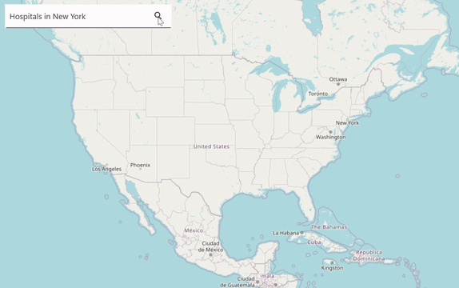

# AI-Driven Smart Location Search in .NET MAUI Maps (SfMaps)

This document provides a comprehensive guide to implementing advanced search functionality within the Syncfusion [.NET MAUI Maps](https://help.syncfusion.com/cr/maui/Syncfusion.Maui.Maps.SfMaps.html) control. By integrating **Azure OpenAI**, this solution enables an intelligent, AI-powered location search experience.

N> **Prerequisite:** Ensure that the required NuGet packages are installed, the necessary namespaces are imported, and the **.NET MAUI Maps** control is properly configured in your application. For detailed setup and configuration instructions, refer to the **[.NET MAUI Maps Getting Started](https://help.syncfusion.com/maui/maps/getting-started)** guide. Also, refer to the **[.NET MAUI Autocomplete Getting Started](https://help.syncfusion.com/maui/autocomplete/getting-started)** guide before proceeding with this documentation.

## Integrating Azure OpenAI with the .NET MAUI app

First, open [Visual Studio](https://visualstudio.microsoft.com/) and [create a new .NET MAUI app](https://learn.microsoft.com/en-us/dotnet/maui/get-started/first-app?view=net-maui-7.0&tabs=vswin&pivots=devices-android).

To locate specific places effortlessly with AI, ensure that you have access to [Azure OpenAI](https://azure.microsoft.com/en-in/products/ai-services/openai-service) and have set up a deployment in the Azure portal. Install the following NuGet packages in the project from the [NuGet Gallery](https://www.nuget.org/):

* [Azure.AI.OpenAI](https://www.nuget.org/packages/Azure.AI.OpenAI/1.0.0-beta.12) (v1.0.0-beta.12 or later)
* [Newtonsoft.Json](https://www.nuget.org/packages/Newtonsoft.Json) (for JSON parsing)
* Syncfusion .NET MAUI Maps and Autocomplete NuGet packages

Once you get your key and endpoint, follow these steps:

### Step 1: Set up Azure OpenAI

To configure **Azure OpenAI**, use the **GPT-4O** deployment for text and the **DALL-E** deployment for images. Set up the `OpenAIClient` and the `ChatCompletionsOptions` as shown in the following code example.





internal class AzureOpenAIService
{
    const string endpoint = "https://{YOUR_END_POINT}.openai.azure.com";
    const string deploymentName = "GPT-4O";
    const string imageDeploymentName = "DALL-E";
    string key = "API key";
    
    internal OpenAIClient? Client { get; private set; }
    internal ChatCompletionsOptions? chatCompletions;
    
    internal AzureOpenAIService()
    {
        // Initialize the client and the chat completions options on demand.
        this.Client = new OpenAIClient(new Uri(endpoint), new AzureKeyCredential(key));
        this.chatCompletions = new ChatCompletionsOptions(deploymentName, new List<ChatRequestMessage>());
    }
}





### Step 2: Connect to the Azure OpenAI

To set up the connection to Azure OpenAI. Refer to the following code.





	// At the time of required.
    this.client = new OpenAIClient(new Uri(endpoint), new AzureKeyCredential(key)





This connection allows you to send prompts to the model and **receive responses**, which can be used to generate map markers for .NET MAUI Maps.

### Step 3: Get the result from the AI service

Implement the `GetResultsFromAI` and `GetImageFromAI` methods to retrieve responses from the **OpenAI** API based on user input. Clear the previous messages on each call to avoid accumulating stale context across searches.





public async Task<string> GetResultsFromAI(string userPrompt)
{
    if (this.Client != null && this.chatCompletions != null)
    {
        // Clear previous messages to avoid accumulating context across searches.
        this.chatCompletions.Messages.Clear();
        // Add the system message and user message to the options.
        this.chatCompletions.Messages.Add(new ChatRequestSystemMessage("You are a predictive analytics assistant."));
        this.chatCompletions.Messages.Add(new ChatRequestUserMessage(userPrompt));
        try
        {
            var response = await this.Client.GetChatCompletionsAsync(this.chatCompletions);
            return response.Value.Choices[0].Message.Content;
        }
        catch
        {
            return string.Empty;
        }
    }
    return string.Empty;
}

public async Task<Uri> GetImageFromAI(string? locationName)
{
    var imageGenerations = await this.Client!.GetImageGenerationsAsync(
        new ImageGenerationOptions()
        {
            Prompt = $"Share the {locationName} image. If the image is not available share common image based on the location",
            Size = ImageSize.Size1024x1024,
            Quality = ImageGenerationQuality.Standard,
            DeploymentName = imageDeploymentName,
        });
        var imageUrl = imageGenerations.Value.Data[0].Url;
        return new Uri(imageUrl.ToString());
}





The **AzureOpenAIService** class now offers a convenient way to interact with the **OpenAI** API and retrieve completion results based on the provided **prompt**.

## Integrating AI-powered smart location search in .NET MAUI Autocomplete

To design the AI-powered smart location search UI using the [.NET MAUI Autocomplete](https://www.syncfusion.com/maui-controls/maui-autocomplete) control, and then map the selected location into the **.NET MAUI Maps** control. Before proceeding, please refer to the getting started documentation for both the Syncfusion **.NET MAUI Maps** and **Autocomplete** controls.

### Step 1: Create a custom marker model

Create a custom marker model to define geographic location information for **.NET MAUI Maps** tile layer markers. The model can also include a name, details, address, and image to provide additional information for the **marker tooltip**. The `Image` property holds the AI-generated image URI, and `ImageName` is reserved for an alternative local image name if needed.





public class CustomMarker : MapMarker
{
    public string? Name { get; set; }

    public string? Details { get; set; }
    
    public Uri? Image { get; set; }

    public string? Address { get; set; }

    public string? ImageName { get; set; }
}





### Step 2: Add Maps tile layer in .NET MAUI Maps

Add a [tile layer](https://help.syncfusion.com/maui/maps/getting-started#add-tile-layer) in the .NET MAUI Maps that can be used to search for and locate landmarks based on user input. The `EnableCenterAnimation` property animates the map center change, `CanCacheTiles` enables local tile caching for faster reloads, and `ZoomLevel` sets the initial magnification.

N> The OpenStreetMap tile URL used here is subject to the [OSM Tile Usage Policy](https://operations.osmfoundation.org/policies/tiles/). Use a suitable tile provider for production and respect the provider's usage limits.





<maps:SfMaps x:Name="maps">
    <maps:SfMaps.Layer>
        <maps:MapTileLayer x:Name="mapTileLayer"
                           UrlTemplate="https://tile.openstreetmap.org/{z}/{x}/{y}.png"
                           CanCacheTiles="True"
                           EnableCenterAnimation="True"
                           ShowMarkerTooltip="True">
            <maps:MapTileLayer.Center>
                <maps:MapLatLng x:Name="mapLatLng"
                                Latitude="37.0902"
                                Longitude="-95.7129">
                </maps:MapLatLng>
            </maps:MapTileLayer.Center>
            
            <maps:MapTileLayer.ZoomPanBehavior>
                <maps:MapZoomPanBehavior x:Name="zoomPanBehavior"
                                         ZoomLevel="4"
                                         MinZoomLevel="4"
                                         MaxZoomLevel="18"
                                         EnableDoubleTapZooming="True" />
            </maps:MapTileLayer.ZoomPanBehavior>
        </maps:MapTileLayer>
    </maps:SfMaps.Layer>
</maps:SfMaps>





### Step 3: Customize the .NET MAUI Maps marker and tooltips

Customize the .NET MAUI Maps markers and tooltips to display relevant information, improving the overall user experience on the map. The `MarkerTemplate` defines the marker icon, while `MarkerTooltipTemplate` selects the tooltip layout via a `DataTemplateSelector`. The `MarkerTooltipSettings` configure the tooltip appearance (for example, a transparent background) so that the custom tooltip `DataTemplate` controls the visuals.





<Grid.Resources>
    <ResourceDictionary>
        <DataTemplate x:Key="MarkerTemplate">
            <StackLayout IsClippedToBounds="false"
                         HorizontalOptions="Start"
                         VerticalOptions="Start"
                         HeightRequest="30">
                <Image Source="map_pin.png"
                       Scale="1"
                       Aspect="AspectFit"
                       HorizontalOptions="Start"
                       VerticalOptions="Start"
                       HeightRequest="30"
                       WidthRequest="30" />
            </StackLayout>
        </DataTemplate>
      
        <DataTemplate x:Key="DetailTemplate">
            <Frame HasShadow="True" Margin="0" Padding="0" CornerRadius="10" WidthRequest="250">
                <StackLayout BackgroundColor="Transparent" Orientation="Vertical">
                    <Image Source="{Binding DataItem.Image}" HeightRequest="120" Margin="0" WidthRequest="250" Aspect="AspectFill"/>
                    <Label Grid.Row="1" Text="{Binding DataItem.Name}" FontAttributes="Bold" FontSize="12" LineBreakMode="WordWrap" Padding="10,5,0,0"/>
                    <Label Grid.Row="2" Text="{Binding DataItem.Details}" LineBreakMode="WordWrap" FontSize="10" Padding="10,0,0,0"/>
                    <Label Grid.Row="3" Padding="10,0,0,5">
                        <Label.FormattedText>
                            <FormattedString>
                                <Span Text="&#xe76e;" FontSize="8" FontFamily="MauiSampleFontIcon"/>
                                <Span Text="{Binding DataItem.Address}" FontSize="10"/>
                            </FormattedString>
                        </Label.FormattedText>
                    </Label>
                </StackLayout>
            </Frame>
        </DataTemplate>
      
        <DataTemplate x:Key="NormalTemplate">
            <Frame HasShadow="True" Margin="0" Padding="0" CornerRadius="10" WidthRequest="250">
                <StackLayout BackgroundColor="Transparent" Orientation="Vertical">
                    <Image Source="{Binding DataItem.Image}" HeightRequest="120" Margin="0" WidthRequest="250" Aspect="AspectFill"/>
                    <Label Grid.Row="1" Text="{Binding DataItem.Name}" FontAttributes="Bold" FontSize="12" LineBreakMode="WordWrap" Padding="10,5,0,0"/>
                    <Label Grid.Row="2" Text="{Binding DataItem.Details}" LineBreakMode="WordWrap" FontSize="10" Padding="10,0,0,5"/>
                </StackLayout>
            </Frame>
        </DataTemplate>
        
        <local:MarkerTemplateSelector x:Key="MarkerTemplateSelector"
                                      DetailTemplate="{StaticResource DetailTemplate}"
                                      NormalTemplate="{StaticResource NormalTemplate}"/>
    </ResourceDictionary>
</Grid.Resources>

<maps:SfMaps x:Name="maps">
    <maps:SfMaps.Layer>
        <!-- code omitted for brevity -->
        <maps:MapTileLayer x:Name="mapTileLayer"
                           UrlTemplate="https://tile.openstreetmap.org/{z}/{x}/{y}.png"
                           CanCacheTiles="True"
                           EnableCenterAnimation="True"
                           ShowMarkerTooltip="True"
                           MarkerTooltipTemplate="{StaticResource MarkerTemplateSelector}"
                           MarkerTemplate="{StaticResource MarkerTemplate}">
            <maps:MapTileLayer.MarkerTooltipSettings>
                <maps:MapTooltipSettings Background="Transparent"/>
            </maps:MapTileLayer.MarkerTooltipSettings>
        </maps:MapTileLayer>
    </maps:SfMaps.Layer>
</maps:SfMaps>





Refer to the following code example to select the marker tooltip data template.





public class MarkerTemplateSelector : DataTemplateSelector
{
    public DataTemplate? NormalTemplate { get; set; }
    public DataTemplate? DetailTemplate { get; set; }
    
    protected override DataTemplate? OnSelectTemplate(object item, BindableObject container)
    {
        var customMarker = (CustomMarker)item;
        return customMarker.Address == null ? NormalTemplate : DetailTemplate;
    }
}





### Step 4: Integrate .NET MAUI Autocomplete in the searching UI

Add the .NET MAUI Autocomplete control to collect the user input, which can then be passed to an AI service to retrieve geometric details.

N> The tooltip uses a custom `MauiSampleFontIcon` font family. Register custom fonts in `MauiProgram.cs` by adding them to the `ConfigureFonts` pipeline (see the [Fonts](https://learn.microsoft.com/en-us/dotnet/maui/user-interface/fonts) documentation).

Refer to the following code example to add the .NET MAUI Autocomplete control and design a search button. The button is wired to the `OnSearchClicked` handler (shown in Step 5) that calls `GetRecommendationAsync`.





<!-- code omitted for brevity -->
<HorizontalStackLayout VerticalOptions="Start" IsClippedToBounds="False" HorizontalOptions="Start" WidthRequest="{OnPlatform Default=350, Android=300}" Margin="10" IsVisible="True">
    <!-- Get location inputs from users to find a location -->
    <editors:SfAutocomplete x:Name="autoComplete"
                            IsClearButtonVisible="False"
                            HorizontalOptions="Start"
                            WidthRequest="{OnPlatform Default=350, Android=300}"
                            HeightRequest="50"
                            DropDownItemHeight="50" 
                            Text="Hospitals in New York">
    </editors:SfAutocomplete>
    
    <!-- Location Search button -->
    <Button x:Name="button"
            Text="&#xe713;"
            Margin="-55,0,0,0"
            BackgroundColor="Transparent"
            BorderColor="Transparent"
            FontSize="20"
            TextColor="Black"
            FontFamily="MauiSampleFontIcon"
            HeightRequest="50"
            WidthRequest="50"
            Clicked="OnSearchClicked"/>
</HorizontalStackLayout>





### Step 5: Enable AI-powered smart searching in .NET MAUI Maps

Add the **prompt** that asks the AI service to convert the user input into geographic locations in **JSON** format. The **JSON** data is then parsed into custom markers, which are added to the **.NET MAUI Maps** by using the **Markers** property of the **MapTileLayer** class. The expected JSON shape is shown below.

```json
{
  "markercollections": [
    {
      "Name": "NYU Langone Hospital",
      "Details": "A leading academic medical center.",
      "Latitude": "40.7420",
      "Longitude": "-73.9740",
      "Address": "550 First Avenue, New York, NY 10016"
    }
  ]
}
```

The following code declares the page fields (`azureAIHelper`, `customMarkers`, `busyIndicator`), the `OnSearchClicked` button handler, the helper that converts string latitude/longitude values to `double`, and the `GetRecommendationAsync` method with error handling for malformed AI responses.





// code omitted for brevity
private AzureOpenAIService azureAIHelper;
private ObservableCollection<CustomMarker> customMarkers;
private SfBusyIndicator? busyIndicator;

private async void OnSearchClicked(object sender, EventArgs e)
{
    if (this.autoComplete != null)
    {
        await this.GetRecommendationAsync(this.autoComplete.Text);
    }
}

// Converts a string latitude/longitude value to a double using an invariant culture
// so that culture-specific decimal separators do not break parsing.
private static double StringToDoubleConverter(string? value)
{
    if (double.TryParse(value, System.Globalization.NumberStyles.Any,
        System.Globalization.CultureInfo.InvariantCulture, out double result))
    {
        return result;
    }
    return 0;
}

private async Task GetRecommendationAsync(string userQuery)
{
    if (this.autoComplete == null || this.mapTileLayer == null || this.zoomPanBehavior == null)
    {
        return;
    }
    
    if (string.IsNullOrWhiteSpace(this.autoComplete.Text))
    {
        return;
    }
    
    if (this.busyIndicator != null)
    {
        this.busyIndicator.IsVisible = true;
        this.busyIndicator.IsRunning = true;
    }
     
    // Prompt that asks the AI service to convert the user input into geographic locations.
    string prompt = $"Given location name: {userQuery}" +
       $"\nSome conditions need to follow:" +
       $"\nCheck the location name is just a state, city, capital or region, then retrieve the following fields: location name, detail, latitude, longitude, and set address value as null" +
       $"\nOtherwise, retrieve minimum 5 to 6 entries with following fields: location's name, details, latitude, longitude, address." +
       $"\nThe return format should be the following JSON format: markercollections[Name, Details, Latitude, Longitude, Address]" +
       $"\nRemove ```json and remove ``` if it is there in the code." +
       $"\nProvide JSON format details only, No need any explanation.";

    try
    {
        var returnMessage = await this.azureAIHelper.GetResultsFromAI(prompt);
        if (string.IsNullOrWhiteSpace(returnMessage))
        {
            this.busyIndicator.IsVisible = false;
            this.busyIndicator.IsRunning = false;
            return;
        }

        var jsonObj = JObject.Parse(returnMessage);
        var markerCollections = jsonObj["markercollections"];

        this.customMarkers?.Clear();
        if (markerCollections != null)
        {
            foreach (var marker in markerCollections)
            {
                CustomMarker customMarker = new CustomMarker();
                customMarker.Name = (string?)marker["Name"];
                customMarker.Details = (string?)marker["Details"];
                customMarker.Address = (string?)marker["Address"];
                customMarker.Latitude = StringToDoubleConverter((string?)marker["Latitude"]);
                customMarker.Longitude = StringToDoubleConverter((string?)marker["Longitude"]);
                if (this.azureAIHelper.Client != null)
                {
                    customMarker.Image = await this.azureAIHelper.GetImageFromAI(customMarker.Name);
                    customMarker.ImageName = string.Empty;
                }
                // JSON data is then parsed into custom markers to add in .NET MAUI Maps.
                this.customMarkers?.Add(customMarker);
            }
        }

        this.mapTileLayer.Markers = this.customMarkers;
        this.mapTileLayer.EnableCenterAnimation = true;
        if (this.customMarkers != null && this.customMarkers.Count > 0)
        {
            var firstMarker = this.customMarkers[0];
            this.mapTileLayer.Center = new MapLatLng
            {
                Latitude = firstMarker.Latitude,
                Longitude = firstMarker.Longitude,
            };

            if (this.azureAIHelper.Client != null)
            {
                this.zoomPanBehavior.ZoomLevel = 10;
            }
        }
    }
    catch (Exception)
    {
        // AI responses can be non-JSON or malformed; surface an empty result set.
        this.customMarkers?.Clear();
        this.mapTileLayer.Markers = this.customMarkers;
    }
    finally
    {
        if (this.busyIndicator != null)
        {
            this.busyIndicator.IsVisible = false;
            this.busyIndicator.IsRunning = false;
        }
    }
}







You can find the complete sample from this [link](https://github.com/SyncfusionExamples/Integrating-AI-Driven-Location-Search-into-.NET-MAUI-Maps).