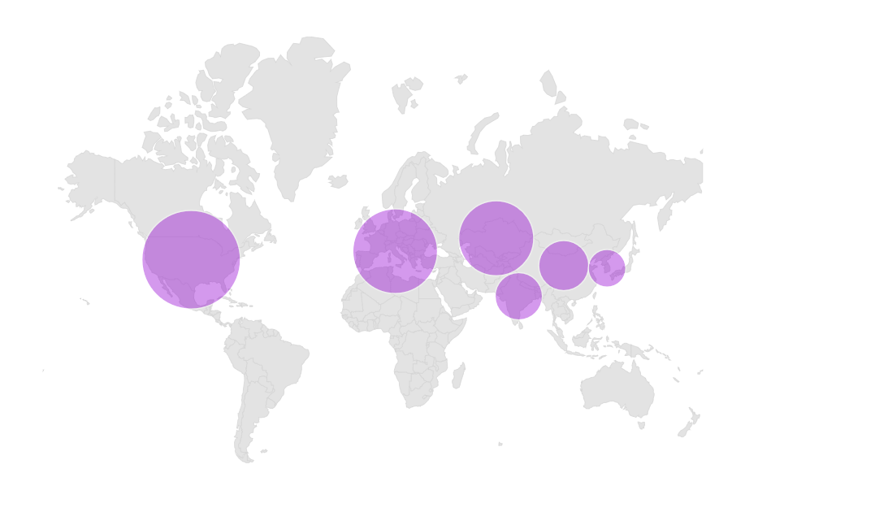
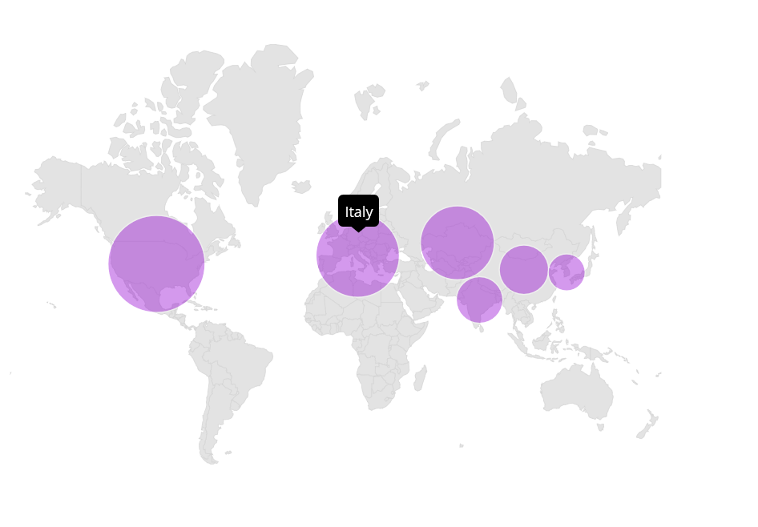
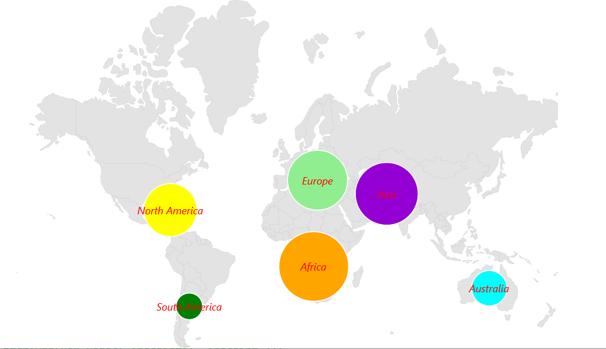
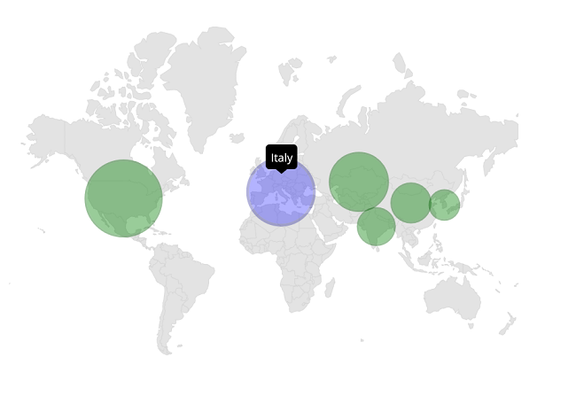

# Bubbles in .NET MAUI Maps (SfMaps)

N> **Prerequisite:** Ensure that the required NuGet package is installed, the necessary namespaces are imported, and the **.NET MAUI Maps** control is properly configured in your application. For detailed setup and configuration instructions, refer to the **[Getting Started](https://help.syncfusion.com/maui/maps/getting-started)** guide.

Bubbles can be rendered in different colors and sizes based on the data values of their assigned shape. You can add information to shapes such as population density, number of users, and more. 

To learn more about the .NET MAUI Maps bubbles, you can check the following video.

 <iframe id='MAUIMapsVideoTutorial' src="https://www.youtube.com/embed/mNkPkNfYG0g?start=82"></iframe>

## Enable bubbles

You can enable bubbles using the [`ShowBubbles`](https://help.syncfusion.com/cr/maui/Syncfusion.Maui.Maps.MapShapeLayer.html#Syncfusion_Maui_Maps_MapShapeLayer_ShowBubbles) property. You can customize the bubbles using the [`BubbleSettings`](https://help.syncfusion.com/cr/maui/Syncfusion.Maui.Maps.MapShapeLayer.html#Syncfusion_Maui_Maps_MapShapeLayer_BubbleSettings) property, which lets you specify the values that drive the bubble size (via [`SizeValuePath`](https://help.syncfusion.com/cr/maui/Syncfusion.Maui.Maps.MapBubbleSettings.html#Syncfusion_Maui_Maps_MapBubbleSettings_SizeValuePath)) and the bubble color (via [`ColorValuePath`](https://help.syncfusion.com/cr/maui/Syncfusion.Maui.Maps.MapBubbleSettings.html#Syncfusion_Maui_Maps_MapBubbleSettings_ColorValuePath)). When both [`Fill`](https://help.syncfusion.com/cr/maui/Syncfusion.Maui.Maps.MapBubbleSettings.html#Syncfusion_Maui_Maps_MapBubbleSettings_Fill) and `ColorValuePath` are set, the `ColorValuePath`-based color mapping (if any) takes precedence over the static `Fill`.

N> The XAML samples in this document bind `DataSource="{Binding Data}"`. Set the page `BindingContext` to a `ViewModel` instance for the XAML binding to work, as shown in the C# samples.





<!-- code omitted for brevity -->
<map:SfMaps>
    <map:SfMaps.Layer>
        <map:MapShapeLayer ShapesSource="https://cdn.syncfusion.com/maps/map-data/world-map.json"
                           DataSource="{Binding Data}"
                           PrimaryValuePath="State" 
                           ShapeDataField="name" 
                           ShowBubbles="True">

            <map:MapShapeLayer.BubbleSettings>
                <map:MapBubbleSettings ColorValuePath="Population" 
                                       SizeValuePath="Population" 
                                       Fill="DarkViolet"
                                       MinSize="30"
                                       MaxSize="80">
                </map:MapBubbleSettings>
            </map:MapShapeLayer.BubbleSettings>
        </map:MapShapeLayer>
    </map:SfMaps.Layer>
</map:SfMaps>





public MainPage()
{
   InitializeComponent();
   ViewModel viewModel = new ViewModel();
   this.BindingContext = viewModel;
   SfMaps maps = new SfMaps();
   MapShapeLayer layer = new MapShapeLayer();
   layer.ShapesSource = MapSource.FromUri(new Uri("https://cdn.syncfusion.com/maps/map-data/world-map.json"));
   layer.DataSource = viewModel.Data;
   layer.PrimaryValuePath = "State";
   layer.ShapeDataField = "name";
   layer.ShowBubbles = true;

   MapBubbleSettings bubbleSettings = new MapBubbleSettings()
   {
       ColorValuePath = "Population",
       SizeValuePath = "Population",
       Fill = Colors.DarkViolet,
       MinSize = 30,
       MaxSize = 80
   };

   layer.BubbleSettings = bubbleSettings;
   maps.Layer = layer;
   this.Content = maps;
}

public class ViewModel
{
    public ObservableCollection<Model> Data { get; set; }
	
    public ViewModel()
    {
        Data = new ObservableCollection<Model>();
        Data.Add(new Model("India", 21));
        Data.Add(new Model("United States", 58));
        Data.Add(new Model("Kazakhstan", 41));
        Data.Add(new Model("Italy", 48));
        Data.Add(new Model("Korea", 14));
        Data.Add(new Model("China", 23));
    }
}

public class Model
{
    public string State { get; set; }
    public int Population { get; set; }
	
    public Model(string state, int population)
    {
        State = state;
        Population = population;
    }
}





## Tooltip for the bubbles

You can enable a tooltip for the bubbles using the [`ShowBubbleTooltip`](https://help.syncfusion.com/cr/maui/Syncfusion.Maui.Maps.MapShapeLayer.html#Syncfusion_Maui_Maps_MapShapeLayer_ShowBubbleTooltip) property. It can be used to clearly indicate the information about the currently interacted bubble. The following sample extends the enable-bubbles sample by adding `ShowBubbleTooltip` and setting the shape hover fill/stroke to `Transparent` so that shape hover effects do not visually interfere with the bubble tooltip.





<!-- code omitted for brevity -->
<map:SfMaps>
    <map:SfMaps.Layer>
        <map:MapShapeLayer ShapesSource="https://cdn.syncfusion.com/maps/map-data/world-map.json"
                           DataSource="{Binding Data}"
                           PrimaryValuePath="State" 
                           ShapeDataField="name" 
                           ShapeHoverFill="Transparent" 
                           ShapeHoverStroke="Transparent"
                           ShowBubbles="True"
                           ShowBubbleTooltip="True">

            <map:MapShapeLayer.BubbleSettings>
                <map:MapBubbleSettings ColorValuePath="Population" 
                                       SizeValuePath="Population" 
                                       Fill="DarkViolet"
                                       MinSize="30"
                                       MaxSize="80">
                </map:MapBubbleSettings>
            </map:MapShapeLayer.BubbleSettings>
        </map:MapShapeLayer>
    </map:SfMaps.Layer>
</map:SfMaps>





public MainPage()
{
   InitializeComponent();
   ViewModel viewModel = new ViewModel();
   this.BindingContext = viewModel;
   SfMaps maps = new SfMaps();
   MapShapeLayer layer = new MapShapeLayer();
   layer.ShapesSource = MapSource.FromUri(new Uri("https://cdn.syncfusion.com/maps/map-data/world-map.json"));
   layer.DataSource = viewModel.Data;
   layer.PrimaryValuePath = "State";
   layer.ShapeDataField = "name";
   layer.ShapeHoverFill = Colors.Transparent;
   layer.ShapeHoverStroke = Colors.Transparent;
   layer.ShowBubbles = true;
   layer.ShowBubbleTooltip = true;

   MapBubbleSettings bubbleSettings = new MapBubbleSettings()
   {
       ColorValuePath = "Population",
       SizeValuePath = "Population",
       Fill = Colors.DarkViolet,
       MinSize = 30,
       MaxSize = 80
   };

   layer.BubbleSettings = bubbleSettings;
   maps.Layer = layer;
   this.Content = maps;
}

public class ViewModel
{
    public ObservableCollection<Model> Data { get; set; }
	
    public ViewModel()
    {
        Data = new ObservableCollection<Model>();
        Data.Add(new Model("India", 21));
        Data.Add(new Model("United States", 58));
        Data.Add(new Model("Kazakhstan", 41));
        Data.Add(new Model("Italy", 48));
        Data.Add(new Model("Korea", 14));
        Data.Add(new Model("China", 23));
    }
}

public class Model
{
    public String State { get; set; }
    public int Population { get; set; }
	
    public Model(string state, int population)
    {
        State = state;
        Population = population;
    }
}





## Bubble color customization

You can customize the bubble color based on the value from the [`ColorValuePath`](https://help.syncfusion.com/cr/maui/Syncfusion.Maui.Maps.MapBubbleSettings.html#Syncfusion_Maui_Maps_MapBubbleSettings_ColorValuePath) property. If it provides a direct color value, it applies directly to the bubbles. Otherwise, you must provide [`ColorMappings`](https://help.syncfusion.com/cr/maui/Syncfusion.Maui.Maps.MapBubbleSettings.html#Syncfusion_Maui_Maps_MapBubbleSettings_ColorMappings).

The value from the [`ColorValuePath`](https://help.syncfusion.com/cr/maui/Syncfusion.Maui.Maps.MapBubbleSettings.html#Syncfusion_Maui_Maps_MapBubbleSettings_ColorValuePath) will be used for the comparison in the [`EqualColorMapping.Value`](https://help.syncfusion.com/cr/maui/Syncfusion.Maui.Maps.EqualColorMapping.html) or [`RangeColorMapping.From`](https://help.syncfusion.com/cr/maui/Syncfusion.Maui.Maps.RangeColorMapping.html#Syncfusion_Maui_Maps_RangeColorMapping_From) and [`RangeColorMapping.To`](https://help.syncfusion.com/cr/maui/Syncfusion.Maui.Maps.RangeColorMapping.html#Syncfusion_Maui_Maps_RangeColorMapping_To). Then, the [`RangeColorMapping.Color`](https://help.syncfusion.com/cr/maui/Syncfusion.Maui.Maps.ColorMapping.html#Syncfusion_Maui_Maps_ColorMapping_Color) or [`EqualColorMapping.Color`](https://help.syncfusion.com/cr/maui/Syncfusion.Maui.Maps.ColorMapping.html#Syncfusion_Maui_Maps_ColorMapping_Color) will be applied to the respective bubble.

N> The `EqualColorMapping.Value` is compared as a string against the value resolved from the [`ColorValuePath`](https://help.syncfusion.com/cr/maui/Syncfusion.Maui.Maps.MapBubbleSettings.html#Syncfusion_Maui_Maps_MapBubbleSettings_ColorValuePath) field. To map a range of numeric values instead of exact matches, use [`RangeColorMapping`](https://help.syncfusion.com/cr/maui/Syncfusion.Maui.Maps.RangeColorMapping.html) with its `From`, `To`, and `Color` properties.





<!-- code omitted for brevity -->
<map:SfMaps>
    <map:SfMaps.Layer>
        <map:MapShapeLayer ShapesSource="https://cdn.syncfusion.com/maps/map-data/world-map.json"
                           DataSource="{Binding Data}" 
                           PrimaryValuePath="State" 
                           ShapeDataField="name" 
                           ShowBubbles="True">
            <map:MapShapeLayer.BubbleSettings>

            <map:MapBubbleSettings ColorValuePath="Population" 
                                   SizeValuePath="Population" 
                                   MinSize="30"
                                   MaxSize="80">

                    <map:MapBubbleSettings.ColorMappings>
                        <map:EqualColorMapping Color="DarkViolet" Value="21"/>
                        <map:EqualColorMapping Color="Orange" Value="58"/>
                        <map:EqualColorMapping Color="Yellow" Value="41"/>
                        <map:EqualColorMapping Color="LightGreen" Value="48"/>
                        <map:EqualColorMapping Color="Green" Value="14"/>
                        <map:EqualColorMapping Color="Aqua" Value="23"/>
                    </map:MapBubbleSettings.ColorMappings>
            </map:MapBubbleSettings>
            </map:MapShapeLayer.BubbleSettings>

        </map:MapShapeLayer>
    </map:SfMaps.Layer>
</map:SfMaps>





public MainPage()
{
    InitializeComponent();
    ViewModel viewModel = new ViewModel();
    this.BindingContext = viewModel;

    SfMaps maps = new SfMaps();
    MapShapeLayer layer = new MapShapeLayer();
    layer.ShapesSource = MapSource.FromUri(new Uri("https://cdn.syncfusion.com/maps/map-data/world-map.json"));
    layer.DataSource = viewModel.Data;
    layer.PrimaryValuePath = "State";
    layer.ShapeDataField = "name";
    layer.ShowBubbles = true;

    MapBubbleSettings bubbleSettings = new MapBubbleSettings()
    {
        ColorValuePath = "Population",
        SizeValuePath = "Population",
        Opacity = 1,
        MinSize = 30,
        MaxSize = 80,
    };
	
    bubbleSettings.ColorMappings.Add(new EqualColorMapping()
    {
        Color = Colors.DarkViolet,
        Value = "21"
    });
    bubbleSettings.ColorMappings.Add(new EqualColorMapping()
    {
        Color = Colors.Orange,
        Value = "58"
    });
    bubbleSettings.ColorMappings.Add(new EqualColorMapping()
    {
        Color = Colors.Yellow,
        Value = "41"
    });
    bubbleSettings.ColorMappings.Add(new EqualColorMapping()
    {
        Color = Colors.LightGreen,
        Value = "48"
    });
    bubbleSettings.ColorMappings.Add(new EqualColorMapping()
    {
        Color = Colors.Green,
        Value = "14"
    });
    bubbleSettings.ColorMappings.Add(new EqualColorMapping()
    {
        Color = Colors.Aqua,
        Value = "23"
    });

    layer.BubbleSettings = bubbleSettings;
    maps.Layer = layer;
    this.Content = maps;
}
	
public class ViewModel
{
    public ObservableCollection<Model> Data { get; set; }
	
    public ViewModel()
    {
        Data = new ObservableCollection<Model>();
        Data.Add(new Model("India", 21));
        Data.Add(new Model("United States", 58));
        Data.Add(new Model("Kazakhstan", 41));
        Data.Add(new Model("Italy", 48));
        Data.Add(new Model("Korea", 14));
        Data.Add(new Model("China", 23));
    }
}

public class Model
{
    public String State { get; set; }
    public int Population { get; set; }
	
    public Model(string state, int population)
    {
        State = state;
        Population = population;
    }
}





## Appearance customization

You can customize the appearance of the bubbles as follows.

* **MinSize** - Change the minimum radius of the bubbles using the [`MinSize`](https://help.syncfusion.com/cr/maui/Syncfusion.Maui.Maps.MapBubbleSettings.html#Syncfusion_Maui_Maps_MapBubbleSettings_MinSize) property. The default value of the [`MinSize`](https://help.syncfusion.com/cr/maui/Syncfusion.Maui.Maps.MapBubbleSettings.html#Syncfusion_Maui_Maps_MapBubbleSettings_MinSize) property is `20.0`.
* **MaxSize** - Change the maximum radius of the bubbles using the [`MaxSize`](https://help.syncfusion.com/cr/maui/Syncfusion.Maui.Maps.MapBubbleSettings.html#Syncfusion_Maui_Maps_MapBubbleSettings_MaxSize) property. The default value of the [`MaxSize`](https://help.syncfusion.com/cr/maui/Syncfusion.Maui.Maps.MapBubbleSettings.html#Syncfusion_Maui_Maps_MapBubbleSettings_MaxSize) property is `50.0`.
* **Fill** - Change the background color of the bubbles using the [`Fill`](https://help.syncfusion.com/cr/maui/Syncfusion.Maui.Maps.MapBubbleSettings.html#Syncfusion_Maui_Maps_MapBubbleSettings_Fill) property. The default value is `Color.FromArgb("#80FFFFFF")`.
* **Stroke** - Change the stroke color of the bubbles using the [`Stroke`](https://help.syncfusion.com/cr/maui/Syncfusion.Maui.Maps.MapBubbleSettings.html#Syncfusion_Maui_Maps_MapBubbleSettings_Stroke) property. The default value is `Color.FromArgb("#FFFFFF54")`.
* **StrokeThickness** - Change the stroke width of the bubbles using the [`StrokeThickness`](https://help.syncfusion.com/cr/maui/Syncfusion.Maui.Maps.MapBubbleSettings.html#Syncfusion_Maui_Maps_MapBubbleSettings_StrokeThickness) property. The default value is `2.0`.
* **HoverFill** - Change the hover color of the bubbles using the [`HoverFill`](https://help.syncfusion.com/cr/maui/Syncfusion.Maui.Maps.MapBubbleSettings.html#Syncfusion_Maui_Maps_MapBubbleSettings_HoverFill) property. The default value is `Color.FromArgb("#9BBDDEDD")`.
* **HoverStroke** - Change the hover stroke color of the bubbles using the [`HoverStroke`](https://help.syncfusion.com/cr/maui/Syncfusion.Maui.Maps.MapBubbleSettings.html#Syncfusion_Maui_Maps_MapBubbleSettings_HoverStroke) property. The default value is `Color.FromArgb("#FF80CBC4")`.
* **HoverStrokeThickness** - Change the hover stroke thickness of the bubbles using the [`HoverStrokeThickness`](https://help.syncfusion.com/cr/maui/Syncfusion.Maui.Maps.MapBubbleSettings.html#Syncfusion_Maui_Maps_MapBubbleSettings_HoverStrokeThickness) property. The default value is `2.0`.
* **Opacity** - Change the opacity of the bubbles using the [`Opacity`](https://help.syncfusion.com/cr/maui/Syncfusion.Maui.Maps.MapBubbleSettings.html#Syncfusion_Maui_Maps_MapBubbleSettings_Opacity) property. The default value is `1.0`.





<!-- code omitted for brevity -->
<map:SfMaps>
    <map:SfMaps.Layer>
        <map:MapShapeLayer ShapesSource="https://cdn.syncfusion.com/maps/map-data/world-map.json"
                           DataSource="{Binding Data}"
                           PrimaryValuePath="State" 
                           ShapeDataField="name"
                           ShapeHoverFill = "Transparent" 
                           ShapeHoverStroke="Transparent"
                           ShowBubbles="True"
                           ShowBubbleTooltip="True" >

            <map:MapShapeLayer.BubbleSettings>
                <map:MapBubbleSettings ColorValuePath="Population" 
                                       SizeValuePath="Population" 
                                       Fill="Green"
                                       Stroke="DarkGreen"
                                       StrokeThickness="2"
                                       HoverFill="Blue"
                                       HoverStroke="DarkBlue"
                                       HoverStrokeThickness="3"
                                       Opacity="1"
                                       MinSize="30"
                                       MaxSize="80">
                </map:MapBubbleSettings>
            </map:MapShapeLayer.BubbleSettings>
        </map:MapShapeLayer>
    </map:SfMaps.Layer>
</map:SfMaps>





public MainPage()
{
   InitializeComponent();
    ViewModel viewModel = new ViewModel();
    this.BindingContext = viewModel;
    SfMaps maps = new SfMaps();
    MapShapeLayer layer = new MapShapeLayer();
    layer.ShapesSource = MapSource.FromUri(new Uri("https://cdn.syncfusion.com/maps/map-data/world-map.json"));
    layer.DataSource = viewModel.Data;
    layer.PrimaryValuePath = "State";
    layer.ShapeDataField = "name";
    layer.ShapeHoverFill = Colors.Transparent;
    layer.ShapeHoverStroke = Colors.Transparent;
    layer.ShowBubbles = true;
    layer.ShowBubbleTooltip = true;

    MapBubbleSettings bubbleSettings = new MapBubbleSettings()
    {
        ColorValuePath = "Population",
        SizeValuePath = "Population",
        Fill = Colors.Green,
        Stroke = Colors.DarkGreen,
        StrokeThickness = 2,
        HoverFill = Colors.Blue,
        HoverStroke = Colors.DarkBlue,
        HoverStrokeThickness = 3,
        Opacity = 1,
        MinSize = 30,
        MaxSize = 80
    };

    layer.BubbleSettings = bubbleSettings;
    maps.Layer = layer;
    this.Content = maps;
}

public class ViewModel
{
    public ObservableCollection<Model> Data { get; set; }
	
    public ViewModel()
    {
        Data = new ObservableCollection<Model>();
        Data.Add(new Model("India", 21));
        Data.Add(new Model("United States", 58));
        Data.Add(new Model("Kazakhstan", 41));
        Data.Add(new Model("Italy", 48));
        Data.Add(new Model("Korea", 14));
        Data.Add(new Model("China", 23));
    }
}

public class Model
{
    public String State { get; set; }
    public int Population { get; set; }
	
    public Model(string state, int population)
    {
        State = state;
        Population = population;
    }
}





N> You can refer to our [.NET MAUI Maps](https://www.syncfusion.com/maui-controls/maui-maps) feature tour page for its groundbreaking feature representations.
 
N> You can also explore our [.NET MAUI Maps Bubble example](https://github.com/syncfusion/maui-demos/) that shows how to configure Maps in .NET MAUI.