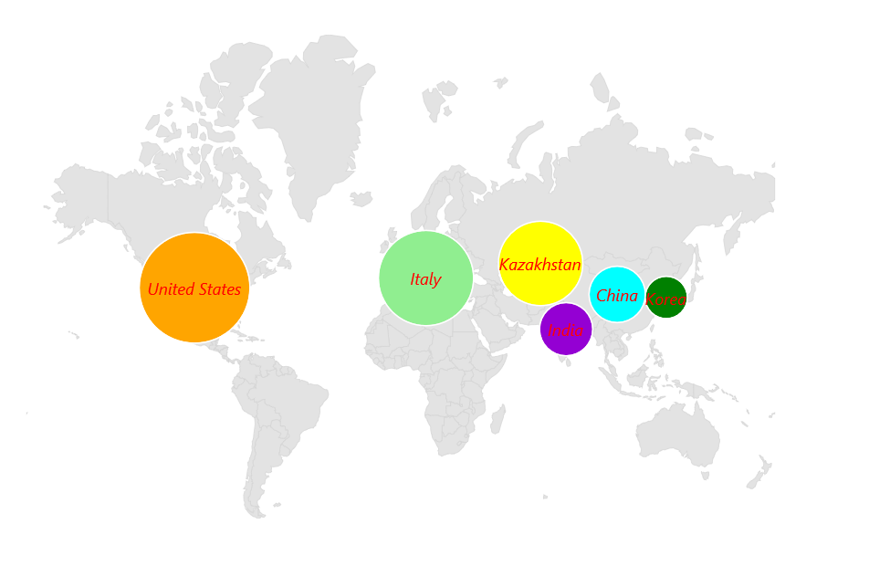

# Bubbles in MAUI Maps (SfMaps)

Bubbles can be rendered in different colors and sizes based on the data values of their assigned shape. You can add information to shapes such as population density, number of users, and more. 

## Enable bubbles

You can enable bubbles using the [`ShowBubbles`](). You can customize a bubbles using the [`BubbleSettings`](). This property is used to specify the value based on which the bubble's size has to be rendered.





     <map:SfMaps>
        <map:SfMaps.Layer>
            <map:MapShapeLayer ShapesSource="https://cdn.syncfusion.com/maps/map-data/world-map.json"
							   DataSource="{Binding Data}"
							   PrimaryValuePath="State" 
							   ShapeDataField="name" 
							   ShowBubbles="True">

              <map:MapShapeLayer.BubbleSettings>
                  <map:MapBubbleSettings ColorValuePath="Population" 
       									 SizeValuePath="Population" 
       									 Fill="DarkViolet"
       									 MinSize="30"
       									 MaxSize="80">
                  </map:MapBubbleSettings>
              </map:MapShapeLayer.BubbleSettings>
            </map:MapShapeLayer>
        </map:SfMaps.Layer>
    </map:SfMaps>





public MainPage()
{
   InitializeComponent();
   ViewModel viewModel = new ViewModel();
   this.BindingContext = viewModel;
   SfMaps maps = new SfMaps();
   MapShapeLayer layer = new MapShapeLayer();
   layer.ShapesSource = MapSource.FromUri(new Uri("https://cdn.syncfusion.com/maps/map-data/world-map.json"));
   layer.DataSource = viewModel.Data;
   layer.PrimaryValuePath = "State";
   layer.ShapeDataField = "name";
   layer.ShowBubbles = true;

   MapBubbleSettings bubbleSetting = new MapBubbleSettings()
   {
       ColorValuePath = "Population",
       SizeValuePath = "Population",
       Fill = Colors.DarkViolet,
       MinSize = 30,
       MaxSize = 80
   };

   layer.BubbleSettings = bubbleSetting;
   maps.Layer = layer;
   this.Content = maps;
}

public class ViewModel
{
    public ObservableCollection<Model> Data { get; set; }
	
    public ViewModel()
    {
        Data = new ObservableCollection<Model>();
        Data.Add(new Model("India", 21));
        Data.Add(new Model("United States", 58));
        Data.Add(new Model("Kazakhstan", 41));
        Data.Add(new Model("Italy", 48));
        Data.Add(new Model("Korea", 14));
        Data.Add(new Model("China", 23));
    }
}

public class Model
{
    public String State { get; set; }
    public int Population { get; set; }
	
    public Model(string state, int population)
    {
        State = state;
        Population = population;
    }
}





## Tooltip for the bubbles

You can enable tooltip for the bubbles using the [`ShowBubbleTooltip`]() property. It can be used to indicate clearly the information about the currently interacted bubble.





     <map:SfMaps>
        <map:SfMaps.Layer>
            <map:MapShapeLayer ShapesSource="https://cdn.syncfusion.com/maps/map-data/world-map.json"
   							   DataSource="{Binding Data}"
   							   PrimaryValuePath="State" 
   							   ShapeDataField="name" 
   							   ShapeHoverFill="Transparent" 
   							   ShapeHoverStroke="Transparent"
   							   ShowBubbles="True"
   							   ShowBubbleTooltip="True">

              <map:MapShapeLayer.BubbleSettings>
                  <map:MapBubbleSettings ColorValuePath="Population" 
										 SizeValuePath="Population" 
										 Fill="DarkViolet"
										 MinSize="30"
										 MaxSize="80">
                  </map:MapBubbleSettings>
              </map:MapShapeLayer.BubbleSettings>
            </map:MapShapeLayer>
        </map:SfMaps.Layer>
    </map:SfMaps>





public MainPage()
{
   InitializeComponent();
   ViewModel viewModel = new ViewModel();
   this.BindingContext = viewModel;
   SfMaps maps = new SfMaps();
   MapShapeLayer layer = new MapShapeLayer();
   layer.ShapesSource = MapSource.FromUri(new Uri("https://cdn.syncfusion.com/maps/map-data/world-map.json"));
   layer.DataSource = viewModel.Data;
   layer.PrimaryValuePath = "State";
   layer.ShapeDataField = "name";
   layer.ShapeHoverFill = Colors.Transparent;
   layer.ShapeHoverStroke = Colors.Transparent;
   layer.ShowBubbles = true;
   layer.ShowBubbleTooltip = true;

   MapBubbleSettings bubbleSetting = new MapBubbleSettings()
   {
       ColorValuePath = "Population",
       SizeValuePath = "Population",
       Fill = Colors.DarkViolet,
       MinSize = 30,
       MaxSize = 80
   };

   layer.BubbleSettings = bubbleSetting;
   maps.Layer = layer;
   this.Content = maps;
}

public class ViewModel
{
    public ObservableCollection<Model> Data { get; set; }
	
    public ViewModel()
    {
        Data = new ObservableCollection<Model>();
        Data.Add(new Model("India", 21));
        Data.Add(new Model("United States", 58));
        Data.Add(new Model("Kazakhstan", 41));
        Data.Add(new Model("Italy", 48));
        Data.Add(new Model("Korea", 14));
        Data.Add(new Model("China", 23));
    }
}

public class Model
{
    public String State { get; set; }
    public int Population { get; set; }
	
    public Model(string state, int population)
    {
        State = state;
        Population = population;
    }
}





## Color

You can customize the bubble color based on the value from the [`ColorValuePath`]() property. If it provides direct color value then it applies to bubbles strightaway. Otherwise, we must provide [`ColorMapping`]().

The value from the [`ColorValuePath`]() will be used for the comparison in the [`EqualColorMapping.Value`]() or [`RangeColorMapping.From`]() and [`RangeColorMapping.To`](). Then, the [`RangeColorMapping.Color`]() or [`EqualColorMapping.Color`]() will be applied to the respective bubble.





     <map:SfMaps>
        <map:SfMaps.Layer>
            <map:MapShapeLayer ShapesSource="https://cdn.syncfusion.com/maps/map-data/world-map.json"  
							   ShowDataLabels="True"
							   DataSource="{Binding Data}" 
							   PrimaryValuePath="State" 
							   ShapeDataField="name" 
							   ShowBubbles="True">
              <map:MapShapeLayer.BubbleSettings>

                <map:MapBubbleSettings ColorValuePath="Population" 
									   SizeValuePath="Population" 
									   MinSize="30"
									   MaxSize="80">

                      <map:MapBubbleSettings.ColorMappings>
                           <map:EqualColorMapping Color="DarkViolet" Value="51"/>
                           <map:EqualColorMapping Color="Orange" Value="58"/>
                           <map:EqualColorMapping Color="Yellow" Value="41"/>
                           <map:EqualColorMapping Color="LightGreen" Value="48"/>
                           <map:EqualColorMapping Color="Green" Value="14"/>
                           <map:EqualColorMapping Color="Aqua" Value="23"/>
                      </map:MapBubbleSettings.ColorMappings>
                </map:MapBubbleSettings>
              </map:MapShapeLayer.BubbleSettings>

              <map:MapShapeLayer.DataLabelSettings>
                  <map:MapDataLabelSettings DataLabelPath="State"
										    OverflowMode="None">
                      <map:MapDataLabelSettings.DataLabelStyle>
                         <map:MapLabelStyle FontSize="12" 
											TextColor="Red" 
											FontAttributes="Italic"/>
                      </map:MapDataLabelSettings.DataLabelStyle>
                  </map:MapDataLabelSettings>
              </map:MapShapeLayer.DataLabelSettings>

            </map:MapShapeLayer>
        </map:SfMaps.Layer>
    </map:SfMaps>





public MainPage()
{
    InitializeComponent();
    ViewModel viewModel = new ViewModel();
    this.BindingContext = viewModel;

    SfMaps maps = new SfMaps();
    MapShapeLayer layer = new MapShapeLayer();
    layer.ShapesSource = MapSource.FromUri(new Uri("https://cdn.syncfusion.com/maps/map-data/world-map.json"));
    layer.DataSource = viewModel.Data;
    layer.PrimaryValuePath = "State";
    layer.ShapeDataField = "name";
    layer.ShowBubbles = true;
    layer.ShowDataLabels = true;

    MapBubbleSettings bubbleSetting = new MapBubbleSettings()
    {
        ColorValuePath = "Population",
        SizeValuePath = "Population",
        Opacity = 1,
        MinSize = 30,
        MaxSize = 80,
    };
	
    bubbleSetting.ColorMappings.Add(new EqualColorMapping() { Color = Colors.DarkViolet, Value = "21" });
    bubbleSetting.ColorMappings.Add(new EqualColorMapping() { Color = Colors.Orange, Value = "58" });
    bubbleSetting.ColorMappings.Add(new EqualColorMapping() { Color = Colors.Yellow, Value = "41" });
    bubbleSetting.ColorMappings.Add(new EqualColorMapping() { Color = Colors.LightGreen, Value = "48" });
    bubbleSetting.ColorMappings.Add(new EqualColorMapping() { Color = Colors.Green, Value = "14" });
    bubbleSetting.ColorMappings.Add(new EqualColorMapping() { Color = Colors.Aqua, Value = "23" });

    layer.BubbleSettings = bubbleSetting;
    layer.ShapeColorValuePath = "Population";
    layer.ShowDataLabels = true;

    layer.DataLabelSettings = new MapDataLabelSettings()
    {
        DataLabelPath = "State",
        OverflowMode = MapLabelOverflowMode.None,
        DataLabelStyle = new MapLabelStyle()
        {
            FontSize = 12,
            FontAttributes = FontAttributes.Italic,
            TextColor = Colors.Red
        },
    };

    layer.BubbleSettings = bubbleSetting;
    maps.Layer = layer;
    this.Content = maps;
}
	
public class ViewModel
{
    public ObservableCollection<Model> Data { get; set; }
	
    public ViewModel()
    {
        Data = new ObservableCollection<Model>();
        Data.Add(new Model("India", 21));
        Data.Add(new Model("United States", 58));
        Data.Add(new Model("Kazakhstan", 41));
        Data.Add(new Model("Italy", 48));
        Data.Add(new Model("Korea", 14));
        Data.Add(new Model("China", 23));
    }
}

public class Model
{
    public String State { get; set; }
    public int Population { get; set; }
	
    public Model(string state, int population)
    {
        State = state;
        Population = population;
    }
}





## Appearance customization

You can customize the below appearance of the bubbles.

* **MinSize** - Change the minimum radius of the bubbles using the [`MinSize`]() property. The default value of the `MinSize` property is `20.0`.
* **MaxSize** - Change the maximum radius of the bubbles using the [`MaxSize`]() property. The default value of the `MaxSize` property is `50.0`.
* **Fill** - Change the background color of the bubbles using the [`Fill`]() property.
* **Stroke** - Change the stroke color of the bubbles using the [`Stroke`]() property.
* **StrokeThickness** - Change the stroke width of the bubbles using the [`StrokeThickness`]() property.
* **HoverFill** - Change the hover color of the bubbles using the [`HoverFill`]() property.
* **HoverStroke** - Change the hover stroke color of the bubbles using the [`HoverStroke`]() property.
* **HoverStrokeThickness** - Change the hover stroke thickness of the bubbles using the [`HoverStrokeThickness`]() property.





     <map:SfMaps>
        <map:SfMaps.Layer>
            <map:MapShapeLayer ShapesSource="https://cdn.syncfusion.com/maps/map-data/world-map.json"
							   DataSource="{Binding Data}"
							   PrimaryValuePath="State" 
							   ShapeDataField="name"
							   ShapeHoverFill = "Transparent" 
							   ShapeHoverStroke="Transparent"
							   ShowBubbles="True"
							   ShowBubbleTooltip="True" >

              <map:MapShapeLayer.BubbleSettings>
                  <map:MapBubbleSettings ColorValuePath="Population" 
										 SizeValuePath="Population" 
										 Fill="Green"
										 Stroke="DarkGreen"
										 StrokeThickness="2"
										 HoverFill="Blue"
										 HoverStroke="DarkBlue"
										 HoverStrokeThickness="3"
										 MinSize="30"
										 MaxSize="80">
                  </map:MapBubbleSettings>
              </map:MapShapeLayer.BubbleSettings>
            </map:MapShapeLayer>
        </map:SfMaps.Layer>
    </map:SfMaps>





public MainPage()
{
   InitializeComponent();
    ViewModel viewModel = new ViewModel();
    this.BindingContext = viewModel;
    SfMaps maps = new SfMaps();
    MapShapeLayer layer = new MapShapeLayer();
    layer.ShapesSource = MapSource.FromUri(new Uri("https://cdn.syncfusion.com/maps/map-data/world-map.json"));
    layer.DataSource = viewModel.Data;
    layer.PrimaryValuePath = "State";
    layer.ShapeDataField = "name";
    layer.ShapeHoverFill = Colors.Transparent;
    layer.ShapeHoverStroke = Colors.Transparent;
    layer.ShowBubbles = true;
    layer.ShowBubbleTooltip = true;

    MapBubbleSettings bubbleSetting = new MapBubbleSettings()
    {
        ColorValuePath = "Population",
        SizeValuePath = "Population",
        Fill = Colors.Green,
        Stroke = Colors.DarkGreen,
        StrokeThickness = 2,
        HoverFill = Colors.Blue,
        HoverStroke = Colors.DarkBlue,
        HoverStrokeThickness = 3,
        MinSize = 30,
        MaxSize = 80
    };

    layer.BubbleSettings = bubbleSetting;
    maps.Layer = layer;
    this.Content = maps;
}

public class ViewModel
{
    public ObservableCollection<Model> Data { get; set; }
	
    public ViewModel()
    {
        Data = new ObservableCollection<Model>();
        Data.Add(new Model("India", 21));
        Data.Add(new Model("United States", 58));
        Data.Add(new Model("Kazakhstan", 41));
        Data.Add(new Model("Italy", 48));
        Data.Add(new Model("Korea", 14));
        Data.Add(new Model("China", 23));
    }
}

public class Model
{
    public String State { get; set; }
    public int Population { get; set; }
	
    public Model(string state, int population)
    {
        State = state;
        Population = population;
    }
}





N> You can refer to our [MAUI Maps]() feature tour page for its groundbreaking feature representations. You can also explore our [MAUI Maps Bubble example]() that shows how to configure a Maps in MAUI.