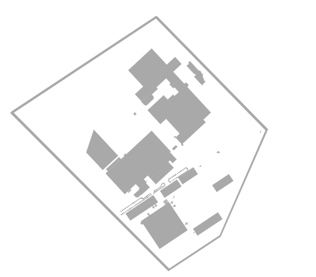

# Custom shapes in .NET MAUI Maps (SfMaps)

The [.NET MAUI Maps](https://www.syncfusion.com/maui-controls/maui-maps) control allows you to render any custom shape to make a map look like building infrastructure, a sports stadium, plane or bus seat arrangements, and more using the [`Geometry`](https://help.syncfusion.com/cr/maui/Syncfusion.Maui.Maps.MapShapeLayer.html#Syncfusion_Maui_Maps_MapShapeLayer_Geometry) property.




<maps:SfMaps>
    <maps:SfMaps.Layer>
        <maps:MapShapeLayer x:Name="layer"
                            ShapeFill="DarkGray"
                            ShapeStroke="DarkGray"
                            Geometry="Points">
        </maps:MapShapeLayer>
    </maps:SfMaps.Layer>
</maps:SfMaps>





public MainPage()
{
    InitializeComponent();
    SfMaps map = new SfMaps();
    MapShapeLayer layer = new MapShapeLayer();
    layer.ShapesSource = MapSource.FromResource("MyProject.floor_planning.json");
    layer.ShapeFill = Brush.DarkGray;
    layer.ShapeStroke = Brush.DarkGray;
    layer.Geometry = MapGeometryType.Points;
    map.Layer = layer;
    this.Content = map;
}





