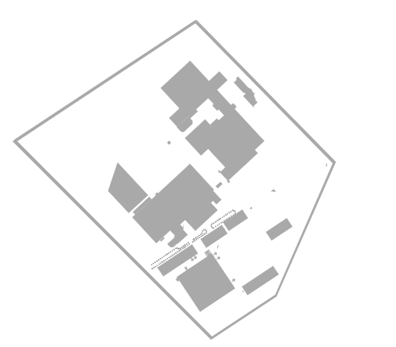

# Custom shapes in .NET MAUI Maps (SfMaps)

N> **Prerequisite:** Ensure that the required NuGet package is installed, the necessary namespaces are imported, and the **.NET MAUI Maps** control is properly configured in your application. For detailed setup and configuration instructions, refer to the **[Getting Started](https://help.syncfusion.com/maui/maps/getting-started)** guide.

The [.NET MAUI Maps](https://www.syncfusion.com/maui-controls/maui-maps) control allows you to render any custom shape to make a map look like building infrastructure, a sports stadium, a plane or bus seat arrangement, and more, using the [`Geometry`](https://help.syncfusion.com/cr/maui/Syncfusion.Maui.Maps.MapShapeLayer.html#Syncfusion_Maui_Maps_MapShapeLayer_Geometry) property.

The [`Geometry`](https://help.syncfusion.com/cr/maui/Syncfusion.Maui.Maps.MapShapeLayer.html#Syncfusion_Maui_Maps_MapShapeLayer_Geometry) property accepts a [`MapGeometryType`](https://help.syncfusion.com/cr/maui/Syncfusion.Maui.Maps.MapGeometryType.html) enum value. When set to [`MapGeometryType.Points`](https://help.syncfusion.com/cr/maui/Syncfusion.Maui.Maps.MapGeometryType.html), the layer renders the points defined in the [`ShapesSource`](https://help.syncfusion.com/cr/maui/Syncfusion.Maui.Maps.MapShapeLayer.html#Syncfusion_Maui_Maps_MapShapeLayer_ShapesSource) as custom shapes (instead of interpreting the source as GeoJSON polygons/paths). Use [`ShapesSource`](https://help.syncfusion.com/cr/maui/Syncfusion.Maui.Maps.MapShapeLayer.html#Syncfusion_Maui_Maps_MapShapeLayer_ShapesSource) to supply the custom-shape definition file.

N> When loading an embedded shape source with [`MapSource.FromResource`](https://help.syncfusion.com/cr/maui/Syncfusion.Maui.Maps.MapSource.html), the JSON file must be embedded in the assembly. Set its build action to `EmbeddedResource`, and reference it by its resource ID (for example, `MyProject.floor_planning.json`). For more details, see the **[Load an embedded file](https://help.syncfusion.com/maui/maps/getting-started#load-an-embedded-file)** section of the Getting Started guide.





<maps:SfMaps>
    <maps:SfMaps.Layer>
        <maps:MapShapeLayer x:Name="layer"
                            ShapeFill="DarkGray"
                            ShapeStroke="DarkGray"
                            Geometry="Points">
        </maps:MapShapeLayer>
    </maps:SfMaps.Layer>
</maps:SfMaps>





public MainPage()
{
    InitializeComponent();
    SfMaps map = new SfMaps();
    MapShapeLayer layer = new MapShapeLayer();
    layer.ShapesSource = MapSource.FromResource("MyProject.floor_planning.json");
    layer.ShapeFill = Brush.DarkGray;
    layer.ShapeStroke = Brush.DarkGray;
    layer.Geometry = MapGeometryType.Points;
    map.Layer = layer;
    this.Content = map;
}





The following properties are commonly used to customize the rendered custom shapes:

* [`ShapeFill`](https://help.syncfusion.com/cr/maui/Syncfusion.Maui.Maps.MapShapeLayer.html#Syncfusion_Maui_Maps_MapShapeLayer_ShapeFill) - Gets or sets the fill color of the shapes using a `Microsoft.Maui.Controls.Brush`. The default value is `LightGray`.
* [`ShapeStroke`](https://help.syncfusion.com/cr/maui/Syncfusion.Maui.Maps.MapShapeLayer.html#Syncfusion_Maui_Maps_MapShapeLayer_ShapeStroke) - Gets or sets the stroke color of the shapes using a `Microsoft.Maui.Controls.Brush`. The default value is `DarkGray`.

## See Also

* [Markers in .NET MAUI Maps](https://help.syncfusion.com/maui/maps/markers)
* [Shape sublayer in .NET MAUI Maps](https://help.syncfusion.com/maui/maps/shape-sublayer)
* [Data labels in .NET MAUI Maps](https://help.syncfusion.com/maui/maps/data-labels)

