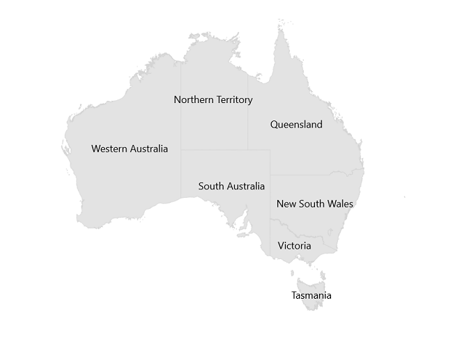
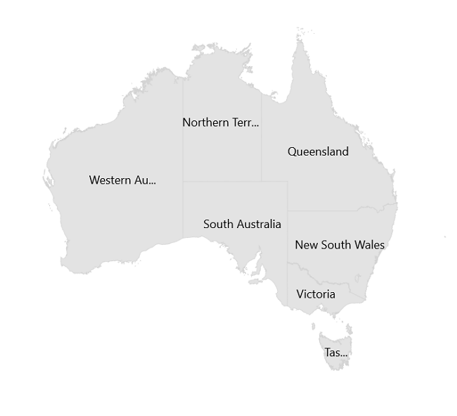
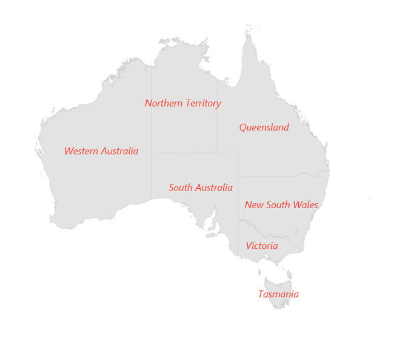

# Data Labels in .NET MAUI Maps (SfMaps)

N> **Prerequisite:** Ensure that the required NuGet package is installed, the necessary namespaces are imported, and the **Maps** control is properly configured in your application. For detailed setup and configuration instructions, refer to the **[Getting Started](https://help.syncfusion.com/maui/maps/getting-started)** guide.

Data labels provide identification for the shapes by displaying their names. You can trim or hide the labels if they exceed the shape bounds.

To learn more about the .NET MAUI Maps data labels, you can check the following video.

 <iframe id='MAUIMapsVideoTutorial' src="https://www.youtube.com/embed/XGeOzARor3U?start=71"></iframe>

## Show data labels

You can show data labels on the map using the [`ShowDataLabels`](https://help.syncfusion.com/cr/maui/Syncfusion.Maui.Maps.MapShapeLayer.html#Syncfusion_Maui_Maps_MapShapeLayer_ShowDataLabels) and [`DataLabelPath`](https://help.syncfusion.com/cr/maui/Syncfusion.Maui.Maps.MapDataLabelSettings.html#Syncfusion_Maui_Maps_MapDataLabelSettings_DataLabelPath) properties. The [`ShowDataLabels`](https://help.syncfusion.com/cr/maui/Syncfusion.Maui.Maps.MapShapeLayer.html#Syncfusion_Maui_Maps_MapShapeLayer_ShowDataLabels) property is used to control the visibility of data labels, and the [`DataLabelPath`](https://help.syncfusion.com/cr/maui/Syncfusion.Maui.Maps.MapDataLabelSettings.html#Syncfusion_Maui_Maps_MapDataLabelSettings_DataLabelPath) property is used to decide which underlying property has to be displayed as data labels. The default value of [`ShowDataLabels`](https://help.syncfusion.com/cr/maui/Syncfusion.Maui.Maps.MapShapeLayer.html#Syncfusion_Maui_Maps_MapShapeLayer_ShowDataLabels) is `false`.

I> Line breaks in the data label string (using `\n`) are supported and will render as multiline labels within the shape.





<map:SfMaps>
    <map:SfMaps.Layer>
        <map:MapShapeLayer ShapesSource="https://cdn.syncfusion.com/maps/map-data/australia.json"
                           DataSource="{Binding Data}"        
                           PrimaryValuePath="State" 
                           ShapeDataField="STATE_NAME" 
                           ShowDataLabels="True">

            <map:MapShapeLayer.DataLabelSettings>
                <map:MapDataLabelSettings DataLabelPath="DisplayName" />
            </map:MapShapeLayer.DataLabelSettings>
        </map:MapShapeLayer>
    </map:SfMaps.Layer>
</map:SfMaps>





public MainPage()
{
    InitializeComponent();
    ViewModel viewModel = new ViewModel();
    this.BindingContext = viewModel;
	
    MapShapeLayer layer = new MapShapeLayer();
    layer.ShapesSource = MapSource.FromUri(new Uri("https://cdn.syncfusion.com/maps/map-data/australia.json"));
    layer.DataSource = viewModel.Data;
    layer.PrimaryValuePath = "State";
    layer.ShapeDataField = "STATE_NAME";
    layer.ShowDataLabels = true;

    layer.DataLabelSettings = new MapDataLabelSettings()
    {
       DataLabelPath = "DisplayName",
    };
	
    SfMaps maps = new SfMaps();
    maps.Layer = layer;
    this.Content = maps;
}

public class ViewModel
{
    public ObservableCollection<Model> Data { get; set; }
    
	public ViewModel()
    {
       Data = new ObservableCollection<Model>();
       Data.Add(new Model("New South Wales", "New\nSouth Wales"));
       Data.Add(new Model("Queensland", "Queensland"));
       Data.Add(new Model("Northern Territory", "Northern\nTerritory"));
       Data.Add(new Model("Victoria", "Victoria"));
       Data.Add(new Model("Tasmania", "Tasmania"));
       Data.Add(new Model("Western Australia", "Western Australia"));
       Data.Add(new Model("South Australia", "South Australia"));
    }
}

public class Model
{
    public string State { get; set; }
    public string DisplayName { get; set; }
	
    public Model(string state, string displayName)
    {
        State = state;
        DisplayName = displayName;
    }
}





## Overflow mode of data labels

You can trim or hide the data labels when a data label overflows the shape bounds, using the [`OverflowMode`](https://help.syncfusion.com/cr/maui/Syncfusion.Maui.Maps.MapDataLabelSettings.html#Syncfusion_Maui_Maps_MapDataLabelSettings_OverflowMode) property. The possible values are [`None`](https://help.syncfusion.com/cr/maui/Syncfusion.Maui.Maps.MapLabelOverflowMode.html#Syncfusion_Maui_Maps_MapLabelOverflowMode_None), [`Trim`](https://help.syncfusion.com/cr/maui/Syncfusion.Maui.Maps.MapLabelOverflowMode.html#Syncfusion_Maui_Maps_MapLabelOverflowMode_Trim), and [`Hide`](https://help.syncfusion.com/cr/maui/Syncfusion.Maui.Maps.MapLabelOverflowMode.html#Syncfusion_Maui_Maps_MapLabelOverflowMode_Hide). The default value of the [`OverflowMode`](https://help.syncfusion.com/cr/maui/Syncfusion.Maui.Maps.MapDataLabelSettings.html#Syncfusion_Maui_Maps_MapDataLabelSettings_OverflowMode) property is [`MapLabelOverflowMode.None`](https://help.syncfusion.com/cr/maui/Syncfusion.Maui.Maps.MapLabelOverflowMode.html#Syncfusion_Maui_Maps_MapLabelOverflowMode_None).

* **None** - The data labels will render even if they overflow the shape bounds.
* **Trim** - The data labels are truncated with an ellipsis when they exceed the shape bounds.
* **Hide** - The data labels that exceed the shape bounds are not rendered.





<map:SfMaps>
    <map:SfMaps.Layer>
        <map:MapShapeLayer ShapesSource="https://cdn.syncfusion.com/maps/map-data/australia.json"
                           DataSource="{Binding Data}"        
                           PrimaryValuePath="State" 
                           ShapeDataField="STATE_NAME" 
                           ShowDataLabels="True">

            <map:MapShapeLayer.DataLabelSettings>
                <map:MapDataLabelSettings OverflowMode="Trim"
                                          DataLabelPath="DisplayName" />
            </map:MapShapeLayer.DataLabelSettings>
        </map:MapShapeLayer>
    </map:SfMaps.Layer>
</map:SfMaps>





public MainPage()
{
    InitializeComponent();
    ViewModel viewModel = new ViewModel();
    this.BindingContext = viewModel;
	
    MapShapeLayer layer = new MapShapeLayer();
    layer.ShapesSource = MapSource.FromUri(new Uri("https://cdn.syncfusion.com/maps/map-data/australia.json"));
    layer.DataSource = viewModel.Data;
    layer.PrimaryValuePath = "State";
    layer.ShapeDataField = "STATE_NAME";
    layer.ShowDataLabels = true;

    layer.DataLabelSettings = new MapDataLabelSettings()
    {
       DataLabelPath = "DisplayName",
       OverflowMode = MapLabelOverflowMode.Trim,
    };
	
    SfMaps maps = new SfMaps();
    maps.Layer = layer;
    this.Content = maps;
}

//code omitted for brevity





## Appearance customization of data labels

You can customize the data labels using the [`DataLabelStyle`](https://help.syncfusion.com/cr/maui/Syncfusion.Maui.Maps.MapDataLabelSettings.html#Syncfusion_Maui_Maps_MapDataLabelSettings_DataLabelStyle) property. The following [`MapLabelStyle`](https://help.syncfusion.com/cr/maui/Syncfusion.Maui.Maps.MapLabelStyle.html) properties are available to customize the data label appearance: `FontSize`, `FontAttributes`, `FontFamily`, `TextColor`, `Margin`, and `Padding`.





<map:SfMaps>
    <map:SfMaps.Layer>
        <map:MapShapeLayer ShapesSource="https://cdn.syncfusion.com/maps/map-data/australia.json"
                           DataSource="{Binding Data}" 
                           PrimaryValuePath="State" 
                           ShapeDataField="STATE_NAME" 
                           ShowDataLabels="True">

            <map:MapShapeLayer.DataLabelSettings>
                <map:MapDataLabelSettings OverflowMode="Trim"
                                          DataLabelPath="DisplayName">
                        <map:MapDataLabelSettings.DataLabelStyle>
                                <map:MapLabelStyle FontSize="12"
                                                   TextColor="#ff4e41"
                                                   FontAttributes="Italic" />
                        </map:MapDataLabelSettings.DataLabelStyle>
                </map:MapDataLabelSettings>
            </map:MapShapeLayer.DataLabelSettings>

        </map:MapShapeLayer>
    </map:SfMaps.Layer>
</map:SfMaps>





public MainPage()
{
    InitializeComponent();
    ViewModel viewModel = new ViewModel();
    this.BindingContext = viewModel;
	
    MapShapeLayer layer = new MapShapeLayer();
    layer.ShapesSource = MapSource.FromUri(new Uri("https://cdn.syncfusion.com/maps/map-data/australia.json"));
    layer.DataSource = viewModel.Data;
    layer.PrimaryValuePath = "State";
    layer.ShapeDataField = "STATE_NAME";
    layer.ShowDataLabels = true;

    layer.DataLabelSettings = new MapDataLabelSettings()
    {
       DataLabelPath = "DisplayName",
       OverflowMode = MapLabelOverflowMode.Trim,
       DataLabelStyle = new MapLabelStyle()
       {
           FontSize = 12,
           FontAttributes = FontAttributes.Italic,
           TextColor = Color.FromRgb(255, 78, 65)
       },
    };
	
    SfMaps maps = new SfMaps();
    maps.Layer = layer;
    this.Content = maps;
}

//code omitted for brevity





