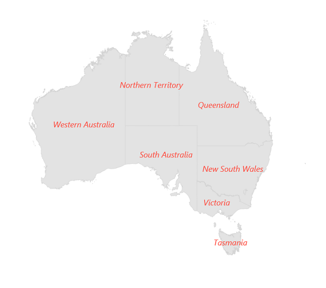

# Data Labels in MAUI Maps (SfMaps)

Data labels provides identification for the shapes by displaying their names. You can trim or hide the labels if they exceed the shape bounds.

## Show data labels

You can show data labels on the map using the [`MapShapeLayer.ShowDataLabels`](https://pub.dev/documentation/syncfusion_flutter_maps/latest/maps/MapShapeLayer/showDataLabels.html) property. By default, the data labels are rendered based on the value of [`ShapeDataField`](https://pub.dev/documentation/syncfusion_flutter_maps/latest/maps/MapShapeSource/shapeDataField.html) property. The default value of the [`ShowDataLabels`](https://pub.dev/documentation/syncfusion_flutter_maps/latest/maps/MapShapeLayer/showDataLabels.html) property is `false`.





     <maps:SfMaps x:Name="sfmap" >
        
        <maps:SfMaps.Layer>

            <maps:MapShapeLayer ShapesSource="https://cdn.syncfusion.com/maps/map-data/world-map.json"  DataSource="{Binding Data}" PrimaryValuePath="Continent" ShapeDataField="continent" ShowDataLabels = "True"  >

                <maps:MapShapeLayer.DataLabelSettings>

                    <maps:MapDataLabelSettings   DataLabelPath="Continent"/>

                </maps:MapShapeLayer.DataLabelSettings>

            </maps:MapShapeLayer>
            
        </maps:SfMaps.Layer>
        
    </maps:SfMaps>





public MainPage()
{
    InitializeComponent();
    ObservableCollection<Model> Data = new ObservableCollection<Model>();
    Data.Add(new Model("Asia", "Asia"));
    Data.Add(new Model("Europe", "EU"));
    Data.Add(new Model("North America", "NA"));
    Data.Add(new Model("South America", "SA"));
    Data.Add(new Model("Australia", "Australia"));
    Data.Add(new Model("Africa", "Africa"));
    SfMaps maps = new SfMaps();
    MapShapeLayer layer = new MapShapeLayer();
    layer.ShapesSource = MapSource.FromResource("world-map.json");
    layer.DataSource = Data;
    layer.PrimaryValuePath = "Continent";
    layer.ShapeDataField = "continent";
    layer.ShowDataLabels = true;

    layer.DataLabelSettings = new MapDataLabelSettings()
    {
       DataLabelPath = "Continent",
    };
    maps.Layer = layer;
    this.Content = maps;
}
class Model
{
    public Model(string continent, string continentCode)
    {
        Continent = continent;
        ContinentCode = continentCode;
    }
     public String Continent { get; set; }
     public String ContinentCode { get; set; }
}




## Text customization

You can customize text of the data labels using the [`MapShapeSource.DataLabelPath`](https://pub.dev/documentation/syncfusion_flutter_maps/latest/maps/MapShapeSource/dataLabelMapper.html) property.





     <maps:SfMaps x:Name="sfmap" >
        
        <maps:SfMaps.Layer>

            <maps:MapShapeLayer ShapesSource="https://cdn.syncfusion.com/maps/map-data/world-map.json"  DataSource="{Binding Data}" PrimaryValuePath="Continent" ShapeDataField="continent" ShowDataLabels = "True"  >

                <maps:MapShapeLayer.DataLabelSettings>

                    <maps:MapDataLabelSettings   DataLabelPath="ContinentCode"/>

                </maps:MapShapeLayer.DataLabelSettings>

            </maps:MapShapeLayer>
            
        </maps:SfMaps.Layer>
        
    </maps:SfMaps>





SfMaps maps = new SfMaps();
        MapShapeLayer layer = new MapShapeLayer();
        layer.ShapesSource = MapSource.FromResource("world-map.json");
        layer.DataSource = Data;
        layer.PrimaryValuePath = "Continent";
        layer.ShapeDataField = "continent";
        layer.ShowDataLabels = true;

        layer.DataLabelSettings = new MapDataLabelSettings()
        {
            DataLabelPath = "ContinentCode",
        };

        maps.Layer = layer;
        this.Content = maps;





## Overflow mode

You can trim or remove the data label when it is overflowed from the shape using the [`MapDataLabelSettings.OverflowMode`](https://pub.dev/documentation/syncfusion_flutter_maps/latest/maps/MapDataLabelSettings/overflowMode.html) property. The possible values are `None`, `Trim`, and `Hide`. The default value of the [`OverflowMode`](https://pub.dev/documentation/syncfusion_flutter_maps/latest/maps/MapDataLabelSettings/overflowMode.html) property is `OverflowMode.None`.

By default, the data labels will render even if it overflows from the shape. 





     <maps:SfMaps x:Name="sfmap" >
        
        <maps:SfMaps.Layer>

            <maps:MapShapeLayer ShapesSource="https://cdn.syncfusion.com/maps/map-data/australia.json" DataSource="{Binding Data}         "PrimaryValuePath="State" ShapeDataField="STATE_NAME" ShowDataLabels = "True"  >

                <maps:MapShapeLayer.DataLabelSettings>

                    <maps:MapDataLabelSettings OverflowMode="Trim"  DataLabelPath="ContinentCode"/>

                </maps:MapShapeLayer.DataLabelSettings>

            </maps:MapShapeLayer>
            
        </maps:SfMaps.Layer>
        
    </maps:SfMaps>





public MainPage()
{
    InitializeComponent();
    ObservableCollection<Model> Data = new ObservableCollection<Model>();
    Data.Add(new Model("New South Wales", "New\nSouth Wales"));
    Data.Add(new Model("Queensland", "Queensland"));
    Data.Add(new Model("Northern Territory", "Northern\nTerritory"));
    Data.Add(new Model("Victoria", "Victoria"));
    Data.Add(new Model("Tasmania", "Tasmania"));
    Data.Add(new Model("Western Australia", "Western Australia"));
    Data.Add(new Model("South Australia", "South Australia"));
    SfMaps maps = new SfMaps();
    MapShapeLayer layer = new MapShapeLayer();
    layer.ShapesSource = MapSource.FromUri(new Uri("https://cdn.syncfusion.com/maps/map-data/australia.json"));
    layer.DataSource = Data;
    layer.PrimaryValuePath = "State";
    layer.ShapeDataField = "STATE_NAME";
    layer.ShowDataLabels = true;

    layer.DataLabelSettings = new MapDataLabelSettings()
    {
       DataLabelPath = "StateCode",
       OverflowMode = MapLabelOverflowMode.Trim,
    };
    maps.Layer = layer;
    this.Content = maps;
}
class Model
{
    public Model(string state, string stateCode)
    {
        State = state;
        StateCode = stateCode;
    }
     public String State { get; set; }
     public String StateCode { get; set; }
}




## Appearance customization

You can customize the data labels using the [`MapDataLabelSettings.DataLabelStyle`](https://pub.dev/documentation/syncfusion_flutter_maps/latest/maps/MapDataLabelSettings/textStyle.html) property.





     <maps:SfMaps x:Name="sfmap" >
        
        <maps:SfMaps.Layer>

            <maps:MapShapeLayer ShapesSource="https://cdn.syncfusion.com/maps/map-data/australia.json"  DataSource="{Binding Data}" PrimaryValuePath="State" ShapeDataField="STATE_NAME" ShowDataLabels = "True"  >

                <maps:MapShapeLayer.DataLabelSettings>

                    <maps:MapDataLabelSettings OverflowMode="Trim"  DataLabelPath="ContinentCode"/>

                    <map:MapDataLabelSettings.DataLabelStyle>
                                    <map:MapLabelStyle x:Name="labelStyle"
                                                   FontSize="12"
                                                   TextColor="Red"
                                                   FontAttributes="Bold"/>
                                </map:MapDataLabelSettings.DataLabelStyle>
                            </map:MapDataLabelSettings>

                </maps:MapShapeLayer.DataLabelSettings>

            </maps:MapShapeLayer>
            
        </maps:SfMaps.Layer>
        
    </maps:SfMaps>





public MainPage()
{
    InitializeComponent();
    ObservableCollection<Model> Data = new ObservableCollection<Model>();
    Data.Add(new Model("New South Wales", "New\nSouth Wales"));
    Data.Add(new Model("Queensland", "Queensland"));
    Data.Add(new Model("Northern Territory", "Northern\nTerritory"));
    Data.Add(new Model("Victoria", "Victoria"));
    Data.Add(new Model("Tasmania", "Tasmania"));
    Data.Add(new Model("Western Australia", "Western Australia"));
    Data.Add(new Model("South Australia", "South Australia"));
    SfMaps maps = new SfMaps();
    MapShapeLayer layer = new MapShapeLayer();
    layer.ShapesSource = MapSource.FromUri(new Uri("https://cdn.syncfusion.com/maps/map-data/australia.json"));
    layer.DataSource = Data;
    layer.PrimaryValuePath = "State";
    layer.ShapeDataField = "STATE_NAME";
    layer.ShowDataLabels = true;

    layer.DataLabelSettings = new MapDataLabelSettings()
    {
       DataLabelPath = "StateCode",
       OverflowMode = MapLabelOverflowMode.Trim,
       DataLabelStyle = new MapLabelStyle()
       {
          FontSize = 12,
          FontAttributes = FontAttributes.Bold,
          TextColor = Colors.Red
       },
    };
    maps.Layer = layer;
    this.Content = maps;
}
class Model
{
    public Model(string state, string stateCode)
    {
        State = state;
        StateCode = stateCode;
    }
     public String State { get; set; }
     public String StateCode { get; set; }
}





